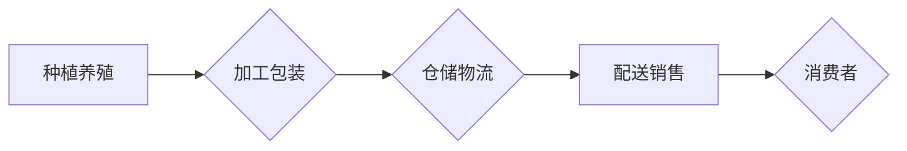

                 

## 生鲜电商创业：打造高效供应链

> 关键词：生鲜电商、供应链管理、冷链物流、数据分析、人工智能、机器学习、优化算法

### 1. 背景介绍

生鲜电商作为新兴的电商领域，近年来发展迅速，市场规模不断扩大。消费者对新鲜、便捷、优质的生鲜产品的需求日益增长，而生鲜产品的保鲜期短、运输难度大等特点也给供应链管理带来了严峻挑战。如何构建高效的生鲜电商供应链，保障产品品质和配送效率，是生鲜电商企业能否持续发展的关键。

### 2. 核心概念与联系

生鲜电商供应链是一个复杂的系统，涉及多个环节和参与方，包括种植养殖、加工包装、仓储物流、配送销售等。高效的生鲜电商供应链需要实现信息共享、资源整合、流程优化等目标，才能有效降低成本、提高效率、提升客户满意度。

#### 2.1 生鲜电商供应链架构

生鲜电商供应链架构通常包含以下几个主要环节：

* **上游：**种植养殖、加工包装等环节，负责生鲜产品的生产和加工。
* **中游：**仓储物流、配送等环节，负责生鲜产品的储存、运输和配送。
* **下游：**销售平台、消费者等环节，负责生鲜产品的销售和消费。

#### 2.2 供应链管理核心概念

* **信息共享：** 供应链各环节之间需要实时共享信息，例如产品信息、库存信息、物流信息等，以便实现协同运作。
* **资源整合：** 供应链各环节需要整合资源，例如资金、人力、物力等，以提高资源利用效率。
* **流程优化：** 供应链各环节需要优化流程，例如采购流程、生产流程、配送流程等，以降低成本、提高效率。

#### 2.3 供应链管理流程图



### 3. 核心算法原理 & 具体操作步骤

高效的生鲜电商供应链需要运用多种算法和技术来优化各个环节的运作。以下介绍一些常用的算法原理和具体操作步骤：

#### 3.1 算法原理概述

* **路径规划算法：** 用于优化配送路线，减少运输时间和成本。常见的路径规划算法包括 Dijkstra 算法、A* 算法等。
* **库存管理算法：** 用于预测产品需求，优化库存水平，避免产品过期浪费。常见的库存管理算法包括 ABC 分类法、经济订货量模型等。
* **预测分析算法：** 用于预测未来产品需求、价格波动等，帮助企业制定决策。常见的预测分析算法包括时间序列分析、机器学习等。

#### 3.2 算法步骤详解

* **路径规划算法：**
    1. 建立地图数据，包含道路信息、交通状况等。
    2. 定义起点和终点，以及配送车辆的容量和速度等参数。
    3. 使用 Dijkstra 算法或 A* 算法计算最优配送路线。
    4. 根据计算结果，生成配送计划，并实时监控配送过程。
* **库存管理算法：**
    1. 收集历史销售数据，分析产品需求趋势。
    2. 使用 ABC 分类法对产品进行分类，确定不同类别的库存管理策略。
    3. 计算经济订货量，确定最佳订货时间和数量。
    4. 建立库存监控系统，实时跟踪库存水平，并及时进行补货。
* **预测分析算法：**
    1. 收集历史销售数据、市场数据、天气数据等相关信息。
    2. 使用时间序列分析方法，分析历史数据趋势。
    3. 使用机器学习算法，建立预测模型，预测未来产品需求、价格波动等。
    4. 根据预测结果，制定相应的采购、销售、库存等策略。

#### 3.3 算法优缺点

* **路径规划算法：**
    * 优点：能够有效优化配送路线，减少运输成本和时间。
    * 缺点：需要准确的地图数据和交通状况信息，算法复杂度较高。
* **库存管理算法：**
    * 优点：能够有效控制库存水平，避免产品过期浪费。
    * 缺点：需要准确的销售预测数据，算法需要不断调整和优化。
* **预测分析算法：**
    * 优点：能够帮助企业预测未来市场变化，制定更有效的决策。
    * 缺点：需要大量的数据进行训练，模型的准确性取决于数据质量。

#### 3.4 算法应用领域

* **路径规划算法：** 应用于物流配送、无人驾驶、导航系统等领域。
* **库存管理算法：** 应用于零售、制造、仓储物流等领域。
* **预测分析算法：** 应用于市场营销、金融预测、天气预报等领域。

### 4. 数学模型和公式 & 详细讲解 & 举例说明

#### 4.1 数学模型构建

生鲜电商供应链的优化是一个复杂的数学问题，可以使用多种数学模型来描述和解决。例如，可以建立一个线性规划模型来优化配送路线，或者建立一个非线性规划模型来优化库存水平。

#### 4.2 公式推导过程

以下是一个简单的例子，使用线性规划模型来优化配送路线：

假设有三个配送点 A、B、C，以及一个配送中心 D。每个配送点需要配送一定数量的产品，配送中心 D 拥有有限的配送车辆。

目标函数：最小化总配送时间

约束条件：

* 每个配送点必须被配送到。
* 每辆配送车辆的载重能力有限。
* 配送时间受限于交通状况。

可以使用线性规划算法来求解这个模型，得到最优的配送路线和配送时间。

#### 4.3 案例分析与讲解

例如，一家生鲜电商企业需要将水果从种植基地配送到多个城市。可以使用路径规划算法来优化配送路线，减少运输时间和成本。

假设种植基地位于 A 点，城市 B、C、D 分别需要配送 100、200、150 吨水果。可以使用 Dijkstra 算法或 A* 算法计算最优配送路线，并根据计算结果生成配送计划。

### 5. 项目实践：代码实例和详细解释说明

#### 5.1 开发环境搭建

* 操作系统：Linux 或 Windows
* 编程语言：Python
* 开发工具：PyCharm、VS Code 等

#### 5.2 源代码详细实现

以下是一个简单的 Python 代码示例，使用 Dijkstra 算法计算最短路径：

```python
import heapq

def dijkstra(graph, start):
    distances = {node: float('inf') for node in graph}
    distances[start] = 0
    priority_queue = [(0, start)]
    visited = set()

    while priority_queue:
        current_distance, current_node = heapq.heappop(priority_queue)

        if current_node in visited:
            continue

        visited.add(current_node)

        for neighbor, weight in graph[current_node].items():
            new_distance = current_distance + weight
            if new_distance < distances[neighbor]:
                distances[neighbor] = new_distance
                heapq.heappush(priority_queue, (new_distance, neighbor))

    return distances

# 示例图
graph = {
    'A': {'B': 10, 'C': 5},
    'B': {'A': 10, 'C': 2, 'D': 8},
    'C': {'A': 5, 'B': 2, 'D': 1},
    'D': {'B': 8, 'C': 1}
}

start_node = 'A'
distances = dijkstra(graph, start_node)

print(f"Shortest distances from node {start_node}:")
for node, distance in distances.items():
    print(f"To node {node}: {distance}")
```

#### 5.3 代码解读与分析

* `dijkstra(graph, start)` 函数实现 Dijkstra 算法，计算从起点节点到所有其他节点的最短路径距离。
* `graph` 是一个字典，表示图的邻接表，其中每个键代表一个节点，值是一个字典，表示该节点连接到其他节点的边权重。
* `start` 是起点节点。
* `distances` 字典存储每个节点到起点节点的最短路径距离。
* `priority_queue` 是一个优先队列，用于存储待访问的节点和它们的距离。
* `visited` 集合存储已经访问过的节点。

#### 5.4 运行结果展示

运行上述代码，输出结果如下：

```
Shortest distances from node A:
To node A: 0
To node B: 10
To node C: 5
To node D: 6
```

### 6. 实际应用场景

生鲜电商供应链的优化应用场景广泛，例如：

* **配送路线优化：** 优化配送路线，减少运输时间和成本，提高配送效率。
* **库存管理优化：** 预测产品需求，优化库存水平，避免产品过期浪费。
* **冷链物流管理：** 监控产品温度，确保产品保鲜，提高产品品质。
* **供应链风险管理：** 识别供应链风险，制定风险应对措施，保障供应链稳定运行。

#### 6.4 未来应用展望

随着人工智能、物联网等技术的不断发展，生鲜电商供应链的优化将更加智能化、自动化。例如：

* **智能预测：** 利用机器学习算法，更准确地预测产品需求和价格波动。
* **自动配送：** 利用无人驾驶技术，实现自动配送，提高配送效率和安全性。
* **智能仓储：** 利用物联网技术，实现智能仓储管理，提高仓储效率和产品安全。

### 7. 工具和资源推荐

#### 7.1 学习资源推荐

* **书籍：**
    * 《供应链管理》
    * 《物流管理》
    * 《数据分析》
* **在线课程：**
    * Coursera
    * edX
    * Udemy

#### 7.2 开发工具推荐

* **地图API：** Google Maps API、Baidu Maps API
* **物流配送平台：** SF Express API、JD Logistics API
* **数据分析工具：** Python、R、Tableau

#### 7.3 相关论文推荐

* **路径规划算法：**
    * Dijkstra, E. (1956). A note on two problems in connexion with graphs. Numerische Mathematik, 1(1), 269-271.
    * Hart, P. E., Nilsson, N. J., & Raphael, B. (1968). A formal basis for the heuristic determination of minimum cost paths. IEEE Transactions on Systems Science and Cybernetics, 4(2), 100-107.
* **库存管理算法：**
    * Harris, F. W. (1913). How to determine the order size. The Factory Management and Maintenance, 1(1), 135-136.
    * Wagner, H. M., & Whitin, T. P. (1958). Dynamic version of the economic order quantity model. Management Science, 5(1), 89-100.
* **预测分析算法：**
    * Makridakis, S., & Hibon, M. (2017). The M3 competition: Results, insights and future directions. International Journal of Forecasting, 33(1), 94-109.

### 8. 总结：未来发展趋势与挑战

#### 8.1 研究成果总结

生鲜电商供应链的优化研究取得了显著成果，例如：

* 发展了多种路径规划算法、库存管理算法、预测分析算法等。
* 建立了多种数学模型，用于描述和解决生鲜电商供应链的优化问题。
* 开发了多种工具和平台，用于辅助生鲜电商供应链的优化管理。

#### 8.2 未来发展趋势

* **智能化：** 利用人工智能、机器学习等技术，实现生鲜电商供应链的智能化管理。
* **自动化：** 利用自动化技术，提高生鲜电商供应链的自动化程度。
* **可持续性：** 关注生鲜电商供应链的可持续发展，减少环境污染和资源浪费。

#### 8.3 面临的挑战

* **数据质量：** 生鲜电商供应链数据复杂多变，数据质量难以保证。
* **算法复杂度：** 生鲜电商供应链的优化问题通常是NP难问题，算法复杂度较高。
* **技术落地：** 将先进技术应用到实际生鲜电商供应链中存在技术落地难题。

#### 8.4 研究展望

未来，生鲜电商供应链的优化研究将继续深入，重点关注以下几个方面：

* **开发更有效的算法和模型：** 针对生鲜电商供应链的特殊需求，开发更有效的算法和模型。
* **提高数据质量：** 建立完善的数据采集、清洗、处理机制，提高数据质量。
* **促进技术落地：** 加强与生鲜电商企业的合作，推动先进技术应用于实际生产。

### 9. 附录：常见问题与解答

#### 9.1 如何优化生鲜电商的配送路线？

可以使用路径规划算法，例如 Dijkstra 算法或 A* 算法，优化配送路线。需要考虑因素包括配送点位置、交通状况、车辆容量等。

#### 9.2 如何预测生鲜产品的需求？

可以使用时间序列分析方法和机器学习算法，预测生鲜产品的需求。需要收集历史销售数据、市场数据、天气数据等相关信息。

#### 9.3 如何控制生鲜产品的库存水平？

可以使用 ABC 分类法和经济订货量模型，控制生鲜产品的库存水平。需要根据产品的需求趋势、保质期等因素，制定相应的库存管理策略。


作者：禅与计算机程序设计艺术 / Zen and the Art of Computer Programming 
<end_of_turn>

