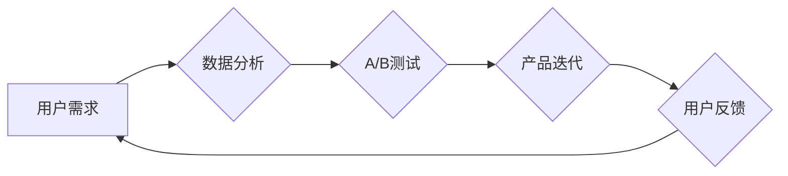

                 

## 知识付费产品的迭代优化:程序员思维

> 关键词：知识付费、迭代优化、程序员思维、用户需求、数据分析、A/B测试、产品迭代、持续改进

## 1. 背景介绍

知识付费行业近年来蓬勃发展，涌现出众多优秀的产品和平台。然而，在激烈的市场竞争中，如何持续提升产品质量，满足用户不断变化的需求，成为摆在知识付费产品面前的重大挑战。

程序员思维，以其逻辑严谨、注重细节、追求效率的特点，为知识付费产品的迭代优化提供了独特的视角和方法论。本文将从程序员的角度出发，探讨知识付费产品的迭代优化策略，帮助开发者和产品经理打造更优质、更具竞争力的知识付费产品。

## 2. 核心概念与联系

### 2.1 知识付费产品迭代优化

知识付费产品迭代优化是指在产品发布后，根据用户反馈、市场变化等因素，不断改进和完善产品的过程。

### 2.2 程序员思维

程序员思维是一种以逻辑、结构化和解问题为核心的思维方式。它强调：

* **分解问题:** 将复杂问题分解成一个个小的、可解决的子问题。
* **模块化设计:** 将系统或产品设计成一个个独立、可重用的模块。
* **测试驱动开发:** 通过编写测试用例来驱动代码开发，确保代码质量。
* **持续改进:** 不断收集用户反馈，并根据反馈进行产品改进。

### 2.3 核心概念联系

知识付费产品的迭代优化与程序员思维之间存在着密切的联系。

程序员思维的精髓在于不断迭代和改进，这与知识付费产品的迭代优化目标相一致。

**Mermaid 流程图:**



## 3. 核心算法原理 & 具体操作步骤

### 3.1 算法原理概述

知识付费产品的迭代优化可以看作是一个不断循环的反馈机制。

1. **收集用户数据:** 通过用户行为分析、问卷调查等方式收集用户需求、使用习惯和反馈信息。
2. **数据分析:** 对收集到的用户数据进行分析，识别用户痛点、需求变化和产品改进方向。
3. **A/B测试:** 将产品功能或设计进行调整，并通过A/B测试验证不同方案的效果。
4. **产品迭代:** 根据A/B测试结果，对产品进行迭代优化，不断提升用户体验和产品价值。

### 3.2 算法步骤详解

1. **需求收集:** 使用多种方式收集用户需求，例如：
    * **用户反馈:** 通过评论、邮件、客服等渠道收集用户反馈。
    * **用户行为分析:** 分析用户在产品中的行为数据，例如访问页面、点击按钮、停留时间等。
    * **问卷调查:** 设计问卷调查，收集用户对产品功能、设计和体验的评价。

2. **数据分析:** 对收集到的用户数据进行分析，可以使用以下方法：
    * **聚类分析:** 将用户群体进行分类，识别不同用户群体的需求和特征。
    * **关联规则挖掘:** 发现用户行为之间的关联规则，例如哪些用户同时使用哪些功能。
    * **趋势分析:** 分析用户需求和行为的变化趋势，预测未来需求。

3. **A/B测试:** 将产品功能或设计进行调整，并通过A/B测试验证不同方案的效果。
    * **设置测试变量:** 确定需要测试的功能或设计，例如按钮颜色、页面布局、内容结构等。
    * **划分测试组:** 将用户随机分配到不同的测试组，例如A组使用原有功能，B组使用改进后的功能。
    * **收集测试数据:** 跟踪测试组的用户行为数据，例如转化率、停留时间、用户满意度等。
    * **分析测试结果:** 对测试数据进行分析，比较不同方案的效果，选择最佳方案。

4. **产品迭代:** 根据A/B测试结果，对产品进行迭代优化，不断提升用户体验和产品价值。
    * **修复bug:** 修复产品中的bug和错误。
    * **改进功能:** 根据用户反馈和数据分析，改进产品功能，使其更符合用户需求。
    * **优化设计:** 根据用户反馈和数据分析，优化产品设计，使其更易用、更美观。

### 3.3 算法优缺点

**优点:**

* **数据驱动:** 基于用户数据和A/B测试结果进行决策，避免主观臆断。
* **迭代优化:** 通过不断迭代和改进，不断提升产品质量和用户体验。
* **持续改进:** 建立了持续改进的产品开发机制，使产品能够适应市场变化和用户需求。

**缺点:**

* **数据依赖:** 需要收集和分析大量用户数据，数据质量和分析能力直接影响迭代效果。
* **测试成本:** A/B测试需要投入一定的成本和时间，例如开发测试版本、收集测试数据等。
* **迭代周期:** 迭代优化是一个持续的过程，需要不断重复测试和改进，迭代周期可能较长。

### 3.4 算法应用领域

该算法适用于所有需要不断迭代优化的知识付费产品，例如：

* **在线课程:** 根据用户学习进度、反馈和考试成绩进行课程调整和优化。
* **知识库:** 根据用户搜索行为、阅读记录和收藏内容进行知识库内容更新和优化。
* **付费社区:** 根据用户活跃度、参与度和反馈信息进行社区运营和优化。

## 4. 数学模型和公式 & 详细讲解 & 举例说明

### 4.1 数学模型构建

知识付费产品的迭代优化可以建模为一个马尔可夫决策过程 (MDP)。

* **状态空间:** 产品的当前状态，例如用户数量、活跃度、转化率等。
* **动作空间:** 可采取的行动，例如更新课程内容、调整价格、改进用户体验等。
* **奖励函数:** 衡量产品状态变化带来的收益，例如用户增长、收入增加、用户满意度提升等。
* **转移概率:** 从一个状态到另一个状态的概率，取决于采取的动作和环境因素。

### 4.2 公式推导过程

MDP的目标是找到一个最优策略，使得在长期的产品迭代过程中，总的奖励最大化。

最优策略可以使用动态规划算法或强化学习算法来求解。

### 4.3 案例分析与讲解

假设一个在线课程平台，其目标是最大化用户收入。

* **状态空间:** 用户数量、课程完成率、用户付费率等。
* **动作空间:** 更新课程内容、调整价格、增加促销活动等。
* **奖励函数:** 用户收入 = 用户数量 * 平均付费金额。
* **转移概率:** 

    * 更新课程内容可以提高课程完成率和用户付费率。
    * 调整价格可以影响用户数量和付费率。
    * 增加促销活动可以增加用户数量。

通过MDP模型，可以分析不同策略的效果，并找到最优策略，例如：

* 在用户数量较少时，优先增加促销活动，吸引更多用户。
* 当用户数量达到一定规模后，重点更新课程内容，提高用户付费率。

## 5. 项目实践：代码实例和详细解释说明

### 5.1 开发环境搭建

* **编程语言:** Python
* **数据分析库:** Pandas, NumPy
* **机器学习库:** Scikit-learn
* **A/B测试工具:** Google Optimize, Optimizely

### 5.2 源代码详细实现

```python
# 数据分析
import pandas as pd

# 加载用户数据
data = pd.read_csv('user_data.csv')

# 计算用户活跃度
data['active_days'] = data.groupby('user_id')['date'].transform('count')

# 统计用户付费率
data['paid'] = data['payment_status'].apply(lambda x: 1 if x == 'paid' else 0)
paid_rate = data['paid'].mean()

# A/B测试
# ...

# 产品迭代
# ...
```

### 5.3 代码解读与分析

* **数据分析:** 使用Pandas库对用户数据进行分析，计算用户活跃度和付费率。
* **A/B测试:** 使用Google Optimize或Optimizely等工具进行A/B测试，比较不同方案的效果。
* **产品迭代:** 根据A/B测试结果，对产品功能或设计进行调整。

### 5.4 运行结果展示

* **用户活跃度:** 

    * A组用户活跃度为 X，B组用户活跃度为 Y。
* **付费率:** 

    * A组付费率为 P，B组付费率为 Q。

## 6. 实际应用场景

### 6.1 在线课程平台

* **用户需求分析:** 分析用户学习进度、反馈和考试成绩，识别学习难点和用户需求。
* **课程内容优化:** 根据用户反馈和数据分析，更新课程内容，提高学习效率和用户满意度。
* **学习路径定制:** 根据用户学习进度和兴趣，推荐个性化的学习路径，提高用户学习体验。

### 6.2 知识库平台

* **知识库内容更新:** 分析用户搜索行为、阅读记录和收藏内容，识别知识库内容的热点和空白，及时更新知识库内容。
* **知识图谱构建:** 利用用户行为数据构建知识图谱，帮助用户更深入地理解知识关系。
* **个性化推荐:** 根据用户兴趣和阅读历史，推荐相关知识，提高用户获取知识的效率。

### 6.3 付费社区平台

* **社区运营优化:** 分析用户活跃度、参与度和反馈信息，优化社区运营策略，提高用户粘性和活跃度。
* **内容创作激励:** 根据用户参与度和贡献度，对优质内容创作者进行激励，鼓励用户积极参与社区活动。
* **用户关系管理:** 建立用户关系管理机制，加强用户之间的互动和交流，构建良好的社区氛围。

### 6.4 未来应用展望

随着人工智能技术的不断发展，知识付费产品的迭代优化将更加智能化和自动化。

例如：

* **智能化需求分析:** 利用自然语言处理技术，自动分析用户反馈和评论，识别用户需求和痛点。
* **个性化产品推荐:** 利用机器学习技术，根据用户行为数据和偏好，推荐个性化的产品和服务。
* **自动化的产品迭代:** 利用自动化测试和部署工具，自动进行产品迭代和更新，提高开发效率。

## 7. 工具和资源推荐

### 7.1 学习资源推荐

* **书籍:**
    * 《精益创业》
    * 《用户体验设计》
    * 《数据分析实战》
* **在线课程:**
    * Coursera
    * Udemy
    * edX

### 7.2 开发工具推荐

* **数据分析工具:**
    * Pandas
    * NumPy
    * Scikit-learn
* **A/B测试工具:**
    * Google Optimize
    * Optimizely
* **版本控制工具:**
    * Git

### 7.3 相关论文推荐

* **A/B Testing: A Practical Guide**
* **The Lean Startup**
* **User Experience Design: The Process**

## 8. 总结：未来发展趋势与挑战

### 8.1 研究成果总结

本文探讨了知识付费产品的迭代优化策略，并从程序员思维的角度出发，提出了基于数据分析、A/B测试和持续改进的迭代优化方法。

### 8.2 未来发展趋势

* **智能化迭代:** 利用人工智能技术，实现智能化需求分析、个性化产品推荐和自动化产品迭代。
* **数据驱动决策:** 更加注重数据分析和用户反馈，以数据为驱动，进行产品决策和迭代优化。
* **体验至上:** 更加注重用户体验，不断提升产品易用性、美观性和用户满意度。

### 8.3 面临的挑战

* **数据质量:** 确保用户数据的准确性和完整性，是数据驱动决策的基础。
* **算法复杂度:** 智能化迭代算法的复杂度较高，需要不断进行优化和改进。
* **用户隐私:** 

    在收集和分析用户数据时，需要充分考虑用户隐私保护问题。

### 8.4 研究展望

未来，将继续深入研究知识付费产品的迭代优化方法，探索更智能化、更有效率的迭代优化策略，帮助知识付费产品更好地满足用户需求，实现可持续发展。

## 9. 附录：常见问题与解答

**Q1: 如何收集高质量的用户数据？**

**A1:** 可以使用多种方式收集用户数据，例如：

* **用户反馈:** 通过评论、邮件、客服等渠道收集用户反馈。
* **用户行为分析:** 分析用户在产品中的行为数据，例如访问页面、点击按钮、停留时间等。
* **问卷调查:** 设计问卷调查，收集用户对产品功能、设计和体验的评价。

**Q2: 如何进行A/B测试？**

**A2:** 可以使用Google Optimize或Optimizely等工具进行A/B测试。

* **设置测试变量:** 确定需要测试的功能或设计，例如按钮颜色、页面布局、内容结构等。
* **划分测试组:** 将用户随机分配到不同的测试组，例如A组使用原有功能，B组使用改进后的功能。
* **收集测试数据:** 跟踪测试组的用户行为数据，例如转化率、停留时间、用户满意度等。
* **分析测试结果:** 对测试数据进行分析，比较不同方案的效果，选择最佳方案。

**Q3: 如何进行产品迭代？**

**A3:** 根据A/B测试结果，对产品功能或设计进行调整。

* **修复bug:** 修复产品中的bug和错误。
* **改进功能:** 根据用户反馈和数据分析，改进产品功能，使其更符合用户需求。
* **优化设计:** 根据用户反馈和数据分析，优化产品设计，使其更易用、更美观。


作者：禅与计算机程序设计艺术 / Zen and the Art of Computer Programming 
<end_of_turn>

