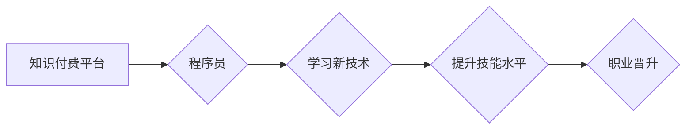

                 

## 知识付费时代程序员的个人发展策略

> 关键词：知识付费、程序员发展、技术栈、个人品牌、持续学习、社区参与、项目实践、职业规划

### 1. 背景介绍

随着互联网技术的发展和普及，软件开发行业蓬勃发展，程序员的需求量持续增长。然而，技术迭代速度日新月异，程序员面临着不断学习新知识、掌握新技能的挑战。知识付费时代到来，为程序员提供了更多学习和提升的机会，但也带来了新的选择和思考。

传统意义上的学习模式，往往依赖于学校教育、培训机构或书籍等形式。而知识付费时代，则以线上课程、在线社区、付费咨询等方式，将知识和技能的获取更加便捷、个性化和高效。程序员可以通过付费的方式，获取到更专业的知识、更实用的技能，并与行业专家和同仁进行交流学习。

### 2. 核心概念与联系

**2.1 知识付费时代**

知识付费时代是指以知识和技能为核心价值，通过付费的方式获取知识和技能的商业模式。在这个时代，知识不再是稀缺资源，而是可以被生产、传播和交易的商品。

**2.2 程序员个人发展**

程序员个人发展是指程序员在职业生涯中不断提升自身的技术能力、专业素养和个人品牌价值的过程。

**2.3 知识付费与程序员个人发展**

知识付费为程序员个人发展提供了新的途径和动力。通过付费学习，程序员可以快速掌握新技术、提升技能水平，并获得行业认可和职业晋升的机会。

**Mermaid 流程图**

### 3. 核心算法原理 & 具体操作步骤

**3.1 算法原理概述**

在知识付费时代，程序员需要掌握多种算法和数据结构，以应对复杂的技术挑战。例如，搜索算法、排序算法、图算法等，都是程序员需要掌握的核心算法。

**3.2 算法步骤详解**

以排序算法为例，常见的排序算法包括冒泡排序、插入排序、快速排序、归并排序等。每个算法都有其独特的步骤和实现方式。

**3.3 算法优缺点**

不同的排序算法具有不同的时间复杂度和空间复杂度，需要根据实际应用场景选择合适的算法。

**3.4 算法应用领域**

排序算法广泛应用于各种软件系统，例如搜索引擎、数据库管理系统、操作系统等。

### 4. 数学模型和公式 & 详细讲解 & 举例说明

**4.1 数学模型构建**

在算法设计和分析中，数学模型可以帮助我们理解算法的性能和效率。例如，时间复杂度和空间复杂度都是用数学公式来表示的。

**4.2 公式推导过程**

时间复杂度通常用大O符号来表示，例如O(n)、O(n^2)、O(log n)等。这些符号表示算法执行时间与输入数据大小的关系。

**4.3 案例分析与讲解**

例如，冒泡排序的时间复杂度为O(n^2)，这意味着算法执行时间随着输入数据大小的平方增长。

### 5. 项目实践：代码实例和详细解释说明

**5.1 开发环境搭建**

程序员需要选择合适的开发环境，例如IDE、编译器、数据库等。

**5.2 源代码详细实现**

程序员需要编写源代码，实现算法的具体功能。

**5.3 代码解读与分析**

程序员需要对代码进行解读和分析，理解代码的逻辑和功能。

**5.4 运行结果展示**

程序员需要运行代码，观察运行结果，并进行测试和调试。

### 6. 实际应用场景

**6.1 搜索引擎**

搜索引擎使用排序算法来对搜索结果进行排序，以便用户能够快速找到相关信息。

**6.2 数据库管理系统**

数据库管理系统使用排序算法来对数据进行排序，以便用户能够高效地查询和检索数据。

**6.3 操作系统**

操作系统使用排序算法来管理进程和内存，以提高系统性能。

**6.4 未来应用展望**

随着人工智能和机器学习的发展，排序算法将在更多领域得到应用，例如推荐系统、个性化服务等。

### 7. 工具和资源推荐

**7.1 学习资源推荐**

* 在线课程平台：Coursera、edX、Udemy等
* 书籍： 《算法导论》、《数据结构与算法分析》等
* 博客和论坛：Stack Overflow、GitHub等

**7.2 开发工具推荐**

* IDE：Visual Studio Code、IntelliJ IDEA等
* 编译器：GCC、Clang等
* 数据库：MySQL、PostgreSQL等

**7.3 相关论文推荐**

* 《Introduction to Algorithms》
* 《The Art of Computer Programming》

### 8. 总结：未来发展趋势与挑战

**8.1 研究成果总结**

知识付费时代为程序员个人发展提供了新的机遇和挑战。程序员需要不断学习新知识、掌握新技能，并积极参与社区建设和项目实践。

**8.2 未来发展趋势**

未来，程序员个人发展将更加注重个性化、定制化和持续学习。

**8.3 面临的挑战**

程序员需要应对技术迭代速度快、竞争激烈等挑战。

**8.4 研究展望**

未来研究将更加关注人工智能、机器学习等新兴技术的应用，以及如何帮助程序员更好地适应未来发展趋势。

### 9. 附录：常见问题与解答

**9.1 如何选择合适的知识付费课程？**

* 确定自己的学习目标和需求。
* 阅读课程介绍和评论，了解课程内容和质量。
* 选择口碑好、师资力量雄厚的课程。

**9.2 如何进行有效的知识付费学习？**

* 制定学习计划，并坚持执行。
* 积极参与课程讨论，与老师和同学交流学习心得。
* 将所学知识应用到实际项目中，巩固学习成果。

作者：禅与计算机程序设计艺术 / Zen and the Art of Computer Programming 
<end_of_turn>

