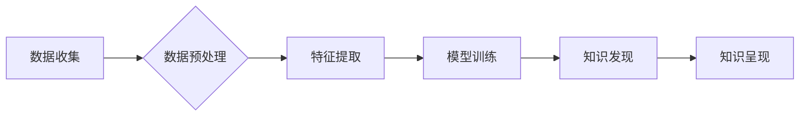

                 

## 知识发现引擎：教育领域的转型利器

> 关键词：知识发现引擎、机器学习、数据挖掘、教育科技、个性化学习、智能推荐

## 1. 背景介绍

教育领域正处于数字化转型的重要阶段。海量教育数据，如学生成绩、学习行为、课后互动等，为教育教学提供了前所未有的机遇。如何有效挖掘这些数据中的潜在价值，提升教育教学效率和质量，是当前教育科技领域面临的重大挑战。知识发现引擎 (Knowledge Discovery Engine，KDE) 应运而生，它利用机器学习、数据挖掘等技术，从海量教育数据中发现隐藏的知识和模式，为教育教学提供数据驱动的决策支持。

传统的教育教学模式往往是“一刀切”，难以满足不同学生个性化的学习需求。而知识发现引擎可以根据学生的学习情况、兴趣爱好等信息，个性化推荐学习资源，提供定制化的学习路径，实现精准化教学。此外，KDE还可以帮助教师分析学生的学习行为，及时发现学习困难，并提供针对性的指导和帮助。

## 2. 核心概念与联系

知识发现引擎的核心是将机器学习和数据挖掘技术应用于教育领域。它通过以下几个关键步骤实现知识发现：

1. **数据收集:** 收集来自各种教育数据源的学生学习数据，包括成绩、作业、课堂参与、在线学习记录等。
2. **数据预处理:** 对收集到的数据进行清洗、转换、整合等预处理，使其符合机器学习算法的输入要求。
3. **特征提取:** 从预处理后的数据中提取关键特征，例如学生的学习习惯、知识掌握情况、学习偏好等。
4. **模型训练:** 利用机器学习算法，对提取的特征进行训练，建立预测模型，例如预测学生的学习成绩、学习兴趣等。
5. **知识发现:** 基于训练好的模型，对教育数据进行分析，发现隐藏的知识和模式，例如学生的学习规律、知识点难易程度等。
6. **知识呈现:** 将发现的知识以可视化、易懂的方式呈现给教师和学生，例如生成学习报告、提供个性化学习建议等。

**Mermaid 流程图:**



## 3. 核心算法原理 & 具体操作步骤

### 3.1  算法原理概述

知识发现引擎中常用的算法包括：

* **聚类算法:** 将学生按照学习特征进行分组，例如根据学习成绩、学习习惯等特征，将学生分为不同学习水平的群体。
* **关联规则挖掘算法:** 发现学生学习行为之间的关联关系，例如发现哪些学生在学习特定知识点时，更容易犯错。
* **预测模型算法:** 利用历史数据预测学生的未来学习表现，例如预测学生的考试成绩、学习兴趣等。

### 3.2  算法步骤详解

以聚类算法为例，其具体步骤如下：

1. **数据预处理:** 对收集到的学生学习数据进行清洗、转换、整合等预处理，例如删除缺失值、标准化数据等。
2. **选择聚类算法:** 根据数据的特点和需求，选择合适的聚类算法，例如K-means聚类、层次聚类等。
3. **确定聚类数:** 根据数据的结构和业务需求，确定合适的聚类数。
4. **执行聚类:** 利用选择的聚类算法，对预处理后的数据进行聚类，将学生划分为不同的类别。
5. **评估聚类结果:** 利用聚类评估指标，例如Silhouette系数、Dunn指数等，评估聚类结果的质量。
6. **可视化结果:** 将聚类结果以图表等形式可视化，方便教师和学生理解。

### 3.3  算法优缺点

**聚类算法的优点:**

* 可以发现数据中的潜在结构和模式。
* 不需要预先定义类别标签，适用于未知类别的情况。
* 可以用于数据降维和特征提取。

**聚类算法的缺点:**

* 难以确定合适的聚类数。
* 对数据噪声和异常值敏感。
* 难以解释聚类结果的内涵。

### 3.4  算法应用领域

聚类算法在教育领域有广泛的应用，例如：

* **学生分层教学:** 根据学生的学习水平，将学生划分为不同的学习小组，提供个性化的教学内容和学习策略。
* **学习兴趣分析:** 分析学生的学习行为，发现学生的学习兴趣和偏好，为个性化学习推荐资源。
* **学习困难识别:** 识别学习困难的学生，及时提供针对性的帮助和指导。

## 4. 数学模型和公式 & 详细讲解 & 举例说明

### 4.1  数学模型构建

聚类算法的数学模型通常基于距离度量和相似度计算。常用的距离度量包括欧氏距离、曼哈顿距离等。相似度计算则通常使用余弦相似度、皮尔逊相关系数等。

### 4.2  公式推导过程

以K-means聚类算法为例，其目标是将数据点划分为K个簇，使得每个簇内的点尽可能接近，而不同簇之间的点尽可能远离。

K-means算法的迭代过程如下：

1. **随机初始化K个聚类中心:** 随机选择K个数据点作为初始聚类中心。
2. **计算每个数据点到每个聚类中心的距离:** 使用选择的距离度量，计算每个数据点到每个聚类中心的距离。
3. **将每个数据点分配到最近的聚类中心:** 将每个数据点分配到距离其最近的聚类中心所属的簇。
4. **更新每个聚类中心的坐标:** 计算每个簇内所有数据点的平均值作为新的聚类中心坐标。
5. **重复步骤2-4:** 直到聚类中心不再发生变化，或者达到最大迭代次数。

### 4.3  案例分析与讲解

假设我们有一组学生学习成绩数据，想要将其聚类为两组，分别代表高分和低分学生。

我们可以使用K-means算法，将数据点划分为两组。首先，随机选择两个数据点作为初始聚类中心。然后，计算每个数据点到这两个聚类中心的距离，并将每个数据点分配到距离其最近的聚类中心所属的簇。最后，计算每个簇内所有数据点的平均值作为新的聚类中心坐标，重复上述步骤，直到聚类中心不再发生变化。

最终，我们将得到两组学生，一组是高分学生，另一组是低分学生。我们可以根据这些聚类结果，为不同学生提供个性化的学习建议和帮助。

## 5. 项目实践：代码实例和详细解释说明

### 5.1  开发环境搭建

为了实现知识发现引擎，我们需要搭建一个开发环境。常用的开发环境包括：

* **操作系统:** Linux、Windows、macOS等。
* **编程语言:** Python、Java、C++等。
* **机器学习库:** scikit-learn、TensorFlow、PyTorch等。
* **数据库:** MySQL、MongoDB、PostgreSQL等。

### 5.2  源代码详细实现

以下是一个使用Python和scikit-learn库实现K-means聚类的简单代码示例：

```python
from sklearn.cluster import KMeans
import numpy as np

# 生成示例数据
data = np.random.rand(100, 2)

# 创建K-means聚类模型
kmeans = KMeans(n_clusters=2)

# 训练模型
kmeans.fit(data)

# 获取聚类结果
labels = kmeans.labels_

# 可视化聚类结果
import matplotlib.pyplot as plt
plt.scatter(data[:, 0], data[:, 1], c=labels)
plt.show()
```

### 5.3  代码解读与分析

这段代码首先导入必要的库，然后生成一些随机数据作为示例数据。接着，创建K-means聚类模型，并指定聚类数为2。然后，使用`fit()`方法训练模型，将数据点聚类到两个簇中。最后，使用`labels_`属性获取聚类结果，并使用matplotlib库可视化聚类结果。

### 5.4  运行结果展示

运行这段代码后，将会生成一个散点图，其中每个点代表一个数据点，颜色表示其所属的簇。

## 6. 实际应用场景

知识发现引擎在教育领域有广泛的应用场景，例如：

* **个性化学习推荐:** 根据学生的学习情况、兴趣爱好等信息，推荐个性化的学习资源和学习路径。
* **智能教学辅助:** 提供智能化的教学辅助功能，例如自动批改作业、生成学习报告等。
* **学习行为分析:** 分析学生的学习行为，发现学习规律和困难点，为教师提供数据驱动的教学决策支持。
* **学生能力评估:** 利用机器学习算法，对学生的学习能力进行评估，帮助教师了解学生的学习水平和发展趋势。

### 6.4  未来应用展望

随着人工智能技术的不断发展，知识发现引擎在教育领域的应用将会更加广泛和深入。未来，知识发现引擎可能能够实现以下功能：

* **实时个性化学习:** 根据学生的实时学习情况，动态调整学习内容和学习节奏。
* **智能化教学设计:** 利用知识发现引擎分析学生的学习数据，帮助教师设计更加有效的教学方案。
* **跨学科知识融合:** 将不同学科的知识进行融合，为学生提供更加全面的学习体验。
* **虚拟现实和增强现实教学:** 利用虚拟现实和增强现实技术，为学生提供更加沉浸式的学习体验。

## 7. 工具和资源推荐

### 7.1  学习资源推荐

* **在线课程:** Coursera、edX、Udacity等平台提供丰富的机器学习和数据挖掘课程。
* **书籍:** 《机器学习》、《数据挖掘》等经典书籍可以帮助读者深入了解相关知识。
* **博客和论坛:** Kaggle、Towards Data Science等平台上有许多优秀的博客和论坛，可以帮助读者学习和交流。

### 7.2  开发工具推荐

* **Python:** Python是一种流行的编程语言，拥有丰富的机器学习和数据挖掘库。
* **scikit-learn:** scikit-learn是一个开源的机器学习库，提供了许多常用的算法和工具。
* **TensorFlow:** TensorFlow是一个开源的深度学习框架，可以用于训练复杂的机器学习模型。
* **PyTorch:** PyTorch是一个开源的深度学习框架，以其灵活性和易用性而闻名。

### 7.3  相关论文推荐

* **K-means聚类算法:** MacQueen, J. (1967). Some methods for classification and analysis of multivariate observations. *Proceedings of the fifth Berkeley symposium on mathematical statistics and probability*, 1, 281-297.
* **关联规则挖掘算法:** Agrawal, R., Imielinski, T., & Swami, A. (1993). Mining association rules between sets of items in large databases. *Proceedings of the ACM SIGMOD conference on Management of data*, 207-216.

## 8. 总结：未来发展趋势与挑战

### 8.1  研究成果总结

知识发现引擎在教育领域取得了显著的成果，例如：

* **提高了教学效率:** 通过个性化学习推荐和智能教学辅助，提高了学生的学习效率。
* **提升了学习质量:** 通过数据驱动的教学决策支持，提升了学生的学习质量。
* **促进了教育公平:** 通过个性化学习和学习困难识别，促进了教育公平。

### 8.2  未来发展趋势

未来，知识发现引擎的发展趋势包括：

* **更加智能化:** 利用深度学习等先进算法，实现更加智能化的知识发现和学习推荐。
* **更加个性化:** 更加深入地了解学生的学习情况和需求，提供更加个性化的学习体验。
* **更加融合:** 将知识发现引擎与其他教育技术融合，例如虚拟现实、增强现实等，提供更加沉浸式的学习体验。

### 8.3  面临的挑战

知识发现引擎在发展过程中也面临一些挑战：

* **数据质量:** 教育数据往往存在不完整、不准确等问题，需要进行有效的数据清洗和预处理。
* **算法解释性:** 一些机器学习算法的决策过程难以解释，需要开发更加可解释的算法。
* **隐私保护:** 教育数据包含学生的个人信息，需要采取有效的措施保护学生的隐私。

### 8.4  研究展望

未来，我们需要继续加强对知识发现引擎的研究，解决上述挑战，使其更好地服务于教育教学。


## 9. 附录：常见问题与解答

**Q1: 知识发现引擎需要哪些数据才能运行？**

**A1:** 知识发现引擎需要各种教育数据，例如学生的成绩、作业、课堂参与、在线学习记录等。

**Q2: 知识发现引擎可以帮助教师做什么？**

**A2:** 知识发现引擎可以帮助教师个性化推荐学习资源、分析学生的学习行为、识别学习困难的学生、评估学生的学习能力等。

**Q3: 知识发现引擎对学生的学习有什么影响？**

**A3:** 知识发现引擎可以帮助学生个性化学习、提高学习效率、提升学习质量、促进学习兴趣等。

**Q4: 知识发现引擎的未来发展趋势是什么？**

**A4:** 知识发现引擎的未来发展趋势包括更加智能化、更加个性化、更加融合等。

**Q5: 知识发现引擎有哪些挑战？**

**A5:** 知识发现引擎面临的数据质量、算法解释性、隐私保护等挑战。


作者：禅与计算机程序设计艺术 / Zen and the Art of Computer Programming 
<end_of_turn>

