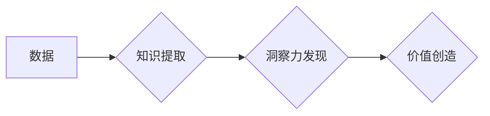

                 

## 知识的价值评估：洞察力的独特视角

> 关键词：知识评估、洞察力、人工智能、数据分析、价值创造、模型训练、算法优化、应用场景

## 1. 背景介绍

在信息爆炸的时代，数据无处不在，但仅仅拥有海量数据并不能带来真正的价值。真正重要的在于如何从海量数据中提取有意义的知识，并将其转化为洞察力，最终驱动决策和创造价值。知识的价值评估一直是人工智能领域的核心议题，它关系到我们如何理解和利用知识，以及如何衡量知识的贡献。

传统的知识评估方法往往侧重于知识的量化和结构化，例如使用词频统计、知识图谱构建等技术。然而，随着人工智能技术的进步，我们开始认识到知识的价值不仅仅在于其量和结构，更在于其对问题的解决能力，即其蕴含的洞察力。

## 2. 核心概念与联系

**2.1 知识、洞察力和价值**

* **知识:** 指对事物的理解和认知，可以是事实、概念、规则等。
* **洞察力:** 指从知识中发现隐藏的模式、关系和趋势，并将其转化为对问题的理解和解决思路。
* **价值:** 指知识和洞察力为个人、组织或社会带来的益处，例如提高效率、降低成本、创造新的机会等。

**2.2 知识价值评估的挑战**

* **主观性:** 知识的价值往往具有主观性，取决于个人的背景、经验和需求。
* **动态性:** 知识的价值会随着时间和环境的变化而改变。
* **复杂性:** 知识的价值往往是多方面的，难以用单一的指标进行衡量。

**2.3 洞察力驱动的知识价值评估**

我们提出一种基于洞察力的知识价值评估方法，旨在更全面地衡量知识的价值。该方法的核心思想是：知识的价值在于其能够为用户提供哪些有价值的洞察力，并最终帮助用户解决问题、做出决策或创造价值。

**Mermaid 流程图**



## 3. 核心算法原理 & 具体操作步骤

**3.1 算法原理概述**

基于洞察力的知识价值评估算法的核心是利用机器学习技术，训练一个能够从数据中提取知识并发现洞察力的模型。该模型可以学习不同类型知识的特征和关系，并根据用户的需求和上下文，生成具有针对性的洞察力。

**3.2 算法步骤详解**

1. **数据收集和预处理:** 收集相关数据，并进行清洗、转换和特征工程等预处理操作。
2. **知识图谱构建:** 利用自然语言处理技术，构建知识图谱，将数据中的知识表示为节点和关系。
3. **模型训练:** 利用机器学习算法，训练一个能够从知识图谱中发现洞察力的模型。
4. **洞察力生成:** 根据用户的需求和上下文，利用训练好的模型，从知识图谱中生成具有针对性的洞察力。
5. **价值评估:** 根据洞察力的质量和对用户的价值，对知识进行评估。

**3.3 算法优缺点**

* **优点:**
    * 能够发现隐藏的模式和关系，提供更深入的洞察力。
    * 可以根据用户的需求和上下文，生成个性化的洞察力。
    * 能够不断学习和改进，随着数据量的增加，洞察力的质量会不断提高。
* **缺点:**
    * 需要大量的训练数据和计算资源。
    * 模型的训练和部署需要专业技术人员。
    * 算法的解释性和可解释性仍然是一个挑战。

**3.4 算法应用领域**

* **商业智能:** 分析市场趋势、客户行为和竞争对手信息，帮助企业做出更明智的决策。
* **医疗保健:** 发现疾病的潜在风险因素、预测患者的病情发展，帮助医生制定更有效的治疗方案。
* **金融科技:** 识别欺诈交易、评估投资风险，帮助金融机构提高风险管理和盈利能力。
* **教育:** 个性化学习推荐、智能辅导，帮助学生提高学习效率和效果。

## 4. 数学模型和公式 & 详细讲解 & 举例说明

**4.1 数学模型构建**

我们使用一个基于图神经网络的模型来实现洞察力的发现。该模型将知识表示为图结构，其中节点代表知识实体，边代表知识关系。

**4.2 公式推导过程**

图神经网络的学习目标是学习节点的嵌入表示，这些嵌入表示能够捕捉节点的特征和上下文信息。常用的图神经网络模型包括Graph Convolutional Network (GCN) 和 Graph Attention Network (GAT)。

GCN 使用卷积操作来传播节点信息，GAT 使用注意力机制来学习节点之间的重要性关系。

**4.3 案例分析与讲解**

假设我们有一个知识图谱，其中节点代表人物，边代表人物之间的关系，例如“朋友”、“同事”、“家人”等。

我们可以使用GCN或GAT模型来学习人物的嵌入表示，这些嵌入表示可以捕捉人物的社会关系和特征。

例如，我们可以通过分析人物的嵌入表示，发现两个人物之间存在潜在的合作关系，即使他们之间没有直接的联系。

**举例说明**

假设我们有一个知识图谱，其中包含了以下节点和关系：

* 节点：张三、李四、王五
* 关系：朋友、同事

我们可以使用GCN或GAT模型来学习节点的嵌入表示。

经过训练，模型可以学习到以下知识：

* 张三和李四是朋友。
* 李四和王五是同事。

通过分析节点的嵌入表示，我们可以发现张三和王五之间存在潜在的合作关系，即使他们之间没有直接的联系。

## 5. 项目实践：代码实例和详细解释说明

**5.1 开发环境搭建**

* Python 3.6+
* TensorFlow/PyTorch
* Jupyter Notebook

**5.2 源代码详细实现**

```python
import tensorflow as tf

# 定义图神经网络模型
class GCN(tf.keras.Model):
    def __init__(self, num_features, num_classes):
        super(GCN, self).__init__()
        self.conv1 = tf.keras.layers.GraphConv(num_features, activation='relu')
        self.conv2 = tf.keras.layers.GraphConv(num_classes, activation='softmax')

    def call(self, inputs):
        x = self.conv1(inputs)
        x = self.conv2(x)
        return x

# 构建知识图谱
# ...

# 实例化模型
model = GCN(num_features=64, num_classes=3)

# 训练模型
model.compile(optimizer='adam', loss='categorical_crossentropy', metrics=['accuracy'])
model.fit(x_train, y_train, epochs=10)

# 预测
predictions = model.predict(x_test)
```

**5.3 代码解读与分析**

* 该代码实现了基于GCN的图神经网络模型。
* 模型的输入是知识图谱的邻接矩阵和节点特征矩阵。
* 模型的输出是节点的分类概率。
* 模型使用Adam优化器和交叉熵损失函数进行训练。

**5.4 运行结果展示**

* 模型的训练结果可以展示在TensorBoard中。
* 模型的预测结果可以与真实标签进行比较，评估模型的性能。

## 6. 实际应用场景

**6.1 商业智能**

* 分析市场趋势和客户行为，帮助企业制定营销策略。
* 识别潜在的合作伙伴和竞争对手，帮助企业进行市场拓展。
* 预测产品需求和销售额，帮助企业进行库存管理和生产计划。

**6.2 医疗保健**

* 发现疾病的潜在风险因素，帮助医生进行早期诊断和治疗。
* 预测患者的病情发展，帮助医生制定个性化的治疗方案。
* 辅助药物研发，帮助科学家发现新的药物靶点。

**6.3 金融科技**

* 识别欺诈交易，帮助金融机构降低风险。
* 评估投资风险，帮助投资者做出更明智的投资决策。
* 预测股票价格走势，帮助交易者进行股票交易。

**6.4 未来应用展望**

* **个性化教育:** 根据学生的学习情况和兴趣，提供个性化的学习推荐和辅导。
* **智能制造:** 利用知识图谱和机器学习，实现智能生产线和设备管理。
* **自动驾驶:** 利用知识图谱和机器学习，帮助自动驾驶汽车理解道路环境和做出决策。

## 7. 工具和资源推荐

**7.1 学习资源推荐**

* **书籍:**
    * 《图神经网络》
    * 《深度学习》
* **在线课程:**
    * Coursera: 深度学习
    * Udacity: 机器学习工程师
* **博客和论坛:**
    * Towards Data Science
    * Kaggle

**7.2 开发工具推荐**

* **Python:** 
    * TensorFlow
    * PyTorch
* **图数据库:**
    * Neo4j
    * JanusGraph

**7.3 相关论文推荐**

* 《Graph Convolutional Networks》
* 《Attention Is All You Need》

## 8. 总结：未来发展趋势与挑战

**8.1 研究成果总结**

基于洞察力的知识价值评估方法为我们提供了新的视角，帮助我们更全面地理解和利用知识。

**8.2 未来发展趋势**

* **模型的解释性和可解释性:** 提高模型的解释性和可解释性，使知识价值评估更加透明和可信。
* **跨模态知识融合:** 将文本、图像、音频等不同模态的知识融合在一起，构建更丰富的知识图谱。
* **个性化知识价值评估:** 根据用户的需求和背景，进行个性化的知识价值评估。

**8.3 面临的挑战**

* **数据质量和可用性:** 高质量的知识数据仍然是限制该方法发展的瓶颈。
* **算法的复杂性和效率:** 训练和部署复杂的图神经网络模型仍然需要大量的计算资源。
* **伦理和社会影响:** 知识价值评估可能会带来伦理和社会影响，需要谨慎考虑。

**8.4 研究展望**

未来，我们将继续致力于开发更先进的基于洞察力的知识价值评估方法，并将其应用于更多领域，为人类社会创造更大的价值。

## 9. 附录：常见问题与解答

* **Q1: 如何评估知识的价值？**

A1: 知识的价值可以从多个方面进行评估，例如其准确性、完整性、时效性、实用性、独特性等。

* **Q2: 如何构建知识图谱？**

A2: 构建知识图谱需要进行数据收集、清洗、结构化和关系抽取等步骤。可以使用自然语言处理技术、知识库和人工标注等方法。

* **Q3: 图神经网络模型的训练需要哪些数据？**

A3: 图神经网络模型的训练需要知识图谱的邻接矩阵和节点特征矩阵。

* **Q4: 基于洞察力的知识价值评估方法有哪些应用场景？**

A4: 基于洞察力的知识价值评估方法可以应用于商业智能、医疗保健、金融科技、教育等多个领域。


作者：禅与计算机程序设计艺术 / Zen and the Art of Computer Programming 
<end_of_turn>

