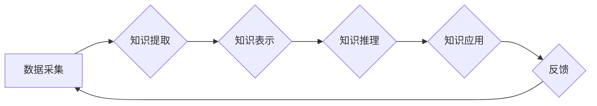

                 

## 知识的永续发展：智慧传承的长期视角

> 关键词：人工智能、知识传承、永续发展、智慧系统、算法、数据驱动、机器学习、深度学习、人类智慧

## 1. 背景介绍

在信息爆炸的时代，知识的产生和积累速度前所未有。然而，知识的获取和传播并非易事。如何有效地传承和利用知识，使其持续发展，成为一个至关重要的课题。人工智能（AI）作为一项新兴技术，为知识的永续发展提供了新的机遇和挑战。

传统知识传承模式主要依赖于人类的记忆和经验传递，存在着局限性，例如知识的碎片化、传承效率低、知识更新缓慢等问题。而AI技术，特别是深度学习，能够从海量数据中自动提取知识，并进行智能分析和推理，为知识的系统化、高效化和持续更新提供了新的可能性。

## 2. 核心概念与联系

**2.1 知识的永续发展**

知识的永续发展是指知识能够持续积累、更新和传播，并最终实现价值最大化的过程。它需要打破传统的知识壁垒，建立一个开放、共享、协作的知识生态系统。

**2.2 智慧传承**

智慧传承是指将人类的智慧经验、知识和技能代代相传的过程。它不仅包括知识的传递，更重要的是对知识的理解、应用和创新。

**2.3 AI驱动的智慧传承**

AI技术能够通过以下方式推动智慧传承：

* **知识自动化提取:** AI算法能够从文本、图像、音频等多种数据源中自动提取知识，并将其转化为可理解和利用的形式。
* **知识智能分析:** AI能够对提取的知识进行智能分析和推理，发现知识之间的关联和规律，并生成新的知识。
* **知识个性化推荐:** AI能够根据用户的需求和兴趣，个性化推荐相关知识，提高知识的利用效率。
* **知识协同创作:** AI能够帮助用户协同创作和更新知识，促进知识的共享和传播。

**2.4  智慧传承的架构**



## 3. 核心算法原理 & 具体操作步骤

**3.1 算法原理概述**

知识图谱构建是AI驱动的智慧传承的关键技术之一。知识图谱是一种基于知识表示的数据库，能够存储和组织大量结构化的知识。构建知识图谱需要以下关键步骤：

* **数据采集:** 从各种数据源中收集相关数据，例如文本、图像、音频等。
* **知识抽取:** 使用自然语言处理（NLP）技术从数据中提取知识，例如实体、关系、事件等。
* **知识表示:** 将提取的知识表示为结构化的形式，例如图结构、三元组等。
* **知识推理:** 使用规则引擎或机器学习算法进行知识推理，发现知识之间的关联和规律，并生成新的知识。

**3.2 算法步骤详解**

1. **数据预处理:** 对收集到的数据进行清洗、格式化和转换，使其能够被算法处理。
2. **实体识别:** 使用命名实体识别（NER）算法识别文本中的实体，例如人名、地名、机构名等。
3. **关系抽取:** 使用关系抽取算法识别实体之间的关系，例如“张三工作于百度”。
4. **知识表示:** 将实体和关系表示为三元组的形式，例如（张三，工作于，百度）。
5. **知识图谱构建:** 将多个三元组连接起来，构建完整的知识图谱。

**3.3 算法优缺点**

* **优点:** 能够有效地组织和存储知识，并进行智能分析和推理。
* **缺点:** 知识抽取和表示仍然是一个复杂的任务，需要大量的训练数据和算法优化。

**3.4 算法应用领域**

* **搜索引擎:** 构建知识图谱可以提高搜索引擎的准确性和相关性。
* **问答系统:** 知识图谱可以为问答系统提供丰富的知识背景，提高其回答质量。
* **推荐系统:** 知识图谱可以帮助推荐系统理解用户的兴趣和需求，提供更精准的推荐。
* **医疗诊断:** 知识图谱可以帮助医生诊断疾病，并提供个性化的治疗方案。

## 4. 数学模型和公式 & 详细讲解 & 举例说明

**4.1 数学模型构建**

知识图谱可以表示为一个图结构，其中节点代表实体，边代表关系。可以使用图论中的概念和算法来分析和推理知识图谱。

**4.2 公式推导过程**

* **节点度:** 节点的度是指连接该节点的边的数量。
* **路径长度:** 两个节点之间的路径长度是指连接这两个节点的边的数量。
* **中心性:** 节点的中心性是指该节点在图中的重要性。

**4.3 案例分析与讲解**

假设我们构建了一个关于电影的知识图谱，其中节点代表电影、演员、导演等实体，边代表关系，例如“主演”、“导演”、“类型”等。

我们可以使用节点度来分析电影的受欢迎程度，度数高的电影通常代表受欢迎程度高。

我们可以使用路径长度来分析电影之间的关联性，路径长度短的电影通常代表关联性强。

我们可以使用中心性来分析电影中的关键人物，中心性高的演员或导演通常代表在电影行业中具有重要影响力。

## 5. 项目实践：代码实例和详细解释说明

**5.1 开发环境搭建**

* Python 3.x
* TensorFlow 或 PyTorch
* SpaCy 或 NLTK

**5.2 源代码详细实现**

```python
import spacy

# 加载 SpaCy 模型
nlp = spacy.load("en_core_web_sm")

# 文本数据
text = "张三工作于百度，李四是张三的同事。"

# 使用 SpaCy 进行实体识别和关系抽取
doc = nlp(text)

# 提取实体和关系
entities = [(ent.text, ent.label_) for ent in doc.ents]
relations = [(token.text, token.dep_) for token in doc if token.dep_ != "ROOT"]

# 打印结果
print("实体:", entities)
print("关系:", relations)
```

**5.3 代码解读与分析**

* 使用 SpaCy 模型进行文本分析，识别实体和关系。
* 提取实体和关系，并将其存储为列表。
* 打印提取的实体和关系。

**5.4 运行结果展示**

```
实体: [('张三', 'PERSON'), ('百度', 'ORG')]
关系: [('工作于', 'prep'), ('是', 'aux'), ('同事', 'compound')]
```

## 6. 实际应用场景

**6.1 教育领域**

* 个性化学习推荐
* 智能问答系统
* 知识图谱辅助教学

**6.2 医疗领域**

* 疾病诊断辅助
* 药物研发
* 患者个性化治疗

**6.3 商业领域**

* 客户关系管理
* 市场营销分析
* 产品推荐

**6.4 未来应用展望**

* 更智能的知识推理和分析
* 更个性化的知识服务
* 更广泛的知识应用场景

## 7. 工具和资源推荐

**7.1 学习资源推荐**

* Stanford NLP Group: https://nlp.stanford.edu/
* DeepMind: https://deepmind.com/
* OpenAI: https://openai.com/

**7.2 开发工具推荐**

* TensorFlow: https://www.tensorflow.org/
* PyTorch: https://pytorch.org/
* SpaCy: https://spacy.io/

**7.3 相关论文推荐**

* Knowledge Graph Embedding: https://arxiv.org/abs/1601.06587
* Graph Convolutional Networks: https://arxiv.org/abs/1609.02907

## 8. 总结：未来发展趋势与挑战

**8.1 研究成果总结**

AI技术在知识传承领域取得了显著进展，例如知识图谱构建、知识推理、知识应用等。

**8.2 未来发展趋势**

* 更智能的知识表示和推理
* 更个性化的知识服务
* 更广泛的知识应用场景

**8.3 面临的挑战**

* 知识的质量和可靠性
* 知识的更新和维护
* 知识的伦理和安全

**8.4 研究展望**

未来研究将重点关注以下方面：

* 开发更智能的知识表示和推理方法
* 建立更完善的知识图谱构建和维护机制
* 研究知识传承的伦理和安全问题


## 9. 附录：常见问题与解答

**9.1 如何构建知识图谱？**

构建知识图谱需要以下步骤：数据采集、知识抽取、知识表示、知识推理。

**9.2 如何评估知识图谱的质量？**

知识图谱的质量可以从以下方面评估：准确性、完整性、一致性、可解释性。

**9.3 如何利用知识图谱进行知识应用？**

知识图谱可以用于各种知识应用，例如搜索引擎、问答系统、推荐系统、医疗诊断等。


作者：禅与计算机程序设计艺术 / Zen and the Art of Computer Programming 
<end_of_turn>

