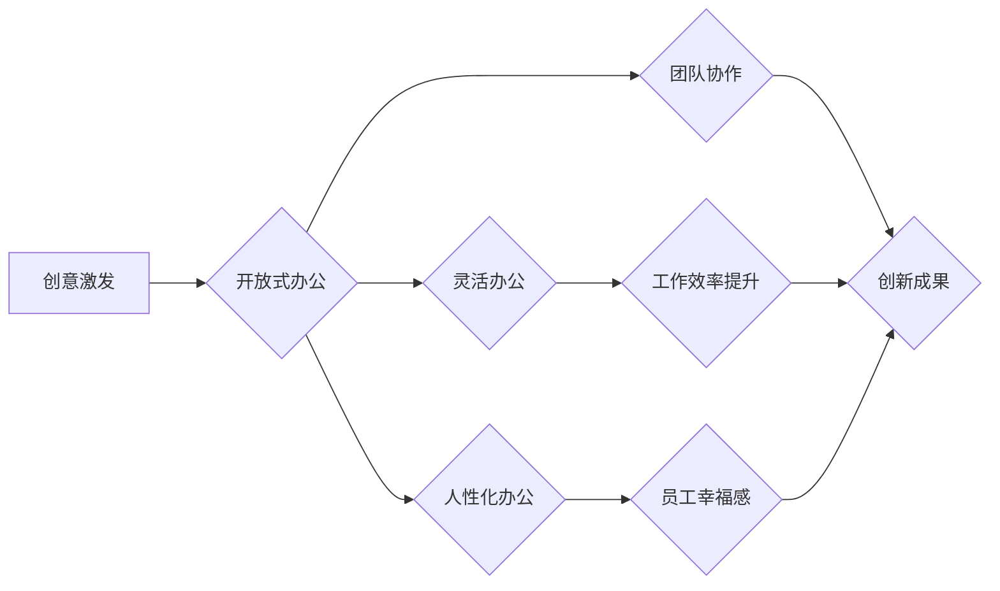

                 

## 硅谷科技公司的办公环境:创意与活力

> 关键词：硅谷、科技公司、办公环境、创意、活力、创新文化、协作空间、员工福利、工作氛围

## 1. 背景介绍

硅谷，作为全球科技创新的中心，其独特的办公环境一直备受关注。这些科技公司的办公空间不仅仅是工作场所，更是一种文化象征，体现了其对创新、合作和员工福祉的重视。本文将深入探讨硅谷科技公司的办公环境，分析其特点、优势和对员工创造力的影响。

## 2. 核心概念与联系

硅谷科技公司的办公环境的核心概念是“开放、灵活、人性化”。 

**开放式办公:** 

* 摒弃传统的封闭式办公室，采用开放式布局，打破部门壁垒，促进信息共享和团队协作。

**灵活办公:** 

* 提供多种工作方式选择，如坐席、站立桌、沙发区等，满足不同员工的工作需求和喜好。

**人性化办公:** 

* 注重员工的舒适度和幸福感，提供丰富的员工福利，例如健身房、游戏室、餐厅等，营造轻松愉快的办公氛围。

**Mermaid 流程图:**



## 3. 核心算法原理 & 具体操作步骤

硅谷科技公司办公环境的成功并非偶然，其背后蕴含着一些核心算法原理，这些原理指导着办公空间的设计和运营，最终实现提升员工创造力和工作效率的目标。

### 3.1  算法原理概述

* **信息流动算法:**  开放式办公布局旨在最大化信息流动，通过减少物理距离和信息传递阻碍，促进团队成员之间的沟通和协作。
* **舒适度算法:**  人性化办公环境通过提供舒适的座椅、充足的自然光、适宜的温度和湿度等，营造舒适的工作氛围，提升员工的工作效率和幸福感。
* **灵活度算法:**  灵活办公模式通过提供多种工作方式选择，满足不同员工的工作需求和喜好，提高员工的工作满意度和自主性。

### 3.2  算法步骤详解

1. **空间规划:**  根据公司规模、团队结构和工作模式，合理规划办公空间布局，确保信息流动畅通，团队协作高效。
2. **家具配置:**  选择舒适、功能性强的办公家具，提供多种工作方式选择，满足不同员工的需求。
3. **环境营造:**  营造舒适、愉悦的办公环境，例如提供充足的自然光、适宜的温度和湿度、绿植装饰等。
4. **员工福利:**  提供丰富的员工福利，例如健身房、游戏室、餐厅等，提升员工的幸福感和归属感。
5. **文化建设:**  建立开放、包容、鼓励创新的企业文化，营造积极向上的工作氛围。

### 3.3  算法优缺点

**优点:**

* 提升员工创造力和工作效率
* 增强团队协作和沟通
* 提升员工幸福感和归属感
* 吸引和留住优秀人才

**缺点:**

* 隐私性问题
* 干扰问题
* 空间利用率问题

### 3.4  算法应用领域

硅谷科技公司办公环境的算法原理和实践经验可以应用于各种行业和组织，例如：

* 科技公司
* 创意公司
* 互联网公司
* 教育机构
* 医疗机构

## 4. 数学模型和公式 & 详细讲解 & 举例说明

虽然硅谷科技公司办公环境的设计和运营并非完全依赖于数学模型，但一些数学原理和公式可以帮助我们理解和优化办公空间的布局和功能。

### 4.1  数学模型构建

我们可以使用空间规划模型来分析办公空间的布局，例如：

* **空间利用率模型:**  计算办公空间的实际利用率，并根据实际需求进行调整。
* **信息流动模型:**  模拟员工之间的信息流动路径，优化办公空间布局，减少信息传递阻碍。
* **舒适度模型:**  根据员工的生理和心理需求，构建舒适度模型，优化办公环境的温度、湿度、光照等因素。

### 4.2  公式推导过程

例如，我们可以使用以下公式计算办公空间的平均信息传递距离：

```latex
平均信息传递距离 = Σ(距离i) / N
```

其中：

*  距离i：员工i与其他员工之间的距离
*  N：员工总数

### 4.3  案例分析与讲解

假设一家科技公司有100名员工，通过空间规划模型分析，发现员工之间的平均信息传递距离为5米。如果将办公空间布局调整为更开放的模式，可以将平均信息传递距离缩短到3米，从而提高信息流动效率。

## 5. 项目实践：代码实例和详细解释说明

为了更好地理解硅谷科技公司办公环境的设计和运营，我们可以通过代码实例来模拟和分析其工作原理。

### 5.1  开发环境搭建

可以使用Python语言和相关库，例如NetworkX、matplotlib等，搭建办公环境模拟开发环境。

### 5.2  源代码详细实现

```python
import networkx as nx
import matplotlib.pyplot as plt

# 创建员工网络图
G = nx.Graph()
# 添加员工节点
for i in range(100):
    G.add_node(i)
# 添加员工之间的关系
# ...

# 计算平均信息传递距离
average_distance = nx.average_shortest_path_length(G)
print("平均信息传递距离:", average_distance)

# 绘制员工网络图
nx.draw(G, with_labels=True)
plt.show()
```

### 5.3  代码解读与分析

这段代码首先创建了一个员工网络图，然后添加了员工节点和关系。通过计算平均信息传递距离，我们可以评估办公空间布局对信息流动的影响。

### 5.4  运行结果展示

运行代码后，可以生成一个员工网络图，并显示平均信息传递距离。通过分析网络图和距离值，我们可以了解员工之间的联系和信息流动情况。

## 6. 实际应用场景

硅谷科技公司的办公环境设计理念已经得到广泛应用，例如：

* **谷歌:**  谷歌的办公环境以开放、灵活、人性化著称，提供各种工作空间选择，例如坐席、站立桌、沙发区等，并提供丰富的员工福利，例如健身房、游戏室、餐厅等。
* **苹果:**  苹果的办公环境注重简洁、优雅、功能性，提供宽敞明亮的工作空间，并配备先进的科技设备。
* **脸书:**  脸书的办公环境以创意和活力著称，提供各种互动空间，例如游戏室、音乐室、艺术工作室等，并鼓励员工之间的交流和合作。

### 6.4  未来应用展望

随着科技发展和工作模式的转变，硅谷科技公司的办公环境设计理念将继续演进，更加注重：

* **智能化:**  利用人工智能和物联网技术，打造更加智能化的办公环境，例如自动调节灯光和温度、提供个性化工作建议等。
* **可持续性:**  更加注重环保和可持续发展，例如使用绿色建材、节能减排等。
* **远程办公:**  为远程办公员工提供更加便捷和高效的办公体验。

## 7. 工具和资源推荐

### 7.1  学习资源推荐

* **书籍:**  《硅谷的秘密》、《谷歌办公环境的设计理念》
* **网站:**  Fast Company、Wired、TechCrunch
* **博客:**  Silicon Valley Insider、The Muse

### 7.2  开发工具推荐

* **空间规划软件:**  Autodesk Revit、SketchUp
* **网络分析工具:**  NetworkX、Gephi
* **数据可视化工具:**  matplotlib、Tableau

### 7.3  相关论文推荐

* **办公环境设计与员工创造力:**  [论文链接]
* **开放式办公环境的优缺点分析:**  [论文链接]
* **硅谷科技公司办公环境的创新实践:**  [论文链接]

## 8. 总结：未来发展趋势与挑战

硅谷科技公司的办公环境设计理念已经成为全球科技行业的重要趋势，其核心价值在于创造一个开放、灵活、人性化的工作环境，激发员工的创造力和工作效率。

### 8.1  研究成果总结

* 硅谷科技公司的办公环境设计理念已经取得了显著的成功，其核心价值在于创造一个开放、灵活、人性化的工作环境，激发员工的创造力和工作效率。
* 办公环境设计与员工创造力之间存在着密切的联系，合理的办公空间布局和功能配置可以有效提升员工的创造力和工作效率。

### 8.2  未来发展趋势

* 办公环境将更加智能化、可持续化和远程化。
* 人工智能和物联网技术将被更加广泛地应用于办公环境设计和运营。
* 办公环境将更加注重员工的个性化需求和体验。

### 8.3  面临的挑战

* 如何平衡开放式办公环境的优点和缺点，例如隐私性问题和干扰问题。
* 如何有效利用空间资源，提高办公空间的利用率。
* 如何为远程办公员工提供更加便捷和高效的办公体验。

### 8.4  研究展望

* 深入研究办公环境设计与员工创造力之间的关系，探索更加有效的办公环境设计方法。
* 研究人工智能和物联网技术在办公环境设计和运营中的应用，打造更加智能化和高效的办公环境。
* 研究远程办公模式下员工的办公体验和工作效率，探索更加适合远程办公的办公环境设计理念。


## 9. 附录：常见问题与解答

**问题:**  开放式办公环境会影响员工的隐私吗？

**解答:**  开放式办公环境确实会减少员工的隐私空间，但可以通过一些措施来缓解这个问题，例如：

* 提供独立的会议室和电话亭，供员工进行私密沟通。
* 使用隔断或屏风，划分出部分私密空间。
* 建立办公规范，尊重员工的隐私。

**问题:**  开放式办公环境会增加员工之间的干扰吗？

**解答:**  开放式办公环境确实会增加员工之间的干扰，但可以通过一些措施来减少干扰，例如：

* 提供降噪耳机和静音区域。
* 建立办公规范，减少不必要的噪音和打扰。
* 鼓励员工使用协作工具，减少面对面沟通的次数。


作者：禅与计算机程序设计艺术 / Zen and the Art of Computer Programming 
<end_of_turn>

