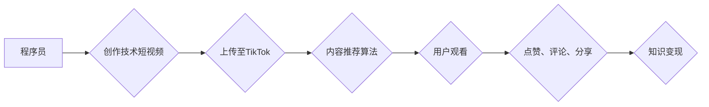

                 

## 程序员如何利用TikTok进行知识变现

> 关键词：程序员，TikTok，知识变现，技术内容，短视频，社区运营，算法，趋势

## 1. 背景介绍

在当今数字时代，信息爆炸和知识经济的快速发展，程序员作为科技领域的领军人物，拥有着丰富的技术知识和经验。然而，传统的知识传播方式，如书籍出版、技术博客等，往往存在传播效率低、受众范围有限等问题。而短视频平台TikTok凭借其独特的传播模式和庞大的用户群体，为程序员提供了新的知识变现机会。

TikTok作为全球最受欢迎的短视频平台之一，其用户群体庞大且活跃，其中不乏对技术感兴趣的年轻用户。程序员可以通过制作高质量的技术短视频，将自己的知识和经验以生动有趣的方式传递给用户，从而实现知识变现。

## 2. 核心概念与联系

### 2.1  知识变现

知识变现是指将个人或组织拥有的知识资源转化为经济价值的过程。对于程序员来说，知识变现可以采取多种形式，例如：

* **技术咨询服务:** 利用自身的技术专长为企业或个人提供技术咨询服务。
* **在线课程和培训:** 制作和销售技术相关的在线课程或培训视频。
* **技术博客和文章:** 通过撰写技术博客文章或技术文档，获得广告收入或赞助。
* **开源软件开发:** 开发开源软件并通过捐赠或商业化服务获得收益。

### 2.2  TikTok平台

TikTok是一个基于短视频的社交平台，其核心功能包括：

* **短视频创作和分享:** 用户可以创作并分享长度不超过10分钟的短视频。
* **内容推荐算法:** TikTok拥有强大的内容推荐算法，可以根据用户的兴趣爱好推荐相关视频。
* **社区互动:** 用户可以点赞、评论、转发视频，并与其他用户进行互动。
* **直播功能:** 用户可以进行实时直播，与粉丝互动。

### 2.3  程序员与TikTok的结合

程序员可以通过将自己的技术知识和经验融入到TikTok的短视频内容中，吸引目标用户，并实现知识变现。

**Mermaid 流程图:**



## 3. 核心算法原理 & 具体操作步骤

### 3.1  算法原理概述

TikTok的推荐算法是一个复杂的机器学习模型，其核心目标是根据用户的兴趣爱好推荐最相关的视频。该算法会分析用户的观看历史、点赞记录、评论内容等多种数据，并利用深度学习技术进行预测，从而推荐用户可能感兴趣的视频。

### 3.2  算法步骤详解

1. **数据采集:** TikTok会收集用户的各种行为数据，例如观看历史、点赞记录、评论内容、关注用户等。
2. **数据预处理:** 收集到的数据需要进行清洗、转换和特征提取等预处理步骤，以便于模型训练。
3. **模型训练:** TikTok会使用深度学习技术训练推荐模型，例如神经网络、深度强化学习等。
4. **模型预测:** 模型训练完成后，可以根据用户的行为数据进行预测，推荐用户可能感兴趣的视频。
5. **结果反馈:** 推荐结果会反馈给用户，并根据用户的反馈进行模型调整，不断优化推荐效果。

### 3.3  算法优缺点

**优点:**

* **精准推荐:** TikTok的推荐算法能够根据用户的兴趣爱好精准推荐相关视频，提高用户观看体验。
* **个性化推荐:** 算法可以根据用户的个性化需求进行推荐，提供更个性化的内容体验。
* **持续优化:** TikTok会不断收集用户反馈，并对算法进行优化，不断提升推荐效果。

**缺点:**

* **数据隐私:** 数据收集和分析可能会涉及用户隐私问题，需要谨慎处理。
* **算法偏差:** 算法可能会存在偏差，导致推荐结果不公平或不准确。
* **内容沉淀:** 短视频平台的内容更新速度快，容易导致优质内容被淹没。

### 3.4  算法应用领域

TikTok的推荐算法广泛应用于以下领域:

* **内容推荐:** 推荐用户可能感兴趣的视频、音乐、商品等。
* **广告投放:** 根据用户的兴趣爱好精准投放广告，提高广告效果。
* **用户画像:** 分析用户的行为数据，构建用户画像，用于个性化服务。
* **市场营销:** 利用算法进行市场调研、用户分析和营销策略制定。

## 4. 数学模型和公式 & 详细讲解 & 举例说明

### 4.1  数学模型构建

TikTok的推荐算法通常基于协同过滤或内容过滤等数学模型。

**协同过滤:**

协同过滤模型基于用户的行为相似性进行推荐。假设用户A和用户B都喜欢观看视频X，则可以推测用户A也可能喜欢观看用户B喜欢的视频。

**内容过滤:**

内容过滤模型基于视频的特征进行推荐。例如，如果用户喜欢观看编程相关的视频，则可以推荐其他编程相关的视频。

### 4.2  公式推导过程

由于TikTok的推荐算法是一个复杂的机器学习模型，其具体公式推导过程较为复杂，涉及到深度学习、概率统计等多个领域。

### 4.3  案例分析与讲解

假设用户A观看过以下视频：

* 视频1：Python编程基础
* 视频2：JavaScript高级技巧
* 视频3：数据结构与算法

根据用户的观看历史，TikTok的推荐算法可以推测用户A可能感兴趣的视频，例如：

* 视频4：机器学习入门
* 视频5：Web开发实战
* 视频6：算法设计与分析

## 5. 项目实践：代码实例和详细解释说明

### 5.1  开发环境搭建

程序员可以使用Python语言和相关的库进行TikTok短视频内容的开发。

**依赖库:**

* **requests:** 用于发送HTTP请求，获取TikTok API数据。
* **pandas:** 用于数据分析和处理。
* **numpy:** 用于数值计算。
* **matplotlib:** 用于数据可视化。

### 5.2  源代码详细实现

```python
import requests
import pandas as pd

# TikTok API接口地址
api_url = "https://api.tiktok.com/v1/videos"

# 用户ID
user_id = "1234567890"

# 获取用户视频列表
response = requests.get(api_url, params={"user_id": user_id})

# 解析JSON数据
data = response.json()

# 创建DataFrame
df = pd.DataFrame(data["videos"])

# 分析视频数据
print(df.head())
```

### 5.3  代码解读与分析

这段代码演示了如何使用Python语言和requests库获取TikTok用户视频列表。

* `api_url`变量存储了TikTok API接口地址。
* `user_id`变量存储了目标用户的ID。
* `requests.get()`函数发送HTTP请求，获取TikTok API数据。
* `response.json()`函数解析JSON数据，将其转换为Python字典。
* `pd.DataFrame()`函数将字典数据转换为DataFrame，方便数据分析和处理。
* `df.head()`函数打印DataFrame的前五行数据，用于查看数据内容。

### 5.4  运行结果展示

运行这段代码后，将输出目标用户的视频列表数据，包括视频ID、标题、描述、点赞数、评论数等信息。

## 6. 实际应用场景

### 6.1  技术讲解

程序员可以利用TikTok平台制作技术讲解视频，例如：

* **编程语言入门:** 教授Python、Java、C++等编程语言的基础知识。
* **算法与数据结构:** 解释常见的算法和数据结构，并提供代码示例。
* **软件开发技巧:** 分享软件开发的经验和技巧，例如代码规范、测试方法等。

### 6.2  项目案例分享

程序员可以分享自己的项目案例，展示自己的技术能力和项目经验。

### 6.3  技术趋势分析

程序员可以分析最新的技术趋势，并分享自己的见解和预测。

### 6.4  未来应用展望

随着短视频平台的不断发展，程序员可以通过TikTok平台进行更深入的技术交流和合作，例如：

* **技术社区建设:** 建立技术主题的TikTok社区，聚集技术爱好者，进行技术讨论和分享。
* **技术合作:** 通过TikTok平台寻找技术合作伙伴，共同开发项目。
* **技术招聘:** 利用TikTok平台发布技术招聘信息，吸引优秀人才。

## 7. 工具和资源推荐

### 7.1  学习资源推荐

* **Coursera:** 提供丰富的在线课程，涵盖各种技术领域。
* **Udemy:** 提供各种技术培训课程，价格相对实惠。
* **GitHub:** 存储大量的开源代码，可以学习其他程序员的代码实现。

### 7.2  开发工具推荐

* **Visual Studio Code:** 一款功能强大的代码编辑器，支持多种编程语言。
* **PyCharm:** 一款专为Python语言开发的IDE，提供丰富的开发工具和功能。
* **Git:** 一款分布式版本控制系统，用于代码管理和协作。

### 7.3  相关论文推荐

* **Deep Learning** by Ian Goodfellow, Yoshua Bengio, and Aaron Courville
* **Recommender Systems: The Textbook** by  Koren, Y.

## 8. 总结：未来发展趋势与挑战

### 8.1  研究成果总结

程序员可以通过利用TikTok平台的特性，将自己的技术知识和经验以生动有趣的方式传播给用户，实现知识变现。

### 8.2  未来发展趋势

随着短视频平台的不断发展，程序员在TikTok平台上的知识变现模式将会更加多样化，例如：

* **直播教学:** 进行实时直播，与用户互动，讲解技术知识。
* **付费课程:** 制作付费课程，提供更深入的技术培训。
* **技术咨询:** 通过TikTok平台提供技术咨询服务。

### 8.3  面临的挑战

程序员在TikTok平台上进行知识变现也面临着一些挑战，例如：

* **内容竞争:** 短视频平台内容更新速度快，需要不断创作优质内容才能脱颖而出。
* **算法变化:** TikTok的推荐算法可能会不断变化，需要及时调整内容策略。
* **用户信任:** 需要建立用户的信任，才能获得用户的关注和支持。

### 8.4  研究展望

未来，程序员可以进一步探索TikTok平台的潜力，开发更创新、更有效的知识变现模式，并与其他平台进行融合，构建更完善的知识传播生态系统。

## 9. 附录：常见问题与解答

**Q1: 如何在TikTok上获得粉丝？**

**A1:** 可以通过创作高质量的短视频内容，并积极与用户互动，例如回复评论、点赞其他用户视频等，来吸引粉丝。

**Q2: 如何进行TikTok直播？**

**A2:** 需要先在TikTok平台注册账号，并设置直播权限。直播时，可以与用户实时互动，回答问题、讲解技术知识等。

**Q3: 如何进行TikTok知识变现？**

**A3:** 可以通过以下方式进行知识变现：

* **广告收入:** 积累粉丝后，可以申请加入TikTok Creator Fund，获得广告收入。
* **付费课程:** 制作付费课程，提供更深入的技术培训。
* **技术咨询:** 通过TikTok平台提供技术咨询服务。
* **产品推广:** 推广与技术相关的产品或服务。


作者：禅与计算机程序设计艺术 / Zen and the Art of Computer Programming 
<end_of_turn>

