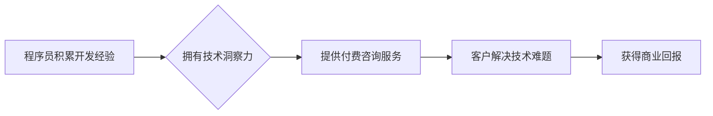

                 

## 程序员如何将开发经验转化为付费咨询服务

> 关键词：软件开发、咨询服务、技术专家、付费咨询、经验转化、商业化

### 1. 背景介绍

在当今科技日新月异的时代，程序员作为构建数字世界的关键力量，拥有着宝贵的开发经验和技术洞察力。然而，许多程序员将这些宝贵的资源局限于个人项目或公司工作，未能将其有效转化为商业价值。付费咨询服务为程序员提供了将开发经验变现的绝佳途径，帮助他们分享专业知识，解决客户难题，并获得可观的收入。

### 2. 核心概念与联系

**2.1 核心概念**

* **付费咨询服务:** 指程序员以其专业知识和经验为基础，为客户提供一对一或小范围的咨询服务，并收取相应的费用。
* **开发经验:** 包括程序员在软件开发过程中积累的知识、技能、最佳实践和解决问题的能力。
* **技术洞察力:** 指程序员对技术趋势、新兴技术和行业发展方向的理解和预测能力。

**2.2 联系关系**

程序员的开发经验和技术洞察力是付费咨询服务的核心资源。通过将这些资源转化为有价值的咨询服务，程序员可以帮助客户解决技术难题，提高开发效率，并获得商业回报。

**2.3 流程图**



### 3. 核心算法原理 & 具体操作步骤

**3.1 算法原理概述**

付费咨询服务的核心算法原理在于将程序员的开发经验和技术洞察力转化为可量化的服务价值。这需要程序员具备以下能力：

* **精准定位客户需求:** 理解客户的具体问题和目标，并提供针对性的解决方案。
* **高效传递知识:** 以清晰易懂的方式传达技术知识，帮助客户理解和应用。
* **提供持续支持:** 在咨询过程中及时解答客户疑问，并提供后续技术支持。

**3.2 算法步骤详解**

1. **确定咨询领域:** 根据自身经验和兴趣，选择一个具体的软件开发领域作为咨询方向。
2. **构建知识体系:** 整理和归纳自身在所选领域积累的知识、技能和最佳实践，形成一个完整的知识体系。
3. **制定服务方案:** 设计不同类型的咨询服务，例如一对一咨询、项目评估、技术培训等，并制定相应的收费标准。
4. **搭建线上平台:** 建立个人网站或使用第三方平台，展示咨询服务内容、案例和收费标准。
5. **推广营销:** 通过社交媒体、技术论坛、行业活动等渠道推广咨询服务，吸引潜在客户。
6. **提供优质服务:** 与客户保持良好的沟通，认真倾听需求，并提供专业、高效、满意的咨询服务。

**3.3 算法优缺点**

* **优点:** 
    * 利用自身经验创造价值，获得可观的收入。
    * 提升个人品牌影响力，建立专业形象。
    * 扩展人脉资源，与行业内其他专业人士建立联系。
* **缺点:** 
    * 需要投入时间和精力进行知识整理和服务推广。
    * 需要具备良好的沟通和服务能力。
    * 市场竞争激烈，需要不断提升服务质量和竞争力。

**3.4 算法应用领域**

* 软件开发咨询
* 技术架构设计
* 项目管理
* 代码审计
* 技术培训

### 4. 数学模型和公式 & 详细讲解 & 举例说明

**4.1 数学模型构建**

付费咨询服务的价值可以抽象为一个数学模型：

**价值 = 经验 * 洞察力 * 服务质量**

其中：

* **经验:** 指程序员在所选领域积累的知识和技能水平。
* **洞察力:** 指程序员对技术趋势和行业发展方向的理解和预测能力。
* **服务质量:** 指程序员提供咨询服务的专业性、效率和客户满意度。

**4.2 公式推导过程**

* **经验:** 可以用程序员在所选领域的工作年限、项目经验、技术认证等指标来量化。
* **洞察力:** 可以通过程序员发表的技术文章、参与行业论坛、预测技术趋势等行为来评估。
* **服务质量:** 可以通过客户评价、回头率、咨询服务成功率等指标来衡量。

**4.3 案例分析与讲解**

假设一位程序员拥有5年的软件开发经验，在人工智能领域拥有深入的洞察力，并提供高质量的咨询服务。根据上述数学模型，该程序员的咨询价值将较高。

### 5. 项目实践：代码实例和详细解释说明

**5.1 开发环境搭建**

* **操作系统:** Windows、macOS、Linux
* **编程语言:** Python、Java、JavaScript等
* **开发工具:** IDE、文本编辑器、版本控制系统等

**5.2 源代码详细实现**

以下是一个简单的Python代码示例，用于展示程序员如何将开发经验转化为付费咨询服务：

```python
def analyze_code(code_snippet):
  """
  分析代码片段，识别潜在问题和改进建议。
  """
  # 代码分析逻辑
  # ...
  return analysis_result

# 示例用法
code_snippet = """
def calculate_sum(a, b):
  return a + b
"""
analysis_result = analyze_code(code_snippet)
print(analysis_result)
```

**5.3 代码解读与分析**

该代码示例展示了一个简单的代码分析函数，可以识别代码片段中的潜在问题和改进建议。程序员可以根据自身经验，扩展该函数的功能，例如：

* 检测代码中的语法错误和逻辑错误。
* 识别代码中的性能瓶颈和可优化之处。
* 提供代码重构和优化建议。

**5.4 运行结果展示**

运行该代码后，将输出分析结果，例如：

```
分析结果：
* 代码语法正确。
* 代码逻辑清晰。
* 性能良好。
* 建议使用更简洁的变量名。
```

### 6. 实际应用场景

**6.1 软件开发团队咨询**

软件开发团队可以聘请程序员作为咨询顾问，帮助他们解决技术难题、优化代码质量、提高开发效率。

**6.2 企业技术转型咨询**

企业在进行技术转型时，可以咨询程序员的专业意见，帮助他们选择合适的技术方案、制定实施计划、评估风险和效益。

**6.3 个人技术提升咨询**

程序员可以向其他程序员提供技术指导和培训，帮助他们提升技术水平、学习新技术、解决工作中的难题。

**6.4 未来应用展望**

随着人工智能、云计算等技术的不断发展，程序员的咨询服务将更加智能化、个性化和自动化。例如，可以利用人工智能技术自动分析代码、生成咨询建议，并提供个性化的学习方案。

### 7. 工具和资源推荐

**7.1 学习资源推荐**

* **书籍:** 《软件工程实践》、《敏捷软件开发》、《设计模式》等
* **在线课程:** Coursera、Udemy、edX等平台提供丰富的软件开发和咨询服务相关的课程。
* **技术论坛:** Stack Overflow、GitHub等平台可以帮助程序员学习新技术、解决问题、与其他程序员交流。

**7.2 开发工具推荐**

* **IDE:** Visual Studio Code、IntelliJ IDEA、Eclipse等
* **版本控制系统:** Git、SVN等
* **协作工具:** Slack、Jira、Trello等

**7.3 相关论文推荐**

* **软件工程论文:** ACM Digital Library、IEEE Xplore等数据库提供丰富的软件工程论文。
* **咨询服务论文:** Harvard Business Review、McKinsey Quarterly等期刊发表了关于咨询服务的相关研究。

### 8. 总结：未来发展趋势与挑战

**8.1 研究成果总结**

程序员将开发经验转化为付费咨询服务是一个具有巨大潜力的商业模式。通过不断提升自身的技术能力、服务质量和品牌影响力，程序员可以获得可观的收入，并为客户提供有价值的技术支持。

**8.2 未来发展趋势**

* **智能化咨询服务:** 利用人工智能技术，提供更加智能化、个性化和自动化的咨询服务。
* **跨领域咨询服务:** 程序员可以将自身的技术经验应用于其他领域，例如金融、医疗、教育等，提供跨领域咨询服务。
* **全球化咨询服务:** 通过线上平台，程序员可以为全球客户提供咨询服务，拓展国际市场。

**8.3 面临的挑战**

* **市场竞争激烈:** 付费咨询服务市场竞争激烈，程序员需要不断提升自身竞争力。
* **服务质量保障:** 需要保证咨询服务的质量和专业性，才能赢得客户信任。
* **知识产权保护:** 需要妥善保护自身的技术知识和咨询服务内容的知识产权。

**8.4 研究展望**

未来，随着人工智能、云计算等技术的不断发展，程序员的咨询服务将更加智能化、个性化和自动化，并拓展到更多领域。程序员需要不断学习新技术、提升服务能力，才能在未来竞争中脱颖而出。

### 9. 附录：常见问题与解答

**9.1 如何确定咨询服务的价格？**

咨询服务的价格可以根据自身经验、服务内容、市场行情等因素进行确定。可以参考其他程序员的收费标准，并根据自身情况进行调整。

**9.2 如何推广自己的咨询服务？**

可以通过社交媒体、技术论坛、行业活动等渠道推广咨询服务。可以建立个人网站或使用第三方平台，展示咨询服务内容、案例和收费标准。

**9.3 如何与客户建立良好的沟通？**

需要认真倾听客户的需求，及时解答客户疑问，并提供专业的技术支持。保持良好的沟通和服务态度，才能赢得客户信任。


作者：禅与计算机程序设计艺术 / Zen and the Art of Computer Programming 
<end_of_turn>

