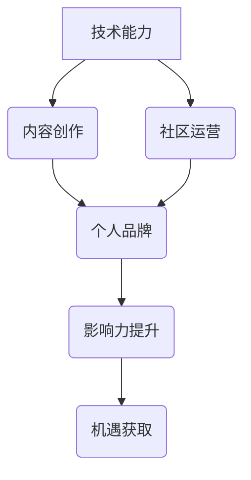

                 

## 程序员如何打造个人IP矩阵

> 关键词：个人IP、技术博客、内容创作、品牌建设、社区运营、技术专家、程序员

### 1. 背景介绍

在当今科技飞速发展的时代，程序员作为数字时代的基石，肩负着构建未来世界的重任。然而，随着编程人才的日益增多，如何脱颖而出，建立个人品牌，并获得更大的影响力，成为了程序员们共同面临的挑战。

个人IP矩阵的概念应运而生，它旨在帮助程序员构建一个多维度的个人品牌体系，通过内容创作、社区运营、技术分享等方式，打造一个独特的个人品牌，从而提升个人影响力，获得更多机遇。

### 2. 核心概念与联系

个人IP矩阵的核心在于将个人技术能力、专业知识、个人特质等多方面元素整合在一起，形成一个完整的个人品牌体系。

**个人IP矩阵架构**



**核心概念原理和架构**

* **技术能力:** 这是个人IP矩阵的基础，程序员需要不断学习和提升自己的技术能力，掌握最新的编程语言、框架和技术趋势。
* **内容创作:** 通过博客、视频、音频等形式，分享自己的技术经验、项目案例、学习心得等，建立个人知识体系，并与他人进行交流互动。
* **社区运营:** 积极参与技术社区，与其他程序员交流学习，分享经验，并建立自己的个人网络。
* **个人品牌:** 通过内容创作和社区运营，形成一个独特的个人品牌形象，展现自己的专业能力、个人特质和价值观。
* **影响力提升:** 通过个人品牌的建立，提升自己在技术领域的知名度和影响力，获得更多关注和认可。
* **机遇获取:** 随着影响力的提升，程序员将获得更多职业发展机会，例如加入知名公司、参与开源项目、获得技术咨询机会等。

### 3. 核心算法原理 & 具体操作步骤

打造个人IP矩阵并非一蹴而就，需要程序员们遵循一定的步骤和策略，逐步完善自己的个人品牌体系。

**3.1 算法原理概述**

打造个人IP矩阵的核心算法可以概括为以下几个步骤：

1. **自我定位:** 确定自己的技术方向和个人特质，明确自己的目标受众。
2. **内容规划:** 制定内容创作计划，选择合适的平台和形式，并保持内容的持续更新。
3. **社区参与:** 积极参与技术社区，建立人脉关系，并分享自己的技术经验和见解。
4. **品牌推广:** 利用社交媒体等平台，推广自己的个人品牌，并与其他技术博主进行合作。
5. **数据分析:** 定期分析内容的阅读量、点赞量、评论量等数据，并根据数据反馈调整内容策略。

**3.2 算法步骤详解**

1. **自我定位:**

   * **技术方向:** 确定自己的技术专长，例如前端开发、后端开发、数据科学等，并深入研究相关领域的技术趋势和发展方向。
   * **个人特质:** 挖掘自己的个人特质，例如幽默风趣、逻辑思维清晰、善于沟通等，并将其融入到内容创作中，打造独特的个人风格。
   * **目标受众:** 明确自己的目标受众，例如初学者、经验丰富的程序员、企业技术负责人等，并根据目标受众的需求调整内容的难度和方向。

2. **内容规划:**

   * **平台选择:** 选择合适的平台进行内容创作，例如博客、技术论坛、视频网站、社交媒体等，并根据平台的特点和目标受众进行内容调整。
   * **内容形式:** 选择合适的內容形式，例如文章、视频、音频、代码示例等，并根据内容主题和目标受众进行选择。
   * **内容更新:** 制定内容更新计划，并坚持定期更新内容，保持用户的关注度。

3. **社区参与:**

   * **技术社区:** 积极参与技术社区，例如 Stack Overflow、GitHub、技术论坛等，并参与讨论、回答问题、分享经验。
   * **线下活动:** 参加线下技术会议、研讨会等活动，与其他程序员进行交流学习，并建立人脉关系。
   * **开源项目:** 参与开源项目，贡献自己的代码和技术经验，并与其他开发者合作，提升自己的技术能力和影响力。

4. **品牌推广:**

   * **社交媒体:** 利用社交媒体平台，例如 Twitter、LinkedIn、微信公众号等，推广自己的个人品牌，并与其他技术博主进行合作。
   * **个人网站:** 建立个人网站，展示自己的技术能力、项目案例、个人博客等，并提供联系方式，方便用户与自己进行沟通。
   * **技术演讲:** 参加技术演讲活动，分享自己的技术经验和见解，并提升自己的个人品牌知名度。

5. **数据分析:**

   * **内容数据:** 分析内容的阅读量、点赞量、评论量等数据，了解用户对内容的兴趣和反馈，并根据数据调整内容策略。
   * **社交媒体数据:** 分析社交媒体平台的粉丝增长、互动率等数据，了解用户对个人品牌的关注度和认可度，并根据数据调整推广策略。
   * **用户反馈:** 收集用户反馈，了解用户对个人品牌的评价和建议，并根据反馈进行改进和优化。

**3.3 算法优缺点**

* **优点:**

   * **可量化:** 算法步骤清晰，可量化评估，方便程序员跟踪和改进。
   * **可重复:** 算法步骤可重复执行，方便程序员快速建立个人IP矩阵。
   * **可持续:** 算法强调内容持续更新和社区参与，有利于个人IP矩阵的长期发展。

* **缺点:**

   * **缺乏灵活性:** 算法步骤较为固定，可能无法满足所有程序员的个性化需求。
   * **需要时间和精力:** 建立个人IP矩阵需要程序员投入大量的时间和精力，需要坚持不懈的努力。
   * **结果不确定:** 个人IP矩阵的成功与否取决于多种因素，例如内容质量、社区参与度、个人特质等，结果并非完全可控。

**3.4 算法应用领域**

* **技术博客:** 程序员可以通过博客分享技术经验、项目案例、学习心得等，建立个人知识体系，并与他人进行交流互动。
* **开源项目:** 程序员可以通过参与开源项目，贡献自己的代码和技术经验，并与其他开发者合作，提升自己的技术能力和影响力。
* **技术社区:** 程序员可以通过积极参与技术社区，回答问题、分享经验、建立人脉关系，提升自己在技术领域的知名度和影响力。
* **技术演讲:** 程序员可以通过参加技术演讲活动，分享自己的技术经验和见解，并提升自己的个人品牌知名度。

### 4. 数学模型和公式 & 详细讲解 & 举例说明

打造个人IP矩阵可以抽象为一个网络传播模型，其中个人IP作为节点，内容、社区、品牌等因素作为连接，通过公式可以量化分析其传播效果。

**4.1 数学模型构建**

我们可以用一个简单的网络传播模型来描述个人IP矩阵的传播过程：

```
IP_影响力 = f(内容质量, 社区参与度, 品牌知名度)
```

其中：

* **IP_影响力:** 指的是个人IP在技术领域的影响力，可以由关注者数量、点赞量、评论量等指标衡量。
* **内容质量:** 指的是个人创作的内容质量，包括内容的原创性、实用性、趣味性等因素。
* **社区参与度:** 指的是个人在技术社区的参与度，包括回答问题、分享经验、建立人脉等行为。
* **品牌知名度:** 指的是个人品牌的知名度，包括个人网站访问量、社交媒体粉丝数量等指标。

**4.2 公式推导过程**

我们可以进一步推导公式，将各个因素的权重进行量化：

```
IP_影响力 = α * 内容质量 + β * 社区参与度 + γ * 品牌知名度
```

其中：

* **α, β, γ:** 分别代表内容质量、社区参与度、品牌知名度的权重，可以通过数据分析和经验判断确定。

**4.3 案例分析与讲解**

假设一个程序员想要打造个人IP矩阵，他可以根据公式进行调整：

* **提高内容质量:** 创作原创性强、实用性高、趣味性强的技术文章，并进行代码示例和案例分析。
* **加强社区参与度:** 积极回答技术社区的问题，分享自己的技术经验，并与其他开发者进行交流学习。
* **提升品牌知名度:** 建立个人网站，展示自己的技术能力和项目案例，并利用社交媒体平台推广个人品牌。

通过不断调整各个因素的权重，程序员可以优化个人IP矩阵的传播效果，提升自己在技术领域的知名度和影响力。

### 5. 项目实践：代码实例和详细解释说明

为了更好地理解如何打造个人IP矩阵，我们可以通过一个简单的项目实践来进行说明。

**5.1 开发环境搭建**

* **操作系统:** Windows/macOS/Linux
* **编程语言:** Python
* **开发工具:** VS Code/Atom/Sublime Text

**5.2 源代码详细实现**

```python
# 个人IP矩阵数据分析脚本

import pandas as pd

# 读取数据
data = pd.read_csv("ip_data.csv")

# 计算内容质量得分
data["content_quality"] = data["likes"] / data["views"]

# 计算社区参与度得分
data["community_engagement"] = data["answers"] + data["comments"]

# 计算品牌知名度得分
data["brand_awareness"] = data["followers"] * data["website_traffic"]

# 计算IP影响力得分
data["ip_influence"] = 0.4 * data["content_quality"] + 0.3 * data["community_engagement"] + 0.3 * data["brand_awareness"]

# 输出结果
print(data)
```

**5.3 代码解读与分析**

* 该脚本首先读取个人IP矩阵的数据，包括内容质量、社区参与度、品牌知名度等指标。
* 然后，根据公式计算IP影响力得分，并将其存储在新的列中。
* 最后，输出结果，展示每个指标的得分以及最终的IP影响力得分。

**5.4 运行结果展示**

运行该脚本后，将输出一个包含所有指标和IP影响力得分的数据表，程序员可以根据数据分析自己的个人IP矩阵的强弱项，并制定相应的改进策略。

### 6. 实际应用场景

个人IP矩阵的应用场景非常广泛，例如：

* **技术博客:** 程序员可以通过博客分享技术经验、项目案例、学习心得等，建立个人知识体系，并与他人进行交流互动。
* **开源项目:** 程序员可以通过参与开源项目，贡献自己的代码和技术经验，并与其他开发者合作，提升自己的技术能力和影响力。
* **技术社区:** 程序员可以通过积极参与技术社区，回答问题、分享经验、建立人脉关系，提升自己在技术领域的知名度和影响力。
* **技术演讲:** 程序员可以通过参加技术演讲活动，分享自己的技术经验和见解，并提升自己的个人品牌知名度。

**6.4 未来应用展望**

随着人工智能、大数据等技术的不断发展，个人IP矩阵的应用场景将更加广泛，例如：

* **个性化学习:** 根据用户的个人IP矩阵，提供个性化的学习建议和资源。
* **精准营销:** 根据用户的个人IP矩阵，进行精准的营销推广。
* **人才招聘:** 根据用户的个人IP矩阵，进行人才的精准招聘。

### 7. 工具和资源推荐

**7.1 学习资源推荐**

* **书籍:** 《程序员如何打造个人IP矩阵》、《技术博客写作指南》、《社交媒体营销实战》
* **网站:** Hacker News、Stack Overflow、GitHub、Medium
* **课程:** Coursera、Udemy、edX

**7.2 开发工具推荐**

* **博客平台:** WordPress、Medium、Ghost
* **代码托管平台:** GitHub、GitLab、Bitbucket
* **社交媒体平台:** Twitter、LinkedIn、微信公众号

**7.3 相关论文推荐**

* **网络传播模型:** "The Diffusion of Innovations" by Everett Rogers
* **个人品牌建设:** "Building a Personal Brand" by Dan Schawbel
* **内容营销:** "Content Rules" by Ann Handley

### 8. 总结：未来发展趋势与挑战

**8.1 研究成果总结**

打造个人IP矩阵是一个不断发展和完善的过程，通过算法模型和数据分析，可以量化评估个人IP矩阵的传播效果，并制定相应的改进策略。

**8.2 未来发展趋势**

未来，个人IP矩阵将更加注重个性化、智能化和数据化，例如：

* **个性化推荐:** 根据用户的个人IP矩阵，提供个性化的学习建议、技术资源和职业发展机会。
* **智能化运营:** 利用人工智能技术，自动分析数据、生成内容、进行社交媒体推广等，提高个人IP矩阵的运营效率。
* **数据化评估:** 通过更加完善的数据指标和分析模型，更加准确地评估个人IP矩阵的价值和影响力。

**8.3 面临的挑战**

打造个人IP矩阵也面临着一些挑战，例如：

* **内容原创性:** 如何创作出原创性强、实用性高、趣味性强的技术内容，是个人IP矩阵建设的关键。
* **社区参与度:** 如何积极参与技术社区，建立人脉关系，并与其他开发者进行有效交流，也是个人IP矩阵建设的重要环节。
* **品牌推广:** 如何有效推广个人品牌，提升知名度和影响力，也是个人IP矩阵建设需要面对的挑战。

**8.4 研究展望**

未来，我们将继续研究个人IP矩阵的构建方法、传播机制和应用场景，并探索如何利用人工智能技术，打造更加智能化、个性化和高效的个人IP矩阵体系。

### 9. 附录：常见问题与解答

**常见问题:**

* **如何确定自己的技术方向？**

   建议根据自己的兴趣爱好、优势技能和市场需求进行选择。

* **如何提高内容质量？**

   建议创作原创性强、实用性高、趣味性强的技术内容，并进行代码示例和案例分析。

* **如何建立人脉关系？**

   建议积极参与技术社区，回答问题、分享经验、与其他开发者进行交流学习。

* **如何推广个人品牌？**

   建议建立个人网站、利用社交媒体平台、参加技术演讲活动等方式进行推广。


作者：禅与计算机程序设计艺术 / Zen and the Art of Computer Programming<end_of_turn>

