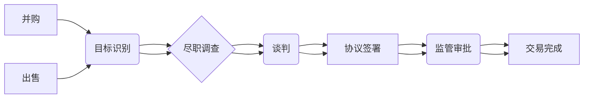

                 

## 程序员如何评估并购机会与公司出售时机

> 关键词：并购、出售、估值、财务分析、技术评估、市场分析、程序员、创业、投资

## 1. 背景介绍

作为程序员，我们常常沉浸在代码的世界里，专注于技术细节和产品开发。然而，在创业的道路上，我们也需要了解并掌握一些商业知识，例如如何评估并购机会和公司出售时机。 

并购和出售是企业发展的重要战略选择，对于程序员来说，理解这些概念不仅可以帮助我们更好地评估自身项目的价值，还可以让我们在投资和创业的过程中做出更明智的决策。

## 2. 核心概念与联系

**2.1 并购与出售**

* **并购 (Mergers and Acquisitions)**：指一家公司收购另一家公司，使其成为其子公司或合并为一家新的公司。并购可以是同行业公司之间的合并，也可以是跨行业公司的收购。
* **出售 (Sale)**：指一家公司将其全部或部分资产出售给另一家公司或个人。

**2.2 并购与出售的动机**

* **并购动机**:
    * **市场份额扩张**: 通过收购竞争对手，扩大市场份额和影响力。
    * **技术整合**: 收购拥有核心技术的公司，获得新的技术和知识产权。
    * **成本节约**: 通过合并，实现规模经济，降低运营成本。
    * **进入新市场**: 通过收购，快速进入新的市场和客户群体。
* **出售动机**:
    * **退出投资**: 创始人或投资者希望获得投资回报，退出公司。
    * **战略调整**: 公司希望专注于核心业务，出售非核心业务部门。
    * **财务困难**: 公司面临财务困境，需要通过出售资产来解决资金问题。

**2.3 并购与出售的流程**

并购和出售的流程通常包括以下几个阶段：

* **目标识别**: 确定并购或出售的目标公司或资产。
* **尽职调查**: 对目标公司进行财务、法律、技术等方面的调查。
* **谈判**: 双方就收购价格、交易结构等进行谈判。
* **协议签署**: 双方签署收购协议或出售协议。
* **监管审批**: 提交相关监管部门审批。
* **交易完成**: 完成交易，并购或出售方正式生效。

**2.4 核心概念关系图**



## 3. 核心算法原理 & 具体操作步骤

### 3.1 算法原理概述

评估并购机会和公司出售时机需要综合考虑多种因素，并利用一定的算法模型进行分析。 

常见的算法模型包括：

* ** discounted cash flow (DCF) 模型**:  通过预测未来现金流，并将其折现回现值，估算公司的价值。
* **comparable company analysis (CCA) 模型**: 通过比较与目标公司业务相似公司的估值指标，估算目标公司的价值。
* **precedent transaction analysis (PTA) 模型**: 通过分析类似交易的历史数据，估算目标公司的价值。

### 3.2 算法步骤详解

**3.2.1 DCF 模型**

1. **预测未来现金流**: 
    * 分析目标公司的财务报表，预测未来三到五年内的营业收入、成本、税费等数据。
    * 考虑市场环境、行业趋势、公司战略等因素，对未来现金流进行调整。
2. **确定折现率**: 
    * 折现率反映了资金的时间价值，通常采用 Weighted Average Cost of Capital (WACC) 来计算。
    * WACC 包括公司债务融资成本和股权融资成本的加权平均值。
3. **计算现值**: 
    * 将未来现金流折现回现值，可以使用公式：PV = CF / (1 + r)^t，其中 PV 为现值，CF 为未来现金流，r 为折现率，t 为时间。
4. **估算企业价值**: 
    * 将所有期现金流的现值相加，得到企业的总现值，即企业价值。

**3.2.2 CCA 模型**

1. **选择 comparable company**: 
    * 找到与目标公司业务相似、规模相近的上市公司，作为比较对象。
2. **收集估值指标**: 
    * 收集比较公司的市盈率 (P/E)、市净率 (P/B)、市销率 (P/S) 等估值指标。
3. **调整估值指标**: 
    * 根据目标公司和比较公司的差异，例如增长率、盈利能力、风险等，对估值指标进行调整。
4. **估算企业价值**: 
    * 将调整后的估值指标乘以目标公司的财务数据，例如净利润、净资产、营业收入等，得到企业价值。

**3.2.3 PTA 模型**

1. **收集历史交易数据**: 
    * 收集类似交易的历史数据，例如收购价格、交易时间、交易对象等。
2. **分析交易数据**: 
    * 分析交易数据的特征，例如交易价格与目标公司财务指标的关系、交易价格与市场环境的关系等。
3. **估算企业价值**: 
    * 根据分析结果，估算目标公司的价值。

### 3.3 算法优缺点

* **DCF 模型**: 
    * 优点: 理论基础扎实，可以考虑未来现金流的变化。
    * 缺点: 对未来现金流的预测存在较大不确定性，对折现率的确定也有一定的主观性。
* **CCA 模型**: 
    * 优点: 数据来源丰富，操作相对简单。
    * 缺点: 找到合适的 comparable company 比较困难，估值指标的调整存在主观性。
* **PTA 模型**: 
    * 优点: 可以参考历史交易数据，相对客观。
    * 缺点: 历史交易数据有限，难以找到完全相同的交易案例。

### 3.4 算法应用领域

* **并购评估**: 帮助企业评估并购目标公司的价值，决定是否进行收购。
* **公司出售**: 帮助企业估算自身价值，制定出售策略。
* **投资决策**: 帮助投资者评估投资机会，做出投资决策。

## 4. 数学模型和公式 & 详细讲解 & 举例说明

### 4.1 数学模型构建

**4.1.1 DCF 模型数学公式**

企业价值 = ∑(CFt / (1 + r)^t) + Terminal Value

其中:

* CFt: t 年期的未来现金流
* r: 折现率
* t: 时间周期
* Terminal Value: 企业在未来无限期内的终端价值

**4.1.2 CCA 模型数学公式**

企业价值 = 估值指标 * 财务指标

其中:

* 估值指标: 市盈率 (P/E)、市净率 (P/B)、市销率 (P/S) 等
* 财务指标: 净利润、净资产、营业收入等

### 4.2 公式推导过程

**4.2.1 DCF 模型公式推导**

DCF 模型的核心思想是将未来现金流折现回现值，并将其相加，得到企业的总现值。

公式推导过程如下:

1. 假设企业在未来 n 年内每年产生 CFt 的现金流。
2. 由于资金的时间价值，每年的现金流需要折现回现值。
3. 折现公式为 PV = CF / (1 + r)^t，其中 PV 为现值，CF 为未来现金流，r 为折现率，t 为时间。
4. 将所有期现金流的现值相加，得到企业的总现值:

企业价值 = ∑(CFt / (1 + r)^t)

5. 为了考虑企业在未来无限期的现金流，需要计算终端价值 (Terminal Value)。

**4.2.2 CCA 模型公式推导**

CCA 模型的核心思想是通过比较与目标公司业务相似公司的估值指标，估算目标公司的价值。

公式推导过程如下:

1. 选择与目标公司业务相似、规模相近的上市公司作为比较对象。
2. 收集比较公司的市盈率 (P/E)、市净率 (P/B)、市销率 (P/S) 等估值指标。
3. 根据目标公司和比较公司的差异，例如增长率、盈利能力、风险等，对估值指标进行调整。
4. 将调整后的估值指标乘以目标公司的财务数据，例如净利润、净资产、营业收入等，得到企业价值。

### 4.3 案例分析与讲解

**4.3.1 DCF 模型案例分析**

假设一家公司预计未来三年的现金流分别为 100 万美元、120 万美元、140 万美元，折现率为 10%。

根据 DCF 模型公式，企业价值为:

企业价值 = 100 万美元 / (1 + 0.1)^1 + 120 万美元 / (1 + 0.1)^2 + 140 万美元 / (1 + 0.1)^3 + Terminal Value

**4.3.2 CCA 模型案例分析**

假设一家公司与一家市盈率为 20 倍的上市公司业务相似，净利润为 100 万美元。

根据 CCA 模型公式，企业价值为:

企业价值 = 20 * 100 万美元 = 2000 万美元

## 5. 项目实践：代码实例和详细解释说明

### 5.1 开发环境搭建

* **编程语言**: Python
* **库依赖**: pandas, numpy, matplotlib

### 5.2 源代码详细实现

```python
import pandas as pd
import numpy as np
from matplotlib import pyplot as plt

# 导入财务数据
data = pd.read_csv('financial_data.csv')

# 计算 DCF 模型
def calculate_dcf(data, discount_rate):
    # 预测未来现金流
    future_cash_flows = data['Net Income'].tail(3)  # 预测未来三年现金流
    # 计算现值
    present_values = future_cash_flows / (1 + discount_rate) ** np.arange(1, 4)
    # 计算企业价值
    enterprise_value = np.sum(present_values)
    return enterprise_value

# 计算 CCA 模型
def calculate_cca(data, comparable_company_data):
    # 获取比较公司估值指标
    comparable_pe = comparable_company_data['P/E']
    # 计算企业价值
    enterprise_value = comparable_pe * data['Net Income']
    return enterprise_value

# 设置参数
discount_rate = 0.1
comparable_company_data = pd.read_csv('comparable_company_data.csv')

# 计算企业价值
dcf_value = calculate_dcf(data, discount_rate)
cca_value = calculate_cca(data, comparable_company_data)

# 打印结果
print(f'DCF 模型估值: {dcf_value}')
print(f'CCA 模型估值: {cca_value}')

# 可视化结果
plt.plot(data['Net Income'], label='Net Income')
plt.plot(future_cash_flows, label='Future Cash Flows')
plt.legend()
plt.show()
```

### 5.3 代码解读与分析

* **数据导入**: 使用 pandas 库导入财务数据和比较公司数据。
* **DCF 模型计算**: 
    * 预测未来三年现金流。
    * 使用公式计算每年的现金流现值。
    * 将所有期现金流的现值相加，得到企业价值。
* **CCA 模型计算**: 
    * 获取比较公司市盈率。
    * 将市盈率乘以目标公司的净利润，得到企业价值。
* **参数设置**: 设置折现率和比较公司数据。
* **结果打印**: 打印 DCF 模型和 CCA 模型的估值结果。
* **可视化结果**: 使用 matplotlib 库绘制净利润和未来现金流的曲线图。

### 5.4 运行结果展示

运行代码后，会输出 DCF 模型和 CCA 模型的估值结果，并生成一个净利润和未来现金流的曲线图。

## 6. 实际应用场景

### 6.1 并购案例

* **谷歌收购 YouTube**: 2006 年，谷歌以 16.5 亿美元收购了 YouTube，这是当时互联网历史上最大的并购交易之一。谷歌利用 DCF 模型和 CCA 模型评估了 YouTube 的价值，并最终决定进行收购。

### 6.2 公司出售案例

* **Facebook IPO**: 2012 年，Facebook 在纳斯达克上市，发行价为 38 美元，市值超过 1000 亿美元。Facebook 利用 DCF 模型和 CCA 模型估算了自己的价值，并制定了上市策略。

### 6.4 未来应用展望

随着人工智能技术的不断发展，并购和出售的评估方法将更加智能化和自动化。

* **机器学习**: 可以利用机器学习算法分析大量财务数据和市场数据，预测未来现金流和估值指标。
* **自然语言处理**: 可以利用自然语言处理技术分析新闻报道、社交媒体数据等非结构化数据，获取对并购和出售的影响因素。

## 7. 工具和资源推荐

### 7.1 学习资源推荐

* **书籍**:
    * Valuation: Measuring and Managing the Value of Companies
    * Mergers & Acquisitions: A Guide to the Process
* **在线课程**:
    * Coursera: Corporate Finance
    * edX: Mergers and Acquisitions

### 7.2 开发工具推荐

* **Python**: 
    * pandas: 数据分析和处理
    * numpy: 数值计算
    * matplotlib: 数据可视化
* **R**: 
    * tidyverse: 数据分析和可视化
* **Excel**: 
    * 财务建模和分析

### 7.3 相关论文推荐

* **The Valuation of Mergers and Acquisitions: A Review of the Literature**
* **A New Approach to Valuing Companies**
* **The Impact of Artificial Intelligence on Mergers and Acquisitions**

## 8. 总结：未来发展趋势与挑战

### 8.1 研究成果总结

* 并购和出售的评估方法已经从传统的财务分析发展到更加智能化的机器学习和自然语言处理方法。
* 随着人工智能技术的不断发展，并购和出售的评估方法将更加精准和高效。

### 8.2 未来发展趋势

* **人工智能驱动的评估**: 利用机器学习和深度学习算法分析大量数据，预测未来现金流和估值指标。
* **个性化评估**: 根据企业的具体情况，定制化评估模型，提高评估的准确性。
* **实时评估**: 利用实时数据流，动态更新评估结果，帮助企业及时做出决策。

### 8.3 面临的挑战

* **数据质量**: 评估模型的准确性依赖于数据的质量，需要确保数据的准确性和完整性。
* **算法解释性**: 许多机器学习算法的决策过程难以解释，需要开发更可解释的算法。
* **伦理问题**: 人工智能驱动的评估可能会带来伦理问题，例如算法偏见和数据隐私。

### 8.4 研究展望

* 研究更准确、更可解释的并购和出售评估算法。
* 开发基于人工智能的并购和出售决策支持系统。
* 研究人工智能驱动的并购和出售的伦理问题。

## 9. 附录：常见问题与解答

**9.1 如何选择合适的并购目标？**

选择合适的并购目标需要考虑多种因素，例如行业趋势、市场规模、公司文化、财务状况等。

**9.2 如何估算公司的出售价格？**

估算公司的出售价格需要考虑多种因素，例如公司财务状况、市场环境、行业趋势、竞争对手情况等。

**9.3 如何利用人工智能技术进行并购和出售评估？**

可以使用机器学习和深度学习算法分析大量数据，预测未来现金流和估值指标，帮助企业进行并购和出售评估。


作者：禅与计算机程序设计艺术 / Zen and the Art of Computer Programming<end_of_turn>

