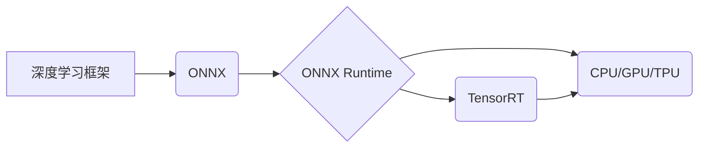

                 

## 自动推理库案例：TensorRT 和 ONNX Runtime

> 关键词：TensorRT, ONNX Runtime, 深度学习, 推理加速, 模型部署, 硬件加速, 异构计算, 模型转换

## 1. 背景介绍

深度学习模型在图像识别、自然语言处理、语音识别等领域取得了突破性进展，但模型推理速度和效率仍然是一个瓶颈。为了解决这个问题，自动推理库应运而生。自动推理库通过优化模型结构、利用硬件加速和并行计算等技术，显著提高模型推理速度和效率，从而推动深度学习模型的广泛应用。

TensorRT 和 ONNX Runtime 是业界领先的自动推理库，它们分别由 NVIDIA 和 Microsoft 开发，在模型部署和推理加速方面具有各自的优势。本文将深入探讨这两个库的核心概念、算法原理、实践案例以及未来发展趋势，帮助读者更好地理解自动推理库的应用场景和发展方向。

## 2. 核心概念与联系

**2.1 核心概念**

* **TensorRT:**  由 NVIDIA 开发的开源深度学习推理优化器，专为 NVIDIA GPU 硬件进行优化，能够显著提高模型推理速度和效率。
* **ONNX Runtime:** 由 Microsoft 开发的开源机器学习推理引擎，支持多种硬件平台和深度学习框架，能够跨平台部署和推理 ONNX 格式的模型。
* **ONNX (Open Neural Network Exchange):**  一种开放的机器学习模型格式，旨在促进不同深度学习框架之间模型互操作性。

**2.2 架构关系**



**2.3 联系**

TensorRT 和 ONNX Runtime 都致力于提高深度学习模型的推理效率，但它们在目标平台和模型格式方面有所不同。

* TensorRT 专注于 NVIDIA GPU 平台，并针对其硬件特性进行优化，能够实现更高的推理性能。
* ONNX Runtime 支持多种硬件平台，包括 CPU、GPU 和 TPU，并且支持 ONNX 格式的模型，能够跨平台部署和推理。

## 3. 核心算法原理 & 具体操作步骤

**3.1 算法原理概述**

自动推理库的核心算法原理主要包括：

* **模型优化:** 通过量化、剪枝、融合等技术，减少模型参数量和计算复杂度，提高推理速度。
* **算子库优化:**  针对特定硬件平台，优化深度学习算子的实现，提高算子执行效率。
* **并行计算:** 利用多核CPU、GPU 并行计算能力，加速模型推理过程。
* **内存优化:**  通过缓存机制和数据布局优化，减少数据传输开销，提高内存利用率。

**3.2 算法步骤详解**

1. **模型输入:**  将深度学习模型输入到自动推理库中。
2. **模型分析:** 自动推理库分析模型结构和算子类型，识别优化机会。
3. **模型优化:**  根据分析结果，对模型进行优化，例如量化、剪枝、融合等。
4. **算子库选择:**  根据目标硬件平台，选择合适的算子库实现。
5. **推理图生成:**  将优化后的模型转换为推理图，并进行并行化优化。
6. **推理执行:**  利用硬件加速和并行计算能力，执行推理图，得到模型输出结果。

**3.3 算法优缺点**

* **优点:**  显著提高模型推理速度和效率，降低部署成本。
* **缺点:**  模型优化过程可能导致模型精度下降，需要根据实际应用场景进行权衡。

**3.4 算法应用领域**

自动推理库广泛应用于以下领域：

* **图像识别:**  人脸识别、物体检测、图像分类等。
* **自然语言处理:**  文本分类、机器翻译、语音识别等。
* **推荐系统:**  商品推荐、用户画像等。
* **自动驾驶:**  感知、决策、控制等。

## 4. 数学模型和公式 & 详细讲解 & 举例说明

**4.1 数学模型构建**

自动推理库通常基于深度学习模型的数学模型进行优化。深度学习模型的核心是神经网络，其数学模型可以表示为一系列的矩阵运算和激活函数。

**4.2 公式推导过程**

自动推理库通过对模型结构和算子进行分析，推导出一系列优化公式，例如量化公式、剪枝公式、融合公式等。这些公式旨在减少模型参数量、计算复杂度和内存占用，从而提高推理效率。

**4.3 案例分析与讲解**

例如，量化技术可以将模型参数从高精度浮点数转换为低精度整数，从而减少内存占用和计算复杂度。量化公式通常涉及到最小二乘法、均值方差等数学概念，通过最小化量化误差，找到最优的量化方案。

## 5. 项目实践：代码实例和详细解释说明

**5.1 开发环境搭建**

TensorRT 和 ONNX Runtime 都提供了详细的开发文档和示例代码，可以根据官方文档进行环境搭建。

**5.2 源代码详细实现**

由于篇幅限制，这里只提供一个简单的 TensorRT 代码示例，展示如何将深度学习模型转换为 TensorRT 格式并进行推理。

```python
import tensorrt as trt

# 加载模型文件
model_path = "model.onnx"
model = trt.read_onnx(model_path)

# 配置推理引擎
builder = trt.Builder(trt.Logger())
config = builder.create_builder_config()
engine = builder.build_engine(model, config)

# 创建上下文
context = engine.create_execution_context()

# 输入数据
input_data = ...

# 推理执行
outputs = context.execute_v2(bindings=[input_data])

# 输出结果
output_data = outputs[0]
```

**5.3 代码解读与分析**

这段代码首先使用 TensorRT 库加载 ONNX 格式的模型文件。然后，创建推理引擎和上下文，并准备输入数据。最后，执行推理并获取输出结果。

**5.4 运行结果展示**

运行结果将显示模型的推理输出，例如图像分类结果、文本分类标签等。

## 6. 实际应用场景

**6.1 医疗诊断**

TensorRT 和 ONNX Runtime 可以加速医学图像分析模型，例如 X 光片、CT 扫描和 MRI 图像的分析，帮助医生更快地诊断疾病。

**6.2 自动驾驶**

自动驾驶系统需要实时处理大量传感器数据，TensorRT 和 ONNX Runtime 可以加速物体检测、路径规划和决策模型，提高自动驾驶系统的实时性和安全性。

**6.3 语音助手**

语音助手需要快速识别语音指令并进行相应的处理，TensorRT 和 ONNX Runtime 可以加速语音识别和自然语言理解模型，提高语音助手的响应速度和准确性。

**6.4 未来应用展望**

随着深度学习技术的不断发展，自动推理库将在更多领域得到应用，例如：

* **边缘计算:**  将深度学习模型部署到边缘设备，实现实时推理和决策。
* **工业自动化:**  加速工业机器视觉、缺陷检测和过程控制等应用。
* **个性化推荐:**  根据用户行为和偏好，提供更精准的个性化推荐。

## 7. 工具和资源推荐

**7.1 学习资源推荐**

* **TensorRT 官方文档:** https://docs.nvidia.com/deeplearning/tensorrt/index.html
* **ONNX Runtime 官方文档:** https://onnxruntime.ai/docs/
* **ONNX 格式规范:** https://onnx.ai/

**7.2 开发工具推荐**

* **CUDA Toolkit:** https://developer.nvidia.com/cuda-toolkit
* **cuDNN:** https://developer.nvidia.com/cudnn
* **Visual Studio Code:** https://code.visualstudio.com/

**7.3 相关论文推荐**

* **TensorRT: A High-Performance Inference Engine for Deep Learning:** https://arxiv.org/abs/1809.03856
* **ONNX Runtime: An Open-Source Machine Learning Inference Engine:** https://arxiv.org/abs/1905.07995

## 8. 总结：未来发展趋势与挑战

**8.1 研究成果总结**

TensorRT 和 ONNX Runtime 已经取得了显著的成果，显著提高了深度学习模型的推理效率，推动了深度学习技术的广泛应用。

**8.2 未来发展趋势**

* **模型压缩:**  进一步探索模型压缩技术，例如知识蒸馏、模型剪枝等，以实现更小的模型尺寸和更低的推理成本。
* **硬件加速:**  与新一代硬件平台，例如 TPU 和 FPGA，进行深度集成，进一步提高推理性能。
* **异构计算:**  支持多种硬件平台的混合计算，充分利用不同硬件的优势，实现更优的推理效率。

**8.3 面临的挑战**

* **模型兼容性:**  确保不同深度学习框架和模型格式之间的兼容性，方便模型部署和推理。
* **性能优化:**  针对不同硬件平台和模型类型，进行更精准的性能优化，提高推理效率。
* **安全性和隐私性:**  保障模型推理过程中的安全性和隐私性，防止模型被恶意攻击或滥用。

**8.4 研究展望**

未来，自动推理库将继续朝着更轻量化、更高效、更安全的方向发展，为深度学习技术的广泛应用提供坚实的基础。


## 9. 附录：常见问题与解答

**9.1  TensorRT 和 ONNX Runtime 的区别是什么？**

TensorRT 专注于 NVIDIA GPU 平台，并针对其硬件特性进行优化，能够实现更高的推理性能。ONNX Runtime 支持多种硬件平台，包括 CPU、GPU 和 TPU，并且支持 ONNX 格式的模型，能够跨平台部署和推理。

**9.2 如何选择合适的自动推理库？**

选择合适的自动推理库需要根据实际应用场景进行考虑，例如目标硬件平台、模型类型、推理性能要求等。

**9.3 如何进行模型优化？**

模型优化可以采用量化、剪枝、融合等技术，需要根据模型结构和算子类型进行分析和选择。

**9.4 如何部署自动推理模型？**

自动推理库通常提供相应的部署工具和文档，可以根据官方文档进行模型部署。


作者：禅与计算机程序设计艺术 / Zen and the Art of Computer Programming 
<end_of_turn>

