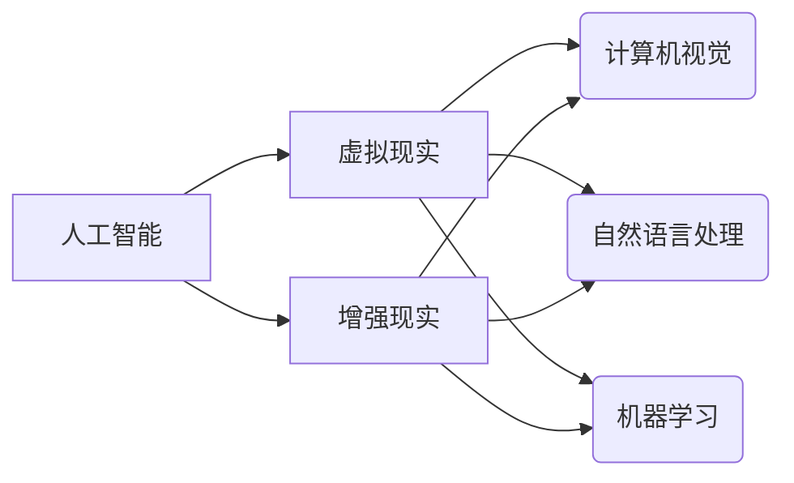

                 

## 虚拟与现实的边界：AI如何重塑我们的感知

> 关键词：人工智能、虚拟现实、增强现实、感知重塑、深度学习、计算机视觉

### 1. 背景介绍

人类感知世界的方式主要依赖于五官接收到的信息，并由大脑进行复杂的处理和解读。然而，随着科技的进步，特别是人工智能（AI）的快速发展，我们对感知的理解和体验正在发生深刻的改变。虚拟现实（VR）和增强现实（AR）技术，作为AI的重要应用领域之一，正在逐渐模糊虚拟与现实的界限，重塑我们对世界的感知。

VR技术通过模拟逼真的虚拟环境，让人们沉浸其中，体验身临其境的感觉。AR技术则通过在现实世界中叠加虚拟信息，增强现实世界的感知。这两项技术都依赖于AI技术的驱动，例如计算机视觉、自然语言处理和机器学习，以实现更逼真的视觉效果、更自然的交互体验和更智能的场景理解。

### 2. 核心概念与联系

**2.1 虚拟与现实的定义**

* **虚拟现实 (VR)**：一种利用计算机技术创造模拟环境的技术，用户通过佩戴头戴式显示器或其他设备，沉浸在虚拟世界中，并通过手柄或其他设备与虚拟环境进行交互。

* **增强现实 (AR)**：一种将虚拟信息叠加在现实世界中，增强现实世界感知的技术。用户可以通过手机、平板电脑或其他设备，看到现实世界中叠加的虚拟信息，例如游戏角色、导航指示或产品信息。

**2.2 AI在VR/AR中的作用**

AI技术在VR/AR中扮演着至关重要的角色，它赋予了虚拟和增强现实更强大的功能和更智能的体验。

* **计算机视觉**: 用于识别和理解现实世界中的物体和场景，为AR应用提供基础，也用于生成逼真的虚拟环境和物体。
* **自然语言处理**: 允许用户用自然语言与虚拟环境进行交互，例如语音控制、对话机器人等。
* **机器学习**: 用于训练AI模型，使其能够更好地理解用户意图，提供更个性化的体验，并不断优化虚拟和增强现实的算法和效果。

**2.3  核心概念关系图**



### 3. 核心算法原理 & 具体操作步骤

**3.1 算法原理概述**

在VR/AR领域，许多核心算法都基于深度学习技术，例如卷积神经网络（CNN）和循环神经网络（RNN）。这些算法能够从大量数据中学习特征，并进行复杂的模式识别和预测。

* **CNN**: 用于图像识别、物体检测和场景理解等任务，能够提取图像中的特征，并进行分类和识别。
* **RNN**: 用于处理序列数据，例如文本和语音，能够学习语言的语法和语义，并进行文本生成、机器翻译等任务。

**3.2 算法步骤详解**

以物体检测为例，其算法步骤如下：

1. **数据采集和预处理**: 收集大量包含物体图像的数据，并进行预处理，例如裁剪、缩放和增强数据。
2. **模型训练**: 使用CNN模型，将预处理后的数据进行训练，学习物体特征。
3. **模型评估**: 使用测试数据评估模型的性能，例如准确率、召回率和F1-score。
4. **模型部署**: 将训练好的模型部署到实际应用中，例如VR/AR应用程序中。

**3.3 算法优缺点**

* **优点**: 深度学习算法能够学习复杂的特征，并取得优异的性能。
* **缺点**: 深度学习算法需要大量的训练数据，训练时间长，并且对硬件资源要求高。

**3.4 算法应用领域**

* **物体识别**: 在VR/AR应用程序中识别物体，例如在AR游戏中识别现实世界中的物体，或在VR游戏中识别虚拟物体。
* **场景理解**: 理解虚拟或增强现实场景中的物体和关系，例如在VR游戏中理解场景布局，或在AR应用程序中理解用户所在位置。
* **人机交互**: 识别用户的动作和意图，例如手势识别、语音识别和表情识别，实现更自然的人机交互。

### 4. 数学模型和公式 & 详细讲解 & 举例说明

**4.1 数学模型构建**

深度学习模型通常使用神经网络结构，其核心是多层神经元之间的连接和权重。每个神经元接收来自前一层神经元的输入，并通过激活函数进行处理，输出到下一层神经元。

**4.2 公式推导过程**

深度学习模型的训练过程基于梯度下降算法，其目标是找到最优的模型参数，使得模型的预测结果与真实值之间的误差最小化。

损失函数用于衡量模型预测结果与真实值的误差，常用的损失函数包括均方误差（MSE）和交叉熵损失（Cross-Entropy Loss）。

梯度下降算法通过计算损失函数对模型参数的梯度，并根据梯度方向更新模型参数，逐步降低损失函数的值。

**4.3 案例分析与讲解**

以图像分类为例，假设我们有一个包含猫和狗的图像数据集，目标是训练一个模型能够识别猫和狗。

1. **构建模型**: 使用CNN模型，包含多个卷积层、池化层和全连接层。
2. **定义损失函数**: 使用交叉熵损失函数，衡量模型预测结果与真实标签之间的误差。
3. **训练模型**: 使用梯度下降算法，根据损失函数的梯度更新模型参数，训练模型能够准确识别猫和狗。
4. **评估模型**: 使用测试数据评估模型的准确率，例如模型能够正确识别多少只猫和狗。

### 5. 项目实践：代码实例和详细解释说明

**5.1 开发环境搭建**

* **操作系统**: Ubuntu 20.04 LTS
* **编程语言**: Python 3.8
* **深度学习框架**: TensorFlow 2.0
* **其他工具**: Git, Jupyter Notebook

**5.2 源代码详细实现**

```python
import tensorflow as tf

# 定义模型结构
model = tf.keras.models.Sequential([
    tf.keras.layers.Conv2D(32, (3, 3), activation='relu', input_shape=(224, 224, 3)),
    tf.keras.layers.MaxPooling2D((2, 2)),
    tf.keras.layers.Conv2D(64, (3, 3), activation='relu'),
    tf.keras.layers.MaxPooling2D((2, 2)),
    tf.keras.layers.Flatten(),
    tf.keras.layers.Dense(10, activation='softmax')
])

# 定义损失函数和优化器
model.compile(loss='sparse_categorical_crossentropy',
              optimizer='adam',
              metrics=['accuracy'])

# 训练模型
model.fit(x_train, y_train, epochs=10)

# 评估模型
loss, accuracy = model.evaluate(x_test, y_test)
print('Test Loss:', loss)
print('Test Accuracy:', accuracy)
```

**5.3 代码解读与分析**

* **模型结构**: 使用了卷积神经网络（CNN）结构，包含多个卷积层、池化层和全连接层。
* **损失函数**: 使用了交叉熵损失函数，用于分类任务。
* **优化器**: 使用了Adam优化器，用于更新模型参数。
* **训练过程**: 使用训练数据训练模型，并使用测试数据评估模型性能。

**5.4 运行结果展示**

训练完成后，可以将模型应用于新的图像数据，进行预测。例如，可以将一张猫的图片输入到模型中，模型会输出预测结果，例如“猫”或“狗”。

### 6. 实际应用场景

**6.1 游戏开发**

* **沉浸式游戏体验**: VR技术可以创造逼真的虚拟游戏世界，让玩家身临其境地体验游戏。
* **增强现实游戏**: AR技术可以将虚拟游戏元素叠加在现实世界中，例如在AR游戏中捕捉现实世界中的精灵或怪物。

**6.2 教育培训**

* **虚拟实验室**: VR技术可以创建虚拟实验室，让学生安全地进行实验操作，例如虚拟解剖学实验室。
* **沉浸式学习**: AR技术可以将虚拟信息叠加在现实世界中，例如在AR应用程序中展示历史遗迹的3D模型。

**6.3 医疗保健**

* **远程医疗**: VR技术可以帮助医生进行远程手术指导，例如远程心血管手术。
* **虚拟康复**: AR技术可以帮助患者进行虚拟康复训练，例如虚拟肢体运动训练。

**6.4 其他应用场景**

* **建筑设计**: VR技术可以帮助建筑师进行虚拟建筑设计和模拟，例如虚拟房屋参观。
* **工业制造**: AR技术可以帮助工人进行虚拟指导和维修，例如AR应用程序可以显示机器的内部结构和维修步骤。

**6.4 未来应用展望**

随着AI技术的不断发展，VR/AR技术将有更广泛的应用场景，例如：

* **元宇宙**: VR/AR技术将成为元宇宙的重要组成部分，构建虚拟世界和增强现实世界。
* **数字孪生**: VR/AR技术可以用于创建数字孪生，模拟现实世界中的物体和系统，用于预测和优化。
* **人机融合**: VR/AR技术将与生物技术融合，实现人机融合，例如脑机接口。

### 7. 工具和资源推荐

**7.1 学习资源推荐**

* **书籍**:
    * 深度学习 (Deep Learning) - Ian Goodfellow, Yoshua Bengio, Aaron Courville
    * 人工智能：一种现代方法 (Artificial Intelligence: A Modern Approach) - Stuart Russell, Peter Norvig
* **在线课程**:
    * Coursera: 深度学习 Specialization
    * Udacity: AI Programming with Python Nanodegree
    * fast.ai: Practical Deep Learning for Coders

**7.2 开发工具推荐**

* **深度学习框架**: TensorFlow, PyTorch, Keras
* **VR开发平台**: Unity, Unreal Engine
* **AR开发平台**: ARKit, ARCore

**7.3 相关论文推荐**

* **ImageNet Classification with Deep Convolutional Neural Networks** - Alex Krizhevsky, Ilya Sutskever, Geoffrey E. Hinton
* **Attention Is All You Need** - Ashish Vaswani, Noam Shazeer, Niki Parmar, Jakob Uszkoreit, Llion Jones, Aidan N. Gomez, Łukasz Kaiser, Illia Polosukhin

### 8. 总结：未来发展趋势与挑战

**8.1 研究成果总结**

近年来，AI技术在VR/AR领域取得了显著的进展，例如：

* **更逼真的视觉效果**: 深度学习算法能够生成更逼真的虚拟图像和场景。
* **更自然的交互体验**: 自然语言处理和计算机视觉技术使得用户能够更自然地与虚拟和增强现实环境进行交互。
* **更智能的场景理解**: AI模型能够更好地理解虚拟和增强现实场景中的物体和关系，提供更个性化的体验。

**8.2 未来发展趋势**

* **更沉浸式的体验**: 未来VR/AR技术将更加沉浸式，例如使用脑机接口技术实现更直接的感知和交互。
* **更广泛的应用场景**: VR/AR技术将应用于更多领域，例如教育、医疗、工业、娱乐等。
* **更智能的AI**: AI模型将更加智能，能够更好地理解用户意图，提供更个性化的体验。

**8.3 面临的挑战**

* **技术挑战**: 提高VR/AR技术的性能和效率，例如降低延迟、提高分辨率和减少眩晕感。
* **伦理挑战**: 确保VR/AR技术的应用安全、伦理和可持续发展。
* **社会挑战**: 应对VR/AR技术带来的社会影响，例如对现实世界的影响和对人际关系的影响。

**8.4 研究展望**

未来，我们需要继续研究和探索VR/AR技术的潜力，解决技术挑战，应对伦理和社会挑战，并推动VR/AR技术朝着更安全、更智能、更可持续的方向发展。

### 9. 附录：常见问题与解答

**9.1 VR/AR技术与现实世界有什么区别？**

VR技术创造虚拟环境，用户沉浸其中，与现实世界隔绝。AR技术叠加虚拟信息在现实世界中，增强现实世界感知。

**9.2 VR/AR技术有哪些应用场景？**

VR/AR技术应用广泛，例如游戏开发、教育培训、医疗保健、建筑设计、工业制造等。

**9.3 如何学习VR/AR技术？**

可以通过学习相关书籍、在线课程、参加培训等方式学习VR/AR技术。

**9.4 未来VR/AR技术的发展趋势是什么？**

未来VR/AR技术将更加沉浸式、智能化、广泛应用于更多领域。


作者：禅与计算机程序设计艺术 / Zen and the Art of Computer Programming 
<end_of_turn>

