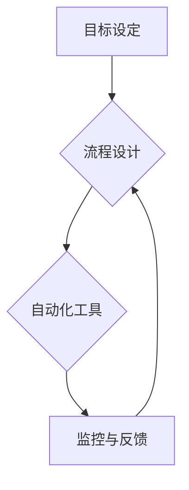

                 

## 行动体系:高效执行的保障

> 关键词：行动体系、执行力、流程优化、自动化、效率提升、软件开发、项目管理

## 1. 背景介绍

在当今瞬息万变的科技时代，拥有先进的技术和理念已经不足以保证成功。高效的执行力，即能够将想法转化为实际成果的能力，成为决定企业和个人命运的关键因素。然而，许多人往往在执行过程中遇到各种阻碍，导致计划难以落地，目标难以实现。

软件开发领域同样面临着类似的挑战。复杂的项目架构、庞大的代码库、多方协作等因素，都可能导致开发效率低下，项目进度延迟。因此，建立一个高效的行动体系，能够有效地保障软件开发项目的顺利执行，显得尤为重要。

## 2. 核心概念与联系

行动体系的核心概念是将复杂的任务分解成一系列可执行的步骤，并通过流程优化、自动化等手段，提高执行效率。

**行动体系的构成要素:**

* **目标设定:** 明确目标，并将其分解成可实现的子目标。
* **流程设计:**  构建清晰的执行流程，明确每个步骤的责任人和时间节点。
* **自动化工具:**  利用自动化工具，减少重复性工作，提高效率。
* **监控与反馈:**  实时监控执行进度，及时发现问题并进行调整。

**Mermaid 流程图:**



## 3. 核心算法原理 & 具体操作步骤

### 3.1  算法原理概述

行动体系的核心算法原理是基于**分而治之**的思想，将复杂的任务分解成一系列简单易执行的子任务，并通过**迭代优化**的方式不断提高执行效率。

### 3.2  算法步骤详解

1. **目标分解:** 将最终目标分解成一系列可实现的子目标，并为每个子目标设定明确的指标和时间节点。
2. **流程设计:**  根据子目标的特性，设计相应的执行流程，明确每个步骤的责任人和时间节点。
3. **自动化工具选取:**  根据流程需求，选择合适的自动化工具，例如CI/CD工具、测试自动化工具等，以减少重复性工作，提高效率。
4. **监控与反馈:**  建立监控机制，实时跟踪执行进度，并收集反馈信息，用于流程优化和改进。

### 3.3  算法优缺点

**优点:**

* **提高执行效率:**  通过分解任务和自动化工具，减少重复性工作，提高执行效率。
* **降低风险:**  将复杂任务分解成小步骤，可以降低每个步骤的风险，提高项目成功率。
* **增强团队协作:**  明确每个步骤的责任人和时间节点，可以增强团队协作，提高项目执行的协调性。

**缺点:**

* **流程设计复杂:**  需要花费时间和精力进行流程设计，并不断进行优化。
* **自动化工具成本:**  一些自动化工具可能需要付费使用，增加项目成本。
* **缺乏灵活性:**  过于僵化的流程可能难以适应突发情况，需要灵活调整。

### 3.4  算法应用领域

行动体系的算法原理广泛应用于软件开发、项目管理、运营管理等领域。

* **软件开发:**  用于构建软件开发流程，提高开发效率和项目成功率。
* **项目管理:**  用于管理项目进度、资源分配和风险控制。
* **运营管理:**  用于优化运营流程，提高运营效率和客户满意度。

## 4. 数学模型和公式 & 详细讲解 & 举例说明

### 4.1  数学模型构建

我们可以用一个简单的数学模型来描述行动体系的效率提升效果。假设一个任务需要完成 **n** 个步骤，每个步骤的完成时间为 **t**，则任务总耗时为 **n * t**。

如果我们使用自动化工具，可以将某些步骤的完成时间缩短为 **t'**，则任务总耗时变为 **n * t'**。

**效率提升率 = (n * t - n * t') / (n * t) * 100%**

### 4.2  公式推导过程

效率提升率公式的推导过程如下：

1. 计算任务总耗时：n * t
2. 计算使用自动化工具后的任务总耗时：n * t'
3. 计算时间差：n * t - n * t'
4. 计算效率提升率： (n * t - n * t') / (n * t) * 100%

### 4.3  案例分析与讲解

假设一个软件开发项目需要完成 100 个步骤，每个步骤的平均完成时间为 1 小时，则总耗时为 100 小时。

如果使用自动化工具，可以将 20 个步骤的完成时间缩短为 30 分钟，则总耗时变为 80 小时。

效率提升率 = (100 * 1 - 80 * 1) / (100 * 1) * 100% = 20%

通过使用自动化工具，该软件开发项目可以节省 20 小时的开发时间。

## 5. 项目实践：代码实例和详细解释说明

### 5.1  开发环境搭建

为了演示行动体系的应用，我们以一个简单的软件项目为例，使用 Python 语言进行开发。

开发环境搭建步骤如下：

1. 安装 Python 语言环境。
2. 安装必要的开发工具，例如 IDE、版本控制系统等。
3. 创建项目目录，并初始化版本控制系统。

### 5.2  源代码详细实现

以下代码示例演示了如何使用行动体系的算法原理，将一个简单的任务分解成多个步骤，并使用自动化工具进行执行。

```python
# 任务：计算两个数字的和

def calculate_sum(num1, num2):
    """计算两个数字的和"""
    sum = num1 + num2
    return sum

# 获取用户输入
num1 = int(input("请输入第一个数字: "))
num2 = int(input("请输入第二个数字: "))

# 调用函数计算和
result = calculate_sum(num1, num2)

# 打印结果
print(f"两个数字的和为: {result}")
```

### 5.3  代码解读与分析

这段代码实现了计算两个数字和的基本功能。

* **函数定义:**  `calculate_sum` 函数负责计算两个数字的和，并返回结果。
* **用户输入:**  程序获取用户输入的两个数字。
* **函数调用:**  程序调用 `calculate_sum` 函数，将用户输入的两个数字作为参数传递。
* **结果打印:**  程序打印计算结果。

### 5.4  运行结果展示

当用户输入两个数字后，程序会计算它们的和并打印出来。

## 6. 实际应用场景

行动体系在软件开发领域有着广泛的应用场景。

* **敏捷开发:**  行动体系可以帮助敏捷开发团队更好地管理迭代周期，提高开发效率。
* **持续集成与持续交付 (CI/CD):**  行动体系可以与 CI/CD 工具集成，实现自动化构建、测试和部署，提高软件发布效率。
* **项目管理:**  行动体系可以帮助项目经理更好地管理项目进度、资源分配和风险控制。

### 6.4  未来应用展望

随着人工智能、自动化技术的发展，行动体系将更加智能化、自动化，能够更好地辅助软件开发和项目管理。

## 7. 工具和资源推荐

### 7.1  学习资源推荐

* **书籍:**  《The Lean Startup》、《Getting Things Done》
* **在线课程:**  Coursera、Udemy 等平台上的项目管理和软件开发课程

### 7.2  开发工具推荐

* **版本控制系统:**  Git、SVN
* **CI/CD 工具:**  Jenkins、CircleCI、Travis CI
* **自动化测试工具:**  Selenium、pytest

### 7.3  相关论文推荐

* **Agile Software Development: Principles, Patterns, and Practices**
* **The Phoenix Project: A Novel About IT, DevOps, and Helping Your Business Win**

## 8. 总结：未来发展趋势与挑战

### 8.1  研究成果总结

行动体系的研究成果表明，通过分解任务、流程优化和自动化工具，可以有效提高执行效率，降低项目风险，增强团队协作。

### 8.2  未来发展趋势

未来行动体系的发展趋势包括：

* **更加智能化:**  利用人工智能技术，实现行动体系的智能化决策和执行。
* **更加自动化:**  通过更广泛的自动化工具应用，实现行动体系的自动化执行。
* **更加个性化:**  根据不同用户的需求和工作习惯，定制个性化的行动体系。

### 8.3  面临的挑战

行动体系的应用也面临一些挑战：

* **流程设计复杂:**  需要花费时间和精力进行流程设计，并不断进行优化。
* **自动化工具成本:**  一些自动化工具可能需要付费使用，增加项目成本。
* **缺乏灵活性:**  过于僵化的流程可能难以适应突发情况，需要灵活调整。

### 8.4  研究展望

未来研究方向包括：

* **开发更智能化的行动体系算法:**  利用人工智能技术，实现行动体系的智能化决策和执行。
* **探索更广泛的自动化工具应用:**  寻找更多可以应用于行动体系的自动化工具，提高执行效率。
* **研究个性化行动体系的设计方法:**  根据不同用户的需求和工作习惯，定制个性化的行动体系。

## 9. 附录：常见问题与解答

**常见问题:**

* 如何设计一个高效的行动体系？
* 如何选择合适的自动化工具？
* 如何应对行动体系中的突发情况？

**解答:**

* 设计一个高效的行动体系需要根据具体项目的需求和特点进行分析，并遵循分而治之、流程优化、自动化工具应用等原则。
* 选择合适的自动化工具需要根据项目的具体需求和技术栈进行选择，并考虑工具的成本、易用性和安全性等因素。
* 应对行动体系中的突发情况需要建立灵活的流程调整机制，并及时收集反馈信息，进行流程优化和改进。


作者：禅与计算机程序设计艺术 / Zen and the Art of Computer Programming 
<end_of_turn>

