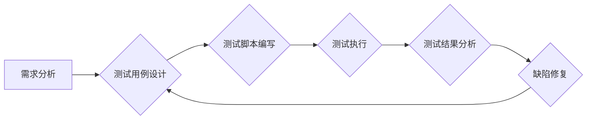

                 

## 软件测试自动化：提高代码质量和效率

> 关键词：软件测试自动化、测试框架、测试脚本、持续集成、代码质量、效率提升、测试用例设计

## 1. 背景介绍

在软件开发领域，测试是确保软件质量和可靠性的关键环节。随着软件系统越来越复杂，手动测试已经难以满足快速迭代和高质量开发的需求。软件测试自动化应运而生，它通过自动化工具和脚本，将重复性的测试任务自动化，提高测试效率，降低人力成本，并最终提升软件质量。

传统的软件测试流程主要依赖于人工操作，测试人员需要手动执行测试用例，并记录测试结果。这种方式存在着以下问题：

* **效率低下：** 手动测试耗费大量时间和人力，难以满足快速迭代的需求。
* **易出错：** 人为因素会导致测试结果的偏差，难以保证测试的准确性和可靠性。
* **难以维护：** 当软件功能发生变化时，测试用例需要进行手动修改，维护成本高。

软件测试自动化可以有效解决上述问题，其主要优势包括：

* **提高测试效率：** 自动化测试脚本可以快速执行大量测试用例，大幅提高测试速度。
* **降低测试成本：** 自动化测试可以减少人工测试的成本，提高资源利用率。
* **提高测试覆盖率：** 自动化测试可以执行更多测试用例，提高测试覆盖率，发现更多潜在问题。
* **提高测试稳定性：** 自动化测试可以减少人为因素的影响，提高测试结果的稳定性。
* **缩短开发周期：** 自动化测试可以加速软件开发流程，缩短开发周期。

## 2. 核心概念与联系

软件测试自动化涉及到多个核心概念，包括测试框架、测试脚本、测试用例设计、持续集成等。这些概念相互关联，共同构成了软件测试自动化的体系。

**2.1 测试框架**

测试框架是软件测试自动化的基础，它提供了一套规范和结构化的测试执行环境。常见的测试框架包括：

* **JUnit:** Java语言的测试框架，广泛应用于Java项目。
* **pytest:** Python语言的测试框架，简洁易用，功能强大。
* **Selenium:** 用于自动化Web浏览器测试的框架，支持多种编程语言。
* **Appium:** 用于自动化移动应用测试的框架，支持多种平台和设备。

**2.2 测试脚本**

测试脚本是自动化测试的核心，它包含了测试用例的执行步骤和预期结果。测试脚本通常使用编程语言编写，例如Java、Python、JavaScript等。

**2.3 测试用例设计**

测试用例设计是软件测试自动化的关键环节，它需要根据软件功能需求和风险分析，设计出全面、准确、可执行的测试用例。

**2.4 持续集成**

持续集成是一种软件开发实践，它将代码变更频繁地集成到主代码库中，并自动执行测试，确保代码质量和稳定性。持续集成与软件测试自动化密切相关，可以帮助提高软件开发效率和质量。

**2.5 Mermaid 流程图**



## 3. 核心算法原理 & 具体操作步骤

### 3.1 算法原理概述

软件测试自动化算法主要涉及到测试用例执行、测试结果分析和缺陷报告等方面。这些算法通常基于以下原理：

* **状态机模型:** 将软件系统抽象为一个状态机，每个状态代表软件系统的一个状态，每个状态转换代表软件系统的一个行为。测试用例可以根据状态机模型设计，覆盖软件系统的各个状态和状态转换。
* **覆盖率分析:** 通过分析测试用例执行结果，计算测试用例覆盖率，评估测试用例的质量和覆盖范围。
* **缺陷优先级排序:** 根据缺陷的严重程度和影响范围，对缺陷进行优先级排序，帮助开发人员快速修复关键缺陷。

### 3.2 算法步骤详解

**3.2.1 测试用例执行:**

1. 根据测试用例设计，编写测试脚本。
2. 使用测试框架执行测试脚本，模拟用户操作，触发软件系统不同的行为。
3. 记录测试执行结果，包括测试用例执行状态、预期结果和实际结果。

**3.2.2 测试结果分析:**

1. 分析测试执行结果，识别测试用例执行失败的用例。
2. 根据测试用例执行结果，计算测试覆盖率，评估测试用例的质量和覆盖范围。
3. 使用缺陷跟踪系统记录缺陷信息，包括缺陷描述、缺陷优先级、缺陷状态等。

**3.2.3 缺陷修复:**

1. 开发人员根据缺陷信息，修复软件缺陷。
2. 测试人员重新执行测试用例，验证缺陷修复结果。
3. 缺陷修复完成后，更新缺陷状态，标记为已修复。

### 3.3 算法优缺点

**优点:**

* **提高测试效率:** 自动化测试可以快速执行大量测试用例，大幅提高测试速度。
* **降低测试成本:** 自动化测试可以减少人工测试的成本，提高资源利用率。
* **提高测试覆盖率:** 自动化测试可以执行更多测试用例，提高测试覆盖率，发现更多潜在问题。
* **提高测试稳定性:** 自动化测试可以减少人为因素的影响，提高测试结果的稳定性。

**缺点:**

* **开发成本高:** 开发自动化测试脚本需要一定的技术成本和时间投入。
* **维护成本高:** 当软件功能发生变化时，测试脚本需要进行修改，维护成本高。
* **难以测试所有场景:** 自动化测试难以覆盖所有可能的测试场景，需要结合人工测试才能保证软件质量。

### 3.4 算法应用领域

软件测试自动化算法广泛应用于各个软件开发领域，例如：

* **Web应用测试:** 自动化测试Web应用程序的功能、性能、安全性等。
* **移动应用测试:** 自动化测试移动应用程序的功能、性能、兼容性等。
* **API测试:** 自动化测试应用程序接口的功能、性能、安全性等。
* **数据库测试:** 自动化测试数据库的功能、性能、安全性等。

## 4. 数学模型和公式 & 详细讲解 & 举例说明

### 4.1 数学模型构建

软件测试自动化算法可以利用数学模型来描述测试用例执行过程和测试结果分析过程。例如，可以使用状态机模型来描述软件系统的状态和状态转换，可以使用覆盖率公式来计算测试用例的覆盖范围。

### 4.2 公式推导过程

**4.2.1 测试覆盖率公式:**

```latex
覆盖率 = (执行的测试用例数 / 总测试用例数) * 100%
```

**推导过程:**

测试覆盖率是指测试用例执行覆盖了软件系统代码的比例。

* 执行的测试用例数：指实际执行的测试用例数量。
* 总测试用例数：指软件系统所有可能的测试用例数量。

### 4.3 案例分析与讲解

**案例:**

假设一个软件系统有100个测试用例，测试人员执行了80个测试用例，其中70个测试用例执行成功。

**计算测试覆盖率:**

```latex
覆盖率 = (80 / 100) * 100% = 80%
```

**分析:**

测试覆盖率为80%，表示测试人员执行的测试用例覆盖了软件系统代码的80%。

## 5. 项目实践：代码实例和详细解释说明

### 5.1 开发环境搭建

* **操作系统:** Windows/macOS/Linux
* **编程语言:** Python
* **测试框架:** pytest
* **其他工具:** Git, virtualenv

### 5.2 源代码详细实现

```python
import pytest

def add(x, y):
    return x + y

def subtract(x, y):
    return x - y

def multiply(x, y):
    return x * y

def divide(x, y):
    if y == 0:
        raise ZeroDivisionError("Cannot divide by zero")
    return x / y

@pytest.mark.parametrize("x, y, expected", [
    (2, 3, 5),
    (-1, 1, 0),
    (10, 5, 2),
])
def test_add(x, y, expected):
    assert add(x, y) == expected

@pytest.mark.parametrize("x, y, expected", [
    (5, 3, 2),
    (10, -5, 15),
    (-2, 2, -4),
])
def test_subtract(x, y, expected):
    assert subtract(x, y) == expected

@pytest.mark.parametrize("x, y, expected", [
    (2, 3, 6),
    (-1, -3, 3),
    (5, 0, 0),
])
def test_multiply(x, y, expected):
    assert multiply(x, y) == expected

@pytest.mark.parametrize("x, y, expected", [
    (10, 2, 5),
    (5, 1, 5),
    (100, 10, 10),
])
def test_divide(x, y, expected):
    assert divide(x, y) == expected

```

### 5.3 代码解读与分析

* **pytest:** pytest是一个Python测试框架，提供简洁易用的语法和丰富的功能。
* **@pytest.mark.parametrize:** pytest的`parametrize`装饰器可以用于参数化测试用例，方便测试多个输入组合。
* **assert:** assert语句用于断言测试结果，如果断言失败，pytest会抛出异常，并停止测试执行。

### 5.4 运行结果展示

运行上述代码，pytest会自动执行所有测试用例，并输出测试结果。如果所有测试用例都执行成功，pytest会输出“PASSED”；如果存在测试用例执行失败，pytest会输出失败用例的信息。

## 6. 实际应用场景

### 6.1 Web应用测试

自动化测试可以用于测试Web应用程序的功能、性能、安全性等。例如，可以使用Selenium自动化测试Web应用程序的登录功能、注册功能、搜索功能等。

### 6.2 移动应用测试

自动化测试可以用于测试移动应用程序的功能、性能、兼容性等。例如，可以使用Appium自动化测试移动应用程序的界面交互、网络请求、数据存储等。

### 6.3 API测试

自动化测试可以用于测试应用程序接口的功能、性能、安全性等。例如，可以使用Postman自动化测试RESTful API的请求和响应。

### 6.4 未来应用展望

随着人工智能和机器学习技术的不断发展，软件测试自动化将更加智能化和自动化。例如，可以使用机器学习算法自动生成测试用例，自动识别缺陷，并自动修复缺陷。

## 7. 工具和资源推荐

### 7.1 学习资源推荐

* **书籍:**
    * 《软件测试自动化》
    * 《Selenium WebDriver》
    * 《Appium》
* **在线课程:**
    * Udemy
    * Coursera
    * Udacity

### 7.2 开发工具推荐

* **测试框架:**
    * JUnit
    * pytest
    * Selenium
    * Appium
* **缺陷跟踪系统:**
    * Jira
    * Bugzilla
    * MantisBT

### 7.3 相关论文推荐

* **论文:**
    * 《Towards Automated Test Case Generation》
    * 《Automated Defect Detection and Repair》
    * 《Machine Learning for Software Testing》

## 8. 总结：未来发展趋势与挑战

### 8.1 研究成果总结

软件测试自动化已经取得了显著的成果，提高了软件开发效率和质量。

### 8.2 未来发展趋势

* **人工智能驱动的测试自动化:** 使用人工智能和机器学习算法自动生成测试用例、识别缺陷、并自动修复缺陷。
* **云原生测试自动化:** 针对云原生应用开发的测试自动化解决方案，支持容器化、微服务化等技术。
* **持续测试:** 将测试自动化融入到持续集成和持续交付流程中，实现全流程的自动化测试。

### 8.3 面临的挑战

* **测试用例设计:** 自动生成测试用例仍然是一个挑战，需要更智能的算法和更丰富的测试数据。
* **测试覆盖率:** 难以覆盖所有可能的测试场景，需要结合人工测试才能保证软件质量。
* **维护成本:** 当软件功能发生变化时，测试脚本需要进行修改，维护成本高。

### 8.4 研究展望

未来软件测试自动化研究将继续探索人工智能、机器学习、云计算等新技术，开发更智能、更自动化、更有效的测试解决方案。


## 9. 附录：常见问题与解答

**常见问题:**

* **如何选择合适的测试框架？**

**解答:** 选择合适的测试框架需要根据项目需求、开发语言、团队经验等因素进行考虑。

* **如何编写高质量的测试脚本？**

**解答:** 编写高质量的测试脚本需要遵循测试用例设计原则，使用清晰简洁的代码，并进行充分的测试覆盖。

* **如何进行测试自动化维护？**

**解答:** 测试自动化维护需要定期检查测试脚本，并根据软件功能变化进行修改。可以使用持续集成和持续交付流程来帮助自动化测试维护。


作者：禅与计算机程序设计艺术 / Zen and the Art of Computer Programming 
<end_of_turn>

