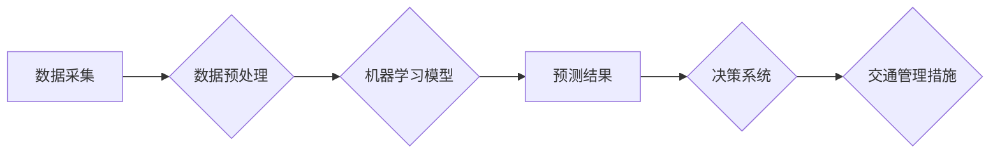

                 

## AI与人类计算：打造可持续发展的城市交通管理系统与基础设施建设

> 关键词：人工智能、城市交通、交通管理、基础设施建设、可持续发展、机器学习、深度学习、预测模型、优化算法、数据分析

## 1. 背景介绍

随着全球人口的持续增长和城市化的加速推进，城市交通系统面临着前所未有的压力。拥堵、事故、污染等问题日益突出，严重影响着城市居民的生活质量和经济发展。传统交通管理模式已难以满足日益复杂的需求，迫切需要引入先进的技术手段进行革新。人工智能（AI）作为一门新兴技术，凭借其强大的数据处理能力、学习能力和决策能力，为城市交通管理提供了全新的解决方案。

AI技术在交通领域的应用已取得了显著进展，例如：

* **智能交通信号灯控制:** 利用AI算法分析实时交通流量数据，动态调整信号灯的绿灯时间，优化交通流，减少拥堵。
* **自动驾驶:** 利用AI技术实现车辆的自动驾驶，提高道路安全，缓解交通拥堵。
* **交通预测:** 利用AI算法分析历史交通数据，预测未来交通流量和出行模式，为交通管理提供决策依据。
* **交通违规识别:** 利用AI技术识别交通违规行为，提高交通执法效率。

## 2. 核心概念与联系

城市交通管理系统是一个复杂的系统，涉及到交通流量、道路设施、交通信号灯、车辆、行人等多方面的因素。AI技术可以帮助我们更好地理解和管理这些因素之间的关系，从而构建更加高效、智能的交通管理系统。

**核心概念:**

* **数据驱动:** AI技术依赖于海量数据进行训练和学习，城市交通管理系统需要收集和分析各种交通数据，例如车辆位置、速度、流量、道路状况、天气信息等。
* **机器学习:** 机器学习算法可以从数据中学习交通模式和规律，并根据学习到的知识进行预测和决策。
* **深度学习:** 深度学习算法可以处理更加复杂的数据，例如图像、视频等，在交通领域可以应用于自动驾驶、交通违规识别等方面。
* **预测模型:** 预测模型可以根据历史数据预测未来交通流量、出行模式等，为交通管理提供决策依据。
* **优化算法:** 优化算法可以根据预测结果，优化交通信号灯控制、道路规划等，提高交通效率。

**架构图:**



## 3. 核心算法原理 & 具体操作步骤

### 3.1  算法原理概述

在城市交通管理系统中，常用的AI算法包括：

* **回归算法:** 用于预测连续变量，例如交通流量、出行时间等。常见的回归算法包括线性回归、逻辑回归、支持向量回归等。
* **分类算法:** 用于分类数据，例如交通违规行为、车辆类型等。常见的分类算法包括决策树、随机森林、支持向量机等。
* **聚类算法:** 用于将数据分组，例如根据出行时间、目的地等将车辆进行分组。常见的聚类算法包括K-means聚类、层次聚类等。
* **强化学习算法:** 用于训练智能体在环境中做出最优决策，例如自动驾驶车辆的决策控制。

### 3.2  算法步骤详解

以交通流量预测为例，详细说明算法步骤：

1. **数据采集:** 收集历史交通流量数据，包括时间、地点、交通流量等信息。
2. **数据预处理:** 对数据进行清洗、转换、特征工程等处理，例如处理缺失值、归一化数据等。
3. **模型选择:** 根据预测任务选择合适的回归算法，例如线性回归、随机森林等。
4. **模型训练:** 利用历史数据训练模型，调整模型参数，使模型能够准确预测未来交通流量。
5. **模型评估:** 利用测试数据评估模型的预测精度，例如使用均方误差、R-squared等指标。
6. **模型部署:** 将训练好的模型部署到生产环境中，用于实时预测交通流量。

### 3.3  算法优缺点

**优点:**

* **高精度:** AI算法可以学习复杂的交通模式，实现高精度的预测和决策。
* **实时性:** AI算法可以实时处理数据，及时做出决策，提高交通管理效率。
* **可扩展性:** AI算法可以根据需要扩展，处理更大的数据量和更复杂的场景。

**缺点:**

* **数据依赖:** AI算法依赖于海量数据进行训练，数据质量直接影响算法性能。
* **算法复杂性:** 一些AI算法比较复杂，需要专业的技术人员进行开发和维护。
* **伦理问题:** AI算法的决策可能会存在偏见或不公平性，需要进行伦理评估和监管。

### 3.4  算法应用领域

AI算法在城市交通管理领域有广泛的应用，例如：

* **交通流量预测:** 预测未来交通流量，优化交通信号灯控制、道路规划等。
* **出行模式分析:** 分析出行模式，为城市交通规划提供依据。
* **交通违规识别:** 利用图像识别技术识别交通违规行为，提高交通执法效率。
* **自动驾驶:** 实现车辆的自动驾驶，提高道路安全，缓解交通拥堵。
* **智能停车:** 利用传感器和AI算法实现智能停车，提高停车效率。

## 4. 数学模型和公式 & 详细讲解 & 举例说明

### 4.1  数学模型构建

交通流量预测模型通常采用时间序列模型，例如ARIMA模型、SARIMA模型等。这些模型基于时间序列数据的自相关性和偏自相关性，建立数学模型来预测未来流量。

**ARIMA模型:**

ARIMA模型是一种经典的时间序列模型，其全称是Autoregressive Integrated Moving Average模型。ARIMA模型包含三个参数：

* **p:** Autoregressive (AR) order，表示模型中自回归项的阶数。
* **d:** Integrated (I) order，表示数据需要进行的差分次数。
* **q:** Moving Average (MA) order，表示模型中移动平均项的阶数。

**SARIMA模型:**

SARIMA模型是ARIMA模型的扩展，它引入了季节性因素。SARIMA模型包含四个参数：

* **P:** Seasonal AR order，表示季节性自回归项的阶数。
* **D:** Seasonal Integrated order，表示季节性数据需要进行的差分次数。
* **Q:** Seasonal MA order，表示季节性移动平均项的阶数。
* **s:** Seasonal period，表示季节性的周期长度。

### 4.2  公式推导过程

ARIMA模型和SARIMA模型的具体公式推导过程比较复杂，这里不再赘述。

### 4.3  案例分析与讲解

假设我们想要预测某条道路的交通流量，我们可以使用ARIMA模型进行预测。首先，我们需要收集该道路的历史交通流量数据，然后根据数据特征选择合适的ARIMA模型参数。例如，如果数据呈现明显的季节性变化，我们可以选择SARIMA模型。

训练好模型后，我们可以使用模型预测未来交通流量。例如，我们可以预测未来一周的交通流量，为交通管理部门提供决策依据。

## 5. 项目实践：代码实例和详细解释说明

### 5.1  开发环境搭建

为了实现城市交通管理系统，我们需要搭建一个开发环境。常用的开发环境包括：

* **操作系统:** Linux、Windows、macOS等。
* **编程语言:** Python、Java、C++等。
* **机器学习框架:** TensorFlow、PyTorch、Scikit-learn等。
* **数据库:** MySQL、PostgreSQL、MongoDB等。

### 5.2  源代码详细实现

以下是一个使用Python和Scikit-learn库实现交通流量预测的简单代码示例：

```python
import pandas as pd
from sklearn.model_selection import train_test_split
from sklearn.linear_model import LinearRegression
from sklearn.metrics import mean_squared_error

# 加载数据
data = pd.read_csv('traffic_data.csv')

# 划分训练集和测试集
X = data[['hour', 'weekday']]
y = data['traffic_volume']
X_train, X_test, y_train, y_test = train_test_split(X, y, test_size=0.2, random_state=42)

# 创建线性回归模型
model = LinearRegression()

# 训练模型
model.fit(X_train, y_train)

# 预测测试集数据
y_pred = model.predict(X_test)

# 计算模型精度
mse = mean_squared_error(y_test, y_pred)
print('Mean Squared Error:', mse)
```

### 5.3  代码解读与分析

这段代码首先加载交通数据，然后将数据划分成训练集和测试集。接着，创建线性回归模型并训练模型。最后，使用训练好的模型预测测试集数据，并计算模型精度。

### 5.4  运行结果展示

运行这段代码后，会输出模型的平均平方误差（MSE）值。MSE值越小，模型的预测精度越高。

## 6. 实际应用场景

### 6.1  智能交通信号灯控制

AI技术可以分析实时交通流量数据，动态调整信号灯的绿灯时间，优化交通流，减少拥堵。例如，在拥堵路段，可以延长绿灯时间，在交通流量较少的路段，可以缩短绿灯时间。

### 6.2  自动驾驶

自动驾驶车辆利用AI技术感知周围环境，做出决策，实现车辆的自动驾驶。自动驾驶技术可以提高道路安全，缓解交通拥堵，提高出行效率。

### 6.3  交通预测

AI算法可以分析历史交通数据，预测未来交通流量、出行模式等，为交通管理提供决策依据。例如，可以预测未来高峰时段的交通流量，提前做好交通疏导工作。

### 6.4  未来应用展望

随着AI技术的不断发展，未来在城市交通管理领域将有更多新的应用场景，例如：

* **个性化交通服务:** 根据用户的出行需求，提供个性化的交通路线规划、出行建议等服务。
* **智能交通管理平台:** 建立一个集数据采集、分析、决策、执行于一体的智能交通管理平台，实现城市交通的智能化管理。
* **无人驾驶公共交通:** 推广无人驾驶公交车、出租车等，提高公共交通效率和安全性。

## 7. 工具和资源推荐

### 7.1  学习资源推荐

* **在线课程:** Coursera、edX、Udacity等平台提供丰富的AI和机器学习课程。
* **书籍:** 《深度学习》、《机器学习实战》等书籍是学习AI和机器学习的经典教材。
* **开源项目:** TensorFlow、PyTorch等开源项目提供了丰富的代码示例和学习资源。

### 7.2  开发工具推荐

* **Python:** Python是一种流行的编程语言，广泛应用于AI和机器学习领域。
* **Jupyter Notebook:** Jupyter Notebook是一种交互式编程环境，方便进行数据分析和模型开发。
* **TensorFlow:** TensorFlow是一个开源的机器学习框架，支持多种深度学习算法。
* **PyTorch:** PyTorch是一个开源的机器学习框架，以其灵活性和易用性而闻名。

### 7.3  相关论文推荐

* **《Attention Is All You Need》:** 这篇论文介绍了Transformer模型，是一种强大的自然语言处理模型，也应用于其他领域，例如图像识别和机器翻译。
* **《Deep Residual Learning for Image Recognition》:** 这篇论文介绍了ResNet模型，一种深度卷积神经网络，在图像识别任务中取得了突破性进展。
* **《Generative Adversarial Networks》:** 这篇论文介绍了GAN模型，一种生成式对抗网络，可以生成逼真的图像、文本和音频等数据。

## 8. 总结：未来发展趋势与挑战

### 8.1  研究成果总结

AI技术在城市交通管理领域取得了显著进展，例如智能交通信号灯控制、自动驾驶、交通预测等。这些技术可以提高交通效率、安全性、舒适度，为城市的可持续发展做出贡献。

### 8.2  未来发展趋势

未来，AI技术在城市交通管理领域将继续发展，主要趋势包括：

* **更精准的预测:** 利用更先进的机器学习算法和数据分析技术，实现更精准的交通流量预测、出行模式预测等。
* **更智能的决策:** 利用强化学习算法，训练智能体在复杂交通环境中做出更智能的决策，例如自动驾驶车辆的决策控制。
* **更个性化的服务:** 根据用户的出行需求，提供个性化的交通路线规划、出行建议等服务。
* **更安全的交通:** 利用AI技术识别交通违规行为、预测事故风险，提高道路安全。

### 8.3  面临的挑战

AI技术在城市交通管理领域也面临一些挑战，例如：

* **数据质量:** AI算法依赖于海量数据进行训练，数据质量直接影响算法性能。需要加强数据采集、清洗、预处理等工作。
* **算法复杂性:** 一些AI算法比较复杂，需要专业的技术人员进行开发和维护。
* **伦理问题:** AI算法的决策可能会存在偏见或不公平性，需要进行伦理评估和监管。
* **安全问题:** 自动驾驶车辆等AI技术应用需要考虑安全问题，例如车辆的可靠性、安全性、伦理问题等。

### 8.4  研究展望

未来，需要继续加强AI技术在城市交通管理领域的应用研究，解决上述挑战，推动AI技术在城市交通管理领域的健康发展。


## 9. 附录：常见问题与解答

### 9.1  常见问题

* **AI技术是否能完全取代人类交通管理人员？**

AI技术可以辅助交通管理人员进行决策，提高效率，但无法完全取代人类交通管理人员。人类需要根据实际情况进行判断和决策，AI技术只能提供参考依据。

* **AI技术在城市交通管理中的应用会带来哪些伦理问题？**

AI算法的决策可能会存在偏见或不公平性，例如，AI算法可能会偏向于富裕地区，忽略贫困地区的交通需求。需要加强伦理评估和监管，确保AI技术在城市交通管理中的公平、公正、透明应用。

* **AI技术在城市交通管理中的应用需要哪些技术支持？**

AI技术在城市交通管理中的应用需要强大的计算能力、海量数据、先进的算法模型等技术支持。

### 9.2  解答

* AI技术可以辅助交通管理人员进行决策，提高效率，但无法完全取代人类交通管理人员。人类需要根据实际情况进行判断和决策，AI技术只能提供参考依据。
* AI算法的决策可能会存在偏见或不公平性，例如，AI算法可能会偏向于富裕地区，忽略贫困地区的交通需求。需要加强伦理评估和监管，确保AI技术在城市交通管理中的公平、公正、透明应用。
* AI技术在城市交通管理中的应用需要强大的计算能力、海量数据、先进的算法模型等技术支持。


作者：禅与计算机程序设计艺术 / Zen and the Art of Computer Programming<end_of_turn>

