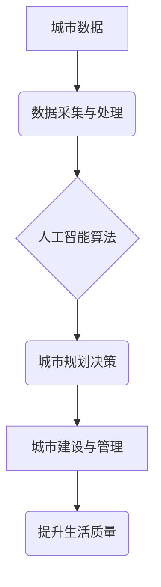

                 

## AI在智能城市规划中的应用：提高生活质量

> 关键词：人工智能、智能城市、城市规划、机器学习、深度学习、优化算法、数据分析、可持续发展

## 1. 背景介绍

随着全球人口的快速增长和城市化的进程加速，城市面临着日益严峻的挑战，包括交通拥堵、环境污染、资源短缺和公共服务压力等。传统城市规划方法难以有效应对这些复杂问题，亟需引入新的技术手段来提升城市规划的效率和智能化水平。人工智能（AI）作为一门新兴技术，凭借其强大的数据处理、分析和预测能力，为智能城市规划提供了新的思路和解决方案。

智能城市规划是指利用先进的传感器、物联网、大数据分析和人工智能等技术，对城市进行全面的感知、分析和优化，以提高城市居民的生活质量、提升城市管理效率和促进城市可持续发展。AI在智能城市规划中的应用，可以从以下几个方面提升城市规划水平：

* **数据驱动决策:** AI可以对海量城市数据进行分析和挖掘，识别城市发展趋势和潜在问题，为城市规划决策提供数据支撑。
* **优化资源配置:** AI可以根据城市需求和资源状况，优化交通、能源、水资源等关键资源的配置，提高资源利用效率。
* **预测城市发展:** AI可以基于历史数据和未来趋势预测城市发展状况，帮助规划者制定更有效的城市发展规划。
* **个性化服务:** AI可以根据居民需求提供个性化的城市服务，例如定制化交通路线、智能垃圾分类等。

## 2. 核心概念与联系

**2.1 核心概念**

* **智能城市:**  智能城市是指利用信息技术和通信技术，将城市基础设施、公共服务、社会管理等各个方面进行智能化改造，提高城市运行效率、居民生活质量和城市可持续发展能力的城市。
* **人工智能 (AI):** 人工智能是指模拟人类智能行为的计算机系统，包括学习、推理、决策、感知和语言理解等能力。
* **城市规划:** 城市规划是指根据城市发展目标和社会需求，对城市空间布局、功能分区、基础设施建设、公共服务提供等方面进行科学规划和设计。

**2.2 架构关系**



**2.3 核心联系**

AI技术在智能城市规划中扮演着关键角色，它通过对城市数据的分析和处理，为城市规划决策提供数据支撑，并帮助优化城市资源配置、预测城市发展趋势，最终提升城市居民的生活质量。

## 3. 核心算法原理 & 具体操作步骤

**3.1 算法原理概述**

在智能城市规划中，常用的AI算法包括机器学习、深度学习、强化学习等。

* **机器学习:**  机器学习算法通过学习从数据中提取的模式和规律，对城市数据进行分类、预测和聚类等分析，例如预测人口流动、交通流量等。
* **深度学习:** 深度学习算法利用多层神经网络结构，能够学习更复杂的城市数据模式，例如识别城市景观、分析城市结构等。
* **强化学习:** 强化学习算法通过试错学习，在城市规划决策中寻找最优策略，例如优化交通信号灯控制、智能能源调度等。

**3.2 算法步骤详解**

以机器学习算法为例，其具体操作步骤如下：

1. **数据收集与预处理:** 收集城市相关数据，例如人口数据、交通数据、环境数据等，并进行清洗、转换和特征工程等预处理操作。
2. **模型选择:** 根据城市规划问题特点选择合适的机器学习算法，例如回归算法、分类算法、聚类算法等。
3. **模型训练:** 利用训练数据对选定的机器学习模型进行训练，调整模型参数，使其能够准确地学习城市数据模式。
4. **模型评估:** 利用测试数据对训练好的模型进行评估，评估模型的预测精度、准确率等指标。
5. **模型部署:** 将训练好的模型部署到实际应用场景中，用于城市规划决策支持。

**3.3 算法优缺点**

* **优点:** 能够自动学习城市数据模式，提高城市规划决策的效率和准确性。
* **缺点:** 需要大量高质量的训练数据，算法训练过程复杂，模型解释性较差。

**3.4 算法应用领域**

* **交通规划:** 预测交通流量、优化交通信号灯控制、规划公共交通路线等。
* **环境规划:** 监测空气质量、预测污染物扩散、规划绿色空间等。
* **资源规划:** 优化能源分配、规划水资源利用、管理城市垃圾等。
* **公共服务规划:** 预测居民需求、优化公共服务配置、提供个性化服务等。

## 4. 数学模型和公式 & 详细讲解 & 举例说明

**4.1 数学模型构建**

在智能城市规划中，可以使用数学模型来描述城市系统复杂的行为和相互作用。例如，可以使用交通流模型来模拟城市交通网络的运行状况，预测交通拥堵情况；可以使用能源模型来模拟城市能源消耗和供需关系，优化能源分配方案。

**4.2 公式推导过程**

以交通流模型为例，常用的数学模型是LWR模型（Lighthill-Whitham-Richards模型）。该模型将交通流视为连续介质，并用密度、速度和流量来描述交通流的状态。

* **密度:** ρ(x,t) 表示在位置x和时间t处的车辆密度。
* **速度:** u(x,t) 表示在位置x和时间t处的车辆速度。
* **流量:** q(x,t) = u(x,t) * ρ(x,t) 表示在位置x和时间t处的车辆流量。

LWR模型的基本方程如下：

∂ρ/∂t + ∂(ρu)/∂x = 0

其中，∂ρ/∂t 表示车辆密度的变化率，∂(ρu)/∂x 表示车辆流量的变化率。

**4.3 案例分析与讲解**

假设城市道路上车辆密度均匀分布，速度为常数，则LWR模型可以简化为：

∂ρ/∂t + u * ∂ρ/∂x = 0

该方程描述了车辆密度随时间和位置的变化规律。通过解该方程，可以预测交通流量的变化趋势，例如预测交通拥堵时间和地点。

## 5. 项目实践：代码实例和详细解释说明

**5.1 开发环境搭建**

* 操作系统: Ubuntu 20.04 LTS
* Python 版本: 3.8.10
* 必要的库: NumPy, Pandas, Matplotlib, Scikit-learn

**5.2 源代码详细实现**

```python
import numpy as np
from sklearn.linear_model import LinearRegression

# 数据加载
data = np.loadtxt("traffic_data.csv", delimiter=",")
X = data[:, :-1]  # 特征数据
y = data[:, -1]  # 目标数据

# 模型训练
model = LinearRegression()
model.fit(X, y)

# 模型预测
new_data = np.array([[10, 20]])  # 新数据
prediction = model.predict(new_data)

# 结果展示
print("预测结果:", prediction)
```

**5.3 代码解读与分析**

* 代码首先加载交通数据，并将数据分为特征数据和目标数据。
* 然后，使用线性回归模型训练模型，并使用训练好的模型对新数据进行预测。
* 最后，打印预测结果。

**5.4 运行结果展示**

运行代码后，将输出预测结果，例如预测未来交通流量。

## 6. 实际应用场景

**6.1 交通规划**

* **交通流量预测:** 利用AI算法预测交通流量，帮助交通管理部门优化交通信号灯控制、调整道路通行规则，缓解交通拥堵。
* **公共交通优化:** 根据乘客需求和交通流量预测，优化公共交通路线和班次，提高公共交通效率和服务质量。
* **智能停车:** 利用传感器和AI算法，实现智能停车位管理，引导车辆驶入空闲停车位，提高停车效率。

**6.2 环境规划**

* **空气质量监测:** 利用传感器和AI算法，实时监测空气质量，识别污染源，制定污染防治措施。
* **绿色空间规划:** 利用AI算法分析城市绿化现状和居民需求，规划合理的绿色空间布局，提高城市绿化覆盖率。
* **水资源管理:** 利用AI算法分析水资源供需关系，优化水资源分配方案，提高水资源利用效率。

**6.3 资源规划**

* **能源管理:** 利用AI算法分析城市能源消耗和供需关系，优化能源分配方案，提高能源利用效率。
* **垃圾分类:** 利用传感器和AI算法，实现智能垃圾分类，提高垃圾处理效率。
* **城市基础设施管理:** 利用AI算法分析城市基础设施运行状况，预测设备故障，及时进行维护保养。

**6.4 未来应用展望**

随着AI技术的不断发展，其在智能城市规划中的应用将更加广泛和深入。例如，未来可能出现以下应用场景：

* **个性化城市服务:** 根据居民需求和喜好，提供个性化的城市服务，例如定制化交通路线、智能家居服务等。
* **城市安全保障:** 利用AI算法分析城市安全数据，预测安全风险，提高城市安全保障水平。
* **城市可持续发展:** 利用AI算法分析城市发展趋势，制定更加可持续的城市发展规划。

## 7. 工具和资源推荐

**7.1 学习资源推荐**

* **在线课程:** Coursera, edX, Udacity 等平台提供人工智能、机器学习等相关课程。
* **书籍:** 《深度学习》、《机器学习实战》等书籍可以帮助深入了解AI相关知识。
* **开源社区:** TensorFlow, PyTorch 等开源社区提供丰富的学习资源和开发工具。

**7.2 开发工具推荐**

* **Python:** Python 是目前最流行的AI开发语言，拥有丰富的AI库和工具。
* **Jupyter Notebook:** Jupyter Notebook 是一个交互式编程环境，方便进行AI算法开发和调试。
* **TensorFlow, PyTorch:** TensorFlow 和 PyTorch 是目前最流行的深度学习框架。

**7.3 相关论文推荐**

* **《Deep Learning》:**  由Ian Goodfellow, Yoshua Bengio 和 Aaron Courville 撰写的深度学习经典著作。
* **《Machine Learning》:**  由Tom Mitchell 撰写的机器学习经典著作。
* **《Reinforcement Learning: An Introduction》:**  由Richard S. Sutton 和 Andrew G. Barto 撰写的强化学习经典著作。

## 8. 总结：未来发展趋势与挑战

**8.1 研究成果总结**

AI技术在智能城市规划领域取得了显著成果，例如交通流量预测、环境监测、资源管理等方面都取得了突破。

**8.2 未来发展趋势**

* **更强大的AI算法:** 未来将出现更强大的AI算法，例如更复杂的深度学习模型、更有效的强化学习算法等，能够解决更复杂的问题。
* **更丰富的城市数据:** 未来城市数据将更加丰富，例如传感器数据、社交媒体数据等，为AI算法提供更丰富的训练数据。
* **更智能的城市服务:** 未来将出现更多智能城市服务，例如个性化交通规划、智能家居服务等，提高居民生活质量。

**8.3 面临的挑战**

* **数据隐私保护:** 城市数据往往包含敏感信息，需要采取有效措施保护数据隐私。
* **算法解释性:** 许多AI算法的决策过程难以解释，需要提高算法的解释性，增强公众信任。
* **技术可持续性:** 需要确保AI技术能够长期稳定运行，并适应城市发展变化。

**8.4 研究展望**

未来，AI技术在智能城市规划领域将继续发挥重要作用，需要加强基础研究，探索更有效的AI算法和应用场景，并解决技术伦理和社会影响等问题，推动AI技术在城市规划领域的健康发展。

## 9. 附录：常见问题与解答

**9.1 如何选择合适的AI算法？**

选择合适的AI算法需要根据具体的城市规划问题和数据特点进行分析。例如，如果需要预测交通流量，可以使用时间序列分析算法；如果需要识别城市景观，可以使用图像识别算法。

**9.2 如何保证AI算法的准确性？**

保证AI算法的准确性需要使用高质量的训练数据，并对算法进行充分的训练和测试。

**9.3 如何解决AI算法的解释性问题？**

可以采用可解释AI技术，例如LIME、SHAP等，提高算法的解释性。

**9.4 如何应对AI技术带来的伦理挑战？**

需要制定相应的伦理规范和法律法规，确保AI技术在城市规划领域的应用安全、公平、透明。


作者：禅与计算机程序设计艺术 / Zen and the Art of Computer Programming 
<end_of_turn>

