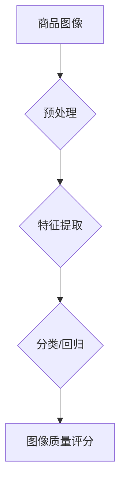

                 

## AI在电商平台商品图像质量评估中的应用

> 关键词：电商平台、商品图像质量评估、人工智能、深度学习、卷积神经网络、图像分类、物体检测、图像修复

## 1. 背景介绍

在当今以电商为核心的数字经济时代，商品图像质量已成为消费者决策的重要因素。高质量的商品图像能够更直观地展示商品的特性，提升用户体验，从而促进销售转化。然而，电商平台上商品图像数量庞大，人工审核效率低下，且存在主观性偏差。因此，如何高效、准确地评估商品图像质量，成为电商平台亟待解决的关键问题。

人工智能技术，特别是深度学习技术，为商品图像质量评估提供了新的解决方案。深度学习模型能够自动学习图像特征，并根据这些特征对图像质量进行客观评价。相较于传统人工评估方法，AI技术具有以下优势：

* **自动化**:  深度学习模型能够自动完成图像质量评估，无需人工干预，大幅提高效率。
* **客观性**:  深度学习模型基于图像特征进行评估，减少主观性偏差，保证评估结果的客观性。
* **可扩展性**:  深度学习模型能够处理海量图像数据，满足电商平台日益增长的需求。

## 2. 核心概念与联系

### 2.1 商品图像质量评估

商品图像质量评估是指对商品图像的清晰度、色彩、构图、光线等方面进行客观评价，并将其转化为可量化的分数或等级。

### 2.2 深度学习

深度学习是一种机器学习的子领域，它利用多层神经网络来模拟人类大脑的学习过程。深度学习模型能够自动学习图像特征，并根据这些特征进行图像分类、物体检测、图像修复等任务。

### 2.3 卷积神经网络 (CNN)

卷积神经网络 (CNN) 是一种专门用于处理图像数据的深度学习模型。CNN 利用卷积操作和池化操作来提取图像特征，并通过全连接层进行分类或回归。

**Mermaid 流程图**



## 3. 核心算法原理 & 具体操作步骤

### 3.1 算法原理概述

商品图像质量评估的深度学习算法通常基于卷积神经网络 (CNN)。CNN 模型通过多层卷积和池化操作，从图像中提取特征，并将其映射到一个特征向量空间。然后，通过全连接层将特征向量映射到图像质量评分。

### 3.2 算法步骤详解

1. **数据收集和预处理**: 收集大量商品图像数据，并对图像进行预处理，例如调整图像大小、归一化像素值等。
2. **模型构建**: 使用深度学习框架 (例如 TensorFlow 或 PyTorch) 构建 CNN 模型。模型通常包含多个卷积层、池化层和全连接层。
3. **模型训练**: 使用训练数据训练 CNN 模型，通过反向传播算法调整模型参数，使模型能够准确地预测图像质量评分。
4. **模型评估**: 使用测试数据评估模型的性能，例如计算准确率、召回率等指标。
5. **模型部署**: 将训练好的模型部署到电商平台，用于对商品图像进行实时评估。

### 3.3 算法优缺点

**优点**:

* **自动化**:  深度学习模型能够自动完成图像质量评估，无需人工干预。
* **客观性**:  深度学习模型基于图像特征进行评估，减少主观性偏差。
* **可扩展性**:  深度学习模型能够处理海量图像数据。

**缺点**:

* **数据依赖性**:  深度学习模型需要大量高质量的训练数据才能达到较高的准确率。
* **计算资源**:  训练深度学习模型需要大量的计算资源。
* **解释性**:  深度学习模型的决策过程较为复杂，难以解释。

### 3.4 算法应用领域

商品图像质量评估的深度学习算法不仅应用于电商平台，还可应用于以下领域:

* **图像修复**:  修复图像中的缺陷，例如噪声、模糊、缺失部分等。
* **图像增强**:  提升图像的清晰度、色彩、对比度等。
* **图像检索**:  根据图像内容进行检索，例如查找相似图像、识别物体等。

## 4. 数学模型和公式 & 详细讲解 & 举例说明

### 4.1 数学模型构建

商品图像质量评估的深度学习模型通常采用卷积神经网络 (CNN) 作为基础架构。CNN 模型通过多个卷积层和池化层提取图像特征，并通过全连接层进行分类或回归。

**卷积层**: 卷积层使用卷积核对图像进行卷积操作，提取图像局部特征。卷积核是一个小的矩阵，通过滑动在图像上，计算每个位置的卷积结果。

**池化层**: 池化层对卷积层的输出进行降维操作，减少计算量，提高模型鲁棒性。常见的池化操作包括最大池化和平均池化。

**全连接层**: 全连接层将卷积层和池化层的输出进行连接，并进行分类或回归。全连接层使用激活函数将输出映射到目标空间。

### 4.2 公式推导过程

CNN 模型的训练过程基于反向传播算法。反向传播算法通过计算损失函数的梯度，更新模型参数，使模型能够更好地预测图像质量评分。

**损失函数**: 损失函数用于衡量模型预测结果与真实结果之间的差异。常见的损失函数包括均方误差 (MSE) 和交叉熵损失 (Cross-Entropy Loss)。

**梯度下降**: 梯度下降算法用于更新模型参数。梯度下降算法通过计算损失函数的梯度，沿着梯度负方向更新模型参数。

### 4.3 案例分析与讲解

假设我们使用 CNN 模型对商品图像进行质量评估，并使用 MSE 作为损失函数。训练过程中，模型会不断调整参数，使预测的图像质量评分与真实评分之间的误差最小化。

例如，如果模型预测的图像质量评分为 80，而真实评分为 90，则损失函数的值为 (80 - 90)^2 = 100。模型会根据梯度下降算法，调整参数，使预测评分更接近真实评分。

## 5. 项目实践：代码实例和详细解释说明

### 5.1 开发环境搭建

* **操作系统**: Ubuntu 18.04 或更高版本
* **Python**: 3.6 或更高版本
* **深度学习框架**: TensorFlow 或 PyTorch
* **其他依赖库**: numpy, pandas, matplotlib等

### 5.2 源代码详细实现

```python
# 使用 TensorFlow 构建 CNN 模型

import tensorflow as tf

# 定义模型结构
model = tf.keras.models.Sequential([
    tf.keras.layers.Conv2D(32, (3, 3), activation='relu', input_shape=(224, 224, 3)),
    tf.keras.layers.MaxPooling2D((2, 2)),
    tf.keras.layers.Conv2D(64, (3, 3), activation='relu'),
    tf.keras.layers.MaxPooling2D((2, 2)),
    tf.keras.layers.Flatten(),
    tf.keras.layers.Dense(10, activation='softmax')
])

# 编译模型
model.compile(optimizer='adam',
              loss='categorical_crossentropy',
              metrics=['accuracy'])

# 训练模型
model.fit(x_train, y_train, epochs=10)

# 评估模型
loss, accuracy = model.evaluate(x_test, y_test)
print('Loss:', loss)
print('Accuracy:', accuracy)
```

### 5.3 代码解读与分析

* **模型结构**: 代码定义了一个简单的 CNN 模型，包含两个卷积层、两个池化层、一个 Flatten 层和一个全连接层。
* **激活函数**: 模型使用 ReLU 激活函数，可以提高模型的学习能力。
* **损失函数**: 模型使用交叉熵损失函数，适合多分类任务。
* **优化器**: 模型使用 Adam 优化器，可以快速收敛。
* **训练和评估**: 代码展示了模型的训练和评估过程。

### 5.4 运行结果展示

训练完成后，可以将模型部署到电商平台，用于对商品图像进行实时评估。评估结果可以用于以下用途:

* **商品审核**: 自动筛选出质量不合格的商品图像。
* **商品推荐**: 根据图像质量推荐更优质的商品。
* **用户体验**: 提供更清晰、更美观的商品展示，提升用户体验。

## 6. 实际应用场景

### 6.1 商品图片质量控制

电商平台可以利用 AI 技术对上传的商品图片进行自动审核，识别模糊、失焦、色差等问题，确保商品图片质量符合平台标准。

### 6.2 商品图片推荐

根据商品图片质量，电商平台可以推荐更优质的商品图片给用户，提升用户购物体验。

### 6.3 商品图片修复

AI 技术可以对商品图片进行修复，例如去除噪点、修复缺失部分，提升图片质量。

### 6.4 未来应用展望

随着 AI 技术的不断发展，商品图像质量评估的应用场景将更加广泛，例如:

* **虚拟试衣**: 利用 AI 技术对商品图片进行虚拟试衣，帮助用户更直观地了解商品的穿着效果。
* **个性化推荐**: 根据用户的画像和偏好，推荐更符合其审美观的商品图片。
* **跨平台应用**: 将商品图像质量评估技术应用于其他平台，例如社交媒体、搜索引擎等。

## 7. 工具和资源推荐

### 7.1 学习资源推荐

* **书籍**:
    * 深度学习
    * 构建深度学习模型
* **在线课程**:
    * Coursera 深度学习课程
    * Udacity 深度学习工程师 Nanodegree
* **博客**:
    * TensorFlow 官方博客
    * PyTorch 官方博客

### 7.2 开发工具推荐

* **深度学习框架**: TensorFlow, PyTorch
* **图像处理库**: OpenCV, Pillow
* **数据可视化工具**: Matplotlib, Seaborn

### 7.3 相关论文推荐

* **ImageNet Classification with Deep Convolutional Neural Networks**
* **Deep Residual Learning for Image Recognition**
* **Attention Is All You Need**

## 8. 总结：未来发展趋势与挑战

### 8.1 研究成果总结

AI 技术在商品图像质量评估领域取得了显著成果，能够自动、客观地评估图像质量，并应用于电商平台的商品审核、推荐等场景。

### 8.2 未来发展趋势

* **模型精度提升**:  研究更深、更复杂的 CNN 模型，提高图像质量评估的精度。
* **多模态融合**:  将图像质量评估与其他模态数据 (例如文本、音频) 融合，提升评估的全面性和准确性。
* **个性化评估**:  根据用户的画像和偏好，进行个性化的图像质量评估。

### 8.3 面临的挑战

* **数据标注**:  高质量的图像数据标注是深度学习模型训练的关键，但数据标注成本较高。
* **模型解释性**:  深度学习模型的决策过程较为复杂，难以解释，这限制了模型的应用场景。
* **公平性**:  深度学习模型可能存在偏见，导致对不同类型商品的评估结果不公平。

### 8.4 研究展望

未来，商品图像质量评估的研究将更加注重模型的精度、解释性和公平性。同时，将探索将 AI 技术应用于更多电商场景，例如商品推荐、虚拟试衣等。

## 9. 附录：常见问题与解答

**Q1: 如何选择合适的深度学习模型？**

**A1:** 选择合适的深度学习模型需要根据具体任务和数据特点进行选择。对于商品图像质量评估任务，常用的模型包括 ResNet, Inception, VGG 等。

**Q2: 如何解决数据标注问题？**

**A2:** 可以采用以下方法解决数据标注问题:

* **人工标注**:  由专业人员进行人工标注，但成本较高。
* **自动标注**:  利用 AI 技术自动标注数据，但精度可能较低。
* **数据增强**:  通过对现有数据进行变换 (例如旋转、缩放、翻转等)，增加数据量，提高模型的泛化能力。

**Q3: 如何评估模型的性能？**

**A3:** 可以使用以下指标评估模型的性能:

* **准确率**:  模型正确预测的图像数量占总图像数量的比例。
* **召回率**:  模型预测出的所有正确图像占所有真实正确图像的比例。
* **F1-score**:  准确率和召回率的调和平均数。


作者：禅与计算机程序设计艺术 / Zen and the Art of Computer Programming 
<end_of_turn>

