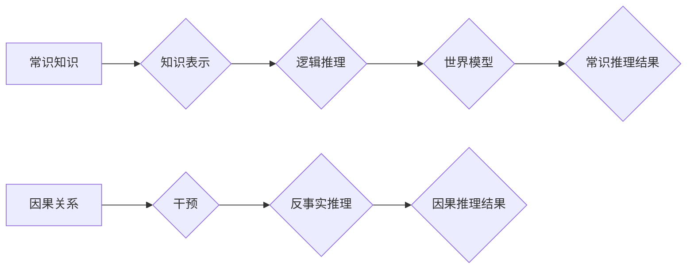

                 

## AI推理能力的评测基准:常识推理和因果推理测试集

> 关键词：人工智能、推理能力、常识推理、因果推理、评测基准、测试集、知识图谱、逻辑推理、机器学习

## 1. 背景介绍

人工智能（AI）的发展日新月异，特别是深度学习技术的突破，使得AI在图像识别、自然语言处理等领域取得了令人瞩目的成就。然而，与人类相比，AI在推理能力方面仍然存在着显著差距。人类能够运用常识和因果关系进行复杂推理，而AI则往往局限于已知数据范围内的模式识别，难以应对开放世界中的未知情境。

常识推理和因果推理是AI发展的重要方向之一。常识推理是指基于人类普遍的知识和经验进行推理，例如判断“如果下雨，地面会湿”这样的陈述。因果推理是指识别事件之间的因果关系，例如判断“因为我按下了按钮，所以灯亮了”。

目前，评估AI推理能力的标准缺乏统一，缺乏针对常识推理和因果推理的专门测试集。这使得AI研究者难以准确地衡量AI的推理能力，也阻碍了AI推理能力的进一步发展。

## 2. 核心概念与联系

### 2.1 常识推理

常识推理是基于人类普遍的知识和经验进行推理，它涉及到以下几个核心概念：

* **知识表示:** 常识推理需要将常识知识以机器可理解的形式表示出来，例如使用知识图谱、规则库等。
* **逻辑推理:** 常识推理通常基于逻辑推理规则，例如蕴含关系、归纳推理等。
* **世界模型:** 常识推理需要建立一个关于世界的模型，以便对新的信息进行解释和预测。

### 2.2 因果推理

因果推理是指识别事件之间的因果关系，它涉及到以下几个核心概念：

* **因果关系:** 因果关系是指一个事件导致另一个事件发生。
* **干预:** 干预是指人为改变一个事件，以观察其对其他事件的影响。
* **反事实推理:** 反事实推理是指假设某个事件没有发生，然后推断出可能的结果。

**Mermaid 流程图**



## 3. 核心算法原理 & 具体操作步骤

### 3.1 算法原理概述

常识推理和因果推理算法通常基于以下几种原理：

* **规则库:** 使用预先定义的规则来进行推理，例如专家系统。
* **逻辑推理:** 使用逻辑推理规则，例如命题逻辑、描述逻辑等，进行推理。
* **机器学习:** 使用机器学习算法，例如深度神经网络，从数据中学习推理规则。

### 3.2 算法步骤详解

**规则库法:**

1. 建立一个包含常识知识和因果关系的规则库。
2. 将输入问题转化为规则库中的规则形式。
3. 根据规则库中的规则进行推理，得出结论。

**逻辑推理法:**

1. 将常识知识和因果关系表示为逻辑公式。
2. 使用逻辑推理规则，例如蕴含关系、归纳推理等，进行推理。
3. 将推理结果转化为可理解的形式。

**机器学习法:**

1. 收集大量包含常识推理和因果推理问题的训练数据。
2. 使用深度神经网络等机器学习算法，从数据中学习推理规则。
3. 将训练好的模型应用于新的推理问题。

### 3.3 算法优缺点

**规则库法:**

* **优点:** 规则易于理解和维护，推理过程透明。
* **缺点:** 规则库难以覆盖所有可能的场景，难以处理复杂推理问题。

**逻辑推理法:**

* **优点:** 能够处理复杂推理问题，推理过程严谨。
* **缺点:** 需要复杂的逻辑知识，难以处理开放世界中的未知情境。

**机器学习法:**

* **优点:** 能够学习复杂的推理规则，适应开放世界中的未知情境。
* **缺点:** 训练数据量大，模型难以解释，容易受到数据偏差的影响。

### 3.4 算法应用领域

常识推理和因果推理算法在许多领域都有应用，例如：

* **自然语言理解:** 理解人类语言的含义，例如问答系统、机器翻译。
* **知识图谱构建:** 建立关于世界的知识图谱，例如自动知识提取、关系推理。
* **医疗诊断:** 基于患者症状和病史进行诊断，例如辅助医生诊断疾病。
* **自动驾驶:** 理解道路环境，做出驾驶决策，例如避障、路径规划。

## 4. 数学模型和公式 & 详细讲解 & 举例说明

### 4.1 数学模型构建

常识推理和因果推理可以建模为图论问题。知识图谱可以表示为一个有向图，其中节点代表实体，边代表关系。因果关系可以表示为因果图，其中节点代表事件，边代表因果关系。

### 4.2 公式推导过程

**逻辑推理:**

可以使用命题逻辑的推理规则，例如蕴含关系、归纳推理等，进行常识推理和因果推理。例如，如果我们知道“所有猫都是哺乳动物”，并且知道“小猫是猫”，那么我们可以通过蕴含关系推理出“小猫是哺乳动物”。

**机器学习:**

可以使用深度神经网络等机器学习算法，学习常识推理和因果推理的规则。例如，可以使用循环神经网络（RNN）学习文本序列中的因果关系，可以使用图卷积网络（GCN）学习知识图谱中的常识推理规则。

### 4.3 案例分析与讲解

**案例:**

假设我们有一个知识图谱，其中包含以下知识：

* 猫是哺乳动物。
* 小猫是猫。
* 哺乳动物产奶。

**推理问题:** 小猫会产奶吗？

**推理过程:**

1. 根据知识图谱中的规则，我们可以推断出小猫是哺乳动物。
2. 因为哺乳动物产奶，所以小猫也会产奶。

**结论:** 小猫会产奶。

## 5. 项目实践：代码实例和详细解释说明

### 5.1 开发环境搭建

* Python 3.x
* TensorFlow 或 PyTorch
* Jupyter Notebook

### 5.2 源代码详细实现

```python
# 使用 TensorFlow 实现简单的常识推理模型

import tensorflow as tf

# 定义输入层和输出层
input_layer = tf.keras.Input(shape=(10,))
output_layer = tf.keras.layers.Dense(1, activation='sigmoid')(input_layer)

# 定义模型
model = tf.keras.Model(inputs=input_layer, outputs=output_layer)

# 编译模型
model.compile(optimizer='adam', loss='binary_crossentropy', metrics=['accuracy'])

# 训练模型
model.fit(x_train, y_train, epochs=10)

# 预测结果
predictions = model.predict(x_test)
```

### 5.3 代码解读与分析

这段代码使用 TensorFlow 库构建了一个简单的常识推理模型。

* `input_layer` 定义了模型的输入层，形状为 (10,)，表示输入特征的维度为 10。
* `output_layer` 定义了模型的输出层，使用 sigmoid 激活函数，输出一个介于 0 和 1 之间的数值，表示推理结果的概率。
* `model` 定义了模型，将输入层和输出层连接起来。
* `model.compile()` 编译模型，指定优化器、损失函数和评估指标。
* `model.fit()` 训练模型，使用训练数据 `x_train` 和 `y_train` 进行训练。
* `model.predict()` 使用训练好的模型预测测试数据 `x_test` 的结果。

### 5.4 运行结果展示

训练完成后，可以使用测试数据评估模型的性能，例如计算准确率、召回率等指标。

## 6. 实际应用场景

常识推理和因果推理在许多实际应用场景中发挥着重要作用，例如：

* **医疗诊断:** 基于患者症状和病史进行诊断，例如辅助医生诊断疾病。
* **自动驾驶:** 理解道路环境，做出驾驶决策，例如避障、路径规划。
* **机器人交互:** 使机器人能够理解人类语言和行为，进行更自然的交互。
* **个性化推荐:** 基于用户的行为和偏好进行个性化推荐，例如推荐电影、商品等。

### 6.4 未来应用展望

随着人工智能技术的不断发展，常识推理和因果推理将在更多领域得到应用，例如：

* **科学发现:** 帮助科学家发现新的规律和知识。
* **法律判决:** 辅助法官进行法律判决。
* **教育教学:** 个性化教学，提高学习效率。

## 7. 工具和资源推荐

### 7.1 学习资源推荐

* **书籍:**
    * 《人工智能：现代方法》
    * 《深度学习》
    * 《知识表示与推理》
* **在线课程:**
    * Coursera: 人工智能课程
    * edX: 深度学习课程
    * Udacity: 机器学习工程师课程

### 7.2 开发工具推荐

* **TensorFlow:** 开源深度学习框架
* **PyTorch:** 开源深度学习框架
* **Keras:** 高级深度学习 API

### 7.3 相关论文推荐

* **《BERT: Pre-training of Deep Bidirectional Transformers for Language Understanding》**
* **《Graph Convolutional Networks》**
* **《Attention Is All You Need》**

## 8. 总结：未来发展趋势与挑战

### 8.1 研究成果总结

近年来，在常识推理和因果推理领域取得了显著进展，例如：

* **知识图谱技术:** 知识图谱技术的发展使得知识表示更加完善，为常识推理提供了更丰富的知识资源。
* **深度学习技术:** 深度学习技术的发展使得机器能够学习更复杂的推理规则，提高了常识推理和因果推理的准确率。

### 8.2 未来发展趋势

未来，常识推理和因果推理领域将朝着以下方向发展:

* **更强大的推理能力:** 开发能够处理更复杂推理问题的模型。
* **更灵活的知识表示:** 探索新的知识表示方法，例如符号逻辑、概率图模型等。
* **更有效的训练方法:** 开发更有效的训练方法，例如迁移学习、强化学习等。

### 8.3 面临的挑战

常识推理和因果推理仍然面临着许多挑战:

* **知识的表达和推理:** 如何将人类的常识知识以机器可理解的形式表示出来，并进行有效的推理。
* **数据稀缺性:** 常识推理和因果推理的数据往往稀缺，难以训练出高性能的模型。
* **解释性:** 深度学习模型的推理过程难以解释，难以让人理解模型的决策机制。

### 8.4 研究展望

未来，我们将继续致力于开发更强大、更灵活、更解释性的常识推理和因果推理模型，推动人工智能的进一步发展。

## 9. 附录：常见问题与解答

**常见问题:**

* **常识推理和因果推理有什么区别？**

常识推理是指基于人类普遍的知识和经验进行推理，例如判断“如果下雨，地面会湿”这样的陈述。因果推理是指识别事件之间的因果关系，例如判断“因为我按下了按钮，所以灯亮了”。

* **如何评估AI的常识推理能力？**

目前，评估AI常识推理能力的标准缺乏统一，缺乏针对常识推理的专门测试集。

* **如何训练AI进行常识推理？**

可以使用规则库、逻辑推理或机器学习算法训练AI进行常识推理。

**作者：禅与计算机程序设计艺术 / Zen and the Art of Computer Programming**<end_of_turn>

