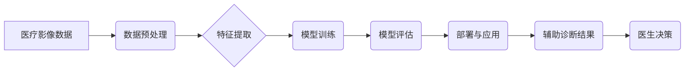

                 

## AI辅助诊断在硅谷的应用现状

> 关键词：人工智能、辅助诊断、机器学习、深度学习、医疗影像、硅谷、应用现状、未来趋势

## 1. 背景介绍

医疗领域正经历一场由人工智能（AI）驱动的革命。AI技术，特别是机器学习和深度学习，正在改变医疗诊断、治疗和预防的方式。硅谷作为全球科技创新的中心，在AI辅助诊断领域扮演着至关重要的角色。

近年来，硅谷涌现出一大批致力于开发AI辅助诊断解决方案的公司和研究机构。这些公司利用先进的算法和海量医疗数据，开发出能够辅助医生进行更准确、更快速、更个性化的诊断的工具。

## 2. 核心概念与联系

**2.1 核心概念**

* **人工智能（AI）：** 指能够模拟人类智能行为的计算机系统，例如学习、推理、决策和解决问题。
* **机器学习（ML）：** 一种AI子领域，通过算法从数据中学习模式和规律，从而进行预测或分类。
* **深度学习（DL）：** 一种更高级的机器学习方法，利用多层神经网络模拟人类大脑的结构和功能，能够处理更复杂的数据和任务。
* **辅助诊断：** 指利用AI技术辅助医生进行诊断，提高诊断的准确性、效率和个性化程度。

**2.2 架构图**



**2.3 联系**

AI辅助诊断的核心是利用机器学习和深度学习算法从海量医疗影像数据中学习，识别疾病特征，并辅助医生做出更准确的诊断。

## 3. 核心算法原理 & 具体操作步骤

**3.1 算法原理概述**

AI辅助诊断常用的算法包括卷积神经网络（CNN）、循环神经网络（RNN）和生成对抗网络（GAN）。

* **CNN:** 擅长处理图像数据，能够自动学习图像特征，识别病变区域。
* **RNN:** 擅长处理序列数据，例如病历记录和医学影像序列，能够捕捉时间上的依赖关系。
* **GAN:** 可以生成逼真的合成数据，用于数据增强和模型训练。

**3.2 算法步骤详解**

1. **数据收集和预处理:** 收集大量医疗影像数据，并进行预处理，例如图像增强、尺寸调整和噪声去除。
2. **特征提取:** 利用CNN等算法从图像数据中提取特征，例如边缘、纹理和形状。
3. **模型训练:** 利用训练数据训练机器学习模型，例如CNN、RNN或GAN。
4. **模型评估:** 使用测试数据评估模型的性能，例如准确率、召回率和F1-score。
5. **模型部署:** 将训练好的模型部署到实际应用环境中，例如医院或诊所。

**3.3 算法优缺点**

* **优点:** 提高诊断准确率、效率和个性化程度；辅助医生发现难以察觉的病变；降低医疗成本。
* **缺点:** 需要大量高质量的训练数据；模型训练成本高；存在算法偏差和伦理问题。

**3.4 算法应用领域**

* **肿瘤诊断:** 识别肺癌、乳腺癌、脑肿瘤等。
* **心血管疾病诊断:** 诊断冠心病、心肌梗塞等。
* **眼科疾病诊断:** 诊断白内障、青光眼等。
* **神经系统疾病诊断:** 诊断阿尔茨海默病、帕金森病等。

## 4. 数学模型和公式 & 详细讲解 & 举例说明

**4.1 数学模型构建**

深度学习模型通常采用多层神经网络结构，每个神经元接收多个输入信号，并通过激活函数进行处理，输出到下一层神经元。

**4.2 公式推导过程**

* **激活函数:** sigmoid函数、ReLU函数等。
* **损失函数:** 交叉熵损失函数、均方误差损失函数等。
* **优化算法:** 梯度下降算法、Adam算法等。

**4.3 案例分析与讲解**

例如，在图像分类任务中，可以使用CNN模型，其结构包括卷积层、池化层和全连接层。卷积层提取图像特征，池化层降低特征维度，全连接层进行分类。

**举例说明:**

假设一个CNN模型有三个卷积层，每个卷积层有32个卷积核，每个卷积核大小为3x3。输入图像大小为224x224。

* 第一个卷积层输出特征图大小为112x112x32。
* 第二个卷积层输出特征图大小为56x56x32。
* 第三个卷积层输出特征图大小为28x28x32。

然后，将特征图扁平化，输入全连接层进行分类。

## 5. 项目实践：代码实例和详细解释说明

**5.1 开发环境搭建**

使用Python语言和深度学习框架TensorFlow或PyTorch进行开发。

**5.2 源代码详细实现**

```python
import tensorflow as tf

# 定义CNN模型
model = tf.keras.models.Sequential([
    tf.keras.layers.Conv2D(32, (3, 3), activation='relu', input_shape=(224, 224, 3)),
    tf.keras.layers.MaxPooling2D((2, 2)),
    tf.keras.layers.Conv2D(64, (3, 3), activation='relu'),
    tf.keras.layers.MaxPooling2D((2, 2)),
    tf.keras.layers.Flatten(),
    tf.keras.layers.Dense(10, activation='softmax')
])

# 编译模型
model.compile(optimizer='adam',
              loss='sparse_categorical_crossentropy',
              metrics=['accuracy'])

# 训练模型
model.fit(x_train, y_train, epochs=10)

# 评估模型
loss, accuracy = model.evaluate(x_test, y_test)
print('Test loss:', loss)
print('Test accuracy:', accuracy)
```

**5.3 代码解读与分析**

* 使用TensorFlow框架构建CNN模型。
* 模型包含三个卷积层、两个池化层和一个全连接层。
* 使用Adam优化器、交叉熵损失函数和准确率作为评估指标。
* 使用训练数据训练模型，并使用测试数据评估模型性能。

**5.4 运行结果展示**

训练完成后，打印出测试集上的损失值和准确率。

## 6. 实际应用场景

**6.1 医疗影像分析**

AI辅助诊断在医疗影像分析领域有着广泛的应用，例如：

* **肺癌筛查:** 利用AI算法分析胸部X光片，识别潜在的肺癌病变。
* **乳腺癌检测:** 利用AI算法分析乳腺钼靶片，识别乳腺癌肿块。
* **脑肿瘤诊断:** 利用AI算法分析脑部MRI图像，识别脑肿瘤类型和大小。

**6.2 病历分析和预测**

AI算法可以分析患者的病历记录、实验室检查结果和影像学检查结果，预测患者的疾病风险和治疗效果。

**6.3 个性化医疗**

AI辅助诊断可以帮助医生根据患者的个体特征，制定个性化的治疗方案。

**6.4 未来应用展望**

* **更精准的诊断:** AI算法将能够识别更细微的病变特征，提高诊断的准确率。
* **更早的干预:** AI算法能够帮助医生更早地发现疾病，进行早期干预，提高治疗效果。
* **更个性化的治疗:** AI算法能够帮助医生根据患者的个体特征，制定更个性化的治疗方案。

## 7. 工具和资源推荐

**7.1 学习资源推荐**

* **在线课程:** Coursera、edX、Udacity等平台提供深度学习和机器学习相关的在线课程。
* **书籍:** 《深度学习》、《机器学习实战》等书籍。
* **开源代码库:** TensorFlow、PyTorch等开源代码库提供丰富的深度学习模型和工具。

**7.2 开发工具推荐**

* **Python:** 深度学习开发的主要编程语言。
* **TensorFlow:** Google开发的开源深度学习框架。
* **PyTorch:** Facebook开发的开源深度学习框架。
* **Jupyter Notebook:** 用于深度学习开发和可视化的交互式笔记本环境。

**7.3 相关论文推荐**

* **AlexNet:** 《ImageNet Classification with Deep Convolutional Neural Networks》
* **VGGNet:** 《Very Deep Convolutional Networks for Large-Scale Image Recognition》
* **ResNet:** 《Deep Residual Learning for Image Recognition》

## 8. 总结：未来发展趋势与挑战

**8.1 研究成果总结**

AI辅助诊断在硅谷取得了显著的进展，已经应用于多种医疗领域，提高了诊断的准确率和效率。

**8.2 未来发展趋势**

* **更强大的算法:** 研究更强大的深度学习算法，例如Transformer、BERT等，提高诊断的准确率和泛化能力。
* **更丰富的医疗数据:** 收集和整合更丰富的医疗数据，例如电子病历、基因组数据等，为AI模型提供更全面的信息。
* **更个性化的医疗:** 利用AI算法为患者提供更个性化的诊断和治疗方案。

**8.3 面临的挑战**

* **数据隐私和安全:** 保护患者的医疗数据隐私和安全。
* **算法偏差和公平性:** 确保AI算法不产生偏差，并为所有患者提供公平的诊断和治疗。
* **伦理问题:** 应对AI辅助诊断带来的伦理问题，例如责任归属和决策权。

**8.4 研究展望**

未来，AI辅助诊断将继续朝着更精准、更个性化、更安全的方向发展，为人类健康做出更大的贡献。

## 9. 附录：常见问题与解答

**9.1 AI辅助诊断是否会取代医生？**

AI辅助诊断是辅助医生，而不是取代医生。AI算法可以帮助医生更快、更准确地诊断疾病，但最终的诊断和治疗决策仍然由医生做出。

**9.2 AI辅助诊断的准确率有多高？**

AI辅助诊断的准确率取决于多种因素，例如算法模型、训练数据和应用场景。目前，AI辅助诊断的准确率已经接近或超过了人类医生的水平。

**9.3 AI辅助诊断的成本如何？**

AI辅助诊断的成本取决于多种因素，例如算法模型、硬件设备和数据存储。随着技术的进步和规模效应，AI辅助诊断的成本将逐渐降低。


作者：禅与计算机程序设计艺术 / Zen and the Art of Computer Programming 
<end_of_turn>

