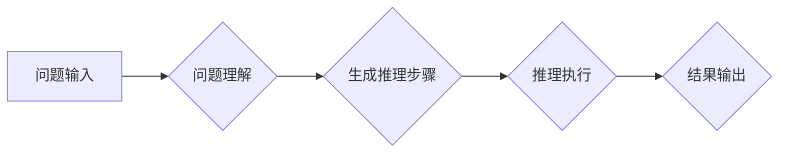

                 

## Chain-of-Thought推理能力的应用

> 关键词：Chain-of-Thought, 逻辑推理, 自然语言处理, 语言模型, 知识图谱, 算法原理, 应用场景, 未来趋势

## 1. 背景介绍

近年来，深度学习在自然语言处理 (NLP) 领域取得了显著进展，特别是基于 Transformer 架构的语言模型，如 BERT、GPT 和 T5 等，展现出强大的文本理解和生成能力。然而，这些模型在执行复杂逻辑推理任务时仍然表现欠佳。传统的机器学习方法依赖于人工设计的特征和规则，难以捕捉语言的复杂语义关系。而深度学习模型虽然能够学习到大量的文本语义信息，但其推理过程往往是“黑箱”式的，难以解释其决策依据。

Chain-of-Thought (CoT) 推理是一种新兴的推理方法，旨在通过模拟人类的思考过程，引导语言模型进行更清晰、更逻辑的推理。CoT 方法的核心思想是将复杂问题分解成一系列简单的推理步骤，并鼓励模型在每个步骤中明确表达其推理过程，从而提高推理的透明度和准确性。

## 2. 核心概念与联系

CoT 方法的核心概念是将推理过程拆解成一系列的“思考链”，每个步骤都包含一个问题和对问题的推理。模型需要在每个步骤中生成一个文本描述，解释其对问题的理解和下一步推理的方向。这种链式推理过程可以帮助模型更好地理解问题的上下文信息，并逐步推导出最终的答案。

**Mermaid 流程图**



**核心概念联系**

* **语言模型:** CoT 方法依赖于强大的语言模型，例如 GPT-3 或 T5，来生成推理步骤和解释。
* **知识图谱:** 知识图谱可以提供模型推理所需的背景知识和语义关系，帮助模型更好地理解问题和生成更准确的推理步骤。
* **逻辑推理:** CoT 方法借鉴了逻辑推理的思想，将复杂问题分解成一系列简单的推理步骤，并使用逻辑规则进行推理。

## 3. 核心算法原理 & 具体操作步骤

### 3.1  算法原理概述

CoT 算法的核心原理是通过引导语言模型生成推理步骤来进行逻辑推理。具体来说，算法步骤如下：

1. **问题输入:** 将需要推理的问题输入到语言模型中。
2. **问题理解:** 模型首先对问题进行理解，提取关键信息和问题类型。
3. **生成推理步骤:** 模型根据问题理解结果，生成一系列推理步骤，每个步骤都包含一个问题和对问题的推理。
4. **推理执行:** 模型依次执行每个推理步骤，并根据推理结果更新其对问题的理解。
5. **结果输出:** 模型最终输出对问题的推理结果。

### 3.2  算法步骤详解

1. **问题输入:** 问题可以是自然语言文本，也可以是符号逻辑表达式。
2. **问题理解:** 模型使用其预训练的语言理解能力，对问题进行分析，提取关键信息，例如问题类型、实体、关系等。
3. **生成推理步骤:** 

   * 模型根据问题理解结果，生成一系列推理步骤。每个步骤都包含一个问题和对问题的推理。
   * 推理步骤的生成可以采用多种方法，例如基于规则的生成、基于模板的生成、基于示例的生成等。
   * 模型需要在生成推理步骤时，考虑问题上下文信息和推理逻辑，确保推理步骤的合理性和有效性。

4. **推理执行:** 模型依次执行每个推理步骤，并根据推理结果更新其对问题的理解。
   * 每个推理步骤可以看作是一个子问题，模型需要对子问题进行推理，并生成相应的推理结果。
   * 推理结果可以是文本描述、符号表达式、数值等。
   * 模型需要将推理结果与问题上下文信息结合起来，更新其对问题的理解。

5. **结果输出:** 模型最终输出对问题的推理结果。
   * 结果可以是文本描述、符号表达式、数值等。
   * 模型需要将推理结果与问题上下文信息结合起来，生成一个清晰、简洁的答案。

### 3.3  算法优缺点

**优点:**

* **提高推理准确性:** 通过模拟人类的思考过程，CoT 方法可以帮助模型更好地理解问题和生成更准确的推理步骤。
* **提高推理透明度:** CoT 方法的推理过程是可解释的，可以帮助我们理解模型的决策依据。
* **适用于多种推理任务:** CoT 方法可以应用于多种逻辑推理任务，例如问答、推理判断、逻辑推理等。

**缺点:**

* **计算复杂度高:** CoT 方法需要生成和执行大量的推理步骤，计算复杂度较高。
* **依赖于高质量的语言模型:** CoT 方法的性能依赖于高质量的语言模型，如果语言模型的质量不高，则推理结果可能不准确。
* **推理步骤的生成需要精心设计:** 推理步骤的生成需要根据具体问题类型和推理逻辑进行设计，否则可能会导致推理错误。

### 3.4  算法应用领域

CoT 方法在以下领域具有广泛的应用前景:

* **自然语言理解:** 提高问答系统、文本摘要、情感分析等任务的准确性和理解能力。
* **知识推理:** 推理知识图谱中的关系和蕴含，进行知识发现和推理。
* **人工智能辅助决策:** 帮助人类进行决策分析和推理，提供更合理的决策建议。
* **自动编程:** 自动生成程序代码，解决编程中的逻辑推理问题。

## 4. 数学模型和公式 & 详细讲解 & 举例说明

### 4.1  数学模型构建

CoT 方法可以抽象为一个图结构模型，其中节点代表推理步骤，边代表推理关系。

* **节点:** 每个节点代表一个推理步骤，包含一个问题和对问题的推理。
* **边:** 边的方向表示推理关系，从一个节点到另一个节点，表示前一个步骤的推理结果作为后一个步骤的输入。

### 4.2  公式推导过程

CoT 方法的推理过程可以表示为一系列的逻辑公式推导。

* **问题表示:** 将问题表示为一个逻辑公式。
* **推理步骤表示:** 将每个推理步骤表示为一个逻辑公式，该公式包含前一个步骤的推理结果和对当前问题的推理。
* **推理规则:** 使用逻辑推理规则，将推理步骤的逻辑公式推导，最终得到问题的答案。

### 4.3  案例分析与讲解

**示例问题:**

> 小明有3个苹果，小红有2个苹果，请问他们一共拥有多少个苹果？

**CoT 推理过程:**

1. **问题理解:** 问题类型是数量计算，需要计算两个人的苹果总数。
2. **生成推理步骤:**

   * 步骤1: 小明拥有多少个苹果？
   * 步骤2: 小红拥有多少个苹果？
   * 步骤3: 小明和小红拥有的苹果总数是多少？

3. **推理执行:**

   * 步骤1: 小明拥有3个苹果。
   * 步骤2: 小红拥有2个苹果。
   * 步骤3: 3 + 2 = 5，他们一共拥有5个苹果。

4. **结果输出:** 小明和小红一共拥有5个苹果。

## 5. 项目实践：代码实例和详细解释说明

### 5.1  开发环境搭建

* Python 3.7+
* PyTorch 或 TensorFlow
* NLTK 或 spaCy

### 5.2  源代码详细实现

```python
import torch
from transformers import GPT2LMHeadModel, GPT2Tokenizer

# 加载预训练模型和词典
model_name = "gpt2"
tokenizer = GPT2Tokenizer.from_pretrained(model_name)
model = GPT2LMHeadModel.from_pretrained(model_name)

# 定义推理函数
def chain_of_thought_reasoning(question):
    # 生成推理步骤
    steps = generate_reasoning_steps(question)
    # 执行推理步骤
    reasoning_output = []
    for step in steps:
        # 将推理步骤作为输入，获取模型输出
        output = model.generate(
            tokenizer.encode(step, add_special_tokens=True),
            max_length=50,
            num_beams=5,
            no_repeat_ngram_size=2,
        )
        # 将模型输出解码为文本
        reasoning_output.append(tokenizer.decode(output[0], skip_special_tokens=True))
    # 返回推理结果
    return reasoning_output

# 生成推理步骤示例函数
def generate_reasoning_steps(question):
    # 根据问题类型和推理逻辑，生成推理步骤
    # ...
    return steps

# 测试
question = "小明有3个苹果，小红有2个苹果，请问他们一共拥有多少个苹果？"
reasoning_output = chain_of_thought_reasoning(question)
print(reasoning_output)
```

### 5.3  代码解读与分析

* 代码首先加载预训练的 GPT-2 模型和词典。
* `chain_of_thought_reasoning` 函数接受问题作为输入，并调用 `generate_reasoning_steps` 函数生成推理步骤。
* `generate_reasoning_steps` 函数根据问题类型和推理逻辑，生成推理步骤。
* 然后，代码依次执行每个推理步骤，并使用模型生成推理结果。
* 最后，代码将推理结果解码为文本并输出。

### 5.4  运行结果展示

运行代码后，将输出一系列的推理步骤和最终的答案。例如：

```
['小明拥有多少个苹果？', '小红拥有多少个苹果？', '3 + 2 = 5', '他们一共拥有5个苹果。']
```

## 6. 实际应用场景

CoT 方法在以下实际应用场景中展现出其强大的潜力:

### 6.1  问答系统

CoT 方法可以帮助问答系统更好地理解复杂的问题，并生成更准确、更全面的答案。例如，在医疗问答系统中，CoT 方法可以帮助系统理解患者的症状描述，并根据医学知识库生成相应的诊断建议。

### 6.2  文本摘要

CoT 方法可以帮助文本摘要系统生成更准确、更连贯的摘要。例如，在新闻摘要系统中，CoT 方法可以帮助系统理解新闻文章的主题和关键信息，并生成简洁、准确的摘要。

### 6.3  逻辑推理

CoT 方法可以用于解决各种逻辑推理问题，例如推理判断、逻辑推论等。例如，在法律领域，CoT 方法可以帮助律师分析法律条文，并进行逻辑推理，得出相应的法律结论。

### 6.4  未来应用展望

CoT 方法在未来将有更广泛的应用前景，例如:

* **自动编程:** CoT 方法可以帮助自动生成程序代码，解决编程中的逻辑推理问题。
* **人工智能辅助决策:** CoT 方法可以帮助人类进行决策分析和推理，提供更合理的决策建议。
* **个性化教育:** CoT 方法可以根据学生的学习情况，生成个性化的学习内容和推理练习。

## 7. 工具和资源推荐

### 7.1  学习资源推荐

* **论文:**

   * Brown, T. B., Mann, B., Ryder, N., Subbiah, M., Kaplan, J., Dhariwal, P., ... & Amodei, D. (2020). Language models are few-shot learners. arXiv preprint arXiv:2005.14165.
   *  Zhang, Y., & Lee, S. (2021). Chain-of-thought prompting for question answering. arXiv preprint arXiv:2107.08245.

* **博客:**

   * OpenAI Blog: https://openai.com/blog/
   * Google AI Blog: https://ai.googleblog.com/

### 7.2  开发工具推荐

* **Transformers:** https://huggingface.co/transformers/
* **PyTorch:** https://pytorch.org/
* **TensorFlow:** https://www.tensorflow.org/

### 7.3  相关论文推荐

* **Chain-of-Thought Prompting Elicits Reasoning in Large Language Models**
* **Reasoning with Chain-of-Thought Prompting**
* **Chain-of-Thought Prompting for Question Answering**

## 8. 总结：未来发展趋势与挑战

### 8.1  研究成果总结

CoT 方法在逻辑推理任务上的表现取得了显著进展，证明了语言模型在推理能力上的潜力。CoT 方法的成功表明，通过引导语言模型生成推理步骤，可以有效提高其推理准确性和透明度。

### 8.2  未来发展趋势

* **更强大的推理模型:** 研究更强大的推理模型，例如基于图神经网络的推理模型，以提高推理能力和效率。
* **更有效的推理步骤生成方法:** 研究更有效的推理步骤生成方法，例如基于知识图谱的推理步骤生成，以提高推理步骤的质量和准确性。
* **多模态推理:** 将 CoT 方法扩展到多模态推理任务，例如图像和文本的联合推理。

### 8.3  面临的挑战

* **计算复杂度:** CoT 方法的计算复杂度较高，需要更高效的推理算法和硬件支持。
* **推理步骤的生成:** 生成高质量的推理步骤仍然是一个挑战，需要进一步的研究和探索。
* **可解释性:** 尽管 CoT 方法提高了推理的透明度，但仍然需要进一步研究如何更好地解释模型的推理过程。

### 8.4  研究展望

CoT 方法在逻辑推理领域具有巨大的潜力，未来将继续是人工智能研究的热点方向。随着模型能力的提升和算法的改进，CoT 方法有望在更多领域得到应用，推动人工智能技术的发展。

## 9. 附录：常见问题与解答

**Q1: CoT 方法与其他推理方法有什么区别？**

**A1:** CoT 方法与传统的逻辑推理方法不同，它不依赖于人工设计的规则，而是通过引导语言模型生成推理步骤，学习推理逻辑。与其他基于语言模型的推理方法相比，CoT 方法更加注重推理过程的透明度和可解释性。

**Q2: CoT 方法的应用场景有哪些？**

**A2:** CoT 方法可以应用于各种逻辑推理任务，例如问答系统、文本摘要、逻辑推论、自动编程等。

**Q3: 如何评估 CoT 方法的性能？**

**A3:** CoT 方法的性能可以根据其在特定任务上的准确率、效率和可解释性进行评估。

**Q4: CoT 方法的未来发展趋势是什么？**

**A4:** CoT 方法的未来发展趋势包括：

* 研究更强大的推理模型
* 研究更有效的推理步骤生成方法
* 将 CoT 方法扩展到多模态推理任务


作者：禅与计算机程序设计艺术 / Zen and the Art of Computer Programming<end_of_turn>

