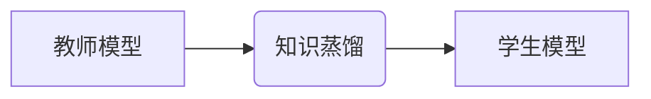

                 

## LLM在知识蒸馏过程中的应用探索

> 关键词：知识蒸馏、大语言模型（LLM）、教师模型、学生模型、参数效率、迁移学习、自然语言处理

## 1. 背景介绍

近年来，大语言模型（LLM）在自然语言处理（NLP）领域取得了显著的成就，展现出强大的文本生成、理解和翻译能力。然而，LLM通常具有庞大的参数量和高昂的计算成本，这限制了其在资源有限的设备和场景中的应用。知识蒸馏（Knowledge Distillation）作为一种模型压缩技术，旨在将大型模型的知识迁移到小型模型中，从而降低模型的复杂度和计算成本，同时保持其性能。

知识蒸馏的核心思想是将大型模型（教师模型）的知识“蒸馏”到小型模型（学生模型）中。教师模型在训练过程中学习了丰富的知识和模式，而学生模型则通过模仿教师模型的输出来学习这些知识。通过这种方式，学生模型可以获得与教师模型相似的性能，但参数量和计算成本更低。

## 2. 核心概念与联系

### 2.1 核心概念

* **教师模型 (Teacher Model):** 指训练好的大型语言模型，拥有丰富的知识和强大的表达能力。
* **学生模型 (Student Model):** 指要训练的小型语言模型，通过学习教师模型的知识来提升性能。
* **知识蒸馏 (Knowledge Distillation):** 指将教师模型的知识迁移到学生模型的过程。

### 2.2 架构



## 3. 核心算法原理 & 具体操作步骤

### 3.1 算法原理概述

知识蒸馏的核心是利用教师模型的输出作为学生模型的监督信号。传统的监督学习使用真实标签作为监督信号，而知识蒸馏则使用教师模型的预测结果作为监督信号。

教师模型和学生模型在相同的输入上进行预测，然后将教师模型的预测结果作为学生模型的监督信号。学生模型的目标是尽可能地模仿教师模型的预测结果，从而学习到教师模型的知识。

### 3.2 算法步骤详解

1. **训练教师模型:** 首先需要训练一个大型的语言模型作为教师模型。
2. **准备数据:** 使用与教师模型训练相同的训练数据来训练学生模型。
3. **知识蒸馏:** 
    * 将教师模型的预测结果作为学生模型的监督信号。
    * 使用交叉熵损失函数来衡量学生模型预测结果与教师模型预测结果之间的差异。
    * 通过反向传播算法更新学生模型的参数。
4. **评估学生模型:** 在测试集上评估学生模型的性能，并与教师模型和未进行知识蒸馏的学生模型进行比较。

### 3.3 算法优缺点

**优点:**

* **参数效率:** 学生模型的参数量远小于教师模型，可以显著降低模型的存储和计算成本。
* **迁移学习:** 可以将教师模型的知识迁移到新的任务或领域，提高模型的泛化能力。
* **加速推理:** 学生模型的推理速度更快，可以提高模型的实时性。

**缺点:**

* **性能损失:** 学生模型的性能可能无法完全达到教师模型的水平。
* **教师模型依赖:** 学生模型的性能依赖于教师模型的质量。
* **训练复杂度:** 知识蒸馏的训练过程可能比传统的监督学习更复杂。

### 3.4 算法应用领域

* **移动设备:** 将大型语言模型压缩到移动设备上，实现语音识别、机器翻译等功能。
* **嵌入式系统:** 将知识蒸馏应用于资源受限的嵌入式系统，例如智能家居设备和可穿戴设备。
* **边缘计算:** 将知识蒸馏应用于边缘计算场景，实现离线推理和数据隐私保护。

## 4. 数学模型和公式 & 详细讲解 & 举例说明

### 4.1 数学模型构建

知识蒸馏的目标是最小化学生模型的预测结果与教师模型预测结果之间的差异。可以使用交叉熵损失函数来衡量这种差异。

假设教师模型的预测结果为 $p_t$, 学生模型的预测结果为 $p_s$, 则交叉熵损失函数可以表示为:

$$
L_{KD} = -\sum_{i=1}^{N} \left[ y_i \log p_{t_i} + (1-y_i) \log (1-p_{t_i}) \right] + \lambda \sum_{i=1}^{N} \left[ y_i \log p_{s_i} + (1-y_i) \log (1-p_{s_i}) \right]
$$

其中:

* $N$ 是样本数量。
* $y_i$ 是真实标签。
* $p_{t_i}$ 是教师模型对样本 $i$ 的预测概率。
* $p_{s_i}$ 是学生模型对样本 $i$ 的预测概率。
* $\lambda$ 是平衡教师模型和学生模型预测结果差异的权重系数。

### 4.2 公式推导过程

交叉熵损失函数的推导过程可以参考传统的分类问题中的损失函数推导过程。

### 4.3 案例分析与讲解

假设我们训练一个图像分类模型，教师模型是一个大型的卷积神经网络，学生模型是一个小型卷积神经网络。

在知识蒸馏过程中，我们可以将教师模型的输出作为学生模型的监督信号。例如，如果教师模型对图像预测为猫的概率为0.9，则学生模型的目标是将预测概率尽可能地接近0.9。

通过训练，学生模型可以学习到教师模型的知识，并获得与教师模型相似的分类性能，但参数量和计算成本更低。

## 5. 项目实践：代码实例和详细解释说明

### 5.1 开发环境搭建

* Python 3.7+
* PyTorch 1.7+
* CUDA 10.2+ (可选，用于GPU加速)

### 5.2 源代码详细实现

```python
import torch
import torch.nn as nn

# 定义教师模型和学生模型
class TeacherModel(nn.Module):
    # ...

class StudentModel(nn.Module):
    # ...

# 加载预训练的教师模型
teacher_model = TeacherModel()
teacher_model.load_state_dict(torch.load('teacher_model.pth'))

# 实例化学生模型
student_model = StudentModel()

# 定义损失函数和优化器
criterion = nn.CrossEntropyLoss()
optimizer = torch.optim.Adam(student_model.parameters(), lr=0.001)

# 训练循环
for epoch in range(num_epochs):
    for batch_idx, (data, target) in enumerate(train_loader):
        # 前向传播
        teacher_output = teacher_model(data)
        student_output = student_model(data)

        # 计算损失
        loss = criterion(student_output, target) + 0.5 * criterion(student_output, teacher_output)

        # 反向传播
        optimizer.zero_grad()
        loss.backward()
        optimizer.step()

# 保存训练好的学生模型
torch.save(student_model.state_<bos><h1><end_of_turn>

