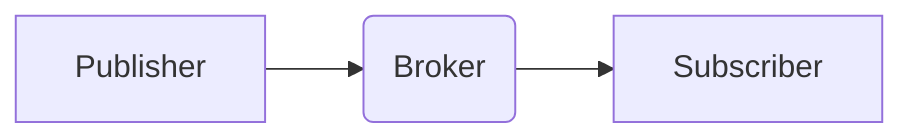

                 

## MQTT物联网通信协议详解

> 关键词：MQTT,物联网,轻量级,消息队列,发布订阅,TCP/IP,IoT

## 1. 背景介绍

物联网（IoT）的蓬勃发展，催生了对高效、可靠、低功耗的通信协议的需求。MQTT（Message Queuing Telemetry Transport）协议应运而生，凭借其轻量级、简单易用、可扩展性强等特点，迅速成为物联网通信领域的首选协议之一。

MQTT协议是一种基于TCP/IP的机器对机器（M2M）通信协议，旨在为资源受限的设备提供一种高效、可靠的消息传输机制。它采用发布订阅模式，允许设备以一种灵活、可扩展的方式进行通信。

### 1.1 物联网通信的挑战

传统的通信协议，例如HTTP和FTP，在物联网场景下存在一些弊端：

* **高资源消耗:**  HTTP和FTP协议通常需要较大的带宽和处理能力，不适合资源受限的物联网设备。
* **复杂性:**  这些协议的复杂性使得设备开发和维护成本较高。
* **延迟:**  传统的协议通常存在较高的延迟，不适合实时数据传输。

### 1.2 MQTT协议的优势

MQTT协议针对物联网场景的挑战，提供了以下优势：

* **轻量级:**  MQTT协议的协议栈非常小，占用资源少，适合资源受限的设备。
* **简单易用:**  MQTT协议的语法简单易懂，易于学习和使用。
* **可扩展性强:**  MQTT协议支持多种主题和订阅模式，可以灵活地扩展应用场景。
* **可靠性:**  MQTT协议提供多种质量保证机制，确保消息的可靠传输。
* **低功耗:**  MQTT协议采用断线重连机制，可以有效降低设备的功耗。

## 2. 核心概念与联系

MQTT协议的核心概念包括：

* **Broker:**  消息代理服务器，负责管理消息的发布和订阅。
* **Publisher:**  消息发布者，发送消息到指定的主题。
* **Subscriber:**  消息订阅者，订阅指定的主题，接收发布的消息。
* **Topic:**  主题，用于分类和组织消息。
* **Message:**  消息，包含数据和元信息。

MQTT协议采用**发布订阅模式**，消息发布者将消息发布到指定的主题，消息订阅者订阅指定的主题，接收发布的消息。

**MQTT协议架构流程图:**



## 3. 核心算法原理 & 具体操作步骤

### 3.1  算法原理概述

MQTT协议的核心算法是**消息传输算法**，它负责消息的编码、传输和接收。该算法基于TCP/IP协议，利用TCP协议的可靠性保证消息的传输可靠性。

### 3.2  算法步骤详解

1. **连接建立:**  Publisher和Subscriber首先需要连接到Broker。
2. **订阅主题:**  Subscriber向Broker订阅指定的主题。
3. **发布消息:**  Publisher向Broker发布消息，指定消息的主题。
4. **消息转发:**  Broker收到消息后，将消息转发给订阅该主题的Subscriber。
5. **消息接收:**  Subscriber收到消息后，进行处理。

### 3.3  算法优缺点

**优点:**

* **可靠性:**  基于TCP协议，保证消息的可靠传输。
* **效率:**  轻量级协议，占用资源少，传输效率高。
* **可扩展性:**  支持多种主题和订阅模式，可扩展性强。

**缺点:**

* **安全性:**  MQTT协议本身没有内置的安全性机制，需要额外配置安全措施。
* **复杂性:**  虽然MQTT协议相对简单，但实现完整的MQTT应用仍然需要一定的复杂度。

### 3.4  算法应用领域

MQTT协议广泛应用于物联网领域，例如：

* **智能家居:**  控制家电设备、监控环境数据。
* **工业自动化:**  监控设备状态、控制生产流程。
* **农业物联网:**  监测作物生长情况、控制灌溉系统。
* **智能交通:**  监控交通状况、控制交通信号灯。

## 4. 数学模型和公式 & 详细讲解 & 举例说明

MQTT协议的数学模型主要涉及消息传输的可靠性保证机制。

### 4.1  数学模型构建

MQTT协议使用**确认机制**来保证消息的可靠传输。

* **QoS (Quality of Service):**  MQTT协议定义了三种QoS级别：0、1和2。QoS 0表示“尽力交付”，QoS 1表示“至少一次交付”，QoS 2表示“恰好一次交付”。

* **ACK (Acknowledgement):**  当Subscriber收到消息后，会向Publisher发送ACK，确认消息已接收。

* **NACK (Negative Acknowledgement):**  当Publisher没有收到ACK，则会发送NACK，指示消息未被成功接收。

### 4.2  公式推导过程

假设Publisher发送消息M到Subscriber，并设置QoS为1。

1. Publisher发送消息M到Broker。
2. Broker将消息M转发给Subscriber。
3. Subscriber收到消息M后，发送ACK给Broker。
4. Broker收到ACK后，发送ACK给Publisher。

如果Publisher没有收到Broker的ACK，则Publisher会重发消息M。

### 4.3  案例分析与讲解

例如，在智能家居场景中，一个智能灯泡需要接收来自手机的控制指令。

* Publisher: 手机
* Subscriber: 智能灯泡
* Topic: /home/lights/livingroom

当用户通过手机应用程序发送控制指令到`/home/lights/livingroom`主题时，Broker会将消息转发给订阅该主题的智能灯泡。智能灯泡收到消息后，会执行相应的控制操作，例如开灯或关灯。

## 5. 项目实践：代码实例和详细解释说明

### 5.1  开发环境搭建

* **操作系统:**  Linux、Windows或macOS
* **编程语言:**  Python、Java、C++等
* **MQTT Broker:**  Mosquitto、HiveMQ等

### 5.2  源代码详细实现

以下是一个使用Python语言和Mosquitto Broker实现MQTT发布订阅的简单代码示例：

```python
import paho.mqtt.client as mqtt

# MQTT Broker地址
broker_address = "mqtt.example.com"

# 订阅主题
topic = "/home/lights/livingroom"

# 连接到Broker
client = mqtt.Client()
client.connect(broker_address)

# 订阅主题
client.subscribe(topic)

# 发布消息
def on_message(client, userdata, message):
    print("Received message: ", str(message.payload.decode("utf-8")))

# 设置消息接收回调函数
client.on_message = on_message

# 启动循环，接收消息
client.loop_forever()
```

### 5.3  代码解读与分析

* **导入paho.mqtt.client库:**  该库提供了Python语言的MQTT客户端接口。
* **连接到Broker:**  使用`client.connect()`方法连接到MQTT Broker。
* **订阅主题:**  使用`client.subscribe()`方法订阅指定的主题。
* **设置消息接收回调函数:**  使用`client.on_message`方法设置消息接收回调函数，该函数将在收到消息时被调用。
* **启动循环:**  使用`client.loop_forever()`方法启动循环，接收消息。

### 5.4  运行结果展示

当Publisher发布消息到`/home/lights/livingroom`主题时，Subscriber会收到消息并打印到控制台。

## 6. 实际应用场景

MQTT协议在物联网领域有着广泛的应用场景，例如：

### 6.1 智能家居

* 控制家电设备，例如灯泡、空调、电视等。
* 监控环境数据，例如温度、湿度、光照等。
* 实现远程控制和自动化场景。

### 6.2 工业自动化

* 监控设备状态，例如运行状态、温度、压力等。
* 控制生产流程，例如启动、停止、调整等。
* 实现远程诊断和维护。

### 6.3 农业物联网

* 监测作物生长情况，例如温度、湿度、土壤水分等。
* 控制灌溉系统，根据土壤水分自动浇水。
* 实现精准农业管理。

### 6.4 智能交通

* 监控交通状况，例如拥堵情况、事故信息等。
* 控制交通信号灯，根据交通流量自动调整信号灯时间。
* 实现智能停车管理。

### 6.5 未来应用展望

随着物联网技术的不断发展，MQTT协议的应用场景将会更加广泛，例如：

* **智慧城市:**  实现城市管理的智能化，例如环境监测、交通管理、公共安全等。
* **医疗保健:**  实现远程医疗、健康监测等应用。
* **教育:**  实现智慧教室、个性化学习等应用。

## 7. 工具和资源推荐

### 7.1 学习资源推荐

* **MQTT官网:**  https://mqtt.org/
* **MQTT协议规范:**  https://docs.oasis-open.org/mqtt/mqtt/v5.0/os/mqtt-v5.0-os.html
* **Paho MQTT Python库文档:**  https://pypi.org/project/paho-mqtt/

### 7.2 开发工具推荐

* **Mosquitto Broker:**  https://mosquitto.org/
* **HiveMQ Broker:**  https://www.hivemq.com/
* **Eclipse Paho:**  https://www.eclipse.org/paho/

### 7.3 相关论文推荐

* **MQTT Protocol Specification:**  https://docs.oasis-open.org/mqtt/mqtt/v5.0/os/mqtt-v5.0-os.html
* **MQTT for the Internet of Things:**  https://ieeexplore.ieee.org/document/7939937

## 8. 总结：未来发展趋势与挑战

### 8.1 研究成果总结

MQTT协议作为一种轻量级、高效、可靠的物联网通信协议，在物联网领域取得了显著的成果。它为物联网设备的连接和数据传输提供了可靠的解决方案，推动了物联网应用的快速发展。

### 8.2 未来发展趋势

* **安全性:**  随着物联网应用的普及，安全性将成为MQTT协议发展的重要方向。
* **可扩展性:**  MQTT协议需要进一步提高可扩展性，以支持更大的规模的物联网应用。
* **边缘计算:**  MQTT协议将与边缘计算技术相结合，实现更智能、更高效的物联网应用。

### 8.3 面临的挑战

* **安全性:**  MQTT协议本身没有内置的安全性机制，需要额外配置安全措施，例如TLS/SSL加密。
* **标准化:**  MQTT协议的标准化工作仍在进行中，需要进一步完善和规范。
* **生态系统:**  MQTT协议的生态系统还需要进一步发展，例如提供更多的开发工具和应用案例。

### 8.4 研究展望

未来，MQTT协议的研究将继续关注以下几个方面：

* **开发更安全的MQTT协议实现:**  研究并开发更安全的MQTT协议实现，例如使用端到端加密技术。
* **提高MQTT协议的可扩展性:**  研究并开发新的MQTT协议扩展机制，以支持更大的规模的物联网应用。
* **将MQTT协议与边缘计算技术相结合:**  研究并开发将MQTT协议与边缘计算技术相结合的解决方案，实现更智能、更高效的物联网应用。


## 9. 附录：常见问题与解答

### 9.1  MQTT协议和HTTP协议的区别是什么？

MQTT协议和HTTP协议都是用于网络通信的协议，但它们在设计目标、应用场景和性能方面存在显著差异。

* **MQTT协议:**  设计用于物联网场景，特点是轻量级、低功耗、可靠性强。
* **HTTP协议:**  设计用于Web应用场景，特点是功能丰富、易于使用，但资源消耗较大。

### 9.2  MQTT协议的QoS级别是什么意思？

MQTT协议定义了三种QoS级别：0、1和2。

* **QoS 0:**  “尽力交付”，消息可能丢失，不保证消息的可靠传输。
* **QoS 1:**  “至少一次交付”，保证消息至少被接收一次，但可能存在重复接收的情况。
* **QoS 2:**  “恰好一次交付”，保证消息被恰好一次接收，不重复也不丢失。

### 9.3  如何选择合适的MQTT Broker？

选择合适的MQTT Broker取决于具体的应用场景和需求。

* **Mosquitto:**  开源、轻量级、易于部署。
* **HiveMQ:**  商业化、功能丰富、高性能。

### 9.4  如何实现MQTT协议的安全性？

MQTT协议本身没有内置的安全性机制，需要额外配置安全措施，例如：

* **TLS/SSL加密:**  使用TLS/SSL协议加密消息传输，保证消息的 confidentiality 和 integrity。
* **身份验证:**  使用用户名密码、证书等方式进行身份验证，确保只有授权的用户才能访问Broker。


作者：禅与计算机程序设计艺术 / Zen and the Art of Computer Programming<end_of_turn>

