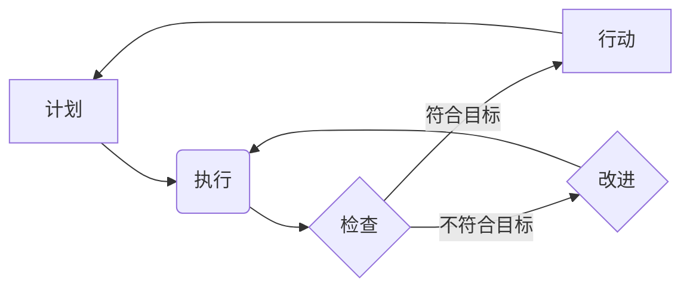

                 

## PDCA:高效管理者的行动方法论

> 关键词：PDCA, 循环管理, 持续改进, 软件开发, 项目管理, 效率提升, 流程优化

## 1. 背景介绍

在瞬息万变的科技时代，高效的管理方法对于个人和组织的成功至关重要。无论是软件开发、项目管理还是日常工作，高效的行动方法论可以帮助我们更好地规划、执行和优化工作流程，最终实现更高的效率和更优的成果。

PDCA循环管理方法论，全称为Plan-Do-Check-Act（计划-执行-检查-行动），是一种以循环的方式不断改进和优化的管理方法。它源于质量管理领域，但其应用范围远不止于此，在软件开发、项目管理、流程优化等领域都得到了广泛应用。

## 2. 核心概念与联系

PDCA循环管理方法的核心在于通过四个阶段的循环，不断改进和优化工作流程。

* **Plan (计划)**： 
   * 明确目标和任务，制定详细的计划和方案。
   * 确定资源、时间、人员等关键要素。
   * 制定风险评估和应急预案。

* **Do (执行)**： 
   * 根据计划，执行任务和操作。
   * 严格按照流程进行，并记录执行过程中的数据和信息。
   * 及时发现问题并进行处理。

* **Check (检查)**： 
   * 对执行结果进行评估和分析，检查是否达到预期目标。
   * 分析数据和信息，找出问题和改进点。
   * 总结经验教训，为下次循环提供参考。

* **Act (行动)**： 
   * 根据检查结果，制定改进方案并实施。
   * 更新计划和流程，不断优化工作效率。
   * 将改进经验推广应用，形成良性循环。

**Mermaid 流程图**



## 3. 核心算法原理 & 具体操作步骤

PDCA循环本身并非一个算法，而是一种管理方法论。它通过循环的迭代过程，不断优化工作流程，最终实现效率提升和目标达成。

### 3.1  算法原理概述

PDCA循环的核心原理在于持续改进和优化。通过计划、执行、检查、行动四个阶段的循环，我们可以不断地发现问题、分析原因、制定解决方案并实施改进，最终实现工作流程的不断优化。

### 3.2  算法步骤详解

1. **计划阶段**: 
    * 明确目标和任务，制定详细的计划和方案。
    * 确定资源、时间、人员等关键要素。
    * 制定风险评估和应急预案。

2. **执行阶段**: 
    * 根据计划，执行任务和操作。
    * 严格按照流程进行，并记录执行过程中的数据和信息。
    * 及时发现问题并进行处理。

3. **检查阶段**: 
    * 对执行结果进行评估和分析，检查是否达到预期目标。
    * 分析数据和信息，找出问题和改进点。
    * 总结经验教训，为下次循环提供参考。

4. **行动阶段**: 
    * 根据检查结果，制定改进方案并实施。
    * 更新计划和流程，不断优化工作效率。
    * 将改进经验推广应用，形成良性循环。

### 3.3  算法优缺点

**优点**:

* 简单易懂，易于实施。
* 适用于各种类型的项目和工作。
* 能够促进持续改进和优化。
* 能够提高工作效率和质量。

**缺点**:

* 需要投入时间和精力进行计划和检查。
* 如果循环不完整，可能无法达到预期效果。
* 需要团队成员的积极参与和配合。

### 3.4  算法应用领域

PDCA循环管理方法广泛应用于以下领域：

* 软件开发：软件开发流程的优化，bug修复和迭代改进。
* 项目管理：项目计划、执行、监控和控制，风险管理和问题解决。
* 流程优化：业务流程的分析、改进和优化，提高工作效率和降低成本。
* 质量管理：产品质量控制、持续改进和提升客户满意度。

## 4. 数学模型和公式 & 详细讲解 & 举例说明

PDCA循环本身并非一个数学模型，但我们可以用数学模型来描述其循环过程和改进效果。

### 4.1  数学模型构建

我们可以用一个简单的状态转移模型来描述PDCA循环：

* 状态：Plan (计划)、Do (执行)、Check (检查)、Act (行动)
* 状态转移：每个状态都对应一个特定的操作，并且状态之间存在明确的转移关系。

### 4.2  公式推导过程

由于PDCA循环是一个迭代过程，我们可以用递归公式来描述其改进效果：

```
改进效果 = f(初始效果, 迭代次数)
```

其中：

* 初始效果：初始状态下的工作效率或质量。
* 迭代次数：PDCA循环的次数。
* f()：改进函数，描述每次循环带来的改进效果。

### 4.3  案例分析与讲解

假设一个软件开发团队采用PDCA循环来改进代码质量。

* **初始效果**: 代码质量较低，bug率较高。
* **迭代次数**: 经过5次PDCA循环。
* **改进函数**: 每次循环都能降低bug率10%。

根据公式，我们可以计算出经过5次PDCA循环后，代码质量的改进效果：

```
改进效果 = f(初始效果, 5) = f(初始效果, 1) * f(初始效果, 2) * f(初始效果, 3) * f(初始效果, 4) * f(初始效果, 5)
```

由于每次循环都能降低bug率10%，所以改进函数可以表示为：

```
f(初始效果, n) = (1 - 0.1)^n
```

最终，代码质量将得到显著提升。

## 5. 项目实践：代码实例和详细解释说明

为了更好地理解PDCA循环的应用，我们可以通过一个简单的代码实例来进行说明。

### 5.1  开发环境搭建

* 编程语言：Python
* 开发工具：VS Code

### 5.2  源代码详细实现

```python
def calculate_average(numbers):
  """
  计算列表中数字的平均值。
  """
  sum_of_numbers = sum(numbers)
  average = sum_of_numbers / len(numbers)
  return average

# 测试代码
numbers = [1, 2, 3, 4, 5]
average = calculate_average(numbers)
print(f"平均值: {average}")
```

### 5.3  代码解读与分析

这段代码实现了计算列表中数字平均值的函数 `calculate_average`。

* **计划阶段**: 确定目标是编写一个能够计算列表中数字平均值的函数。
* **执行阶段**: 根据目标，编写了 `calculate_average` 函数。
* **检查阶段**: 测试函数，发现平均值计算结果正确。
* **行动阶段**: 将函数集成到项目中，并进行持续改进和优化。

### 5.4  运行结果展示

```
平均值: 3.0
```

## 6. 实际应用场景

PDCA循环管理方法在软件开发、项目管理、流程优化等领域都有广泛的应用场景。

### 6.1  软件开发

* **迭代开发**: PDCA循环可以指导软件开发的迭代过程，通过不断的计划、执行、检查和行动，不断改进软件的功能和质量。
* **bug修复**: 当发现软件bug时，可以使用PDCA循环来进行修复，明确bug的根源，制定修复方案，并进行测试和验证。

### 6.2  项目管理

* **项目计划**: PDCA循环可以帮助项目经理制定详细的项目计划，明确项目目标、任务、资源和时间安排。
* **项目执行**: 在项目执行过程中，可以使用PDCA循环来监控项目进度，发现问题并及时进行处理。
* **风险管理**: PDCA循环可以帮助项目经理识别和评估项目风险，制定风险应对计划，并进行持续监控和调整。

### 6.3  流程优化

* **业务流程分析**: PDCA循环可以帮助企业分析现有的业务流程，找出流程中的瓶颈和改进点。
* **流程改进**: 根据分析结果，制定流程改进方案，并进行实施和验证。
* **流程监控**: 持续监控改进后的流程效果，并进行必要的调整和优化。

### 6.4  未来应用展望

随着科技的不断发展，PDCA循环管理方法将继续在更多领域得到应用，例如：

* **人工智能**: PDCA循环可以用于训练和优化人工智能模型，提高模型的准确性和效率。
* **物联网**: PDCA循环可以用于管理和优化物联网设备的运行状态，提高设备的可靠性和安全性。
* **云计算**: PDCA循环可以用于管理和优化云计算资源的利用率，降低云计算成本。

## 7. 工具和资源推荐

### 7.1  学习资源推荐

* **书籍**:
    * 《质量管理的PDCA循环》
    * 《PDCA循环管理方法》
* **在线课程**:
    * Coursera: PDCA循环管理
    * Udemy: PDCA循环管理方法

### 7.2  开发工具推荐

* **项目管理工具**: Jira, Trello, Asana
* **代码版本控制工具**: Git, GitHub, Bitbucket

### 7.3  相关论文推荐

* **PDCA循环在软件开发中的应用研究**
* **PDCA循环在项目管理中的实践经验**

## 8. 总结：未来发展趋势与挑战

PDCA循环管理方法是一种简单易懂、易于实施的管理方法，它能够帮助个人和组织不断改进和优化工作流程，最终实现更高的效率和更优的成果。

### 8.1  研究成果总结

PDCA循环管理方法已经得到了广泛的应用和验证，并在各个领域取得了显著的成果。

### 8.2  未来发展趋势

未来，PDCA循环管理方法将继续发展和完善，并与其他管理方法相结合，形成更加强大的管理体系。

* **数据驱动**: 将数据分析和机器学习技术融入PDCA循环，实现更加精准的改进和优化。
* **自动化**: 利用自动化工具和技术，提高PDCA循环的效率和自动化程度。
* **协作**: 加强团队协作，促进PDCA循环的有效实施和推广。

### 8.3  面临的挑战

PDCA循环管理方法的实施也面临着一些挑战：

* **文化阻力**: 一些组织可能难以接受PDCA循环这种新的管理方法。
* **缺乏经验**: 一些团队缺乏PDCA循环的实施经验，需要进行培训和指导。
* **数据收集**: 需要收集和分析足够的数据，才能进行有效的PDCA循环。

### 8.4  研究展望

未来，研究者将继续探索PDCA循环管理方法的应用场景和改进方向，使其更加高效、灵活和智能。

## 9. 附录：常见问题与解答

### 9.1  PDCA循环需要多长时间才能看到效果？

PDCA循环的效果取决于项目的复杂度、团队的经验和资源的投入等因素。一般来说，需要经过几次循环才能看到显著的效果。

### 9.2  如何才能保证PDCA循环的有效实施？

* 明确目标和任务
* 制定详细的计划
* 严格执行计划
* 及时检查和反馈
* 持续改进和优化

### 9.3  PDCA循环适用于哪些类型的项目？

PDCA循环适用于各种类型的项目，包括软件开发、项目管理、流程优化等。

作者：禅与计算机程序设计艺术 / Zen and the Art of Computer Programming


<end_of_turn>

