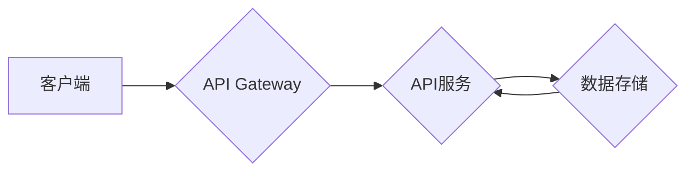

                 

## RESTful API设计：构建可扩展的Web服务

> 关键词：RESTful API, Web服务, API设计, 可扩展性, HTTP, JSON, XML

### 1. 背景介绍

随着互联网的蓬勃发展，Web服务扮演着越来越重要的角色。它们为应用程序之间提供了一种高效、灵活的通信方式，推动着软件架构的演进和业务的协同发展。在众多Web服务架构中，RESTful API凭借其简单易懂、灵活可扩展的特点，逐渐成为业界主流选择。

RESTful API（Representational State Transfer Application Programming Interface）是一种基于HTTP协议的架构风格，它利用HTTP方法（GET、POST、PUT、DELETE等）来操作资源，并通过标准化的数据格式（如JSON、XML）进行数据交换。其核心思想是将Web服务抽象为一系列资源，并通过统一的接口进行访问和操作。

### 2. 核心概念与联系

#### 2.1 RESTful API的核心概念

RESTful API的设计遵循以下核心概念：

* **资源（Resource）：**  RESTful API的核心概念是资源，它代表着Web服务中可操作的对象，例如用户、商品、订单等。资源通常用URL标识，例如 `/users/123` 代表一个用户资源。
* **状态（State）：** 资源的状态是指其当前的属性和值。RESTful API通过HTTP方法来修改资源的状态。
* **表示（Representation）：** 资源的表示是指对资源状态的描述，通常采用标准化的数据格式，如JSON或XML。
* **客户端-服务器（Client-Server）：** RESTful API采用客户端-服务器架构，客户端发起请求，服务器处理请求并返回响应。
* **缓存（Cache）：** 缓存机制可以提高API性能，允许客户端缓存响应数据，减少重复请求。
* **无状态（Stateless）：** 每个请求都是独立的，服务器不会记住之前的请求状态。客户端需要在每个请求中包含所有必要的上下文信息。
* **层次性（Layered System）：** RESTful API可以被分层，每个层负责特定的功能，例如身份验证、路由、数据访问等。
* **代码可重用性（Code on Demand）：** 服务器可以向客户端发送代码，例如JavaScript，以便客户端执行特定功能。

#### 2.2 RESTful API架构



**图 1：RESTful API架构**

* 客户端发起请求到API Gateway。
* API Gateway负责路由请求到相应的API服务。
* API服务处理请求，并从数据存储中获取或更新数据。
* API服务返回响应给API Gateway。
* API Gateway返回响应给客户端。

### 3. 核心算法原理 & 具体操作步骤

#### 3.1 算法原理概述

RESTful API的设计并不依赖于特定的算法，而是基于HTTP协议和资源的抽象概念。其核心原理是通过标准化的HTTP方法和数据格式来操作资源，实现应用程序之间的通信和数据交换。

#### 3.2 算法步骤详解

1. **定义资源：** 首先需要确定API要提供的资源，并为每个资源分配一个唯一的URL标识。
2. **设计HTTP方法：** 根据资源的操作需求，选择合适的HTTP方法，例如：
    * **GET：** 用于获取资源的表示。
    * **POST：** 用于创建新的资源。
    * **PUT：** 用于更新现有资源。
    * **DELETE：** 用于删除资源。
3. **选择数据格式：** 选择标准化的数据格式，例如JSON或XML，来表示资源的属性和值。
4. **编写API接口：** 根据定义的资源、HTTP方法和数据格式，编写API接口代码，实现资源的访问和操作逻辑。
5. **测试和部署：** 对API接口进行测试，确保其功能正确，然后部署到服务器上。

#### 3.3 算法优缺点

* **优点：**
    * 简单易懂：RESTful API的设计遵循简单易懂的原则，易于学习和使用。
    * 灵活可扩展：RESTful API可以轻松扩展，支持新的资源和操作。
    * 可重用性高：RESTful API可以被多个应用程序共享使用。
    * 平台无关：RESTful API基于HTTP协议，可以跨平台使用。
* **缺点：**
    * 状态管理：由于RESTful API是无状态的，客户端需要在每个请求中包含所有必要的上下文信息，这可能会增加开发复杂度。
    * 安全性：RESTful API需要考虑安全性问题，例如身份验证和授权。

#### 3.4 算法应用领域

RESTful API广泛应用于各种领域，例如：

* **Web应用程序：** 用于实现前后端分离，提供数据接口。
* **移动应用程序：** 用于连接移动应用程序和服务器端数据。
* **云计算：** 用于构建云服务和API网关。
* **物联网：** 用于连接物联网设备和数据平台。

### 4. 数学模型和公式 & 详细讲解 & 举例说明

#### 4.1 数学模型构建

RESTful API的设计并不依赖于复杂的数学模型，其核心原理基于资源的抽象和HTTP协议的规范。

#### 4.2 公式推导过程

RESTful API的设计没有特定的公式推导过程，其设计遵循的原则和规范是基于HTTP协议和资源的抽象概念。

#### 4.3 案例分析与讲解

假设我们要设计一个RESTful API来管理用户数据，我们可以使用以下URL结构：

* `/users`: 获取所有用户列表
* `/users/{id}`: 获取指定用户的信息
* `/users`: 创建新的用户
* `/users/{id}`: 更新指定用户的资料
* `/users/{id}`: 删除指定用户

每个URL路径都代表一个资源，而HTTP方法则用于操作该资源。例如，使用GET方法访问`/users`路径可以获取所有用户的列表，使用POST方法访问`/users`路径可以创建一个新的用户。

### 5. 项目实践：代码实例和详细解释说明

#### 5.1 开发环境搭建

为了演示RESTful API的开发，我们可以使用Python和Flask框架。

* 安装Python：https://www.python.org/downloads/
* 安装Flask：`pip install Flask`

#### 5.2 源代码详细实现

```python
from flask import Flask, request, jsonify

app = Flask(__name__)

users = [
    {'id': 1, 'name': 'John Doe', 'email': 'john.doe@example.com'},
    {'id': 2, 'name': 'Jane Doe', 'email': 'jane.doe@example.com'}
]

@app.route('/users', methods=['GET'])
def get_users():
    return jsonify(users)

@app.route('/users/<int:user_id>', methods=['GET'])
def get_user(user_id):
    user = next((user for user in users if user['id'] == user_id), None)
    if user:
        return jsonify(user)
    else:
        return jsonify({'error': 'User not found'}), 404

if __name__ == '__main__':
    app.run(debug=True)
```

#### 5.3 代码解读与分析

* 首先，我们创建了一个Flask应用程序。
* 然后，我们定义了一个`users`列表，用于存储用户数据。
* 接下来，我们定义了两个API接口：
    * `/users`: 用于获取所有用户的列表。
    * `/users/{user_id}`: 用于获取指定用户的详细信息。
* 每个接口都使用不同的HTTP方法（GET）来处理请求。
* 当客户端访问`/users`路径时，API会返回所有用户的列表，格式为JSON。
* 当客户端访问`/users/{user_id}`路径时，API会根据`user_id`参数查找对应的用户，并返回其详细信息。

#### 5.4 运行结果展示

运行上述代码后，我们可以使用浏览器或工具访问以下API接口：

* `http://127.0.0.1:5000/users`: 获取所有用户列表。
* `http://127.0.0.1:5000/users/1`: 获取用户ID为1的用户详细信息。

### 6. 实际应用场景

RESTful API广泛应用于各种实际场景，例如：

* **电商平台：** 用于提供商品信息、购物车管理、订单处理等API接口。
* **社交媒体：** 用于实现用户注册、登录、发布内容、评论点赞等功能。
* **金融服务：** 用于提供账户查询、转账、支付等API接口。
* **医疗保健：** 用于连接医疗设备、共享患者数据、预约挂号等。

### 6.4 未来应用展望

随着互联网的不断发展，RESTful API将继续发挥重要作用，并将在以下领域得到更广泛的应用：

* **微服务架构：** RESTful API是微服务架构的核心组成部分，用于实现微服务之间的通信和数据交换。
* **物联网：** RESTful API可以用于连接物联网设备，实现数据采集、控制和分析。
* **人工智能：** RESTful API可以用于提供人工智能模型的接口，方便其他应用程序调用。

### 7. 工具和资源推荐

#### 7.1 学习资源推荐

* **RESTful API设计：构建可扩展的Web服务** by Leonard Richardson and Sam Ruby
* **RESTful Web Services** by  David Baumeister
* **REST API Design Guide** by Google

#### 7.2 开发工具推荐

* **Postman:** 用于测试和调试RESTful API。
* **Swagger:** 用于文档化和测试RESTful API。
* **OpenAPI Generator:** 用于从API规范生成代码。

#### 7.3 相关论文推荐

* **RESTful Web Services** by Roy Fielding
* **Architectural Styles and the Design of Network-based Software Architectures** by Roy Fielding

### 8. 总结：未来发展趋势与挑战

#### 8.1 研究成果总结

RESTful API已经成为Web服务架构的标准，其简单易懂、灵活可扩展的特点使其在各种领域得到广泛应用。

#### 8.2 未来发展趋势

* **微服务架构：** RESTful API将继续是微服务架构的核心组成部分，并随着微服务技术的不断发展而演进。
* **API网关：** API网关将变得越来越重要，用于管理和保护API接口。
* **API安全：** API安全将成为越来越重要的关注点，需要采用更先进的技术来保护API接口免受攻击。

#### 8.3 面临的挑战

* **API文档管理：** 随着API数量的增加，API文档管理变得越来越复杂。
* **API测试和调试：** API测试和调试需要更自动化和高效的工具和方法。
* **API性能优化：** 随着API流量的增加，API性能优化变得越来越重要。

#### 8.4 研究展望

未来研究方向包括：

* **更智能的API网关：** 开发能够自动发现、管理和保护API接口的智能API网关。
* **更自动化和高效的API测试工具：** 开发能够自动生成测试用例、执行测试和分析结果的API测试工具。
* **更有效的API性能优化方法：** 研究和开发更有效的API性能优化方法，例如缓存、负载均衡和代码优化。


### 9. 附录：常见问题与解答

* **什么是RESTful API？**

RESTful API是一种基于HTTP协议的架构风格，它利用HTTP方法来操作资源，并通过标准化的数据格式（如JSON、XML）进行数据交换。

* **RESTful API有哪些优点？**

RESTful API简单易懂、灵活可扩展、可重用性高、平台无关等优点。

* **如何设计一个RESTful API？**

设计一个RESTful API需要遵循以下步骤：定义资源、设计HTTP方法、选择数据格式、编写API接口、测试和部署。

* **RESTful API有哪些应用场景？**

RESTful API广泛应用于电商平台、社交媒体、金融服务、医疗保健等领域。


作者：禅与计算机程序设计艺术 / Zen and the Art of Computer Programming 
<end_of_turn>

