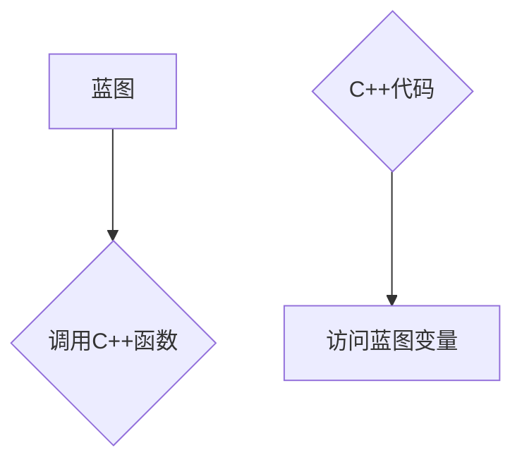

                 

## Unreal Engine 4：蓝图视觉化编程

> 关键词：Unreal Engine 4, 蓝图, 视觉化编程, 游戏开发,  C++,  图形引擎,  游戏制作

## 1. 背景介绍

Unreal Engine 4（UE4）作为Epic Games旗下的跨平台游戏引擎，以其强大的图形渲染能力、物理引擎和丰富的功能库而闻名。它为游戏开发者提供了从概念设计到最终发布的完整游戏开发解决方案。然而，传统的C++编程语言对许多初学者来说门槛较高，学习曲线陡峭。为了降低开发门槛，UE4引入了蓝图视觉化编程系统，让没有编程经验的用户也能轻松创建游戏逻辑。

蓝图是一种基于节点的图形编程语言，它通过连接不同类型的节点来实现程序逻辑。与传统的文本代码相比，蓝图更加直观易懂，开发者可以直观地理解程序流程，并通过拖放节点的方式快速构建游戏逻辑。

## 2. 核心概念与联系

### 2.1 蓝图基础概念

* **节点:** 蓝图的核心元素，每个节点代表一个功能或操作，例如数学运算、逻辑判断、变量赋值等。
* **连接线:** 连接节点，表示数据流向和执行顺序。
* **事件:** 触发蓝图执行的信号，例如按键按下、碰撞检测等。
* **变量:** 用于存储数据的容器，可以是数字、文本、布尔值等类型。

### 2.2 蓝图与C++的关系

蓝图和C++是UE4中两种不同的编程方式，它们之间可以相互转换和调用。

* **蓝图可以调用C++代码:** 开发者可以将C++代码封装成蓝图可调用的函数，从而在蓝图中使用C++的强大功能。
* **C++可以访问蓝图数据:** 开发者可以从C++代码中访问蓝图中的变量和函数，从而将蓝图与C++代码进行集成。

**Mermaid 流程图:**



## 3. 核心算法原理 & 具体操作步骤

### 3.1 算法原理概述

蓝图的编程原理基于事件驱动模型和数据流模型。

* **事件驱动模型:** 蓝图的执行流程由事件触发，例如玩家按下按键、物体碰撞等。当事件发生时，相应的蓝图节点会被执行。
* **数据流模型:** 蓝图节点之间通过连接线传递数据，数据流动的方向决定了程序的执行顺序。

### 3.2 算法步骤详解

1. **创建蓝图:** 在UE4编辑器中，选择“添加蓝图”功能，选择要创建的蓝图类型，例如游戏角色、游戏道具等。
2. **添加节点:** 从蓝图面板中拖放节点到蓝图编辑区域，每个节点代表一个功能或操作。
3. **连接节点:** 使用连接线将节点连接起来，形成数据流，并定义程序的执行顺序。
4. **设置事件:** 为蓝图设置事件触发器，例如按键按下、碰撞检测等。
5. **添加变量:** 在蓝图中定义变量，用于存储数据。
6. **调试和测试:** 使用UE4编辑器的调试工具，逐步执行蓝图，检查程序逻辑是否正确。

### 3.3 算法优缺点

**优点:**

* **易于学习:** 蓝图的图形化界面和拖放操作方式，让没有编程经验的用户也能轻松上手。
* **直观易懂:** 蓝图的节点和连接线，直观地展示了程序的逻辑流程，方便开发者理解和调试。
* **快速迭代:** 蓝图的节点和连接线可以快速拖放和修改，方便开发者快速迭代和测试游戏逻辑。

**缺点:**

* **功能有限:** 蓝图的节点库相对有限，无法实现所有C++代码的功能。
* **性能问题:** 蓝图的执行效率相对C++代码较低，对于复杂的逻辑操作，可能会导致性能下降。
* **可读性问题:** 蓝图的代码结构相对复杂，对于大型项目，可读性和维护性可能会成为问题。

### 3.4 算法应用领域

蓝图在游戏开发领域有着广泛的应用，例如：

* **游戏角色行为:** 控制角色的移动、攻击、对话等行为。
* **游戏道具功能:** 实现道具的特殊效果、使用方式等。
* **游戏关卡设计:** 设置关卡的场景、障碍、敌人等。
* **游戏UI交互:** 实现游戏界面的按钮、菜单、提示等交互功能。

## 4. 数学模型和公式 & 详细讲解 & 举例说明

### 4.1 数学模型构建

蓝图中可以使用数学运算节点来实现各种数学计算，例如加减乘除、三角函数、向量运算等。这些运算节点基于基本的数学模型和公式，例如：

* **加法:**  a + b
* **减法:** a - b
* **乘法:** a * b
* **除法:** a / b
* **三角函数:** sin(a), cos(a), tan(a)

### 4.2 公式推导过程

蓝图中的数学运算节点通常是基于预先定义的公式实现的，开发者无需手动推导公式。例如，加法运算节点的内部实现就是简单的将两个输入值相加。

### 4.3 案例分析与讲解

**举例说明:**

假设我们需要计算两个角色之间的距离，可以使用蓝图中的“向量长度”节点来实现。

1. 获取两个角色的位置向量。
2. 使用“向量减法”节点计算两个位置向量的差值。
3. 使用“向量长度”节点计算差值向量的长度，即两个角色之间的距离。

## 5. 项目实践：代码实例和详细解释说明

### 5.1 开发环境搭建

1. 下载并安装Unreal Engine 4。
2. 安装必要的开发工具，例如Visual Studio。
3. 创建新的UE4项目。

### 5.2 源代码详细实现

```
// 创建一个蓝图事件
Event BeginPlay()
{
    // 获取角色的组件
    CharacterMovementComponent = GetCharacterMovement();

    // 设置角色的移动速度
    CharacterMovementComponent.MaxWalkSpeed = 500;
}

// 创建一个蓝图函数
void MoveForward(float Value)
{
    // 获取角色的朝向向量
    FVector Direction = GetActorForwardVector();

    // 计算角色的移动距离
    FVector Movement = Direction * Value;

    // 移动角色
    AddMovementInput(Movement);
}
```

### 5.3 代码解读与分析

* **Event BeginPlay():** 当游戏角色开始播放时，该事件会被触发，用于初始化角色的属性和组件。
* **CharacterMovementComponent:** 角色的移动组件，用于控制角色的移动速度、跳跃高度等。
* **MaxWalkSpeed:** 角色的最大移动速度。
* **MoveForward(float Value):** 当玩家按下W键时，该函数会被触发，用于控制角色向前移动。
* **GetActorForwardVector():** 获取角色的朝向向量。
* **AddMovementInput(Movement):** 将角色移动到指定方向。

### 5.4 运行结果展示

当玩家按下W键时，角色会向前移动。

## 6. 实际应用场景

蓝图在游戏开发中有着广泛的应用场景，例如：

* **角色行为控制:** 控制角色的移动、攻击、对话、动画等行为。
* **道具功能实现:** 实现道具的特殊效果、使用方式、拾取逻辑等。
* **关卡设计:** 设置关卡的场景、障碍、敌人、触发器等。
* **游戏UI交互:** 实现游戏界面的按钮、菜单、提示、动画等交互功能。

### 6.4 未来应用展望

随着UE4引擎的不断发展，蓝图的功能将会更加强大，应用场景将会更加广泛。未来，蓝图可能在以下领域得到更广泛的应用：

* **虚拟现实和增强现实:** 蓝图可以用于创建交互式VR和AR体验。
* **人工智能:** 蓝图可以用于开发简单的AI系统，例如NPC行为控制、路径规划等。
* **跨平台开发:** 蓝图可以帮助开发者更轻松地将游戏移植到不同的平台。

## 7. 工具和资源推荐

### 7.1 学习资源推荐

* **Unreal Engine 官方文档:** https://docs.unrealengine.com/
* **Unreal Engine 蓝图教程:** https://www.youtube.com/playlist?list=PLZlv_N0_O1gY9k499977b1q1z_1n_8_1g
* **Unreal Engine 蓝图社区:** https://forums.unrealengine.com/

### 7.2 开发工具推荐

* **Visual Studio:** https://visualstudio.microsoft.com/
* **Unreal Engine 4:** https://www.unrealengine.com/

### 7.3 相关论文推荐

* **A Survey of Visual Programming Languages for Game Development:** https://dl.acm.org/doi/10.1145/3293843.3301987

## 8. 总结：未来发展趋势与挑战

### 8.1 研究成果总结

蓝图视觉化编程系统为游戏开发带来了革命性的改变，降低了开发门槛，提高了开发效率。它为没有编程经验的用户提供了便捷的开发工具，也为游戏开发者提供了更灵活的开发方式。

### 8.2 未来发展趋势

未来，蓝图将会朝着以下方向发展：

* **更强大的功能:** 蓝图的功能将会更加强大，能够支持更复杂的逻辑操作和数据处理。
* **更直观的界面:** 蓝图的界面将会更加直观易懂，方便开发者理解和调试程序逻辑。
* **更广泛的应用场景:** 蓝图将会应用于更多领域，例如虚拟现实、增强现实、人工智能等。

### 8.3 面临的挑战

蓝图也面临着一些挑战：

* **性能问题:** 蓝图的执行效率相对C++代码较低，对于大型项目，可能会导致性能下降。
* **可读性问题:** 蓝图的代码结构相对复杂，对于大型项目，可读性和维护性可能会成为问题。
* **功能限制:** 蓝图的节点库相对有限，无法实现所有C++代码的功能。

### 8.4 研究展望

未来，研究者将继续致力于解决蓝图面临的挑战，提高其性能、可读性和功能性。同时，也将探索蓝图在更多领域的新应用场景。


## 9. 附录：常见问题与解答

**常见问题:**

* **如何学习蓝图编程？**

**解答:**

* 阅读Unreal Engine官方文档和教程。
* 观看蓝图编程视频教程。
* 参加蓝图编程社区讨论。
* 练习编写简单的蓝图程序。

* **蓝图和C++哪个更好？**

**解答:**

* 蓝图更适合没有编程经验的用户，因为它更加直观易懂。
* C++更适合需要高性能和复杂逻辑的项目，因为它拥有更强大的功能和更灵活的控制。

* **蓝图可以实现所有C++代码的功能吗？**

**解答:**

* 不，蓝图的节点库相对有限，无法实现所有C++代码的功能。

**作者：禅与计算机程序设计艺术 / Zen and the Art of Computer Programming**<end_of_turn>

