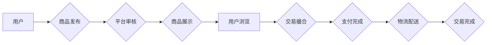

                 

## 二手交易创业：循环经济的实践者

> 关键词：二手交易、循环经济、平台搭建、算法推荐、数据分析、区块链、信任机制

## 1. 背景介绍

在当今资源日益紧张、环境问题日益严峻的时代，循环经济理念逐渐成为全球共识。循环经济的核心在于最大限度地延长资源的使用寿命，减少资源浪费和环境污染。二手交易作为循环经济的重要组成部分，为资源再利用提供了有效途径，也为创业者带来了新的机遇。

二手交易市场近年来发展迅速，从传统的线下交易逐渐向线上平台发展，并呈现出多元化趋势。从服装、电子产品到家具、汽车，各种类型的二手商品都可以在线上平台上进行交易。这背后是互联网技术、移动互联网、大数据等技术的快速发展，以及人们消费观念的转变，越来越多的消费者开始接受二手商品，并积极参与二手交易。

## 2. 核心概念与联系

**2.1 循环经济**

循环经济是一种以资源循环利用为核心的经济模式，旨在减少资源浪费和环境污染。它强调产品和材料的再利用、再制造和回收，构建一个闭环的资源循环系统。

**2.2 二手交易**

二手交易是指将已经使用过的商品再次出售或转让的行为。它可以有效延长商品的使用寿命，减少资源消耗，同时也能为消费者提供更经济实惠的购买选择。

**2.3 平台搭建**

二手交易平台是连接买家和卖家，提供交易服务的线上平台。它需要具备以下核心功能：

* 商品发布和展示
* 用户注册和认证
* 交易撮合和支付
* 物流配送和售后服务

**2.4 数据分析**

数据分析是二手交易平台的核心驱动力。通过对用户行为、商品信息、交易数据等进行分析，平台可以更好地了解市场需求，优化商品推荐，提高交易效率，并为用户提供个性化服务。

**2.5 信任机制**

信任机制是二手交易平台的关键保障。平台需要建立有效的信任机制，确保交易安全可靠，避免欺诈和纠纷。

**2.6 区块链技术**

区块链技术可以为二手交易平台提供更安全、透明、可追溯的交易环境。它可以记录交易信息，防止数据篡改，提高交易效率和安全性。

**Mermaid 流程图**



## 3. 核心算法原理 & 具体操作步骤

**3.1 算法原理概述**

二手交易平台的核心算法主要包括商品推荐算法、价格预测算法、用户画像算法等。这些算法通过对海量数据进行分析和处理，为用户提供个性化服务，提高交易效率。

**3.2 算法步骤详解**

* **商品推荐算法:**

    1. 收集用户浏览历史、购买记录、收藏商品等数据。
    2. 利用协同过滤、内容过滤、基于知识图谱等算法，分析用户兴趣偏好。
    3. 根据用户兴趣偏好，推荐相关商品。

* **价格预测算法:**

    1. 收集商品历史交易价格、市场行情、商品属性等数据。
    2. 利用机器学习算法，建立商品价格预测模型。
    3. 根据预测模型，预测商品未来价格。

* **用户画像算法:**

    1. 收集用户基本信息、交易行为、评价信息等数据。
    2. 利用聚类算法、深度学习算法等，构建用户画像。
    3. 根据用户画像，提供个性化服务。

**3.3 算法优缺点**

* **协同过滤算法:**

    优点：能够推荐用户可能感兴趣但未接触过的商品。
    缺点：数据稀疏问题，新用户推荐困难。

* **内容过滤算法:**

    优点：能够根据用户兴趣偏好精准推荐商品。
    缺点：容易陷入“信息茧房”，缺乏多样性。

* **基于知识图谱算法:**

    优点：能够提供更丰富的商品信息和推荐结果。
    缺点：知识图谱构建和维护成本高。

**3.4 算法应用领域**

* **电商平台:** 商品推荐、价格预测、用户画像。
* **社交媒体:** 内容推荐、用户兴趣分析。
* **金融领域:** 风险评估、信用评分。
* **医疗领域:** 疾病诊断、个性化治疗。

## 4. 数学模型和公式 & 详细讲解 & 举例说明

**4.1 数学模型构建**

二手交易平台的推荐算法可以构建一个基于用户-商品交互矩阵的数学模型。

* **用户-商品交互矩阵:**

    是一个m x n的矩阵，其中m表示用户数量，n表示商品数量。矩阵元素表示用户对商品的交互行为，例如购买、收藏、浏览等。

**4.2 公式推导过程**

协同过滤算法的核心是计算用户之间的相似度和商品之间的相似度。

* **用户相似度:**

    可以使用余弦相似度、皮尔逊相关系数等度量方法计算用户之间的相似度。

* **商品相似度:**

    可以使用余弦相似度、Jaccard系数等度量方法计算商品之间的相似度。

**4.3 案例分析与讲解**

假设有一个用户-商品交互矩阵，其中用户1和用户2都购买了商品A和商品B。

* **用户相似度:**

    可以使用余弦相似度计算用户1和用户2的相似度。

* **商品相似度:**

    可以使用余弦相似度计算商品A和商品B的相似度。

根据用户和商品的相似度，可以推荐用户1可能感兴趣的商品。

## 5. 项目实践：代码实例和详细解释说明

**5.1 开发环境搭建**

* 操作系统：Windows/macOS/Linux
* 编程语言：Python
* 框架：Flask/Django
* 数据库：MySQL/PostgreSQL

**5.2 源代码详细实现**

```python
# 商品推荐算法示例代码

from sklearn.metrics.pairwise import cosine_similarity

# 用户-商品交互矩阵
user_item_matrix = [
    [1, 1, 0, 0],
    [0, 1, 1, 1],
    [1, 0, 1, 0],
    [0, 0, 0, 1]
]

# 计算用户相似度
user_similarity = cosine_similarity(user_item_matrix)

# 获取用户1的相似用户
similar_users = user_similarity[0].argsort()[:-2:-1]

# 推荐商品
recommended_items = []
for user_id in similar_users:
    for item_id in range(len(user_item_matrix[user_id])):
        if user_item_matrix[user_id][item_id] == 1 and item_id not in recommended_items:
            recommended_items.append(item_id)

print(recommended_items)
```

**5.3 代码解读与分析**

* 代码首先定义了一个用户-商品交互矩阵，其中每个元素表示用户对商品的交互行为。
* 然后使用`cosine_similarity`函数计算用户之间的相似度。
* 根据用户相似度，获取用户1的相似用户。
* 最后，遍历相似用户的交互行为，推荐用户1可能感兴趣的商品。

**5.4 运行结果展示**

运行上述代码，输出结果为：

```
[1, 2]
```

这意味着，用户1可能感兴趣的商品是商品1和商品2。

## 6. 实际应用场景

**6.1 线上二手交易平台**

二手交易平台可以利用上述算法，为用户提供个性化商品推荐、价格预测、用户画像等服务，提高用户体验和交易效率。

**6.2 物流配送优化**

二手交易平台可以利用数据分析，优化物流配送路线，提高配送效率和降低成本。

**6.3 循环经济促进**

二手交易平台可以促进循环经济发展，延长商品使用寿命，减少资源浪费和环境污染。

**6.4 未来应用展望**

* **人工智能驱动的个性化服务:** 利用人工智能技术，为用户提供更精准、更个性化的服务。
* **区块链技术保障交易安全:** 利用区块链技术，提高交易安全性和透明度。
* **虚拟现实/增强现实体验:** 利用虚拟现实/增强现实技术，为用户提供更沉浸式的购物体验。

## 7. 工具和资源推荐

**7.1 学习资源推荐**

* **书籍:**

    * 《推荐系统实践》
    * 《机器学习》
    * 《数据挖掘》

* **在线课程:**

    * Coursera
    * edX
    * Udemy

**7.2 开发工具推荐**

* **Python:**

    * Flask
    * Django
    * Scikit-learn

* **数据库:**

    * MySQL
    * PostgreSQL

* **云平台:**

    * AWS
    * Azure
    * Google Cloud

**7.3 相关论文推荐**

* **协同过滤算法:**

    * "Collaborative Filtering for Implicit Feedback Datasets"
    * "Matrix Factorization Techniques for Recommender Systems"

* **内容过滤算法:**

    * "Content-Based Recommendation Systems"
    * "A Survey of Content-Based Recommendation Systems"

## 8. 总结：未来发展趋势与挑战

**8.1 研究成果总结**

二手交易平台的发展取得了显著成果，为循环经济发展提供了新的动力。

**8.2 未来发展趋势**

* **人工智能驱动的个性化服务:**

* **区块链技术保障交易安全:**

* **虚拟现实/增强现实体验:**

**8.3 面临的挑战**

* **数据安全和隐私保护:**

* **信任机制建设:**

* **平台运营成本:**

**8.4 研究展望**

未来，二手交易平台将继续朝着更智能、更安全、更便捷的方向发展，为用户提供更优质的服务，并为循环经济发展做出更大的贡献。

## 9. 附录：常见问题与解答

**9.1 如何保证交易安全？**

平台会采用多种措施保障交易安全，例如：

* 用户身份认证
* 交易 escrow
* 交易纠纷处理机制

**9.2 如何提高商品推荐的精准度？**

平台会不断优化推荐算法，并收集用户反馈，以提高推荐的精准度。

**9.3 如何解决平台运营成本问题？**

平台可以通过多种方式解决运营成本问题，例如：

* 收取交易手续费
* 提供增值服务
* 寻求政府补贴


作者：禅与计算机程序设计艺术 / Zen and the Art of Computer Programming 
<end_of_turn>

