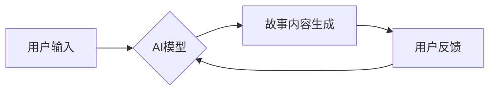

                 

## 体验叙事工作室：AI驱动的个人故事创作坊

> 关键词：人工智能、自然语言处理、故事创作、叙事生成、AI写作、体验设计、用户交互、创意工具

## 1. 背景介绍

在数字时代，故事的力量依然不可忽视。故事能够连接人与人，传递情感，激发共鸣，并塑造我们对世界的理解。然而，创作一个引人入胜的故事并非易事，它需要丰富的想象力、深刻的洞察力和精湛的叙事技巧。

近年来，人工智能技术取得了长足进步，特别是自然语言处理领域，为故事创作带来了新的可能性。AI驱动的叙事生成技术能够帮助人们更轻松地创作故事，并探索新的叙事形式。

本文将介绍“体验叙事工作室”，一个基于AI的个人故事创作平台。该平台利用先进的自然语言处理算法和用户交互设计，为用户提供一个沉浸式的创作体验，帮助他们将自己的想法和情感转化为生动的故事。

## 2. 核心概念与联系

体验叙事工作室的核心概念是将AI技术与用户体验相结合，创造一个协作式、交互式的创作环境。

**2.1 核心概念**

* **AI驱动的叙事生成:** 利用自然语言处理、机器学习等技术，帮助用户生成故事内容，包括人物、情节、场景等。
* **用户交互设计:** 通过直观易用的界面和交互方式，让用户能够轻松地参与到故事创作过程中，并与AI模型进行协作。
* **体验式创作:** 打造一个沉浸式的创作环境，让用户能够更好地融入故事世界，并激发他们的创作灵感。

**2.2 架构图**



**2.3 核心联系**

用户通过输入自己的想法、情感或故事梗概，触发AI模型的生成过程。AI模型根据用户输入和其训练的数据，生成故事内容，并将其呈现给用户。用户可以对生成的內容进行反馈，例如修改、补充或删除，AI模型会根据用户反馈进行调整，最终生成一个符合用户意愿的故事。

## 3. 核心算法原理 & 具体操作步骤

**3.1 算法原理概述**

体验叙事工作室的核心算法是基于深度学习的文本生成模型，例如GPT-3、T5等。这些模型通过训练大量的文本数据，学习了语言的结构和语法规则，并能够生成流畅、自然的文本内容。

**3.2 算法步骤详解**

1. **数据预处理:** 收集和清洗大量文本数据，例如小说、诗歌、剧本等，并将其转换为模型可识别的格式。
2. **模型训练:** 使用深度学习算法训练文本生成模型，让模型能够学习语言的规律和故事结构。
3. **用户输入:** 用户输入自己的故事想法、情感或梗概。
4. **文本编码:** 将用户输入的文本转换为模型可理解的数字表示。
5. **文本生成:** 模型根据用户输入和其训练数据，生成故事内容。
6. **文本解码:** 将生成的数字表示转换为可读的文本内容。
7. **用户反馈:** 用户可以对生成的文本进行修改、补充或删除。
8. **模型调整:** 模型根据用户反馈进行调整，生成更符合用户意愿的故事。

**3.3 算法优缺点**

* **优点:**

    * 可以生成流畅、自然的文本内容。
    * 可以根据用户输入生成个性化的故事。
    * 可以帮助用户克服创作瓶颈，激发创作灵感。

* **缺点:**

    * 模型生成的文本可能缺乏原创性和深度。
    * 模型需要大量的训练数据，训练成本较高。
    * 模型可能存在偏见或错误，需要进行仔细的审核和校对。

**3.4 算法应用领域**

* **个人故事创作:** 帮助个人创作小说、诗歌、剧本等。
* **教育领域:** 作为教学工具，帮助学生学习写作技巧和故事结构。
* **游戏开发:** 生成游戏剧情、人物对话等。
* **营销推广:** 创建个性化的营销故事，吸引用户。

## 4. 数学模型和公式 & 详细讲解 & 举例说明

**4.1 数学模型构建**

体验叙事工作室的核心算法基于Transformer模型，其数学模型可以概括为以下几个方面：

* **词嵌入:** 将每个单词映射到一个低维向量空间，捕捉单词之间的语义关系。
* **注意力机制:** 允许模型关注输入序列中重要的部分，并根据其重要性分配不同的权重。
* **多头注意力:** 使用多个注意力头，捕捉不同层次的语义信息。
* **前馈神经网络:** 对每个词的嵌入向量进行非线性变换，学习更复杂的特征表示。

**4.2 公式推导过程**

Transformer模型的数学公式推导过程较为复杂，涉及到线性变换、激活函数、softmax函数等多种数学操作。

**4.3 案例分析与讲解**

假设用户输入了一个故事梗概：“一个勇敢的女孩在森林里寻找丢失的宠物”。

Transformer模型会首先将这个梗概中的每个单词映射到一个词嵌入向量。然后，模型会使用注意力机制来关注梗概中重要的部分，例如“勇敢的女孩”和“丢失的宠物”。

通过多头注意力机制，模型可以捕捉到这些关键词之间的语义关系，例如“勇敢”和“女孩”之间的关系，以及“丢失”和“宠物”之间的关系。

最后，模型会使用前馈神经网络对每个词的嵌入向量进行非线性变换，学习更复杂的特征表示。

基于这些特征表示，模型可以生成一个符合用户意愿的故事，例如：

> 小丽是一个勇敢的女孩，她最喜欢的宠物是一只名叫咪咪的小猫。有一天，咪咪突然不见了，小丽非常着急。她决定深入森林寻找咪咪。

## 5. 项目实践：代码实例和详细解释说明

**5.1 开发环境搭建**

体验叙事工作室可以使用Python语言和相关的深度学习框架进行开发，例如TensorFlow、PyTorch等。

**5.2 源代码详细实现**

```python
# 导入必要的库
import tensorflow as tf

# 定义Transformer模型
class Transformer(tf.keras.Model):
    def __init__(self, vocab_size, embedding_dim, num_heads, num_layers):
        super(Transformer, self).__init__()
        # ... 模型结构定义 ...

    def call(self, inputs):
        # ... 模型前向传播过程 ...

# 加载预训练模型
model = Transformer(vocab_size=..., embedding_dim=..., num_heads=..., num_layers=...)

# 准备用户输入
user_input = "一个勇敢的女孩在森林里寻找丢失的宠物"

# 将用户输入转换为模型可理解的格式
input_ids = tokenizer.encode(user_input)

# 使用模型生成故事内容
generated_text = model.predict(input_ids)

# 将生成的文本解码为可读文本
output_text = tokenizer.decode(generated_text)

# 打印生成的文本
print(output_text)
```

**5.3 代码解读与分析**

这段代码展示了体验叙事工作室的基本结构。首先，定义了一个Transformer模型，并加载预训练模型。然后，将用户输入转换为模型可理解的格式，并使用模型生成故事内容。最后，将生成的文本解码为可读文本，并打印输出。

**5.4 运行结果展示**

运行这段代码后，会输出一个根据用户输入生成的文本故事。

## 6. 实际应用场景

体验叙事工作室可以应用于多种场景，例如：

* **个人创作:** 帮助个人创作小说、诗歌、剧本等。
* **教育教学:** 作为教学工具，帮助学生学习写作技巧和故事结构。
* **游戏开发:** 生成游戏剧情、人物对话等。
* **营销推广:** 创建个性化的营销故事，吸引用户。

**6.4 未来应用展望**

随着人工智能技术的不断发展，体验叙事工作室将拥有更强大的功能和更广泛的应用场景。例如：

* **多模态创作:** 支持文本、图像、音频等多种模态的创作。
* **个性化定制:** 根据用户的喜好和需求，生成更个性化的故事。
* **跨文化创作:** 支持多种语言的创作，促进跨文化交流。

## 7. 工具和资源推荐

**7.1 学习资源推荐**

* **书籍:**

    * 《深度学习》
    * 《自然语言处理》
    * 《Transformer模型详解》

* **在线课程:**

    * Coursera: 深度学习
    * edX: 自然语言处理
    * fast.ai: 深度学习

**7.2 开发工具推荐**

* **深度学习框架:** TensorFlow, PyTorch
* **自然语言处理库:** NLTK, spaCy
* **文本生成工具:** GPT-3 API, OpenAI API

**7.3 相关论文推荐**

* 《Attention Is All You Need》
* 《BERT: Pre-training of Deep Bidirectional Transformers for Language Understanding》
* 《GPT-3: Language Models are Few-Shot Learners》

## 8. 总结：未来发展趋势与挑战

**8.1 研究成果总结**

体验叙事工作室的开发和应用，标志着人工智能技术在创意领域取得了新的突破。AI驱动的文本生成模型能够帮助人们更轻松地创作故事，并探索新的叙事形式。

**8.2 未来发展趋势**

未来，体验叙事工作室将朝着以下方向发展：

* **更强大的生成能力:** 模型将能够生成更复杂、更生动的故事。
* **更个性化的创作体验:** 用户将能够更深入地参与到创作过程中，并定制自己的故事。
* **更广泛的应用场景:** 体验叙事工作室将应用于更多领域，例如教育、游戏、营销等。

**8.3 面临的挑战**

体验叙事工作室的发展也面临着一些挑战：

* **模型的原创性和深度:** 现有的AI模型生成的文本可能缺乏原创性和深度，需要进一步的研究和改进。
* **模型的偏见和错误:** 模型可能存在偏见或错误，需要进行仔细的审核和校对。
* **伦理问题:** AI驱动的创作可能会引发一些伦理问题，例如版权问题、虚假信息问题等，需要进行深入的探讨和解决。

**8.4 研究展望**

未来，我们将继续研究AI驱动的叙事生成技术，努力解决上述挑战，并推动体验叙事工作室的健康发展。

## 9. 附录：常见问题与解答

**9.1 如何使用体验叙事工作室？**

体验叙事工作室将提供一个用户友好的界面，用户可以通过输入自己的想法、情感或故事梗概，触发AI模型的生成过程。

**9.2 体验叙事工作室生成的文本是否原创？**

体验叙事工作室生成的文本基于AI模型的训练数据，有一定的原创性，但并非完全原创。

**9.3 体验叙事工作室是否可以生成不同类型的文本？**

体验叙事工作室可以生成多种类型的文本，例如小说、诗歌、剧本等。

**9.4 体验叙事工作室的安全性如何？**

体验叙事工作室将采用严格的安全措施，保护用户的隐私和数据安全。


作者：禅与计算机程序设计艺术 / Zen and the Art of Computer Programming 
<end_of_turn>

