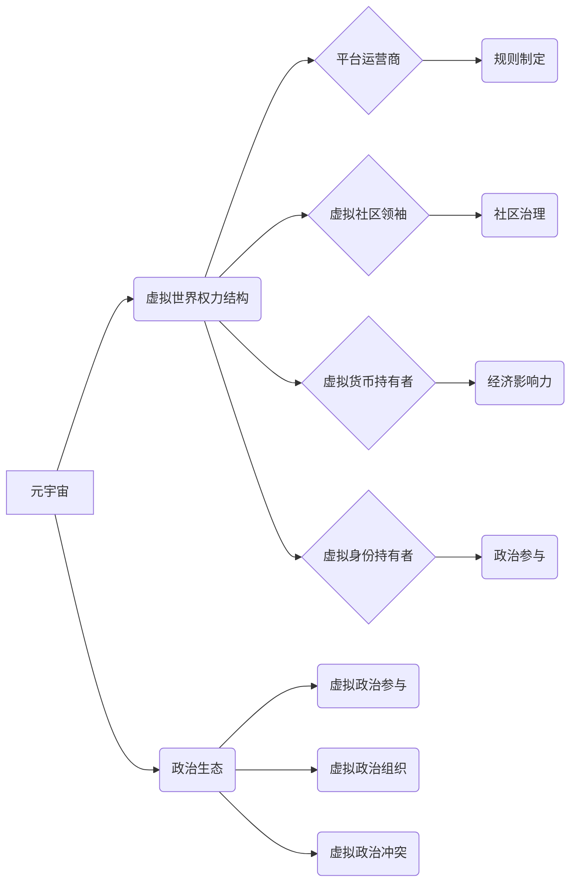

                 

## 元宇宙政治生态:虚拟世界的权力新格局

> 关键词：元宇宙、虚拟世界、权力结构、政治生态、数字治理、网络安全、数据隐私、虚拟身份、虚拟经济

## 1. 背景介绍

元宇宙概念近年来备受关注，它被描绘成一个沉浸式、持久、共享的虚拟世界，将现实世界与数字世界深度融合。在这个虚拟世界中，人们可以创建虚拟身份，参与虚拟经济活动，体验虚拟社交互动，甚至进行虚拟政治参与。元宇宙的出现，不仅带来了技术革新和商业机遇，也引发了关于虚拟世界权力结构、政治生态和社会治理的新思考。

传统政治生态主要围绕现实世界展开，权力结构相对稳定，政治参与方式相对单一。而元宇宙的虚拟特性，打破了现实世界的边界，为权力结构和政治参与模式带来了新的可能性。虚拟世界中的权力，不再仅仅局限于现实世界的国家、政党和组织，而是可能由新的主体掌握，例如虚拟平台运营商、虚拟社区领袖、甚至虚拟货币持有者。

## 2. 核心概念与联系

**2.1 元宇宙概念**

元宇宙是一个由虚拟现实 (VR)、增强现实 (AR)、区块链、人工智能等技术融合而成的虚拟世界。它具有以下核心特征：

* **沉浸式体验:** 通过VR/AR技术，用户可以身临其境地体验虚拟世界。
* **持久性:** 元宇宙是一个持续存在的虚拟世界，即使用户离开，虚拟世界也会继续运行。
* **共享性:** 多个用户可以同时进入元宇宙，并与彼此互动。
* **去中心化:** 元宇宙的治理和运营通常由多个主体共同参与，而不是由单一实体控制。

**2.2 虚拟世界权力结构**

虚拟世界中的权力结构，与现实世界存在相似之处，但也存在一些独特之处。

* **平台运营商:** 作为元宇宙的基础设施提供者，平台运营商拥有巨大的权力，可以控制虚拟世界的规则、资源分配和用户行为。
* **虚拟社区领袖:** 在虚拟社区中，一些具有影响力的用户可能会成为社区领袖，拥有较高的政治声望和决策权。
* **虚拟货币持有者:** 在元宇宙中，虚拟货币扮演着重要的角色，持有大量虚拟货币的用户可能拥有更大的经济和政治影响力。
* **虚拟身份持有者:** 虚拟身份是用户在元宇宙中的代表，拥有独特的属性和权利，虚拟身份的价值和地位也会影响用户的政治参与和影响力。

**2.3 政治生态**

元宇宙的政治生态，是指虚拟世界中政治活动、权力关系和社会治理模式的整体特征。

* **虚拟政治参与:** 元宇宙为用户提供了新的政治参与方式，例如虚拟投票、虚拟议会、虚拟游行等。
* **虚拟政治组织:** 在元宇宙中，用户可以创建虚拟政治组织，进行政治宣传、组织活动和争取利益。
* **虚拟政治冲突:** 虚拟世界中的政治冲突，可能与现实世界中的政治冲突相呼应，也可能出现新的冲突模式。

**2.4 核心概念关系图**



## 3. 核心算法原理 & 具体操作步骤

**3.1 算法原理概述**

元宇宙的构建和运行，依赖于多种核心算法，例如：

* **虚拟现实渲染算法:** 用于生成逼真的虚拟环境和物体。
* **人工智能算法:** 用于模拟虚拟角色的行为和决策，以及提供个性化服务。
* **区块链算法:** 用于保障虚拟资产的安全性和去中心化管理。
* **网络安全算法:** 用于保护虚拟世界免受攻击和数据泄露。

**3.2 算法步骤详解**

以虚拟角色行为模拟为例，其算法步骤可以概括为以下几个阶段：

1. **角色建模:** 根据用户输入或预设模板，构建虚拟角色的属性、行为模式和个性特征。
2. **环境感知:** 利用传感器数据或虚拟环境模型，让虚拟角色感知周围环境的变化和其他角色的行为。
3. **决策制定:** 基于角色属性、环境感知和预设规则，虚拟角色做出相应的决策，例如移动、对话、互动等。
4. **行为执行:** 根据决策结果，虚拟角色执行相应的动作，并反馈到虚拟环境中。
5. **学习和进化:** 通过与其他角色的互动和环境反馈，虚拟角色不断学习和进化，其行为模式变得更加复杂和智能。

**3.3 算法优缺点**

* **优点:** 能够模拟逼真的虚拟角色行为，增强用户体验，并为虚拟世界提供更丰富的互动内容。
* **缺点:** 算法复杂度高，需要大量数据和计算资源，且角色行为的预测性和可控性仍然存在挑战。

**3.4 算法应用领域**

* **游戏开发:** 创建更智能、更具互动性的游戏角色。
* **虚拟培训:** 模拟真实场景，进行虚拟培训和角色扮演。
* **虚拟客服:** 提供智能化的虚拟客服服务，解决用户问题。
* **虚拟社交:** 创建更逼真的虚拟社交体验，增强用户之间的互动和情感连接。

## 4. 数学模型和公式 & 详细讲解 & 举例说明

**4.1 数学模型构建**

虚拟世界中的权力结构和政治生态，可以抽象为一个复杂的网络系统，其中每个节点代表一个主体，边代表权力关系和影响力。

* **节点:** 平台运营商、虚拟社区领袖、虚拟货币持有者、虚拟身份持有者等。
* **边:** 权力赋予、资源控制、信息传播、政治支持等。

**4.2 公式推导过程**

可以利用图论和网络分析的数学模型，量化虚拟世界中的权力关系和影响力。例如，可以定义一个“权力指数”来衡量每个主体的权力大小，该指数可以基于节点的度数、中心度、介数等指标进行计算。

**4.3 案例分析与讲解**

假设一个虚拟世界中，平台运营商拥有大量的虚拟资源和用户数据，可以控制虚拟货币的流通和虚拟身份的创建。虚拟社区领袖拥有较高的政治声望和用户忠诚度，可以影响用户行为和决策。虚拟货币持有者拥有大量的虚拟财富，可以购买虚拟资源和影响虚拟市场。

根据上述分析，我们可以推导出以下权力关系：

* 平台运营商 -> 虚拟社区领袖 (资源控制、信息传播)
* 平台运营商 -> 虚拟货币持有者 (虚拟货币发行、虚拟资源分配)
* 虚拟社区领袖 -> 虚拟身份持有者 (政治支持、社区治理)
* 虚拟货币持有者 -> 虚拟身份持有者 (虚拟资源交易、经济影响力)

## 5. 项目实践：代码实例和详细解释说明

**5.1 开发环境搭建**

* 操作系统: Ubuntu 20.04
* 编程语言: Python 3.8
* 开发工具: PyCharm
* 虚拟环境: venv

**5.2 源代码详细实现**

```python
# 虚拟角色行为模拟代码示例

class VirtualCharacter:
    def __init__(self, name, attributes, behavior_patterns):
        self.name = name
        self.attributes = attributes
        self.behavior_patterns = behavior_patterns

    def perceive_environment(self, environment):
        # 模拟角色感知环境信息
        pass

    def make_decision(self, environment, attributes):
        # 根据环境信息和角色属性，做出决策
        pass

    def execute_action(self, action):
        # 执行决策结果
        pass

# 示例用法
character = VirtualCharacter("Alice", {"intelligence": 80, "aggressiveness": 50}, [
    {"condition": "enemy_nearby", "action": "attack"},
    {"condition": "friend_in_danger", "action": "help"}
])

# 模拟环境
environment = {"enemies": 2, "friends": 3}

# 角色感知环境
character.perceive_environment(environment)

# 角色决策
decision = character.make_decision(environment, character.attributes)

# 角色执行动作
character.execute_action(decision)
```

**5.3 代码解读与分析**

该代码示例展示了虚拟角色行为模拟的基本框架。

* `VirtualCharacter` 类定义了虚拟角色的基本属性和行为方法。
* `perceive_environment()` 方法模拟角色感知环境信息。
* `make_decision()` 方法根据环境信息和角色属性，做出决策。
* `execute_action()` 方法执行决策结果。

**5.4 运行结果展示**

根据环境信息和角色属性，虚拟角色将做出不同的决策和行为。例如，如果环境中存在敌人，角色可能会选择攻击敌人；如果朋友处于危险之中，角色可能会选择帮助朋友。

## 6. 实际应用场景

**6.1 游戏开发**

元宇宙中的游戏，将更加沉浸式、交互式和智能化。虚拟角色的行为更加逼真，玩家的体验更加丰富。

**6.2 虚拟培训**

元宇宙可以提供虚拟培训环境，模拟真实场景，进行角色扮演和互动学习。例如，医生可以进行虚拟手术培训，飞行员可以进行虚拟飞行模拟。

**6.3 虚拟社交**

元宇宙可以提供虚拟社交平台，用户可以创建虚拟身份，与其他用户进行互动，参加虚拟活动，建立虚拟社区。

**6.4 未来应用展望**

元宇宙的应用场景还在不断扩展，未来可能涵盖教育、医疗、金融、艺术等各个领域。

## 7. 工具和资源推荐

**7.1 学习资源推荐**

* **书籍:** 《元宇宙：虚拟世界的未来》
* **网站:** 
    * https://www.metaverse.com/
    * https://www.wired.com/topic/metaverse/

**7.2 开发工具推荐**

* **Unity:** 游戏引擎
* **Unreal Engine:** 游戏引擎
* **Blender:** 3D建模软件

**7.3 相关论文推荐**

* **The Metaverse: A New Paradigm for Human Interaction**
* **Decentralized Metaverse: A Vision for the Future of the Internet**

## 8. 总结：未来发展趋势与挑战

**8.1 研究成果总结**

元宇宙的概念和技术正在快速发展，为虚拟世界带来了新的可能性。虚拟角色行为模拟、虚拟世界权力结构分析、元宇宙政治生态研究等领域取得了重要进展。

**8.2 未来发展趋势**

* **技术融合:** 元宇宙将更加融合虚拟现实、增强现实、人工智能、区块链等技术，带来更加沉浸式、交互式和智能化的体验。
* **去中心化发展:** 元宇宙将更加注重去中心化治理，用户将拥有更大的自主权和参与度。
* **跨界融合:** 元宇宙将与现实世界更加紧密融合，影响教育、医疗、金融、艺术等各个领域。

**8.3 面临的挑战**

* **技术难题:** 元宇宙的构建和运行需要克服许多技术难题，例如渲染算法、人工智能算法、网络安全等。
* **伦理问题:** 元宇宙的虚拟世界可能会带来新的伦理问题，例如虚拟身份的隐私保护、虚拟财产的合法性、虚拟行为的责任追究等。
* **社会影响:** 元宇宙的普及可能会对社会结构、经济模式、文化价值观等方面产生深远影响，需要进行深入的社会研究和政策引导。

**8.4 研究展望**

未来，元宇宙研究将更加注重以下几个方面:

* **虚拟世界治理:** 研究如何构建更加公平、透明、可持续的虚拟世界治理机制。
* **虚拟身份与隐私保护:** 研究如何保障虚拟身份的隐私和安全，防止虚拟身份被盗用或滥用。
* **虚拟经济与社会影响:** 研究元宇宙对虚拟经济和社会发展的影响，并提出相应的政策建议。


## 9. 附录：常见问题与解答

**9.1 如何进入元宇宙？**

目前，可以通过VR/AR设备、PC/手机等设备进入部分元宇宙平台。

**9.2 元宇宙是否会取代现实世界？**

元宇宙不会取代现实世界，而是与现实世界相互补充和融合。

**9.3 元宇宙的安全性如何？**

元宇宙的安全性是一个重要的挑战，需要通过技术手段和社会规范来保障。

**9.4 元宇宙的未来发展前景如何？**

元宇宙的未来发展前景广阔，它将深刻地改变我们的生活方式和社会结构。


作者：禅与计算机程序设计艺术 / Zen and the Art of Computer Programming 
<end_of_turn>

