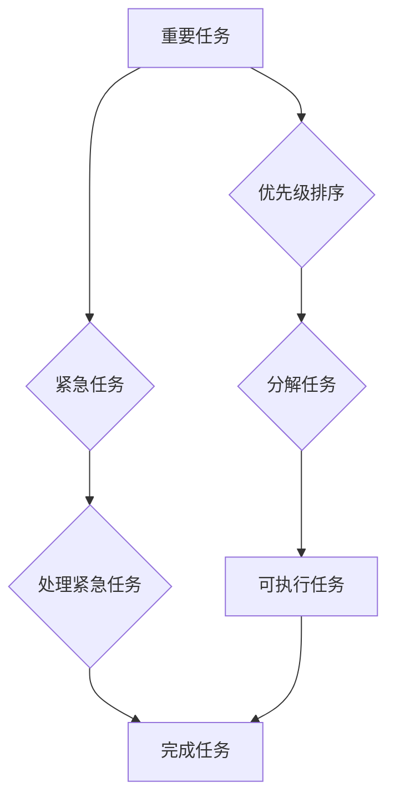

                 

## 双目标清单:聚焦要事的法宝

> 关键词：双目标清单，优先级排序，时间管理，效率提升，目标达成，任务分解，专注力

### 1. 背景介绍

在当今快节奏的科技时代，我们每天都面临着大量的任务和信息。如何有效地管理时间，提高效率，并最终达成目标，成为了许多程序员和技术人员共同面临的挑战。传统的任务管理方法往往难以应对复杂的任务和不断变化的需求，而双目标清单法则提供了一种全新的思路，帮助我们聚焦要事，提升工作效率。

双目标清单法，源于美国作家艾伦·拉德的畅销书《双目标清单》，是一种基于优先级排序和目标分解的管理方法。它强调将任务分解成更小的、可管理的单元，并根据其重要性和紧急程度进行优先级排序，从而帮助我们集中精力完成最重要的任务，并避免被琐碎的事情所困扰。

### 2. 核心概念与联系

双目标清单的核心概念是将任务分为两类：

* **重要任务 (Important Tasks):** 这些任务对实现长期目标至关重要，即使它们不紧急，也需要优先完成。
* **紧急任务 (Urgent Tasks):** 这些任务需要立即处理，否则会造成负面影响，但它们可能并不真正重要。

**双目标清单的架构**



双目标清单法强调，我们应该将大部分时间和精力投入到重要任务上，而不是被紧急任务所占据。通过优先级排序和任务分解，我们可以有效地管理时间，提高工作效率，并最终达成目标。

### 3. 核心算法原理 & 具体操作步骤

#### 3.1  算法原理概述

双目标清单法的核心算法原理是基于优先级排序和任务分解。

* **优先级排序:** 

根据任务的重要性和紧急程度，将任务进行排序。常用的方法是艾森豪威尔矩阵，将任务分为四象限：

* **重要且紧急:** 需要立即处理
* **重要但不紧急:** 需要计划和安排时间处理
* **紧急但不重要:** 可以委托他人处理
* **不紧急也不重要:** 可以忽略

* **任务分解:** 将大型、复杂的任务分解成更小的、可管理的单元。每个单元都应该具有明确的目标和截止日期。

#### 3.2  算法步骤详解

1. **列出所有任务:** 将所有需要完成的任务列出来，包括工作、学习、生活等各个方面。
2. **评估任务重要性和紧急程度:** 使用艾森豪威尔矩阵或其他方法，评估每个任务的重要性和紧急程度。
3. **优先级排序:** 根据重要性和紧急程度，将任务进行排序。将重要且紧急的任务放在首位，其次是重要但不紧急的任务，然后是紧急但不重要，最后是都不紧急也不重要的任务。
4. **任务分解:** 将大型、复杂的任务分解成更小的、可管理的单元。每个单元都应该具有明确的目标和截止日期。
5. **制定计划:** 根据优先级排序和任务分解的结果，制定详细的计划，并安排时间完成每个任务。
6. **执行计划:** 按照计划执行任务，并定期回顾和调整计划。

#### 3.3  算法优缺点

**优点:**

* 提高效率: 通过优先级排序和任务分解，可以集中精力完成最重要的任务，提高工作效率。
* 降低压力: 将任务分解成更小的单元，可以降低心理压力，更容易完成任务。
* 增强专注力: 通过专注于最重要的任务，可以增强专注力，提高工作质量。

**缺点:**

* 需要时间投入: 列出所有任务、评估重要性和紧急程度、分解任务都需要时间投入。
* 可能会忽略一些重要任务: 如果任务列表不完整，可能会忽略一些重要任务。
* 需要不断调整: 随着时间的推移，任务的优先级和紧急程度可能会发生变化，需要不断调整计划。

#### 3.4  算法应用领域

双目标清单法适用于各种领域，包括：

* **软件开发:** 帮助程序员优先完成关键功能，提高开发效率。
* **项目管理:** 帮助项目经理规划项目进度，分配任务，并跟踪项目进展。
* **个人生活:** 帮助个人管理时间，提高生活效率，并达成个人目标。

### 4. 数学模型和公式 & 详细讲解 & 举例说明

双目标清单法本身并不依赖于复杂的数学模型，但我们可以使用一些数学概念来分析其效率和效果。

#### 4.1  数学模型构建

我们可以将双目标清单法看作是一个时间管理模型，其中：

* **时间:** 作为模型的输入变量。
* **任务:** 作为模型的输出变量。
* **优先级:** 作为模型的权重变量。

#### 4.2  公式推导过程

由于双目标清单法是一个基于经验和实践的管理方法，并没有一个严格的数学公式来描述其效果。

#### 4.3  案例分析与讲解

假设一个程序员每天有 8 小时可以用于工作，他需要完成以下任务：

* **重要且紧急:** 修复一个关键的 bug，截止日期是明天。
* **重要但不紧急:** 完成一个新功能的原型设计，截止日期是下周。
* **紧急但不重要:** 回复一些邮件和同事的询问，截止日期是今天。
* **不紧急也不重要:** 刷社交媒体，没有截止日期。

使用双目标清单法，程序员可以将任务按照优先级排序，并分配时间：

* **重要且紧急:** 优先完成修复 bug 的任务，占用 4 小时。
* **重要但不紧急:** 完成原型设计，占用 2 小时。
* **紧急但不重要:** 回复邮件和询问，占用 1 小时。
* **不紧急也不重要:** 忽略刷社交媒体。

通过这种方式，程序员可以确保完成最重要的任务，并避免被琐碎的事情所困扰。

### 5. 项目实践：代码实例和详细解释说明

#### 5.1  开发环境搭建

为了演示双目标清单法的应用，我们可以使用 Python 开发一个简单的任务管理工具。

* 安装 Python 3.x 环境。
* 安装必要的库，例如 `datetime` 和 `json`。

#### 5.2  源代码详细实现

```python
import datetime
import json

class Task:
    def __init__(self, title, description, priority, due_date):
        self.title = title
        self.description = description
        self.priority = priority
        self.due_date = due_date

    def __str__(self):
        return f"Title: {self.title}\nDescription: {self.description}\nPriority: {self.priority}\nDue Date: {self.due_date}"

class TaskManager:
    def __init__(self):
        self.tasks = []

    def add_task(self, title, description, priority, due_date):
        task = Task(title, description, priority, due_date)
        self.tasks.append(task)

    def view_tasks(self):
        if not self.tasks:
            print("No tasks added yet.")
            return

        for i, task in enumerate(self.tasks):
            print(f"{i+1}. {task}")

    def sort_tasks(self):
        self.tasks.sort(key=lambda x: x.priority)

    def save_tasks(self, filename="tasks.json"):
        with open(filename, "w") as f:
            json.dump(self.tasks, f)

    def load_tasks(self, filename="tasks.json"):

        try:
            with open(filename, "r") as f:
                self.tasks = json.load(f)
        except FileNotFoundError:
            print("No tasks file found.")

# Example usage
manager = TaskManager()
manager.load_tasks()
manager.add_task("Fix bug", "Fix critical bug in login system", "High", datetime.date(2023, 12, 20))
manager.add_task("Design new feature", "Design prototype for new user interface", "Medium", datetime.date(2023, 12, 25))
manager.view_tasks()
manager.sort_tasks()
manager.view_tasks()
manager.save_tasks()
```

#### 5.3  代码解读与分析

* `Task` 类：定义了一个任务的结构，包括标题、描述、优先级和截止日期。
* `TaskManager` 类：管理任务列表，提供添加、查看、排序和保存任务的功能。
* 例子：演示了如何使用 `TaskManager` 类添加、查看和排序任务，并保存任务到 JSON 文件。

#### 5.4  运行结果展示

运行代码后，程序会创建一个任务列表，并根据优先级排序显示任务。

### 6. 实际应用场景

双目标清单法在软件开发、项目管理、个人生活等各个领域都有广泛的应用场景。

#### 6.1  软件开发

* **优先级排序:** 程序员可以使用双目标清单法优先完成关键功能，避免被琐碎的任务所困扰。
* **任务分解:** 将大型软件项目分解成更小的、可管理的单元，可以提高开发效率和质量。
* **迭代开发:** 双目标清单法可以与迭代开发方法相结合，帮助程序员更好地管理项目进度和完成目标。

#### 6.2  项目管理

* **项目规划:** 项目经理可以使用双目标清单法规划项目进度，分配任务，并跟踪项目进展。
* **风险管理:** 通过识别和优先处理重要风险，可以提高项目成功率。
* **团队协作:** 双目标清单法可以帮助团队成员更好地协作，并确保所有任务都得到完成。

#### 6.3  个人生活

* **时间管理:** 个人可以使用双目标清单法管理时间，提高生活效率，并达成个人目标。
* **学习计划:** 将学习目标分解成更小的任务，并按照优先级排序，可以提高学习效率和效果。
* **健康管理:** 设置健康目标，并将其分解成可执行的任务，可以帮助个人养成健康的生活习惯。

#### 6.4  未来应用展望

随着人工智能和自动化技术的不断发展，双目标清单法可能会与这些技术相结合，提供更智能和高效的管理解决方案。例如，人工智能可以帮助我们自动识别和排序任务，并根据我们的习惯和目标提供个性化的建议。

### 7. 工具和资源推荐

#### 7.1  学习资源推荐

* **书籍:**
    * 《双目标清单》 by 艾伦·拉德
    * 《Getting Things Done》 by 데이비드·艾伦

* **网站:**
    * https://www.gettingthingsdone.com/
    * https://www.theproductivityist.com/

#### 7.2  开发工具推荐

* **Todoist:** https://todoist.com/
* **Asana:** https://asana.com/
* **Trello:** https://trello.com/

#### 7.3  相关论文推荐

* **Eisenhower Matrix: A Framework for Prioritizing Tasks**
* **The Impact of Task Management Techniques on Productivity**

### 8. 总结：未来发展趋势与挑战

#### 8.1  研究成果总结

双目标清单法是一种简单易用、高效的管理方法，它可以帮助我们聚焦要事，提高工作效率，并最终达成目标。

#### 8.2  未来发展趋势

随着人工智能和自动化技术的不断发展，双目标清单法可能会与这些技术相结合，提供更智能和高效的管理解决方案。例如，人工智能可以帮助我们自动识别和排序任务，并根据我们的习惯和目标提供个性化的建议。

#### 8.3  面临的挑战

* **用户习惯:** 许多人习惯于使用传统的任务管理方法，需要时间和努力才能适应双目标清单法。
* **任务复杂度:** 对于非常复杂的任务，双目标清单法可能难以提供有效的解决方案。
* **技术实现:** 将双目标清单法与人工智能技术相结合，需要克服一些技术挑战。

#### 8.4  研究展望

未来研究可以集中在以下几个方面：

* **个性化定制:** 开发更智能的双目标清单工具，能够根据用户的习惯和目标提供个性化的建议。
* **跨平台协作:** 实现双目标清单工具的跨平台协作，方便团队成员共享和管理任务。
* **与其他管理方法的结合:** 研究双目标清单法与其他管理方法的结合，例如看板法、番茄工作法等，以提高管理效率。

### 9. 附录：常见问题与解答

**Q1: 如何使用双目标清单法？**

A1: 首先，列出所有需要完成的任务。然后，根据重要性和紧急程度，将任务进行排序。最后，将任务分解成更小的单元，并制定计划完成每个任务。

**Q2: 双目标清单法适用于哪些场景？**

A2: 双目标清单法适用于各种场景，包括软件开发、项目管理、个人生活等。

**Q3: 双目标清单法的优点是什么？**

A3: 双目标清单法的优点包括提高效率、降低压力、增强专注力等。

**Q4: 双目标清单法的缺点是什么？**

A4: 双目标清单法的缺点包括需要时间投入、可能会忽略一些重要任务、需要不断调整等。

**Q5: 有哪些工具可以帮助我使用双目标清单法？**

A5: 有许多工具可以帮助你使用双目标清单法，例如 Todoist、Asana 和 Trello 等。


作者：禅与计算机程序设计艺术 / Zen and the Art of Computer Programming<end_of_turn>

