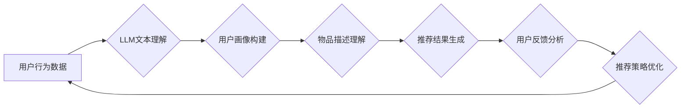

                 

## 基于LLM的推荐系统用户满意度预测

> 关键词：LLM,推荐系统,用户满意度,预测模型,自然语言处理,机器学习

## 1. 背景介绍

推荐系统作为互联网时代的重要技术之一，在电商、社交媒体、视频平台等领域发挥着越来越重要的作用。传统的推荐系统主要基于用户行为数据，如点击、购买、评分等，通过协同过滤、内容过滤等算法来预测用户对物品的兴趣。然而，这些方法往往难以捕捉用户细粒度的需求和情感，导致推荐结果不够精准，用户满意度难以提升。

近年来，大语言模型（LLM）的快速发展为推荐系统带来了新的机遇。LLM 拥有强大的文本理解和生成能力，能够从用户文本数据中挖掘更深层的意图和偏好，从而提供更个性化、更精准的推荐。基于LLM的推荐系统用户满意度预测模型，能够通过分析用户对推荐结果的反馈，例如评论、评分等，更准确地预测用户满意度，从而帮助推荐系统不断优化推荐策略，提升用户体验。

## 2. 核心概念与联系

### 2.1  推荐系统

推荐系统旨在根据用户的历史行为、偏好和上下文信息，预测用户对特定物品的兴趣，并推荐用户可能感兴趣的物品。

### 2.2  用户满意度

用户满意度是指用户对推荐结果的整体感受和评价，通常通过用户反馈，例如评分、评论、点击率等指标来衡量。

### 2.3  大语言模型（LLM）

LLM 是指能够理解和生成人类语言的深度学习模型，通过训练海量文本数据，掌握了丰富的语言知识和语法规则。

### 2.4  LLM在推荐系统中的应用

LLM 可以用于推荐系统中的多个环节，例如：

* **用户画像构建:**  LLM 可以分析用户文本数据，例如评论、社交媒体帖子等，构建更精准的用户画像，包括用户的兴趣爱好、价值观、生活方式等。
* **物品描述理解:** LLM 可以理解物品的描述信息，例如产品标题、商品详情页等，提取物品的关键特征和属性，帮助推荐系统更准确地匹配用户需求。
* **推荐结果生成:** LLM 可以根据用户的兴趣偏好和上下文信息，生成个性化的推荐结果，并用自然语言描述推荐理由，提升用户体验。
* **用户反馈分析:** LLM 可以分析用户对推荐结果的反馈，例如评论、评分等，识别用户满意度和潜在问题，帮助推荐系统不断优化推荐策略。

**核心概念与架构流程图**



## 3. 核心算法原理 & 具体操作步骤

### 3.1  算法原理概述

基于LLM的推荐系统用户满意度预测模型通常采用深度学习算法，例如卷积神经网络（CNN）、循环神经网络（RNN）或Transformer等，将用户行为数据和文本反馈数据作为输入，学习用户满意度的预测模型。

### 3.2  算法步骤详解

1. **数据预处理:** 收集用户行为数据和文本反馈数据，进行清洗、格式化和编码等预处理操作。
2. **特征提取:** 利用LLM提取用户行为数据和文本反馈数据中的关键特征，例如用户兴趣、物品属性、评论情感等。
3. **模型构建:** 选择合适的深度学习模型，例如CNN、RNN或Transformer，构建用户满意度预测模型。
4. **模型训练:** 使用训练数据训练模型，调整模型参数，使模型能够准确预测用户满意度。
5. **模型评估:** 使用测试数据评估模型性能，例如准确率、召回率、F1-score等指标。
6. **模型部署:** 将训练好的模型部署到生产环境，用于实时预测用户满意度。

### 3.3  算法优缺点

**优点:**

* 能够捕捉用户细粒度的需求和情感，提升推荐结果的精准度。
* 能够利用海量文本数据，学习更复杂的用户行为模式。
* 能够提供个性化的推荐结果和解释，提升用户体验。

**缺点:**

* 需要大量的训练数据和计算资源。
* 模型训练和部署需要专业技术人员。
* 模型解释性较差，难以理解模型的决策过程。

### 3.4  算法应用领域

基于LLM的推荐系统用户满意度预测模型可以应用于以下领域：

* **电商推荐:** 预测用户对商品的满意度，优化商品推荐策略。
* **内容推荐:** 预测用户对文章、视频、音乐等内容的满意度，个性化推荐内容。
* **社交媒体推荐:** 预测用户对好友、话题、群组等的满意度，优化社交关系推荐。
* **教育推荐:** 预测用户对课程、学习资源的满意度，个性化推荐学习内容。

## 4. 数学模型和公式 & 详细讲解 & 举例说明

### 4.1  数学模型构建

基于LLM的推荐系统用户满意度预测模型通常采用深度学习框架，例如TensorFlow或PyTorch，构建神经网络模型。模型结构可以根据具体应用场景进行设计，常见的模型结构包括CNN、RNN和Transformer等。

### 4.2  公式推导过程

深度学习模型的训练过程本质上是通过优化模型参数，使得模型预测结果与真实值之间的误差最小化。常用的优化算法包括梯度下降法、Adam优化器等。

**损失函数:**

损失函数用于衡量模型预测结果与真实值的差异。常用的损失函数包括均方误差（MSE）、交叉熵损失（Cross-Entropy Loss）等。

**梯度下降法:**

梯度下降法是一种迭代优化算法，通过不断更新模型参数，使得损失函数的值逐渐减小。

### 4.3  案例分析与讲解

假设我们构建了一个基于Transformer的推荐系统用户满意度预测模型，模型输入包括用户的历史行为数据和对推荐结果的文本反馈数据，输出为用户满意度的预测值。

我们可以使用交叉熵损失函数来衡量模型预测结果与真实值的差异，并使用Adam优化器来更新模型参数。

训练过程中，模型会不断学习用户行为模式和文本反馈特征，最终能够准确预测用户对推荐结果的满意度。

## 5. 项目实践：代码实例和详细解释说明

### 5.1  开发环境搭建

* Python 3.7+
* TensorFlow 或 PyTorch
* Jupyter Notebook 或 VS Code

### 5.2  源代码详细实现

```python
# 导入必要的库
import tensorflow as tf

# 定义模型结构
model = tf.keras.Sequential([
    tf.keras.layers.Embedding(input_dim=vocab_size, output_dim=embedding_dim),
    tf.keras.layers.LSTM(units=128),
    tf.keras.layers.Dense(units=1, activation='sigmoid')
])

# 编译模型
model.compile(optimizer='adam', loss='binary_crossentropy', metrics=['accuracy'])

# 训练模型
model.fit(x_train, y_train, epochs=10, batch_size=32)

# 评估模型
loss, accuracy = model.evaluate(x_test, y_test)
print('Loss:', loss)
print('Accuracy:', accuracy)
```

### 5.3  代码解读与分析

* **Embedding层:** 将用户行为数据和文本反馈数据转化为稠密的向量表示。
* **LSTM层:** 学习用户行为模式和文本反馈特征。
* **Dense层:** 输出用户满意度的预测值。
* **Adam优化器:** 用于更新模型参数。
* **Binary Cross-Entropy Loss:** 用于衡量模型预测结果与真实值的差异。

### 5.4  运行结果展示

训练完成后，我们可以使用测试数据评估模型性能，并根据模型预测结果优化推荐策略。

## 6. 实际应用场景

基于LLM的推荐系统用户满意度预测模型可以应用于以下实际场景：

* **电商平台:** 预测用户对商品的满意度，优化商品推荐策略，提高转化率。
* **视频平台:** 预测用户对视频的满意度，个性化推荐视频内容，提升用户粘性。
* **音乐平台:** 预测用户对音乐的满意度，推荐用户喜欢的音乐，提升用户体验。

### 6.4  未来应用展望

随着LLM技术的不断发展，基于LLM的推荐系统用户满意度预测模型将有更广泛的应用场景，例如：

* **个性化教育推荐:** 预测用户对课程的满意度，个性化推荐学习内容，提升学习效率。
* **医疗健康推荐:** 预测用户对医疗服务的满意度，个性化推荐医疗资源，提升医疗服务质量。
* **金融理财推荐:** 预测用户对理财产品的满意度，个性化推荐理财方案，提升用户收益。

## 7. 工具和资源推荐

### 7.1  学习资源推荐

* **书籍:**
    * 《深度学习》 by Ian Goodfellow, Yoshua Bengio, Aaron Courville
    * 《自然语言处理》 by Dan Jurafsky, James H. Martin
* **在线课程:**
    * Coursera: Deep Learning Specialization
    * Udacity: Natural Language Processing Nanodegree
* **博客和论坛:**
    * TensorFlow Blog
    * PyTorch Blog
    * Stack Overflow

### 7.2  开发工具推荐

* **深度学习框架:** TensorFlow, PyTorch
* **自然语言处理库:** NLTK, spaCy, Hugging Face Transformers
* **数据处理工具:** Pandas, NumPy

### 7.3  相关论文推荐

* **BERT: Pre-training of Deep Bidirectional Transformers for Language Understanding**
* **GPT-3: Language Models are Few-Shot Learners**
* **T5: Text-to-Text Transfer Transformer**

## 8. 总结：未来发展趋势与挑战

### 8.1  研究成果总结

基于LLM的推荐系统用户满意度预测模型取得了显著的成果，能够有效提升推荐结果的精准度和用户体验。

### 8.2  未来发展趋势

* **模型架构创新:** 探索更深层次、更复杂的模型架构，例如多模态LLM，提升模型的表达能力和预测精度。
* **数据增强:** 利用数据增强技术，例如文本生成、数据合成等，扩充训练数据，提升模型的泛化能力。
* **模型解释性:** 研究更有效的模型解释方法，提升用户对模型决策过程的理解和信任。

### 8.3  面临的挑战

* **数据隐私:** 如何保护用户隐私数据，同时利用数据进行模型训练，是一个重要的挑战。
* **模型可解释性:** 如何解释LLM的决策过程，提升模型的透明度和可信度，也是一个重要的研究方向。
* **计算资源:** 训练大型LLM模型需要大量的计算资源，如何降低训练成本，也是一个需要解决的问题。

### 8.4  研究展望

未来，基于LLM的推荐系统用户满意度预测模型将继续朝着更智能、更个性化、更可解释的方向发展，为用户提供更精准、更满意的推荐体验。

## 9. 附录：常见问题与解答

* **Q1: 如何选择合适的LLM模型？**

A1: 选择合适的LLM模型需要根据具体应用场景和数据特点进行选择。例如，对于文本分类任务，BERT模型效果较好；对于文本生成任务，GPT模型效果较好。

* **Q2: 如何处理用户数据隐私问题？**

A2: 可以采用数据脱敏、联邦学习等技术来保护用户数据隐私。

* **Q3: 如何评估模型性能？**

A3: 可以使用准确率、召回率、F1-score等指标来评估模型性能。

作者：禅与计算机程序设计艺术 / Zen and the Art of Computer Programming


<end_of_turn>

