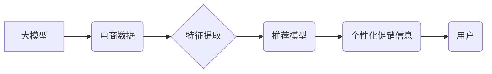

                 

## 大模型驱动的电商个性化促销信息精准投放

> 关键词：大模型、电商、个性化促销、精准投放、推荐系统、自然语言处理、深度学习

## 1. 背景介绍

在当今数据爆炸的时代，电商平台面临着巨大的挑战：如何精准地将促销信息投放到目标用户面前，提升转化率，同时避免信息过载和用户反感。传统的基于规则的推荐系统难以满足个性化需求，而基于协同过滤的推荐系统受数据稀疏性影响较大。近年来，大模型技术的发展为电商个性化促销信息精准投放提供了新的思路和可能性。

大模型，指的是参数规模庞大、训练数据海量的人工智能模型。它们拥有强大的泛化能力和表示学习能力，能够从海量数据中学习到用户行为、商品特征、促销信息等复杂关系，从而实现更精准的个性化推荐。

## 2. 核心概念与联系

### 2.1  大模型

大模型是指参数数量在数十亿甚至千亿级别的人工智能模型。它们通过学习海量文本、图像、音频等数据，能够掌握丰富的知识和模式，并应用于各种自然语言处理、计算机视觉、语音识别等任务。

### 2.2  电商个性化促销信息精准投放

电商个性化促销信息精准投放是指根据用户的兴趣、购买历史、行为偏好等信息，精准地推送个性化的促销信息，提高用户点击率、转化率和购物体验。

### 2.3  推荐系统

推荐系统是帮助用户发现感兴趣内容的核心技术。它通过分析用户的行为数据和商品特征，预测用户可能感兴趣的商品，并将其推荐给用户。

**核心概念与联系流程图:**



## 3. 核心算法原理 & 具体操作步骤

### 3.1  算法原理概述

大模型驱动的电商个性化促销信息精准投放主要基于以下核心算法：

* **Transformer模型:** Transformer模型是一种强大的序列到序列模型，能够捕捉文本序列中的长距离依赖关系，在自然语言处理任务中表现出色。
* **深度学习:** 深度学习算法能够从海量数据中学习到复杂的特征和模式，提高推荐系统的准确性。
* **强化学习:** 强化学习算法能够通过与环境交互学习最优策略，优化推荐系统的效果。

### 3.2  算法步骤详解

1. **数据收集与预处理:** 收集用户行为数据、商品信息、促销活动数据等，并进行清洗、格式化、编码等预处理操作。
2. **特征提取:** 利用自然语言处理技术提取用户和商品的特征，例如用户兴趣、购买历史、商品类别、价格、属性等。
3. **模型训练:** 使用Transformer模型等深度学习算法，训练推荐模型，学习用户和商品之间的关系。
4. **个性化推荐:** 根据用户的特征和模型预测结果，推荐个性化的促销信息。
5. **效果评估:** 通过点击率、转化率等指标评估推荐系统的效果，并进行模型调优。

### 3.3  算法优缺点

**优点:**

* **个性化程度高:** 可以根据用户的具体需求和偏好进行精准推荐。
* **准确性高:** 深度学习算法能够学习到复杂的特征和模式，提高推荐的准确性。
* **可扩展性强:** 可以扩展到更多场景和数据类型。

**缺点:**

* **数据依赖性强:** 需要海量数据进行训练，否则模型效果会下降。
* **计算资源消耗大:** 训练大模型需要大量的计算资源。
* **解释性差:** 深度学习模型的决策过程难以解释，难以理解模型是如何进行推荐的。

### 3.4  算法应用领域

大模型驱动的电商个性化促销信息精准投放技术广泛应用于以下领域:

* **商品推荐:** 推荐用户可能感兴趣的商品。
* **促销活动推荐:** 推送用户可能感兴趣的促销活动。
* **个性化广告投放:** 根据用户的兴趣和行为特征，精准投放广告。
* **用户画像构建:** 建立用户的兴趣、偏好、行为等画像。

## 4. 数学模型和公式 & 详细讲解 & 举例说明

### 4.1  数学模型构建

大模型驱动的电商个性化促销信息精准投放通常采用基于用户的协同过滤模型，其核心思想是根据用户的历史行为数据，预测用户对特定商品的兴趣。

假设用户集合为U，商品集合为I，用户对商品的评分矩阵为R，其中R(u,i)表示用户u对商品i的评分。

### 4.2  公式推导过程

协同过滤模型的目标是预测用户u对商品i的评分R(u,i)。常用的协同过滤算法包括基于用户的协同过滤和基于物品的协同过滤。

**基于用户的协同过滤:**

预测用户u对商品i的评分R(u,i) =  平均评分(u) +  相似度(u,v) * (R(v,i) - 平均评分(v))

其中，平均评分(u)表示用户u对所有已评分商品的平均评分，相似度(u,v)表示用户u和用户v之间的相似度。

**基于物品的协同过滤:**

预测用户u对商品i的评分R(u,i) = 平均评分(i) +  相似度(i,j) * (R(u,j) - 平均评分(j))

其中，平均评分(i)表示商品i的平均评分，相似度(i,j)表示商品i和商品j之间的相似度。

### 4.3  案例分析与讲解

假设用户A和用户B都购买了商品1和商品2，用户A对商品1评分为5，用户B对商品1评分为4，用户A对商品2评分为3，用户B对商品2评分为4。

根据基于用户的协同过滤算法，我们可以计算用户A和用户B之间的相似度，并预测用户A对商品3的评分。

## 5. 项目实践：代码实例和详细解释说明

### 5.1  开发环境搭建

* Python 3.7+
* TensorFlow/PyTorch
* Jupyter Notebook

### 5.2  源代码详细实现

```python
# 导入必要的库
import tensorflow as tf

# 定义模型结构
class RecommenderModel(tf.keras.Model):
    def __init__(self, embedding_dim, num_users, num_items):
        super(RecommenderModel, self).__init__()
        self.user_embedding = tf.keras.layers.Embedding(num_users, embedding_dim)
        self.item_embedding = tf.keras.layers.Embedding(num_items, embedding_dim)
        self.dense = tf.keras.layers.Dense(1)

    def call(self, user_ids, item_ids):
        user_embeddings = self.user_embedding(user_ids)
        item_embeddings = self.item_embedding(item_ids)
        combined_embeddings = user_embeddings + item_embeddings
        predictions = self.dense(combined_embeddings)
        return predictions

# 构建模型实例
model = RecommenderModel(embedding_dim=64, num_users=1000, num_items=10000)

# 编译模型
model.compile(optimizer='adam', loss='mse')

# 训练模型
model.fit(x=[user_ids, item_ids], y=ratings, epochs=10)

```

### 5.3  代码解读与分析

* 首先，我们定义了一个`RecommenderModel`类，该类继承自`tf.keras.Model`，用于构建推荐模型。
* 模型结构包括三个部分：用户嵌入层、商品嵌入层和全连接层。
* 用户嵌入层和商品嵌入层将用户ID和商品ID映射到低维向量空间，从而提取用户的特征和商品的特征。
* 全连接层将用户特征和商品特征进行融合，并输出预测评分。
* 然后，我们构建了模型实例，并使用`adam`优化器和均方误差损失函数对模型进行编译。
* 最后，我们使用训练数据对模型进行训练。

### 5.4  运行结果展示

训练完成后，我们可以使用模型对新的用户和商品进行预测，并评估模型的性能。

## 6. 实际应用场景

### 6.1  电商平台个性化推荐

电商平台可以利用大模型驱动的个性化促销信息精准投放技术，根据用户的兴趣、购买历史、行为偏好等信息，推荐个性化的促销活动和商品，提高用户购物体验和转化率。

### 6.2  社交媒体广告精准投放

社交媒体平台可以利用大模型分析用户的兴趣、行为和社交关系，精准地投放广告，提高广告的点击率和转化率。

### 6.3  内容平台个性化推荐

内容平台可以利用大模型分析用户的阅读习惯、观看历史和兴趣偏好，推荐个性化的内容，提高用户粘性和参与度。

### 6.4  未来应用展望

大模型驱动的电商个性化促销信息精准投放技术未来将更加智能化、个性化和精准化。

* **多模态融合:** 将文本、图像、音频等多模态数据融合，构建更全面的用户画像，实现更精准的推荐。
* **实时个性化:** 基于用户的实时行为数据，动态调整推荐策略，提供更个性化的体验。
* **解释性增强:** 研究更易于解释的推荐模型，帮助用户理解推荐结果背后的逻辑。

## 7. 工具和资源推荐

### 7.1  学习资源推荐

* **书籍:**
    * 《深度学习》
    * 《自然语言处理》
    * 《推荐系统》
* **在线课程:**
    * Coursera: 深度学习
    * Udacity: 自然语言处理
    * fast.ai: 推荐系统

### 7.2  开发工具推荐

* **TensorFlow:** 开源深度学习框架
* **PyTorch:** 开源深度学习框架
* **Scikit-learn:** 机器学习库

### 7.3  相关论文推荐

* **Attention Is All You Need:** https://arxiv.org/abs/1706.03762
* **BERT: Pre-training of Deep Bidirectional Transformers for Language Understanding:** https://arxiv.org/abs/1810.04805
* **Recurrent Neural Networks for Item Recommendation:** https://arxiv.org/abs/1506.05714

## 8. 总结：未来发展趋势与挑战

### 8.1  研究成果总结

大模型驱动的电商个性化促销信息精准投放技术取得了显著的成果，能够有效提高推荐的准确性和个性化程度。

### 8.2  未来发展趋势

未来，大模型驱动的电商个性化促销信息精准投放技术将朝着以下方向发展:

* **模型规模和能力的提升:** 训练更大规模、更强大的大模型，提升推荐的准确性和泛化能力。
* **多模态融合:** 将文本、图像、音频等多模态数据融合，构建更全面的用户画像，实现更精准的推荐。
* **实时个性化:** 基于用户的实时行为数据，动态调整推荐策略，提供更个性化的体验。
* **解释性增强:** 研究更易于解释的推荐模型，帮助用户理解推荐结果背后的逻辑。

### 8.3  面临的挑战

大模型驱动的电商个性化促销信息精准投放技术也面临着一些挑战:

* **数据隐私和安全:** 大模型训练需要海量数据，如何保护用户隐私和数据安全是一个重要问题。
* **模型解释性和可信度:** 深度学习模型的决策过程难以解释，如何提高模型的解释性和可信度是一个关键挑战。
* **计算资源消耗:** 训练大模型需要大量的计算资源，如何降低计算成本是一个需要解决的问题。

### 8.4  研究展望

未来，我们将继续致力于大模型驱动的电商个性化促销信息精准投放技术的研发，探索更智能、更个性化、更精准的推荐方案，为用户提供更好的购物体验。

## 9. 附录：常见问题与解答

**Q1: 大模型训练需要多少数据？**

A1: 大模型训练需要海量数据，通常需要数十亿甚至千亿级别的样本数据。

**Q2: 如何评估大模型的推荐效果？**

A2: 大模型的推荐效果通常通过点击率、转化率、用户满意度等指标进行评估。

**Q3: 如何解决大模型训练的计算资源问题？**

A3: 可以利用云计算平台、分布式训练等技术来解决大模型训练的计算资源问题。

作者：禅与计算机程序设计艺术 / Zen and the Art of Computer Programming 


<end_of_turn>

