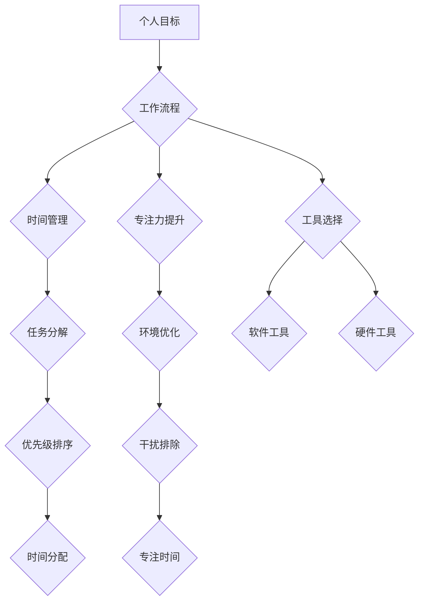

                 

## 打造个人管理风格的方法论

> 关键词：个人管理风格、效率提升、工作流程、时间管理、专注力、目标设定、工具选择、持续改进

## 1. 背景介绍

在当今快节奏的社会，高效地管理个人时间和精力至关重要。每个人都有自己的工作方式和生活习惯，但缺乏一个明确的个人管理风格往往会导致时间浪费、效率低下、目标难以达成。 

一个良好的个人管理风格可以帮助我们：

* **提高工作效率：** 通过合理安排时间和任务，减少拖延和浪费，提高工作成果。
* **减轻工作压力：**  明确目标和优先级，避免过度焦虑和压力。
* **提升生活质量：**  平衡工作和生活，拥有更多时间和精力享受生活。
* **实现个人目标：**  制定清晰的计划，并持之以恒地执行，最终实现个人目标。

## 2. 核心概念与联系

个人管理风格的核心概念是**“找到适合自己的工作方式”**。 

每个人都有独特的性格、思维模式和工作习惯，因此没有一种通用的管理风格适用于所有人。 

**核心架构：**



**核心概念原理：**

* **个人目标:**  明确个人目标是构建个人管理风格的基础。目标应该具体、可衡量、可实现、相关和有时间限制（SMART）。
* **工作流程:**  建立一个高效的工作流程，可以帮助我们更好地组织和管理时间和任务。
* **时间管理:**  合理安排时间，避免浪费时间，提高工作效率。
* **专注力提升:**  集中注意力，减少分心，提高工作质量。
* **工具选择:**  选择合适的工具可以帮助我们更高效地完成工作。

## 3. 核心算法原理 & 具体操作步骤

### 3.1  算法原理概述

个人管理风格的构建本质上是一个**迭代优化**的过程。 

它需要我们不断地**反思、调整和改进**自己的工作方式，最终找到最适合自己的管理方法。

**核心算法：**

1. **自我评估:**  了解自己的性格、工作习惯、时间管理能力等，找出自己的优势和劣势。
2. **目标设定:**  明确个人目标，并将其分解成具体的行动步骤。
3. **流程设计:**  设计一个高效的工作流程，包括任务分解、优先级排序、时间分配等环节。
4. **工具选择:**  选择合适的工具来辅助工作，例如时间管理软件、笔记软件、协作工具等。
5. **实践与反馈:**  将设计好的流程付诸实践，并根据实际情况进行调整和改进。
6. **持续优化:**  不断反思和改进自己的管理风格，使其更加高效和适应不断变化的工作环境。

### 3.2  算法步骤详解

1. **自我评估:**

   * **性格测试:**  通过性格测试了解自己的性格特点，例如内向外向、理性感性、计划性执行性等。
   * **工作习惯分析:**  记录自己的工作时间、工作方式、工作效率等，找出自己的工作习惯和模式。
   * **时间管理能力评估:**  评估自己的时间管理能力，例如是否容易拖延、是否能够有效地安排时间等。

2. **目标设定:**

   * **设定长期目标:**  明确自己的长期目标，例如职业发展、个人成长、财务目标等。
   * **分解长期目标:**  将长期目标分解成具体的短期目标，并设定相应的截止日期。
   * **制定行动计划:**  为每个短期目标制定详细的行动计划，包括具体的步骤、时间安排和资源需求。

3. **流程设计:**

   * **任务分解:**  将每个目标分解成更小的、可管理的任务。
   * **优先级排序:**  根据任务的重要性、紧急程度和时间限制等因素，对任务进行优先级排序。
   * **时间分配:**  根据任务的优先级和时间安排，分配相应的执行时间。

4. **工具选择:**

   * **时间管理软件:**  例如番茄工作法、时间块管理等，帮助我们更好地安排时间和提高专注力。
   * **笔记软件:**  例如Evernote、Notion等，帮助我们记录想法、整理笔记、管理项目。
   * **协作工具:**  例如Slack、Trello等，帮助我们与团队成员进行沟通协作。

5. **实践与反馈:**

   * **坚持执行:**  按照设计好的流程和计划，坚持执行任务。
   * **记录数据:**  记录自己的工作时间、完成任务情况、遇到的问题等数据。
   * **进行反思:**  定期反思自己的工作方式，分析数据，找出需要改进的地方。

6. **持续优化:**

   * **根据反馈调整流程:**  根据反思和数据分析，调整工作流程、时间分配、工具选择等。
   * **学习新方法:**  不断学习新的个人管理方法和工具，提升自己的管理水平。
   * **保持好奇心:**  对自己的工作方式保持好奇心，不断探索新的可能性。

### 3.3  算法优缺点

**优点:**

* **个性化:**  根据个人的实际情况定制管理风格，提高效率和满足度。
* **迭代优化:**  通过不断反思和调整，不断提升管理水平。
* **持续改进:**  保持学习和探索，适应不断变化的工作环境。

**缺点:**

* **需要时间和精力:**  构建和优化个人管理风格需要投入时间和精力。
* **缺乏标准化:**  没有统一的标准和方法，需要自己摸索和实践。
* **容易陷入自我满足:**  如果缺乏持续的反思和改进，容易陷入自我满足，无法不断提升。

### 3.4  算法应用领域

个人管理风格的算法可以应用于各个领域，例如：

* **职场:**  提高工作效率、管理项目、提升职业发展。
* **学习:**  规划学习计划、提高学习效率、达成学习目标。
* **生活:**  平衡工作和生活、管理时间、提升生活质量。

## 4. 数学模型和公式 & 详细讲解 & 举例说明

### 4.1  数学模型构建

个人管理风格的构建可以抽象为一个**动态系统模型**。

其中，**状态变量**代表个人管理风格的各个方面，例如时间管理能力、专注力、工作效率等。

**输入变量**代表个人目标、工作环境、外部干扰等因素。

**输出变量**代表个人工作成果、生活质量、目标达成率等。

系统模型的演化过程可以用**微分方程**来描述，其中每个状态变量的变化率取决于其自身状态、输入变量和系统参数。

### 4.2  公式推导过程

由于个人管理风格的构建是一个复杂的过程，涉及到多个因素和变量的相互作用，因此很难用一个简单的公式来描述其演化过程。

但是，我们可以通过一些**基本公式**来理解其核心原理。

例如，**时间管理效率**可以表示为：

```latex
效率 = 完成任务数量 / 总时间
```

**专注力**可以表示为：

```latex
专注力 = 实际工作时间 / 总时间
```

**工作效率**可以表示为：

```latex
效率 = 完成任务数量 / 完成任务所需时间
```

### 4.3  案例分析与讲解

假设一个人想要提高工作效率，可以通过以下步骤来构建自己的个人管理风格：

1. **设定目标:**  例如，每天完成5个重要任务。
2. **分析现状:**  例如，每天平均工作8小时，但实际工作时间只有6小时，因为经常被干扰。
3. **制定计划:**  例如，使用番茄工作法，每工作25分钟休息5分钟，并设定每天工作8小时的计划。
4. **选择工具:**  例如，使用番茄工作法计时器、屏蔽手机通知等工具。
5. **实践与反馈:**  根据实际情况调整计划和工具，例如，如果发现番茄工作法不适合自己，可以尝试其他时间管理方法。

通过不断地实践和调整，这个人可以逐渐提高自己的工作效率。

## 5. 项目实践：代码实例和详细解释说明

### 5.1  开发环境搭建

* **操作系统:**  Windows/macOS/Linux
* **编程语言:**  Python
* **IDE:**  VS Code/PyCharm
* **库:**  datetime, time, random

### 5.2  源代码详细实现

```python
import datetime
import time
import random

class PomodoroTimer:
    def __init__(self, work_time=25, break_time=5):
        self.work_time = work_time
        self.break_time = break_time
        self.current_state = "ready"

    def start(self):
        if self.current_state == "ready":
            self.current_state = "working"
            print(f"开始工作，倒计时{self.work_time}分钟")
            time.sleep(self.work_time * 60)
            self.current_state = "break"
            print("休息时间到，休息{self.break_time}分钟")
            time.sleep(self.break_time * 60)
            self.current_state = "ready"
        else:
            print("当前状态不是准备状态，无法开始计时")

# 使用示例
timer = PomodoroTimer()
timer.start()
```

### 5.3  代码解读与分析

* **PomodoroTimer类:**  模拟番茄工作法计时器。
* **__init__方法:**  初始化工作时间和休息时间。
* **start方法:**  启动计时器，根据当前状态执行工作或休息。
* **time.sleep()方法:**  暂停程序执行指定时间。

### 5.4  运行结果展示

程序运行后，会打印以下信息：

```
开始工作，倒计时25分钟
... (25分钟后)
休息时间到，休息5分钟
... (5分钟后)
```

## 6. 实际应用场景

### 6.1  个人工作场景

* **提高专注力:**  番茄工作法可以帮助我们集中注意力，减少分心，提高工作效率。
* **管理时间:**  通过设定工作和休息时间，可以更好地安排时间，避免过度工作。
* **提升工作质量:**  集中注意力工作可以提高工作质量，减少错误。

### 6.2  团队协作场景

* **项目管理:**  使用看板工具可以帮助团队成员更好地协作，跟踪项目进度，提高项目效率。
* **任务分配:**  使用任务管理工具可以帮助团队成员更好地分配任务，明确责任，提高工作效率。
* **沟通协作:**  使用即时通讯工具可以帮助团队成员快速沟通，协作完成任务。

### 6.3  学习场景

* **制定学习计划:**  使用时间管理工具可以帮助我们制定合理的学习计划，并跟踪学习进度。
* **提高学习效率:**  使用番茄工作法可以帮助我们集中注意力学习，提高学习效率。
* **管理知识:**  使用笔记软件可以帮助我们整理笔记，管理知识，方便复习和应用。

### 6.4  未来应用展望

随着人工智能技术的不断发展，个人管理风格的构建将更加智能化和个性化。

例如，我们可以利用人工智能算法分析我们的工作习惯、学习模式和生活方式，并根据分析结果推荐个性化的管理方法和工具。

## 7. 工具和资源推荐

### 7.1  学习资源推荐

* **书籍:**  《Getting Things Done》、《Eat That Frog!》、《Deep Work》
* **博客:**  Zen Habits, Lifehacker, Getting Things Done
* **课程:**  Coursera, Udemy, edX

### 7.2  开发工具推荐

* **时间管理软件:**  番茄工作法计时器、时间块管理软件
* **笔记软件:**  Evernote, Notion, OneNote
* **协作工具:**  Slack, Trello, Asana

### 7.3  相关论文推荐

* **番茄工作法:**  Cirillo, F. (2006). The Pomodoro Technique.
* **时间管理:**  Eisenhower, D. (1954). The Eisenhower Matrix.
* **专注力:**  Nir Eyal. (2014). Hooked: How to Build Habit-Forming Products.

## 8. 总结：未来发展趋势与挑战

### 8.1  研究成果总结

个人管理风格的构建是一个不断发展和完善的过程。

近年来，随着人工智能技术的进步，个人管理风格的构建更加智能化和个性化。

### 8.2  未来发展趋势

* **更智能化的管理工具:**  人工智能算法将被应用于更广泛的个人管理工具，例如自动生成工作计划、提醒重要任务、分析工作效率等。
* **更个性化的管理风格:**  基于个人数据分析，可以定制更适合个人特点的管理风格，提高管理效率和满足度。
* **更全面的管理体系:**  个人管理风格将不再局限于工作和学习，而是扩展到生活各个方面，例如健康管理、财务管理、人际关系管理等。

### 8.3  面临的挑战

* **数据隐私保护:**  个人管理风格的构建需要收集和分析大量个人数据，因此数据隐私保护是一个重要的挑战。
* **算法公平性:**  人工智能算法可能会存在偏见，导致个性化管理风格的推荐不公平。
* **用户接受度:**  一些用户可能对智能化管理工具感到不信任或抵触。

### 8.4  研究展望

未来，个人管理风格的构建将更加注重数据安全、算法公平性和用户体验。

研究者将继续探索新的算法和技术，以帮助人们更好地管理自己的时间、精力和生活。

## 9. 附录：常见问题与解答

**Q1: 如何选择适合自己的个人管理风格？**

**A1:**  没有一种通用的管理风格适用于所有人，需要根据自己的性格、工作习惯、目标和环境进行选择。可以尝试不同的方法，并根据实际效果进行调整。

**Q2: 如何克服拖延症？**

**A2:**  拖延症是一个常见的问题，可以通过番茄工作法、设定明确的目标、分解任务、奖励机制等方法来克服。

**Q3: 如何提高专注力？**

**A3:**  专注力可以通过冥想、运动、充足的睡眠、减少干扰等方法来提高。

**Q4: 如何平衡工作和生活？**

**A4:**  可以通过设定工作时间、安排休息时间、培养兴趣爱好、与家人朋友相处等方法来平衡工作和生活。


作者：禅与计算机程序设计艺术 / Zen and the Art of Computer Programming<end_of_turn>

