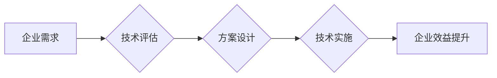

                 

## 技术顾问：高附加值服务的提供

> 关键词：技术咨询、软件架构、人工智能、机器学习、云计算、数据分析、数字化转型

### 1. 背景介绍

在当今科技日新月异的时代，企业面临着前所未有的数字化转型挑战。传统业务模式面临颠覆，新兴技术如人工智能、云计算、大数据等不断涌现，企业需要快速适应和拥抱这些变革，才能保持竞争力。在这种背景下，技术顾问的角色变得越来越重要。

技术顾问作为专业的技术专家，能够帮助企业理解新兴技术的应用场景，制定合适的技术策略，并提供技术实施方案和指导。他们不仅拥有深厚的技术背景，更重要的是具备优秀的沟通能力、问题解决能力和项目管理能力，能够有效地与企业客户沟通，理解他们的需求，并提供切实可行的解决方案。

### 2. 核心概念与联系

**2.1 技术咨询的核心概念**

技术咨询是指技术专家根据企业的需求，提供专业的技术建议、解决方案和实施指导的服务。它涵盖了多个方面，包括：

* **需求分析:** 深入了解企业的业务目标、技术现状和痛点，明确技术咨询的范围和目标。
* **技术评估:** 对企业现有的技术架构、系统和流程进行评估，识别潜在的风险和机遇。
* **方案设计:** 根据企业的需求和技术评估结果，设计符合企业实际情况的技术解决方案。
* **实施指导:** 为企业提供技术实施方案的指导，帮助企业顺利完成技术项目的实施。
* **技术培训:** 为企业员工提供相关技术培训，提升他们的技术能力和应用水平。

**2.2 技术顾问与企业数字化转型的联系**

技术顾问在企业数字化转型过程中扮演着至关重要的角色。他们能够帮助企业：

* **识别数字化转型机会:** 通过对企业业务和市场趋势的分析，帮助企业识别数字化转型带来的机遇。
* **制定数字化转型战略:** 帮助企业制定符合自身特点的数字化转型战略，明确转型目标和路径。
* **选择合适的技术解决方案:** 根据企业的业务需求和技术环境，推荐合适的云计算、大数据、人工智能等技术解决方案。
* **实施数字化转型项目:** 为企业提供技术实施方案和指导，帮助企业顺利完成数字化转型项目。
* **提升数字化转型能力:** 为企业员工提供技术培训，提升他们的数字化转型能力。

**2.3 技术顾问的价值链**

技术顾问为企业提供高附加值服务，其价值链主要体现在以下几个方面：

* **降低技术风险:** 通过专业的技术评估和方案设计，帮助企业降低技术实施的风险。
* **提升技术效率:** 通过优化技术架构和流程，帮助企业提升技术效率和运营成本。
* **创造商业价值:** 通过帮助企业应用新兴技术，创造新的商业模式和价值。
* **提升企业竞争力:** 通过数字化转型，帮助企业提升竞争力，在市场中保持领先地位。

**2.4 Mermaid 流程图**



### 3. 核心算法原理 & 具体操作步骤

**3.1 算法原理概述**

在技术咨询过程中，技术顾问需要运用多种算法和模型来分析数据、预测趋势、优化方案等。例如，在数据分析领域，技术顾问可能会使用机器学习算法来挖掘数据中的隐藏模式，帮助企业进行精准营销和客户关系管理。在软件架构设计领域，技术顾问可能会使用算法来优化系统性能和可靠性。

**3.2 算法步骤详解**

具体算法步骤取决于具体的应用场景。例如，在使用机器学习算法进行数据分析时，一般需要以下步骤：

1. **数据收集和预处理:** 收集相关数据，并进行清洗、转换和特征工程等预处理工作。
2. **模型选择:** 根据数据特点和分析目标，选择合适的机器学习算法模型。
3. **模型训练:** 使用训练数据对模型进行训练，调整模型参数，使其能够准确地预测或分类数据。
4. **模型评估:** 使用测试数据对模型进行评估，评估模型的准确率、召回率、F1-score等指标。
5. **模型部署:** 将训练好的模型部署到生产环境中，用于对实时数据进行预测或分类。

**3.3 算法优缺点**

不同的算法具有不同的优缺点，技术顾问需要根据具体的应用场景选择合适的算法。例如，决策树算法易于理解和解释，但其预测精度可能不如支持向量机算法。

**3.4 算法应用领域**

算法在技术咨询领域应用广泛，例如：

* **数据分析:** 使用机器学习算法进行数据挖掘、预测分析、客户画像等。
* **软件架构设计:** 使用算法优化系统性能、可靠性、可扩展性等。
* **网络安全:** 使用算法进行入侵检测、恶意软件识别、数据加密等。
* **人工智能:** 使用深度学习算法进行图像识别、语音识别、自然语言处理等。

### 4. 数学模型和公式 & 详细讲解 & 举例说明

**4.1 数学模型构建**

在技术咨询过程中，技术顾问经常需要构建数学模型来描述问题、分析数据、预测趋势等。例如，在评估软件系统的性能时，技术顾问可能会使用数学模型来计算系统的吞吐量、响应时间等指标。

**4.2 公式推导过程**

数学模型的构建需要根据具体问题进行公式推导。例如，计算软件系统的吞吐量时，可以使用以下公式：

```latex
吞吐量 = 工作量 / 时间
```

其中，工作量是指系统完成的单位任务数量，时间是指完成这些任务所花费的时间。

**4.3 案例分析与讲解**

假设一个软件系统需要处理1000个用户请求，每个请求处理时间平均为0.1秒，那么系统的吞吐量为：

```latex
吞吐量 = 1000 / (0.1 * 1000) = 10 TPS
```

其中，TPS代表每秒处理的交易数。

### 5. 项目实践：代码实例和详细解释说明

**5.1 开发环境搭建**

技术顾问需要根据项目的具体需求搭建合适的开发环境。例如，在进行机器学习项目时，需要安装Python、TensorFlow等相关软件。

**5.2 源代码详细实现**

具体代码实现取决于项目的具体需求。例如，在实现一个简单的机器学习模型时，可以使用以下Python代码：

```python
from sklearn.linear_model import LogisticRegression
from sklearn.model_selection import train_test_split
from sklearn.metrics import accuracy_score

# 加载数据
data = ...

# 将数据分为训练集和测试集
X_train, X_test, y_train, y_test = train_test_split(data[:, :-1], data[:, -1], test_size=0.2)

# 创建LogisticRegression模型
model = LogisticRegression()

# 训练模型
model.fit(X_train, y_train)

# 预测测试集结果
y_pred = model.predict(X_test)

# 计算模型准确率
accuracy = accuracy_score(y_test, y_pred)
print(f"模型准确率: {accuracy}")
```

**5.3 代码解读与分析**

这段代码实现了使用LogisticRegression模型进行分类任务的简单示例。首先，加载数据并将其分为训练集和测试集。然后，创建LogisticRegression模型并使用训练集进行训练。最后，使用测试集进行预测，并计算模型的准确率。

**5.4 运行结果展示**

运行结果会显示模型的准确率，例如：

```
模型准确率: 0.85
```

这表示模型在测试集上的准确率为85%。

### 6. 实际应用场景

技术顾问在各个行业都有广泛的应用场景，例如：

* **金融行业:** 帮助银行、保险公司等金融机构进行风险管理、欺诈检测、客户画像等。
* **医疗行业:** 帮助医院、药企等医疗机构进行疾病诊断、药物研发、患者管理等。
* **零售行业:** 帮助电商平台、零售企业进行精准营销、库存优化、供应链管理等。
* **制造业:** 帮助制造企业进行生产优化、质量控制、设备维护等。

**6.4 未来应用展望**

随着人工智能、云计算等技术的不断发展，技术顾问的应用场景将更加广泛，例如：

* **个性化服务:** 利用人工智能技术，为用户提供更加个性化的服务。
* **智能决策:** 利用数据分析和机器学习技术，帮助企业进行更加智能的决策。
* **自动化的技术支持:** 利用人工智能技术，实现技术支持的自动化，提高效率和降低成本。

### 7. 工具和资源推荐

**7.1 学习资源推荐**

* **在线课程:** Coursera、edX、Udemy等平台提供丰富的技术课程。
* **书籍:** 《深度学习》、《机器学习实战》、《软件架构》等书籍。
* **技术博客:** Hacker News、Medium、TechCrunch等网站。

**7.2 开发工具推荐**

* **编程语言:** Python、Java、C++等。
* **机器学习框架:** TensorFlow、PyTorch、Scikit-learn等。
* **云计算平台:** AWS、Azure、GCP等。

**7.3 相关论文推荐**

* **机器学习:** 《深度学习》
* **软件架构:** 《软件架构》

### 8. 总结：未来发展趋势与挑战

**8.1 研究成果总结**

技术咨询领域的研究成果不断涌现，例如：

* **人工智能技术:** 人工智能技术在技术咨询领域应用越来越广泛，例如在数据分析、客户服务、风险管理等方面。
* **云计算技术:** 云计算技术为技术咨询提供了更加灵活、高效的解决方案，例如在软件开发、数据存储、灾难恢复等方面。
* **大数据技术:** 大数据技术为技术咨询提供了更加丰富的分析数据，例如在市场调研、用户行为分析、产品优化等方面。

**8.2 未来发展趋势**

未来技术咨询领域的发展趋势主要体现在以下几个方面：

* **更加智能化:** 人工智能技术将更加深入地应用于技术咨询领域，例如自动化的技术支持、智能化的决策建议等。
* **更加个性化:** 技术咨询将更加注重用户的个性化需求，例如提供更加定制化的解决方案、更加精准的客户服务等。
* **更加协作化:** 技术咨询将更加注重跨部门、跨企业的协作，例如联合开发解决方案、共享技术资源等。

**8.3 面临的挑战**

技术咨询领域也面临着一些挑战，例如：

* **技术更新迭代速度快:** 需要不断学习和掌握新技术，才能保持竞争力。
* **人才短缺:** 优秀的技术顾问人才需求量大，供不应求。
* **客户需求多样化:** 需要根据不同的客户需求提供定制化的解决方案。

**8.4 研究展望**

未来技术咨询领域的研究方向主要包括：

* **人工智能技术在技术咨询领域的应用研究:** 如何更好地利用人工智能技术，提高技术咨询的效率和质量。
* **技术咨询服务模式的创新研究:** 如何开发更加灵活、高效、个性化的技术咨询服务模式。
* **技术顾问人才培养机制的研究:** 如何培养更多优秀的技术顾问人才，满足市场需求。

### 9. 附录：常见问题与解答

**9.1 如何选择合适的技术顾问？**

选择技术顾问时，需要考虑以下因素：

* **技术能力:** 技术顾问的技术能力是否符合企业的需求。
* **经验丰富度:** 技术顾问在相关领域的经验是否丰富。
* **沟通能力:** 技术顾问的沟通能力是否强，能否与企业客户有效沟通。
* **项目管理能力:** 技术顾问是否具备良好的项目管理能力，能够顺利完成项目实施。

**9.2 技术顾问的收费标准如何？**

技术顾问的收费标准因人而异，通常根据项目规模、复杂度、时间等因素进行收费。

**9.3 技术顾问的职责范围是什么？**

技术顾问的职责范围包括：

* **需求分析:** 深入了解企业的业务目标、技术现状和痛点。
* **技术评估:** 对企业的现有技术架构、系统和流程进行评估。
* **方案设计:** 根据企业的需求和技术评估结果，设计符合企业实际情况的技术解决方案。
* **技术实施:** 为企业提供技术实施方案的指导，帮助企业顺利完成技术项目的实施。
* **技术培训:** 为企业员工提供相关技术培训，提升他们的技术能力和应用水平。


作者：禅与计算机程序设计艺术 / Zen and the Art of Computer Programming 
<end_of_turn>

