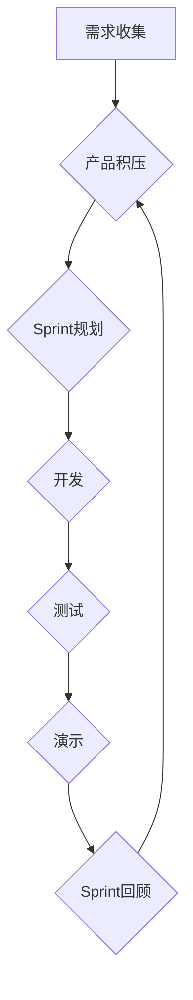

                 

## 敏捷开发方法：Scrum与看板方法

> 关键词：敏捷开发、Scrum、看板、迭代开发、产品管理、团队协作、软件开发

## 1. 背景介绍

在当今快速变化的科技环境中，传统的瀑布式软件开发模式已难以满足市场对快速迭代、灵活响应的需求。敏捷开发方法应运而生，以其强调迭代开发、团队协作和客户反馈的理念，成为软件开发领域的新主流。Scrum和看板是两种最受欢迎的敏捷开发方法，它们在项目管理、团队协作和软件开发流程中发挥着重要作用。

### 1.1 传统瀑布式开发模式的局限性

瀑布式开发模式将软件开发过程划分为多个离散的阶段，每个阶段完成后才进入下一个阶段。这种模式的特点是：

* **线性流程:**  开发过程严格按照预先定义的流程进行，难以进行调整。
* **需求固定:** 项目开始时需要明确所有需求，后期难以进行修改。
* **反馈延迟:**  直到项目完成才能获得用户反馈，难以及时响应需求变化。
* **风险积累:**  问题和缺陷往往在后期才被发现，导致修复成本增加。

### 1.2 敏捷开发方法的优势

敏捷开发方法强调迭代开发、团队协作和客户反馈，旨在提高开发效率、降低风险和满足客户需求。其主要优势包括：

* **快速迭代:**  将项目拆分成多个小迭代周期，每个周期都交付可工作的软件，能够快速响应需求变化。
* **需求灵活:**  允许在开发过程中根据用户反馈不断调整需求，提高软件的适应性。
* **持续反馈:**  定期收集用户反馈，及时调整开发方向，确保软件符合用户期望。
* **风险控制:**  将风险分散到每个迭代周期，能够及时发现和解决问题，降低项目风险。

## 2. 核心概念与联系

Scrum和看板都是敏捷开发方法，它们的核心概念和联系如下：

**Scrum:**

* **迭代开发:**  将项目拆分成多个迭代周期，每个周期持续1-4周，称为“Sprint”。
* **产品积压:**  所有待开发的功能需求都列入“产品积压”，由产品负责人进行优先级排序。
* **每日站会:**  每天早上进行简短的会议，团队成员汇报工作进度、遇到的问题和计划。
* **Sprint回顾:**  每个迭代周期结束后进行回顾，总结经验教训，改进开发流程。

**看板:**

* **可视化工作流程:**  将工作流程可视化，使用看板来展示任务状态和进度。
* **任务卡片:**  每个任务都以卡片的形式表示，卡片上包含任务描述、优先级、负责人等信息。
* **工作列:**  将任务按照状态划分成不同的工作列，例如“待做”、“进行中”、“完成”。
* **限流:**  限制每个工作列的任务数量，避免任务积压。

**Scrum和看板的联系:**

* **共同目标:**  Scrum和看板都旨在提高开发效率、降低风险和满足客户需求。
* **协作精神:**  Scrum和看板都强调团队协作，鼓励成员之间沟通和分享信息。
* **迭代开发:**  Scrum和看板都采用迭代开发模式，将项目拆分成多个小周期，不断交付可工作的软件。

**Mermaid 流程图:**

## 3. 核心算法原理 & 具体操作步骤

Scrum和看板方法本身并不依赖于特定的算法，而是基于敏捷开发理念和实践。它们的核心在于流程管理、团队协作和持续改进。

### 3.1 算法原理概述

Scrum和看板方法的核心原理可以概括为以下几点：

* **迭代开发:** 将项目拆分成多个小迭代周期，每个周期都交付可工作的软件，能够快速响应需求变化。
* **产品积压:**  所有待开发的功能需求都列入“产品积压”，由产品负责人进行优先级排序。
* **每日站会:**  每天早上进行简短的会议，团队成员汇报工作进度、遇到的问题和计划。
* **Sprint回顾:**  每个迭代周期结束后进行回顾，总结经验教训，改进开发流程。
* **看板:**  将工作流程可视化，使用看板来展示任务状态和进度。
* **任务卡片:**  每个任务都以卡片的形式表示，卡片上包含任务描述、优先级、负责人等信息。
* **工作列:**  将任务按照状态划分成不同的工作列，例如“待做”、“进行中”、“完成”。
* **限流:**  限制每个工作列的任务数量，避免任务积压。

### 3.2 算法步骤详解

Scrum和看板方法的具体操作步骤如下：

**Scrum:**

1. **需求收集:**  收集用户需求，并将其整理成详细的描述。
2. **产品积压:**  将所有需求放入产品积压中，并根据优先级进行排序。
3. **Sprint规划:**  团队成员根据产品积压中的需求，选择一部分进行开发，并制定详细的开发计划。
4. **开发:**  团队成员按照计划进行开发，并定期进行代码审查和测试。
5. **测试:**  测试团队对开发完成的功能进行测试，确保其符合需求和质量标准。
6. **演示:**  团队成员向产品负责人和用户演示开发完成的功能。
7. **Sprint回顾:**  团队成员回顾Sprint的成果和经验教训，并改进开发流程。

**看板:**

1. **定义工作流程:**  将工作流程分解成多个阶段，并定义每个阶段的任务类型。
2. **创建看板:**  使用看板工具创建看板，并根据工作流程定义工作列。
3. **添加任务卡片:**  将每个任务以卡片的形式添加到看板中，并填写任务描述、优先级、负责人等信息。
4. **移动任务卡片:**  根据任务进度，将任务卡片从一个工作列移动到另一个工作列。
5. **限流:**  限制每个工作列的任务数量，避免任务积压。
6. **持续改进:**  定期回顾看板的使用情况，并根据实际情况进行调整和优化。

### 3.3 算法优缺点

**Scrum:**

* **优点:**  
    * 迭代开发，能够快速响应需求变化。
    * 强调团队协作，能够提高开发效率。
    * 持续改进，能够不断优化开发流程。
* **缺点:**  
    * 需要团队成员具备良好的沟通和协作能力。
    * 需要产品负责人具备清晰的战略规划和需求优先级排序能力。
    * 对于项目规模较小或需求变化较少的项目，Scrum的优势可能不明显。

**看板:**

* **优点:**  
    * 可视化工作流程，能够清晰地展示任务状态和进度。
    * 灵活易用，能够根据项目实际情况进行调整。
    * 能够帮助团队更好地管理任务和时间。
* **缺点:**  
    * 对于大型复杂项目，看板可能难以管理。
    * 需要团队成员具备良好的自我管理能力。
    * 缺乏对项目整体规划和风险控制的指导。

### 3.4 算法应用领域

Scrum和看板方法广泛应用于软件开发、产品管理、项目管理等领域。

* **软件开发:**  Scrum和看板方法可以帮助软件开发团队提高开发效率、降低风险和满足客户需求。
* **产品管理:**  Scrum和看板方法可以帮助产品经理更好地管理产品需求、优先级和迭代开发。
* **项目管理:**  Scrum和看板方法可以帮助项目经理更好地管理项目进度、风险和团队协作。

## 4. 数学模型和公式 & 详细讲解 & 举例说明

Scrum和看板方法本身并不依赖于特定的数学模型和公式，但一些相关的统计学和概率论知识可以帮助我们更好地理解和应用它们。

### 4.1 数学模型构建

* **Burndown Chart:**  Burndown Chart是一种用于可视化剩余工作量变化的图表，它可以帮助团队成员了解项目进度和剩余工作量。
* **Velocity:**  Velocity是指团队在每个迭代周期内能够完成的工作量，它可以帮助团队成员更好地估算项目时间和资源需求。

### 4.2 公式推导过程

* **Burndown Chart公式:**  剩余工作量 = 初始工作量 - 完成工作量

* **Velocity公式:**  Velocity = 完成工作量 / 迭代周期

### 4.3 案例分析与讲解

假设一个团队在每个迭代周期内能够完成10个用户故事，那么他们的Velocity为10。如果项目初始工作量为50个用户故事，那么根据Burndown Chart公式，我们可以计算出每个迭代周期剩余的工作量。

## 5. 项目实践：代码实例和详细解释说明

Scrum和看板方法的实践需要结合具体的项目需求和团队情况进行调整。以下是一个简单的代码实例，展示了如何使用看板工具来管理项目任务。

### 5.1 开发环境搭建

可以使用Trello、Jira、Asana等在线看板工具来管理项目任务。

### 5.2 源代码详细实现

由于看板工具本身不涉及代码实现，这里只展示如何使用Trello来管理项目任务。

1. 创建一个新的Trello项目，并定义不同的工作列，例如“待做”、“进行中”、“完成”。
2. 将每个任务以卡片的形式添加到看板中，并填写任务描述、优先级、负责人等信息。
3. 根据任务进度，将任务卡片从一个工作列移动到另一个工作列。
4. 使用Trello的评论功能进行任务讨论和协作。

### 5.3 代码解读与分析

Trello的代码实现主要集中在用户界面和数据存储方面。用户可以通过Trello的API进行数据交互，例如创建、更新和删除任务卡片。

### 5.4 运行结果展示

使用Trello可以清晰地展示项目任务状态和进度，帮助团队成员更好地管理任务和协作。

## 6. 实际应用场景

Scrum和看板方法在软件开发、产品管理、项目管理等领域都有广泛的应用场景。

### 6.1 软件开发

Scrum和看板方法可以帮助软件开发团队提高开发效率、降低风险和满足客户需求。例如，可以使用Scrum来管理软件开发项目，并使用看板来可视化任务进度和协作。

### 6.2 产品管理

Scrum和看板方法可以帮助产品经理更好地管理产品需求、优先级和迭代开发。例如，可以使用Scrum来管理产品迭代开发，并使用看板来可视化产品功能进度和用户反馈。

### 6.3 项目管理

Scrum和看板方法可以帮助项目经理更好地管理项目进度、风险和团队协作。例如，可以使用Scrum来管理项目整体进度，并使用看板来可视化任务分配和进度跟踪。

### 6.4 未来应用展望

随着敏捷开发理念的普及，Scrum和看板方法的应用场景将会更加广泛。未来，Scrum和看板方法可能会被应用于更多领域，例如教育、医疗、金融等。

## 7. 工具和资源推荐

### 7.1 学习资源推荐

* **Scrum Guide:**  https://www.scrumguides.org/scrum-guide.html
* **Kanban Guide:**  https://kanbanize.com/kanban/kanban-guide
* **Agile Alliance:**  https://www.agilealliance.org/

### 7.2 开发工具推荐

* **Trello:**  https://trello.com/
* **Jira:**  https://www.atlassian.com/software/jira
* **Asana:**  https://asana.com/

### 7.3 相关论文推荐

* **The Scrum Guide:**  https://www.scrumguides.org/scrum-guide.html
* **Kanban: Successful Evolutionary Change for Your Technology Business:**  https://www.amazon.com/Kanban-Successful-Evolutionary-Change-Technology/dp/1491904187

## 8. 总结：未来发展趋势与挑战

### 8.1 研究成果总结

Scrum和看板方法已经成为敏捷开发领域的重要组成部分，它们为软件开发、产品管理和项目管理提供了有效的解决方案。

### 8.2 未来发展趋势

* **更深入的理论研究:**  需要对Scrum和看板方法进行更深入的理论研究，探索其背后的原理和机制。
* **更广泛的应用场景:**  Scrum和看板方法将会被应用于更多领域，例如教育、医疗、金融等。
* **更智能化的工具:**  未来将会出现更智能化的看板工具，能够自动分析数据、提供建议和优化流程。

### 8.3 面临的挑战

* **团队文化适应:**  Scrum和看板方法需要团队成员具备良好的沟通、协作和自我管理能力，这对于一些传统企业来说可能是一个挑战。
* **复杂项目管理:**  对于大型复杂项目，Scrum和看板方法可能需要进行一些调整和优化，才能更好地管理项目风险和进度。
* **持续改进:**  Scrum和看板方法强调持续改进，需要团队成员不断学习和实践，才能不断提升效率和质量。

### 8.4 研究展望

未来，Scrum和看板方法的研究将会更加注重以下几个方面:

* **人工智能的应用:**  如何利用人工智能技术来辅助Scrum和看板方法的应用，例如自动生成任务卡片、预测项目进度等。
* **跨团队协作:**  如何将Scrum和看板方法应用于跨团队协作场景，例如分布式团队开发。
* **个性化定制:**  如何根据不同项目和团队的需求，定制适合的Scrum和看板方法流程。

## 9. 附录：常见问题与解答

### 9.1 什么是Scrum？

Scrum是一种敏捷软件开发框架，它强调迭代开发、团队协作和持续改进。

### 9.2 什么是看板？

看板是一种可视化工作流程的方法，它使用卡片来表示任务，并根据任务状态将其排列在不同的工作列中。

### 9.3 Scrum和看板方法有什么区别？

Scrum是一种框架，它提供了一套规则和流程来管理软件开发项目。看板是一种方法，它可以用于可视化工作流程和管理任务。

### 9.4 如何选择Scrum还是看板方法？

选择哪种方法取决于项目的具体情况，例如项目规模、团队规模、需求变化程度等。

### 9.5 如何学习Scrum和看板方法？

可以通过阅读书籍、参加培训课程、在线学习等方式学习Scrum和看板方法。

作者：禅与计算机程序设计艺术 / Zen and the Art of Computer Programming

<end_of_turn>

