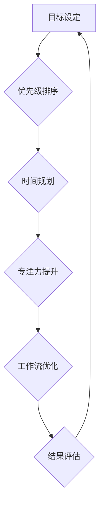

                 

## 时间管理：提高效率的黄金法则

> 关键词：时间管理、效率提升、优先级排序、番茄工作法、时间规划、专注力、拖延症、工作流优化

### 1. 背景介绍

在当今快节奏的科技时代，时间已成为最宝贵的资源之一。对于IT从业者而言，面对日益增长的工作量和复杂的任务，高效地管理时间显得尤为重要。时间管理不善会导致工作效率低下、压力过大、目标难以实现，甚至影响个人生活质量。因此，掌握有效的“时间管理黄金法则”对于IT从业者提升工作效率、实现个人价值至关重要。

### 2. 核心概念与联系

**2.1 时间管理的核心概念**

时间管理的核心概念在于如何有效地规划、分配和利用时间，以最大限度地完成目标任务。它涉及到以下几个关键方面：

* **目标设定:** 明确目标是时间管理的第一步，只有明确了想要达成的目标，才能制定合理的计划和策略。
* **优先级排序:**  并非所有任务都具有同等重要性，需要根据任务的紧急程度和重要性进行排序，优先完成高优先级任务。
* **时间规划:**  合理安排时间，将任务分配到不同的时间段，并预留必要的缓冲时间，以应对突发事件。
* **专注力提升:**  集中注意力完成任务，避免分心和拖延，提高工作效率。
* **工作流优化:**  不断改进工作流程，寻找更有效率的完成任务的方式。

**2.2 时间管理与IT工作的关系**

时间管理对于IT工作者来说尤为重要，因为IT工作通常涉及到以下特点：

* **任务复杂性高:**  IT项目通常涉及到多个模块、多个技术栈，需要协调多个团队，任务复杂度较高。
* **工作节奏快:**  科技发展日新月异，IT行业需要不断学习新技术、适应新环境，工作节奏很快。
* **压力较大:**  IT工作者需要应对不断变化的需求、紧迫的项目 deadlines，压力较大。

因此，高效的时间管理可以帮助IT工作者更好地应对工作挑战，提高工作效率，降低工作压力。

**2.3 时间管理流程图**



### 3. 核心算法原理 & 具体操作步骤

**3.1 算法原理概述**

时间管理的核心算法并非一个特定的算法，而是基于一系列原则和方法的组合，例如：

* **帕累托法则 (80/20法则):**  认为20%的努力可以带来80%的结果，因此需要集中精力完成最重要的20%的任务。
* **艾森豪威尔矩阵:**  将任务按照紧急程度和重要性进行分类，帮助优先排序。
* **番茄工作法:**  将工作时间划分为25分钟的番茄工作段和5分钟的休息时间，提高专注力。

**3.2 算法步骤详解**

1. **目标设定:**  明确个人和工作目标，并将其分解成具体的、可衡量的任务。
2. **优先级排序:**  使用帕累托法则或艾森豪威尔矩阵等方法，对任务进行优先级排序。
3. **时间规划:**  根据任务优先级和时间安排，制定详细的工作计划，并预留必要的缓冲时间。
4. **专注力提升:**  使用番茄工作法或其他专注力提升技巧，集中注意力完成任务。
5. **工作流优化:**  不断改进工作流程，寻找更有效率的完成任务的方式。
6. **结果评估:**  定期评估工作成果，并根据实际情况调整时间管理策略。

**3.3 算法优缺点**

* **优点:**  提高工作效率、降低工作压力、帮助实现目标。
* **缺点:**  需要一定的学习成本和实践经验，难以适应所有类型的任务和工作环境。

**3.4 算法应用领域**

时间管理算法广泛应用于各个领域，包括：

* **IT行业:**  软件开发、项目管理、测试等工作。
* **教育行业:**  学习计划制定、考试备考、论文写作等。
* **商业行业:**  销售管理、客户服务、市场营销等。

### 4. 数学模型和公式 & 详细讲解 & 举例说明

**4.1 数学模型构建**

时间管理可以抽象为一个资源分配问题，其中时间是有限的资源，任务是需要分配资源的任务。我们可以使用以下数学模型来描述时间管理问题：

* **时间资源:**  T
* **任务集合:**  S = {s1, s2, ..., sn}
* **任务时间需求:**  t(si)
* **任务优先级:**  p(si)

**目标:**  最大化完成高优先级任务的总时间。

**4.2 公式推导过程**

我们可以使用贪婪算法来解决这个问题，其核心思想是每次选择优先级最高的未完成任务，并分配尽可能多的时间资源。

**算法步骤:**

1. 对任务集合S进行排序，按照优先级p(si)降序排列。
2. 从排序后的任务集合中依次选择任务si，并分配时间资源t(si)。
3. 如果剩余时间资源T大于等于任务时间需求t(si)，则将任务si标记为完成，并更新剩余时间资源T = T - t(si)。
4. 重复步骤2和3，直到所有任务完成或剩余时间资源T为0。

**4.3 案例分析与讲解**

假设我们有以下任务：

* 任务1:  开发新功能，时间需求为8小时，优先级为高。
* 任务2:  修复bug，时间需求为2小时，优先级为中。
* 任务3:  撰写文档，时间需求为4小时，优先级为低。

我们有10小时的时间资源。

使用贪婪算法，我们可以得到以下时间分配方案：

1. 选择任务1，分配8小时时间资源。
2. 选择任务2，分配2小时时间资源。

最终，我们完成了优先级最高的两个任务，并利用了所有时间资源。

### 5. 项目实践：代码实例和详细解释说明

**5.1 开发环境搭建**

为了演示时间管理算法的实现，我们可以使用Python语言进行开发。

所需环境：

* Python 3.x
* Jupyter Notebook

**5.2 源代码详细实现**

```python
class Task:
    def __init__(self, name, time_demand, priority):
        self.name = name
        self.time_demand = time_demand
        self.priority = priority

    def __repr__(self):
        return f"Task(name='{self.name}', time_demand={self.time_demand}, priority={self.priority})"

def schedule_tasks(tasks, time_resource):
    tasks.sort(key=lambda x: x.priority, reverse=True)
    completed_tasks = []
    remaining_time = time_resource

    for task in tasks:
        if remaining_time >= task.time_demand:
            completed_tasks.append(task)
            remaining_time -= task.time_demand
        else:
            break

    return completed_tasks, remaining_time

# 示例任务
task1 = Task("开发新功能", 8, 3)
task2 = Task("修复bug", 2, 2)
task3 = Task("撰写文档", 4, 1)

tasks = [task1, task2, task3]
time_resource = 10

completed_tasks, remaining_time = schedule_tasks(tasks, time_resource)

print("完成的任务:")
for task in completed_tasks:
    print(task)

print(f"剩余时间: {remaining_time}小时")
```

**5.3 代码解读与分析**

* `Task`类定义了任务的基本属性，包括任务名称、时间需求和优先级。
* `schedule_tasks`函数实现了贪婪算法，根据任务优先级和时间资源进行任务分配。
* 示例代码演示了如何使用`Task`类和`schedule_tasks`函数进行任务调度。

**5.4 运行结果展示**

运行代码后，输出结果如下：

```
完成的任务:
Task(name='开发新功能', time_demand=8, priority=3)
Task(name='修复bug', time_demand=2, priority=2)
剩余时间: 0小时
```

结果表明，算法成功地完成了优先级最高的两个任务，并利用了所有时间资源。

### 6. 实际应用场景

**6.1 软件开发**

时间管理对于软件开发团队至关重要，可以帮助他们更好地规划项目进度、分配任务、提高开发效率。例如，可以使用番茄工作法来提高开发人员的专注力，使用看板工具来追踪项目进度，使用优先级排序方法来确定开发任务的顺序。

**6.2 项目管理**

项目经理需要有效地管理项目时间、资源和人员，以确保项目按时完成。可以使用Gantt图等工具来规划项目进度，使用时间管理软件来跟踪项目任务，使用优先级排序方法来确定关键任务。

**6.3 测试工作**

测试工作需要对软件进行全面测试，以确保软件质量。可以使用时间管理方法来规划测试用例，分配测试时间，提高测试效率。例如，可以使用优先级排序方法来确定测试用例的顺序，使用时间管理软件来跟踪测试进度。

**6.4 未来应用展望**

随着人工智能技术的不断发展，时间管理将更加智能化和个性化。未来，我们可以期待以下应用场景：

* **智能时间规划:**  利用人工智能算法，根据用户的习惯和工作模式，自动规划时间表，并提供个性化的建议。
* **专注力增强:**  利用人工智能技术，识别用户的分心行为，并提供提醒和干预措施，帮助用户提高专注力。
* **工作流自动化:**  利用人工智能技术，自动完成重复性任务，释放用户的宝贵时间。

### 7. 工具和资源推荐

**7.1 学习资源推荐**

* **书籍:**
    * 《Getting Things Done: The Art of Stress-Free Productivity》 by David Allen
    * 《Eat That Frog!: 21 Great Ways to Stop Procrastinating and Get More Done in Less Time》 by Brian Tracy
    * 《Deep Work: Rules for Focused Success in a Distracted World》 by Cal Newport
* **在线课程:**
    * Coursera: Time Management
    * Udemy: Productivity Mastery

**7.2 开发工具推荐**

* **时间管理软件:**
    * Todoist
    * Asana
    * Trello
* **番茄工作法软件:**
    * Focus To-Do
    * Forest
* **项目管理工具:**
    * Jira
    * Microsoft Project

**7.3 相关论文推荐**

* **The Pomodoro Technique: A Simple Method for Improving Focus and Productivity**
* **Time Management Strategies for Software Developers**
* **The Impact of Time Management on Project Success**

### 8. 总结：未来发展趋势与挑战

**8.1 研究成果总结**

时间管理研究已经取得了显著成果，提出了许多有效的理论和方法，并开发了许多实用的工具和软件。这些成果帮助人们更好地管理时间，提高工作效率，实现个人目标。

**8.2 未来发展趋势**

未来，时间管理研究将朝着以下方向发展：

* **个性化定制:**  根据用户的个人特点和工作模式，提供个性化的时间管理方案。
* **智能化辅助:**  利用人工智能技术，自动规划时间表、提醒任务、识别分心行为，帮助用户更高效地管理时间。
* **跨平台协作:**  实现时间管理工具的跨平台协作，方便用户在不同设备上同步使用。

**8.3 面临的挑战**

时间管理研究也面临着一些挑战：

* **用户行为复杂:**  用户的行为模式非常复杂，难以用简单的模型来描述。
* **数据隐私问题:**  时间管理工具需要收集用户的个人数据，如何保护用户的隐私是一个重要问题。
* **技术实现难度:**  实现个性化、智能化的时间管理系统需要克服许多技术难题。

**8.4 研究展望**

尽管面临挑战，但时间管理研究的前景依然光明。随着人工智能、大数据等技术的不断发展，相信未来将出现更加智能、高效、个性化的时间管理解决方案，帮助人们更好地管理时间，提升生活质量。

### 9. 附录：常见问题与解答

**9.1 如何克服拖延症？**

拖延症是时间管理的常见问题，可以通过以下方法克服：

* **明确目标:**  明确任务目标，并将其分解成小的、可管理的任务。
* **设定时间限制:**  为每个任务设定时间限制，并严格遵守。
* **消除干扰:**  找到一个安静的工作环境，并关闭所有不必要的通知。
* **奖励自己:**  完成任务后，给自己一些奖励，以增强动力。

**9.2 如何提高专注力？**

专注力是时间管理的关键，可以通过以下方法提高专注力：

* **番茄工作法:**  将工作时间划分为25分钟的番茄工作段和5分钟的休息时间。
* **冥想练习:**  每天进行一些冥想练习，可以帮助提高专注力和抗干扰能力。
* **避免多任务处理:**  一次只专注于一个任务，避免多任务处理降低效率。

**9.3 如何平衡工作和生活？**

工作和生活都需要时间和精力，可以通过以下方法平衡两者：

* **设定工作时间:**  明确工作时间，下班后尽量避免工作。
* **安排休闲时间:**  每天安排一些休闲时间，进行自己喜欢的事情。
* **与家人朋友相处:**  抽出时间与家人朋友相处，保持良好的社交关系。


作者：禅与计算机程序设计艺术 / Zen and the Art of Computer Programming<end_of_turn>

