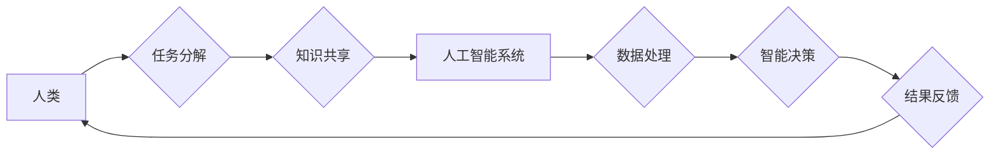

                 

## 未来工作：人机协作，重塑职业版图

> 关键词： 人机协作、人工智能、自动化、职业转型、未来工作、数字技能、协同智能

### 1. 背景介绍

当人工智能（AI）技术日新月异，自动化浪潮席卷全球时，我们不得不面对一个深刻的问题：未来工作会是什么样？哪些职业会消失，哪些职业会诞生？人类与机器的关系将如何演变？

过去几十年，科技进步不断改变着工作格局。从工业革命到信息时代，每一次技术变革都带来了新的职业机会，同时也淘汰了一些传统行业。如今，人工智能的兴起正在加速这一进程，它将深刻地影响着各个行业，并重塑未来的职业版图。

### 2. 核心概念与联系

**2.1 人机协作**

人机协作是指人类和机器在共同完成任务的过程中相互配合、相互补充，发挥各自优势的模式。它不同于单纯的机器替代人类，而是强调人与机器的协同作用，共同创造更高效、更智能的解决方案。

**2.2 人工智能**

人工智能是指模拟人类智能行为的计算机系统。它涵盖了广泛的领域，包括机器学习、深度学习、自然语言处理、计算机视觉等。人工智能技术的不断发展，使得机器能够具备学习、推理、决策等能力，从而在越来越多的领域与人类进行合作。

**2.3 协同智能**

协同智能是指人与人工智能系统共同工作，通过共享知识、资源和能力，实现智能协作的模式。它强调人与机器的互补性，将人类的创造力和机器的计算能力结合起来，以达到更高的智能水平。

**Mermaid 流程图**



### 3. 核心算法原理 & 具体操作步骤

**3.1 算法原理概述**

人机协作的核心算法原理是基于机器学习和深度学习技术，通过训练模型，使机器能够理解人类的需求，并提供相应的智能支持。常见的算法包括：

* **强化学习:** 机器通过与环境交互，学习最佳策略以获得最大奖励。
* **迁移学习:** 利用已训练好的模型，在新的任务上进行快速学习。
* **生成对抗网络 (GAN):** 两个神经网络相互对抗，生成逼真的数据。

**3.2 算法步骤详解**

1. **数据收集和预处理:** 收集与任务相关的各种数据，并进行清洗、转换、格式化等预处理工作。
2. **模型选择和训练:** 根据任务需求选择合适的机器学习算法，并利用训练数据训练模型。
3. **模型评估和优化:** 对训练好的模型进行评估，并根据评估结果进行调整和优化，提高模型性能。
4. **模型部署和应用:** 将训练好的模型部署到实际应用场景中，并与人类进行交互，提供智能支持。

**3.3 算法优缺点**

**优点:**

* **自动化能力强:** 可以自动完成重复性、高强度的工作，提高工作效率。
* **智能化程度高:** 可以根据数据分析，提供更精准、更智能的建议和决策支持。
* **可扩展性强:** 可以根据需要扩展模型规模和功能，适应不同的应用场景。

**缺点:**

* **数据依赖性强:** 模型性能取决于训练数据的质量和数量。
* **解释性差:** 一些深度学习模型的决策过程难以解释，缺乏透明度。
* **伦理风险:** 人工智能的应用可能带来一些伦理风险，例如算法偏见、隐私泄露等问题。

**3.4 算法应用领域**

人机协作算法已广泛应用于各个领域，例如：

* **医疗保健:** 辅助医生诊断疾病、制定治疗方案。
* **金融服务:** 识别欺诈交易、提供个性化理财建议。
* **教育:** 个性化学习辅导、自动批改作业。
* **制造业:** 自动化生产线、预测设备故障。

### 4. 数学模型和公式 & 详细讲解 & 举例说明

**4.1 数学模型构建**

人机协作系统可以抽象为一个多智能体系统，其中每个智能体代表一个参与者，例如人类、机器人、AI系统等。每个智能体都有自己的目标、能力和知识，通过交互和合作来完成共同任务。

**4.2 公式推导过程**

我们可以使用博弈论、强化学习等数学工具来建模和分析人机协作系统。例如，我们可以使用马尔可夫决策过程 (MDP) 来描述智能体的决策过程，并使用Bellman方程来求解最优策略。

**4.3 案例分析与讲解**

例如，在自动驾驶汽车领域，我们可以将驾驶员和自动驾驶系统视为两个智能体，他们共同完成驾驶任务。我们可以使用MDP模型来描述驾驶员和自动驾驶系统的决策过程，并使用Bellman方程来求解最优策略，使得驾驶员和自动驾驶系统能够协同完成驾驶任务，提高安全性。

**举例说明:**

假设一个自动驾驶汽车系统需要在十字路口做出决策，可以选择直行、左转或右转。我们可以将每个动作的奖励函数定义为：

* 直行: R(直行) = 10
* 左转: R(左转) = 5
* 右转: R(右转) = 8

驾驶员和自动驾驶系统可以根据奖励函数和当前路况信息，选择最优动作。

### 5. 项目实践：代码实例和详细解释说明

**5.1 开发环境搭建**

为了实现人机协作系统，我们需要搭建一个合适的开发环境。常用的开发工具包括：

* **Python:** 人工智能开发的常用语言，拥有丰富的库和框架。
* **TensorFlow/PyTorch:** 深度学习框架，用于训练和部署机器学习模型。
* **ROS:** 机器人操作系统，用于开发机器人控制软件。

**5.2 源代码详细实现**

以下是一个简单的基于Python和TensorFlow的人机协作系统代码示例：

```python
import tensorflow as tf

# 定义一个简单的模型
model = tf.keras.Sequential([
    tf.keras.layers.Dense(10, activation='relu'),
    tf.keras.layers.Dense(1, activation='sigmoid')
])

# 训练模型
model.compile(optimizer='adam', loss='binary_crossentropy', metrics=['accuracy'])
model.fit(x_train, y_train, epochs=10)

# 使用模型进行预测
predictions = model.predict(x_test)
```

**5.3 代码解读与分析**

这段代码定义了一个简单的深度学习模型，并使用TensorFlow框架进行训练和预测。

* `tf.keras.Sequential` 创建了一个顺序模型，将多个层级连接起来。
* `tf.keras.layers.Dense` 定义了一个全连接层，每个神经元都连接到上一层的每个神经元。
* `activation='relu'` 使用ReLU激活函数，引入非线性，提高模型表达能力。
* `optimizer='adam'` 使用Adam优化器，更新模型参数。
* `loss='binary_crossentropy'` 使用二分类交叉熵损失函数，衡量模型预测结果与真实值的差异。
* `metrics=['accuracy']` 使用准确率作为评估指标。

**5.4 运行结果展示**

训练完成后，我们可以使用模型对测试数据进行预测，并评估模型的准确率。

### 6. 实际应用场景

**6.1 医疗保健**

* **辅助诊断:** 人工智能可以分析患者的影像数据，例如X光片、CT扫描等，辅助医生诊断疾病。
* **个性化治疗:** 人工智能可以根据患者的基因信息、病史等数据，制定个性化的治疗方案。
* **远程医疗:** 人工智能可以帮助医生进行远程诊断和治疗，提高医疗服务的可及性。

**6.2 金融服务**

* **欺诈检测:** 人工智能可以分析交易数据，识别异常行为，防止欺诈交易。
* **风险管理:** 人工智能可以评估投资风险，帮助金融机构做出更明智的决策。
* **个性化理财:** 人工智能可以根据用户的财务状况和风险偏好，提供个性化的理财建议。

**6.3 教育**

* **个性化学习:** 人工智能可以根据学生的学习进度和能力，提供个性化的学习辅导。
* **自动批改作业:** 人工智能可以自动批改学生的作业，节省教师的时间和精力。
* **智能问答:** 人工智能可以回答学生的疑问，提供学习支持。

**6.4 未来应用展望**

随着人工智能技术的不断发展，人机协作将应用于越来越多的领域，例如：

* **自动驾驶:** 人工智能将与驾驶员协同驾驶，提高安全性。
* **机器人服务:** 人工智能将赋予机器人更强的智能能力，使其能够更好地服务人类。
* **个性化体验:** 人工智能将根据用户的需求和喜好，提供更个性化的体验。

### 7. 工具和资源推荐

**7.1 学习资源推荐**

* **在线课程:** Coursera、edX、Udacity等平台提供丰富的机器学习和人工智能课程。
* **书籍:** 《深度学习》、《人工智能：一种现代方法》等书籍是学习人工智能的经典教材。
* **开源项目:** TensorFlow、PyTorch等开源项目提供了丰富的代码示例和学习资源。

**7.2 开发工具推荐**

* **Python:** 人工智能开发的常用语言，拥有丰富的库和框架。
* **TensorFlow/PyTorch:** 深度学习框架，用于训练和部署机器学习模型。
* **ROS:** 机器人操作系统，用于开发机器人控制软件。

**7.3 相关论文推荐**

* **AlphaGo论文:** 《Mastering the game of Go with deep neural networks and tree search》
* **BERT论文:** 《BERT: Pre-training of Deep Bidirectional Transformers for Language Understanding》
* **GPT-3论文:** 《Language Models are Few-Shot Learners》

### 8. 总结：未来发展趋势与挑战

**8.1 研究成果总结**

近年来，人工智能技术取得了长足进步，人机协作系统也取得了显著成果。例如，AlphaGo战胜了世界围棋冠军，BERT模型在自然语言理解任务上取得了突破性进展。

**8.2 未来发展趋势**

未来，人机协作将朝着以下几个方向发展：

* **更智能的协作:** 人工智能将更加智能，能够更好地理解人类的需求，提供更精准的智能支持。
* **更广泛的应用:** 人机协作将应用于更多领域，例如医疗保健、教育、金融服务等。
* **更人性化的交互:** 人机交互将更加自然、人性化，例如语音交互、体感交互等。

**8.3 面临的挑战**

人机协作也面临一些挑战：

* **算法解释性:** 一些深度学习模型的决策过程难以解释，缺乏透明度。
* **伦理风险:** 人工智能的应用可能带来一些伦理风险，例如算法偏见、隐私泄露等问题。
* **社会影响:** 人机协作可能会导致部分工作岗位消失，需要进行相应的社会调整。

**8.4 研究展望**

未来，我们需要继续研究和探索人机协作的本质，开发更智能、更安全、更可靠的人机协作系统，并积极应对人机协作带来的社会挑战。

### 9. 附录：常见问题与解答

**9.1 如何学习人机协作技术？**

可以学习相关的机器学习、深度学习、自然语言处理等课程，并参与开源项目开发。

**9.2 人机协作会取代人类工作吗？**

人机协作的目标是提高工作效率和质量，而不是取代人类工作。未来，人类和机器将更加紧密地合作，共同创造更美好的未来。

**9.3 人机协作有哪些伦理风险？**

人机协作可能带来算法偏见、隐私泄露等伦理风险，需要进行相应的伦理规范和监管。

作者：禅与计算机程序设计艺术 / Zen and the Art of Computer Programming 


<end_of_turn>

