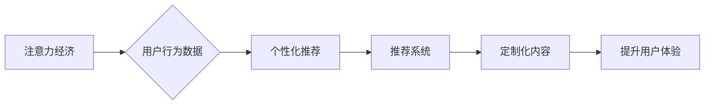

                 

##  注意力经济与个性化推荐系统：为受众提供定制、有针对性的内容和体验

> 关键词：注意力经济、个性化推荐、推荐系统、机器学习、深度学习、用户行为分析、内容过滤

### 1. 背景介绍

在信息爆炸的时代，人们每天面临着海量信息的选择和处理。如何有效地获取所需信息，并过滤掉无关紧要的内容，成为了一个重要的挑战。注意力经济的概念应运而生，它强调了信息获取和处理的有限性，以及人们对信息的“注意力”资源的稀缺性。

个性化推荐系统在这种背景下显得尤为重要。它通过分析用户的行为数据、偏好和兴趣，为用户提供定制化的内容和服务，帮助用户更有效地获取所需信息，提升用户体验。

### 2. 核心概念与联系

#### 2.1 注意力经济

注意力经济是指在信息过载的时代，人们对信息的注意力是有限的，而获取和保持注意力是一种稀缺资源。

#### 2.2 个性化推荐

个性化推荐是指根据用户的个人特征、行为模式和偏好，为用户提供定制化的内容和服务。

#### 2.3 推荐系统

推荐系统是一种利用数据挖掘、机器学习等技术，根据用户的历史行为、兴趣和偏好，预测用户可能感兴趣的内容或服务，并将其推荐给用户的系统。

**核心概念与联系流程图**



### 3. 核心算法原理 & 具体操作步骤

#### 3.1 算法原理概述

个性化推荐系统常用的算法包括：

* **基于内容的推荐算法:** 根据物品的特征和用户对物品的喜好进行推荐。
* **基于协同过滤的推荐算法:** 根据用户的历史行为和与其他用户的相似性进行推荐。
* **基于深度学习的推荐算法:** 利用深度神经网络学习用户和物品的复杂关系，进行推荐。

#### 3.2 算法步骤详解

以基于协同过滤的推荐算法为例，其具体步骤如下：

1. **数据收集:** 收集用户对物品的评分或行为数据，例如用户购买记录、浏览记录、点赞记录等。
2. **用户-物品矩阵构建:** 将用户和物品作为矩阵的行和列，用户对物品的评分或行为数据作为矩阵的元素。
3. **相似性计算:** 计算用户之间的相似度或物品之间的相似度。常用的相似度计算方法包括余弦相似度、皮尔逊相关系数等。
4. **推荐生成:** 根据用户的相似用户或物品的相似物品，生成推荐列表。

#### 3.3 算法优缺点

* **基于内容的推荐算法:**
    * **优点:** 可以推荐与用户兴趣相符的内容，不受用户历史行为数据的影响。
    * **缺点:** 需要对物品进行准确的特征描述，难以捕捉用户隐性的兴趣。
* **基于协同过滤的推荐算法:**
    * **优点:** 可以发现用户之间的隐性关系，推荐用户可能感兴趣但未接触过的物品。
    * **缺点:** 数据稀疏性问题，当用户行为数据不足时，难以进行准确的推荐。
* **基于深度学习的推荐算法:**
    * **优点:** 可以学习用户和物品之间的复杂关系，提高推荐准确率。
    * **缺点:** 需要大量的训练数据，训练成本较高。

#### 3.4 算法应用领域

个性化推荐算法广泛应用于以下领域：

* **电子商务:** 商品推荐、用户画像、个性化营销
* **社交媒体:** 朋友推荐、内容推荐、兴趣小组推荐
* **流媒体平台:** 视频推荐、音乐推荐、节目推荐
* **新闻资讯:** 新闻推荐、个性化订阅、内容聚合

### 4. 数学模型和公式 & 详细讲解 & 举例说明

#### 4.1 数学模型构建

基于协同过滤的推荐算法通常使用用户-物品矩阵作为基础模型。

假设用户集合为U，物品集合为I，用户-物品矩阵为R，其中R(u,i)表示用户u对物品i的评分或行为数据。

#### 4.2 公式推导过程

用户相似度计算公式：

```latex
Sim(u_1, u_2) = \frac{\sum_{i \in I} R(u_1, i) * R(u_2, i)}{\sqrt{\sum_{i \in I} R(u_1, i)^2} * \sqrt{\sum_{i \in I} R(u_2, i)^2}}
```

物品相似度计算公式：

```latex
Sim(i_1, i_2) = \frac{\sum_{u \in U} R(u, i_1) * R(u, i_2)}{\sqrt{\sum_{u \in U} R(u, i_1)^2} * \sqrt{\sum_{u \in U} R(u, i_2)^2}}
```

#### 4.3 案例分析与讲解

假设有两个用户A和B，他们的评分数据如下：

| 用户 | 物品1 | 物品2 | 物品3 |
|---|---|---|---|
| A | 5 | 3 | 4 |
| B | 4 | 5 | 2 |

使用余弦相似度计算用户A和B的相似度：

```latex
Sim(A, B) = \frac{5*4 + 3*5 + 4*2}{\sqrt{5^2 + 3^2 + 4^2} * \sqrt{4^2 + 5^2 + 2^2}} = 0.75
```

结果表明，用户A和B的相似度为0.75，说明他们有一定的兴趣相似性。

### 5. 项目实践：代码实例和详细解释说明

#### 5.1 开发环境搭建

* Python 3.x
* scikit-learn
* pandas
* numpy

#### 5.2 源代码详细实现

```python
import pandas as pd
from sklearn.metrics.pairwise import cosine_similarity

# 加载用户-物品评分数据
data = pd.read_csv('ratings.csv')

# 构建用户-物品矩阵
user_item_matrix = data.pivot_table(index='user_id', columns='item_id', values='rating')

# 计算用户相似度
user_similarity = cosine_similarity(user_item_matrix)

# 获取用户A的相似用户
user_A_id = 1
similar_users = user_similarity[user_A_id].argsort()[:-6:-1]  # 排序获取前5个相似用户

# 生成推荐列表
recommended_items = []
for user_id in similar_users:
    user_rated_items = data[data['user_id'] == user_id]['item_id'].tolist()
    for item_id in user_rated_items:
        if item_id not in data[data['user_id'] == user_A_id]['item_id'].tolist():
            recommended_items.append(item_id)

# 打印推荐列表
print(f'用户{user_A_id}的推荐列表：{recommended_items}')
```

#### 5.3 代码解读与分析

* 代码首先加载用户-物品评分数据，并构建用户-物品矩阵。
* 然后使用余弦相似度计算用户之间的相似度，并获取用户A的相似用户。
* 最后，根据相似用户的评分数据，生成推荐列表，并打印推荐结果。

#### 5.4 运行结果展示

运行代码后，将输出用户A的推荐列表，其中包含用户A未评分但相似用户评分较高的物品。

### 6. 实际应用场景

#### 6.1 电子商务

个性化推荐系统在电子商务领域应用广泛，例如：

* **商品推荐:** 根据用户的浏览历史、购买记录、收藏夹等数据，推荐用户可能感兴趣的商品。
* **用户画像:** 通过分析用户的行为数据，构建用户画像，了解用户的兴趣爱好、消费习惯等信息。
* **个性化营销:** 根据用户的画像，进行精准营销，推送个性化的广告和促销信息。

#### 6.2 社交媒体

个性化推荐系统在社交媒体平台上可以用于：

* **朋友推荐:** 根据用户的兴趣爱好、社交关系等数据，推荐用户可能认识的朋友。
* **内容推荐:** 根据用户的浏览历史、点赞记录、评论等数据，推荐用户可能感兴趣的内容。
* **兴趣小组推荐:** 根据用户的兴趣爱好，推荐用户可能感兴趣的兴趣小组。

#### 6.3 流媒体平台

个性化推荐系统在流媒体平台上可以用于：

* **视频推荐:** 根据用户的观看历史、评分等数据，推荐用户可能感兴趣的视频。
* **音乐推荐:** 根据用户的播放历史、收藏等数据，推荐用户可能喜欢的音乐。
* **节目推荐:** 根据用户的观看历史、评分等数据，推荐用户可能感兴趣的节目。

#### 6.4 未来应用展望

随着人工智能技术的不断发展，个性化推荐系统将应用于更多领域，例如：

* **教育:** 根据学生的学习进度、兴趣爱好等数据，推荐个性化的学习内容和学习路径。
* **医疗:** 根据患者的病史、症状等数据，推荐个性化的治疗方案和健康建议。
* **金融:** 根据用户的投资习惯、风险偏好等数据，推荐个性化的投资产品和理财方案。

### 7. 工具和资源推荐

#### 7.1 学习资源推荐

* **书籍:**
    * 《推荐系统》 -  Koren, Yehuda
    * 《机器学习》 -  周志华
* **在线课程:**
    * Coursera: Recommender Systems
    * Udacity: Machine Learning Engineer Nanodegree

#### 7.2 开发工具推荐

* **Python:** 
    * scikit-learn
    * pandas
    * numpy
* **Spark:** 
    * MLlib

#### 7.3 相关论文推荐

* **Collaborative Filtering for the Netflix Prize** -  Bennett, K. P., & Lanning, S. (2007).
* **Matrix Factorization Techniques for Recommender Systems** -  Koren, Y. (2009).

### 8. 总结：未来发展趋势与挑战

#### 8.1 研究成果总结

个性化推荐系统在信息获取和内容消费方面取得了显著的成果，有效提升了用户体验，并为企业带来了商业价值。

#### 8.2 未来发展趋势

* **深度学习的应用:** 深度学习算法能够学习用户和物品之间的复杂关系，提高推荐准确率。
* **多模态数据的融合:** 将文本、图像、视频等多模态数据融合到推荐系统中，可以更全面地理解用户需求。
* **个性化解释:** 为用户提供推荐结果的解释，帮助用户理解推荐背后的逻辑，提升用户信任度。

#### 8.3 面临的挑战

* **数据稀疏性:** 用户行为数据往往是稀疏的，难以进行准确的推荐。
* **冷启动问题:** 新用户和新物品难以进行推荐，需要新的算法和策略来解决。
* **用户隐私保护:** 个性化推荐系统需要收集用户的个人信息，如何保护用户隐私是一个重要的挑战。

#### 8.4 研究展望

未来，个性化推荐系统将朝着更智能、更个性化、更安全的方向发展，为用户提供更精准、更丰富的个性化体验。

### 9. 附录：常见问题与解答

* **Q1: 什么是冷启动问题？**

> A1: 冷启动问题是指在推荐系统中，新用户或新物品难以进行推荐的问题。

* **Q2: 如何解决数据稀疏性问题？**

> A2: 可以使用一些方法来解决数据稀疏性问题，例如：
> * 使用协同过滤算法的改进版本，例如基于矩阵分解的协同过滤算法。
> * 使用内容过滤算法，根据物品的特征进行推荐。
> * 使用深度学习算法，学习用户和物品之间的复杂关系。

* **Q3: 如何保护用户隐私？**

> A3: 可以使用一些方法来保护用户隐私，例如：
> * 使用匿名化技术，将用户的个人信息进行匿名化处理。
> * 使用差分隐私技术，保护用户的隐私信息不被泄露。
> * 获得用户的明确同意，才能收集和使用用户的个人信息。


作者：禅与计算机程序设计艺术 / Zen and the Art of Computer Programming 
<end_of_turn>

