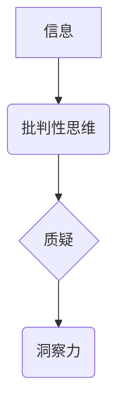

                 

## 理解洞察力的培养：鼓励质疑和批判性思维

> 关键词：洞察力、批判性思维、质疑、人工智能、学习、创新、解决问题

### 1. 背景介绍

在瞬息万变的科技时代，洞察力已成为至关重要的竞争优势。洞察力不仅仅是直觉或灵感，更是一种通过批判性思维、质疑和分析能力，从纷繁的信息中提取有价值的见解和知识的过程。对于程序员、软件架构师和技术领导者来说，洞察力尤为重要，因为它能帮助他们：

* **识别问题和机遇：** 洞察力可以帮助技术人员在复杂系统中发现潜在的问题和未被发掘的机遇，从而做出更明智的决策。
* **设计更优的解决方案：** 通过深入理解问题本质，技术人员可以设计更有效、更具创新性的解决方案。
* **预测未来趋势：** 洞察力可以帮助技术人员预测技术发展趋势，从而提前布局和应对挑战。
* **有效沟通和协作：** 洞察力可以帮助技术人员更清晰地表达自己的想法，并与其他团队成员进行更有效的沟通和协作。

然而，培养洞察力并非易事，它需要不断地学习、思考和实践。

### 2. 核心概念与联系

**2.1 核心概念**

* **批判性思维：** 

批判性思维是指系统地评估信息、识别谬误、形成独立判断的能力。它包括分析、评估、解释、推理和反思等多种思维过程。

* **质疑：** 

质疑是批判性思维的基础，它意味着不盲目接受信息，而是主动思考、探究和挑战现有观点。

* **洞察力：** 

洞察力是指从纷繁的信息中提取有价值的见解和知识的能力。它需要结合批判性思维和质疑，才能真正地洞察事物本质。

**2.2 架构图**



**2.3 联系**

批判性思维是培养洞察力的基础，它提供了一种框架和方法来分析和评估信息。质疑是批判性思维的驱动力，它促使我们不断思考和挑战现有观点。通过批判性思维和质疑，我们可以从纷繁的信息中提取有价值的见解，从而获得洞察力。

### 3. 核心算法原理 & 具体操作步骤

**3.1 算法原理概述**

洞察力的培养并非一个特定的算法，而是需要通过不断学习、思考和实践来积累的技能。然而，我们可以借鉴一些算法设计和优化的方法来帮助我们培养洞察力。例如：

* **分层分析：** 将复杂问题分解成更小的子问题，逐层深入分析，逐步揭示问题的本质。
* **关联分析：** 寻找不同信息之间的关联和联系，发现隐藏的模式和规律。
* **反向推理：** 从结果出发，反推原因，寻找问题的根源。

**3.2 算法步骤详解**

1. **明确目标：** 首先要明确自己想要获得的洞察力，以及需要分析哪些信息。
2. **收集信息：** 从各种渠道收集相关信息，包括数据、文本、图片、视频等。
3. **整理信息：** 对收集到的信息进行整理和分类，以便于分析和理解。
4. **分析信息：** 使用分层分析、关联分析、反向推理等方法，深入分析信息之间的联系和模式。
5. **形成见解：** 基于分析结果，形成自己的见解和结论。
6. **验证见解：** 将自己的见解与其他信息进行验证，确保其准确性和可靠性。

**3.3 算法优缺点**

* **优点：** 

可以帮助我们更深入地理解问题，发现隐藏的模式和规律，从而获得更准确和有价值的洞察力。

* **缺点：** 

需要花费较多的时间和精力，并且需要一定的分析和推理能力。

**3.4 算法应用领域**

* **技术领域：** 

软件开发、系统设计、数据分析、人工智能等领域。
* **商业领域：** 

市场分析、客户洞察、产品创新、竞争策略等领域。
* **个人成长：** 

提升学习能力、解决问题能力、决策能力等。

### 4. 数学模型和公式 & 详细讲解 & 举例说明

**4.1 数学模型构建**

洞察力的培养可以看作是一个信息处理过程，我们可以用数学模型来描述这个过程。

假设：

* **I** 代表输入的信息量。
* **P** 代表批判性思维能力。
* **Q** 代表质疑能力。
* **O** 代表输出的洞察力。

则可以建立以下数学模型：

**O = f(I, P, Q)**

其中，f() 是一个非线性函数，代表信息处理过程的复杂性。

**4.2 公式推导过程**

我们可以进一步推导这个模型，分析每个变量对洞察力的影响。

* **信息量 (I)**： 信息量越大，洞察力越高，但信息量过大也会导致信息冗余和分析困难。
* **批判性思维能力 (P)**： 批判性思维能力越强，洞察力越高，因为它可以帮助我们更有效地分析和评估信息。
* **质疑能力 (Q)**： 质疑能力越强，洞察力越高，因为它可以帮助我们发现信息中的潜在问题和矛盾。

**4.3 案例分析与讲解**

例如，一个程序员想要设计一个新的软件系统。

* **信息量 (I)**： 他需要收集用户需求、市场分析、技术趋势等各种信息。
* **批判性思维能力 (P)**： 他需要分析用户需求的真实性，评估市场分析的准确性，比较不同技术方案的优缺点。
* **质疑能力 (Q)**： 他需要质疑现有系统的设计理念，思考是否有更好的解决方案。

通过以上三个方面的努力，程序员才能获得足够的洞察力，设计出更优秀、更符合用户需求的软件系统。

### 5. 项目实践：代码实例和详细解释说明

**5.1 开发环境搭建**

为了更好地理解洞察力的培养，我们可以通过一个简单的项目实践来进行体验。

* **工具：** Python 语言、 Jupyter Notebook 环境。

**5.2 源代码详细实现**

```python
import pandas as pd

# 加载数据
data = pd.read_csv('data.csv')

# 数据探索
print(data.head())
print(data.describe())

# 关联分析
correlation = data.corr()
print(correlation)

# 分层分析
grouped_data = data.groupby('category')
print(grouped_data.mean())
```

**5.3 代码解读与分析**

这段代码演示了如何使用 Python 和 Pandas 库进行数据分析。

* **数据加载：** 使用 `pd.read_csv()` 函数加载数据文件。
* **数据探索：** 使用 `data.head()` 和 `data.describe()` 函数查看数据的前几行和统计信息。
* **关联分析：** 使用 `data.corr()` 函数计算变量之间的相关系数。
* **分层分析：** 使用 `data.groupby()` 函数将数据按照类别进行分组，并计算每个类别的平均值。

**5.4 运行结果展示**

运行这段代码后，我们可以得到以下结果：

* 数据的前几行和统计信息。
* 变量之间的相关系数矩阵。
* 每个类别的平均值。

通过分析这些结果，我们可以获得对数据的洞察力，例如：

* 某些变量之间存在显著的相关性。
* 不同类别的数据存在差异。

### 6. 实际应用场景

**6.1 技术领域**

* **软件开发：** 

通过洞察用户需求和市场趋势，开发更符合用户需求的软件产品。
* **系统设计：** 

通过洞察系统架构和性能瓶颈，设计更稳定、更高效的系统。
* **数据分析：** 

通过洞察数据中的模式和趋势，发现隐藏的商业价值。
* **人工智能：** 

通过洞察数据和算法的局限性，开发更智能、更可靠的人工智能系统。

**6.2 商业领域**

* **市场分析：** 

通过洞察市场趋势和竞争对手，制定更有效的市场策略。
* **客户洞察：** 

通过洞察客户需求和行为，开发更符合客户需求的产品和服务。
* **产品创新：** 

通过洞察市场需求和技术趋势，开发更具创新性的产品。
* **竞争策略：** 

通过洞察竞争对手的优势和劣势，制定更有效的竞争策略。

**6.3 个人成长**

* **提升学习能力：** 

通过洞察学习内容的本质，提高学习效率和理解深度。
* **解决问题能力：** 

通过洞察问题的根源，找到更有效解决问题的方案。
* **决策能力：** 

通过洞察信息和情境，做出更明智的决策。

**6.4 未来应用展望**

随着人工智能技术的不断发展，洞察力的培养将变得更加重要。未来，我们可以期待看到更多基于人工智能的洞察力工具和平台，帮助人们更有效地分析信息、发现模式和形成见解。

### 7. 工具和资源推荐

**7.1 学习资源推荐**

* **书籍：**

《思考，快与慢》 (Thinking, Fast and Slow) - Daniel Kahneman
《武器思维》 (Weapons of Math Destruction) - Cathy O'Neil
《黑客与画家》 (Hackers and Painters) - Paul Graham

* **在线课程：**

Coursera: Critical Thinking
edX: Data Analysis and Visualization
Udacity: Artificial Intelligence Nanodegree

**7.2 开发工具推荐**

* **Python:** 

Python 是一个非常适合数据分析和机器学习的编程语言。
* **Pandas:** 

Pandas 是一个强大的数据分析库，可以帮助我们处理和分析大型数据集。
* **Scikit-learn:** 

Scikit-learn 是一个机器学习库，可以帮助我们构建和训练机器学习模型。

**7.3 相关论文推荐**

* **"The Power of Critical Thinking"** - Richard Paul
* **"Thinking, Fast and Slow"** - Daniel Kahneman
* **"Data Science for Business"** - Foster Provost and Tom Fawcett

### 8. 总结：未来发展趋势与挑战

**8.1 研究成果总结**

通过以上分析，我们可以看到洞察力的培养是一个复杂而重要的过程，它需要结合批判性思维、质疑和信息处理能力。随着人工智能技术的不断发展，洞察力的培养将变得更加重要，并将在更多领域发挥作用。

**8.2 未来发展趋势**

* **人工智能辅助洞察：** 

人工智能将能够帮助人们更快、更有效地分析信息，发现隐藏的模式和趋势。
* **个性化洞察：** 

基于用户的个人数据和行为，人工智能将能够提供更个性化的洞察力。
* **洞察力平台化：** 

将洞察力工具和平台整合在一起，形成一个完整的洞察力生态系统。

**8.3 面临的挑战**

* **数据质量问题：** 

人工智能的洞察力依赖于数据的质量，而现实世界的数据往往存在噪声、缺失和偏差等问题。
* **算法偏见问题：** 

人工智能算法本身可能存在偏见，导致洞察力不准确或不公平。
* **伦理问题：** 

人工智能洞察力的应用可能引发一些伦理问题，例如隐私泄露、信息操纵等。

**8.4 研究展望**

未来，我们需要继续研究如何提高人工智能洞察力的准确性和可靠性，并解决算法偏见和伦理问题。同时，我们也需要培养人们的批判性思维能力和质疑精神，帮助他们更好地理解和利用人工智能洞察力。

### 9. 附录：常见问题与解答

**9.1 如何培养批判性思维能力？**

* **多阅读不同观点的文章和书籍。**
* **积极思考和质疑信息来源和内容。**
* **学会分析和评估信息的可信度。**
* **练习逻辑推理和辩证思维。**

**9.2 如何提高质疑能力？**

* **不要轻易接受信息，要主动思考和探究。**
* **提出“为什么”和“如何”等问题。**
* **寻找信息中的矛盾和漏洞。**
* **敢于挑战权威和传统观念。**

**9.3 如何利用人工智能工具进行洞察力培养？**

* **使用数据分析工具分析数据，发现隐藏的模式和趋势。**
* **使用机器学习模型预测未来趋势。**
* **使用自然语言处理工具分析文本，提取关键信息。**


作者：禅与计算机程序设计艺术 / Zen and the Art of Computer Programming<end_of_turn>

