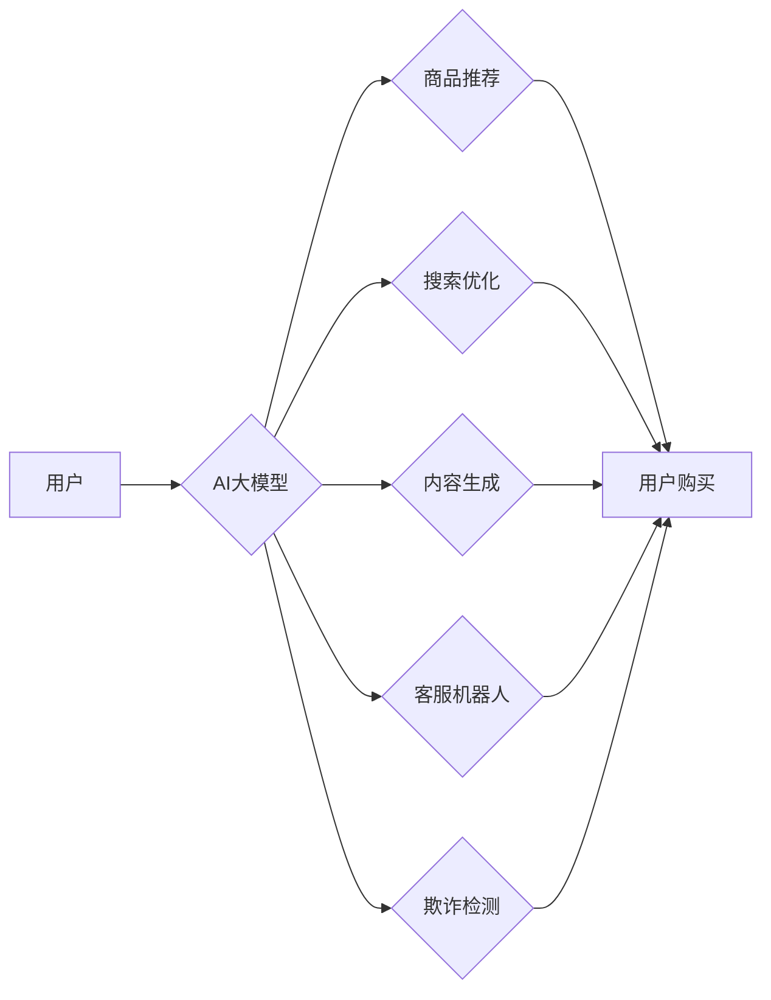

                 

## 电商平台引入AI大模型后的用户体验变革

> 关键词：电商平台、AI大模型、用户体验、推荐系统、个性化、自然语言处理、机器学习

## 1. 背景介绍

近年来，人工智能（AI）技术飞速发展，特别是大模型的涌现，为电商平台带来了前所未有的机遇。AI大模型，凭借其强大的学习能力和泛化能力，能够理解和生成人类语言，并从海量数据中提取有价值的信息。将其应用于电商平台，可以显著提升用户体验，推动商业模式创新。

传统电商平台的用户体验主要依赖于商品分类、搜索引擎和人工推荐。然而，这些方法存在局限性：

* **商品分类**难以涵盖所有细分领域，用户难以找到心仪商品。
* **搜索引擎**依赖关键词匹配，无法理解用户真实需求，搜索结果可能不精准。
* **人工推荐**效率低下，难以满足个性化需求。

AI大模型的引入，可以有效解决这些问题，为用户提供更智能、更个性化的购物体验。

## 2. 核心概念与联系

### 2.1 AI大模型

AI大模型是指在海量数据上训练的深度学习模型，拥有强大的泛化能力和学习能力。常见的AI大模型包括：

* **语言模型**: 如GPT-3、BERT，能够理解和生成人类语言，用于文本生成、翻译、问答等任务。
* **图像模型**: 如DALL-E 2、Stable Diffusion，能够生成逼真的图像，用于图像识别、生成、编辑等任务。
* **多模态模型**: 如LaMDA，能够处理多种数据类型，如文本、图像、音频等，用于更复杂的场景理解和生成。

### 2.2 电商平台应用场景

AI大模型在电商平台的应用场景广泛，包括：

* **商品推荐**: 基于用户行为、偏好和商品属性，提供个性化商品推荐。
* **搜索优化**: 理解用户搜索意图，提供更精准的搜索结果。
* **内容生成**: 自动生成商品描述、促销文案、广告内容等。
* **客服机器人**: 利用自然语言处理技术，自动回复用户咨询，提高客服效率。
* **欺诈检测**: 利用机器学习算法，识别和预防欺诈行为。

### 2.3 架构图



## 3. 核心算法原理 & 具体操作步骤

### 3.1 算法原理概述

电商平台引入AI大模型的核心算法主要包括：

* **协同过滤**: 基于用户历史行为和商品相似度，预测用户对商品的兴趣。
* **内容过滤**: 基于商品属性和用户偏好，推荐与用户兴趣相符的商品。
* **深度学习**: 利用神经网络模型，从海量数据中学习用户行为模式和商品特征，进行更精准的推荐。

### 3.2 算法步骤详解

以协同过滤算法为例，其具体操作步骤如下：

1. **数据收集**: 收集用户购买历史、浏览记录、评分等数据，以及商品属性信息。
2. **数据预处理**: 对数据进行清洗、转换、特征提取等操作，构建用户-商品交互矩阵。
3. **模型训练**: 利用协同过滤算法，训练模型，学习用户和商品之间的关系。
4. **推荐生成**: 根据用户特征和模型预测，生成个性化商品推荐列表。

### 3.3 算法优缺点

**优点**:

* 能够提供个性化推荐，提升用户体验。
* 算法模型不断学习和优化，推荐效果不断提升。

**缺点**:

* 数据依赖性强，需要大量用户行为数据才能训练出准确的模型。
* 冷启动问题，对于新用户和新商品，难以进行准确推荐。
* 算法复杂度高，需要强大的计算资源进行训练和部署。

### 3.4 算法应用领域

协同过滤算法广泛应用于电商平台、视频网站、音乐平台等场景，用于商品推荐、内容推荐、用户画像等。

## 4. 数学模型和公式 & 详细讲解 & 举例说明

### 4.1 数学模型构建

协同过滤算法的核心是构建用户-商品交互矩阵，其中每个元素表示用户对商品的评分或购买行为。

假设有N个用户和M个商品，则用户-商品交互矩阵可以表示为一个N x M的矩阵R，其中R(i,j)表示用户i对商品j的评分或购买行为。

### 4.2 公式推导过程

协同过滤算法的目标是预测用户对商品的评分或购买行为。常用的协同过滤算法包括基于用户的协同过滤和基于物品的协同过滤。

**基于用户的协同过滤**:

预测用户u对商品i的评分R(u,i) = ∑v∈N(u) [R(v,i) * Sim(u,v)] / ∑v∈N(u) Sim(u,v)

其中：

* N(u)表示与用户u相似的用户集合。
* Sim(u,v)表示用户u和用户v之间的相似度。

**基于物品的协同过滤**:

预测用户u对商品i的评分R(u,i) = ∑j∈N(i) [R(u,j) * Sim(i,j)] / ∑j∈N(i) Sim(i,j)

其中：

* N(i)表示与商品i相似的商品集合。
* Sim(i,j)表示商品i和商品j之间的相似度。

### 4.3 案例分析与讲解

假设有一个电商平台，用户A和用户B都购买了商品1和商品2，用户A对商品1评分为5，用户B对商品1评分为4，用户A对商品2评分为3，用户B对商品2评分为4。

基于用户的协同过滤算法，可以计算用户A和用户B之间的相似度，并预测用户A对商品3的评分。

## 5. 项目实践：代码实例和详细解释说明

### 5.1 开发环境搭建

* Python 3.x
* TensorFlow/PyTorch
* scikit-learn

### 5.2 源代码详细实现

```python
# 导入必要的库
import numpy as np
from sklearn.metrics.pairwise import cosine_similarity

# 定义用户-商品交互矩阵
ratings = np.array([
    [5, 4, 0],
    [4, 3, 0],
    [0, 0, 5]
])

# 计算用户之间的相似度
user_similarity = cosine_similarity(ratings)

# 预测用户A对商品3的评分
user_a_index = 0
item_c_index = 2
predicted_rating = np.sum(ratings[user_similarity[user_a_index] > 0] * user_similarity[user_a_index][user_similarity[user_a_index] > 0]) / np.sum(user_similarity[user_a_index][user_similarity[user_a_index] > 0])

# 打印预测结果
print(f"预测用户A对商品3的评分: {predicted_rating}")
```

### 5.3 代码解读与分析

* 代码首先导入必要的库，包括NumPy和scikit-learn。
* 然后定义用户-商品交互矩阵，其中每个元素表示用户对商品的评分。
* 使用cosine_similarity函数计算用户之间的相似度。
* 最后，根据用户A和与之相似用户的评分，预测用户A对商品3的评分。

### 5.4 运行结果展示

运行上述代码，可以得到用户A对商品3的预测评分。

## 6. 实际应用场景

### 6.1 商品推荐

AI大模型可以根据用户的历史购买记录、浏览记录、评分等数据，学习用户的兴趣偏好，并推荐与用户兴趣相符的商品。

### 6.2 搜索优化

AI大模型可以理解用户的搜索意图，并提供更精准的搜索结果。例如，用户搜索“运动鞋”，AI大模型可以根据用户的性别、年龄、购买历史等信息，推荐不同类型的运动鞋。

### 6.3 内容生成

AI大模型可以自动生成商品描述、促销文案、广告内容等，提高内容生产效率。

### 6.4 客服机器人

AI大模型可以利用自然语言处理技术，自动回复用户咨询，提高客服效率。

### 6.5 欺诈检测

AI大模型可以识别和预防欺诈行为，例如虚假交易、刷单等。

## 7. 工具和资源推荐

### 7.1 学习资源推荐

* **书籍**:
    * 《深度学习》
    * 《自然语言处理》
    * 《机器学习实战》
* **在线课程**:
    * Coursera
    * edX
    * Udacity

### 7.2 开发工具推荐

* **TensorFlow**: 开源深度学习框架
* **PyTorch**: 开源深度学习框架
* **scikit-learn**: 机器学习库

### 7.3 相关论文推荐

* **Attention Is All You Need**: Transformer模型的论文
* **BERT: Pre-training of Deep Bidirectional Transformers for Language Understanding**: BERT模型的论文
* **Generative Pre-trained Transformer 3**: GPT-3模型的论文

## 8. 总结：未来发展趋势与挑战

### 8.1 研究成果总结

AI大模型在电商平台的应用取得了显著成果，提升了用户体验，推动了商业模式创新。

### 8.2 未来发展趋势

* **模型规模和能力的提升**: 未来，AI大模型的规模和能力将进一步提升，能够处理更复杂的任务，提供更精准的推荐和服务。
* **多模态模型的应用**: 多模态模型将更加广泛地应用于电商平台，例如结合图像、视频、音频等数据，提供更丰富的用户体验。
* **个性化定制**: AI大模型将更加注重个性化定制，根据用户的具体需求，提供更加精准的商品推荐和服务。

### 8.3 面临的挑战

* **数据隐私和安全**: AI大模型的训练和应用需要大量用户数据，如何保护用户隐私和数据安全是一个重要的挑战。
* **算法公平性和可解释性**: AI大模型的决策过程可能存在偏差，如何保证算法的公平性和可解释性是一个重要的研究方向。
* **模型部署和维护**: 大型AI模型的部署和维护需要强大的计算资源和技术支持，这是一个重要的技术挑战。

### 8.4 研究展望

未来，AI大模型在电商平台的应用将更加深入和广泛，为用户提供更加智能、个性化和便捷的购物体验。


## 9. 附录：常见问题与解答

### 9.1 如何选择合适的AI大模型？

选择合适的AI大模型需要根据具体的应用场景和需求进行考虑。例如，对于商品推荐场景，可以选择基于协同过滤或内容过滤的模型；对于搜索优化场景，可以选择基于BERT等语言模型的模型。

### 9.2 如何解决AI大模型的冷启动问题？

冷启动问题是指对于新用户和新商品，难以进行准确推荐。解决冷启动问题的常用方法包括：

* 利用用户画像信息进行推荐。
* 利用商品属性信息进行推荐。
* 使用迁移学习技术，将已训练好的模型迁移到新的场景。

### 9.3 如何评估AI大模型的性能？

常用的AI大模型性能评估指标包括：

* **准确率**: 模型预测结果与真实结果的匹配度。
* **召回率**: 模型能够召回的真实正例数占所有真实正例数的比例。
* **F1-score**: 准确率和召回率的调和平均值。

作者：禅与计算机程序设计艺术 / Zen and the Art of Computer Programming


<end_of_turn>

