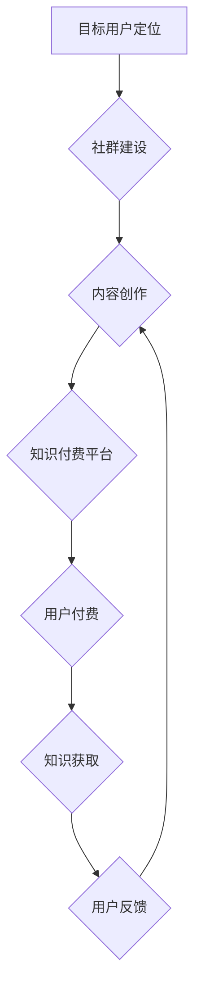

                 

## 知识付费：程序员的社群运营指导

> 关键词：知识付费、程序员、社群运营、内容创作、社区建设、技术分享、在线教育、商业模式

## 1. 背景介绍

在当今数字化时代，知识已成为最宝贵的资源之一。程序员作为科技发展的重要力量，拥有丰富的技术经验和专业技能。随着互联网的普及和技术迭代的加速，程序员们越来越意识到知识的价值，也渴望通过分享和传播自己的知识来获得回报。知识付费模式应运而生，为程序员提供了新的职业发展路径和收入来源。

知识付费是指通过提供有价值的知识和技能，向付费用户收取费用的一种商业模式。它涵盖了多种形式，例如在线课程、付费博客、技术文档、一对一指导等。对于程序员来说，知识付费提供了以下优势：

* **充分利用自身优势:** 程序员拥有专业的技术知识和实践经验，可以通过知识付费将这些优势转化为经济价值。
* **灵活自由的工作方式:** 知识付费模式不受地域和时间限制，程序员可以灵活安排自己的工作时间和地点。
* **建立个人品牌:** 通过高质量的知识付费内容，程序员可以建立个人品牌，提升行业影响力。
* **获得持续收入:** 知识付费内容可以重复销售，为程序员带来持续的收入来源。

## 2. 核心概念与联系

**2.1 知识付费的核心概念**

知识付费的核心概念是“价值交换”。付费用户通过支付费用获得有价值的知识和技能，而知识提供者则通过知识的传播获得收益。

**2.2 社群运营与知识付费的联系**

社群运营是知识付费的重要支撑。通过建立和运营一个活跃的社群，知识提供者可以：

* **精准定位目标用户:** 社群运营可以帮助程序员了解目标用户的需求和痛点，从而创作更符合用户需求的知识付费内容。
* **建立信任关系:** 社群运营可以帮助程序员与用户建立信任关系，提升用户对知识付费内容的认可度。
* **促进内容传播:** 社群成员可以互相分享和推荐知识付费内容，扩大内容的传播范围。
* **获取用户反馈:** 社群运营可以为程序员提供一个收集用户反馈的平台，帮助他们不断改进知识付费内容。

**2.3 社群运营与知识付费的流程图**



## 3. 核心算法原理 & 具体操作步骤

**3.1 算法原理概述**

知识付费的成功离不开有效的算法和策略。以下是一些常用的算法和策略：

* **内容推荐算法:** 基于用户的行为数据和偏好，推荐相关的知识付费内容。
* **价格优化算法:** 根据市场需求和用户支付意愿，动态调整知识付费内容的价格。
* **社群运营算法:** 分析社群成员的互动行为，识别活跃用户和潜在用户，并进行精准推送和引导。

**3.2 算法步骤详解**

* **内容推荐算法:**

    1. 收集用户行为数据，例如浏览记录、购买记录、评论记录等。
    2. 利用机器学习算法，构建用户兴趣模型。
    3. 根据用户兴趣模型，推荐相关的知识付费内容。

* **价格优化算法:**

    1. 分析市场需求和竞争对手价格。
    2. 利用A/B测试等方法，测试不同价格下的转化率。
    3. 根据测试结果，动态调整知识付费内容的价格。

* **社群运营算法:**

    1. 分析社群成员的互动行为，例如发帖、评论、点赞等。
    2. 利用聚类算法，识别活跃用户和潜在用户。
    3. 根据用户类型，进行精准推送和引导。

**3.3 算法优缺点**

* **内容推荐算法:**

    优点: 可以提高用户体验，提升知识付费内容的转化率。
    缺点: 可能存在推荐偏差，导致用户获取不到真正需要的知识。

* **价格优化算法:**

    优点: 可以提高知识付费内容的收益。
    缺点: 需要不断测试和调整，成本较高。

* **社群运营算法:**

    优点: 可以提高社群活跃度，促进知识付费内容的传播。
    缺点: 需要投入大量的时间和精力进行运营。

**3.4 算法应用领域**

* **在线教育平台:** 推荐课程、优化价格、运营学习社群。
* **技术博客:** 推荐文章、优化付费内容价格、运营技术社群。
* **知识付费平台:** 推荐知识付费内容、优化价格、运营用户社群。

## 4. 数学模型和公式 & 详细讲解 & 举例说明

**4.1 数学模型构建**

知识付费的成功可以看作是一个优化问题，目标是最大化知识提供者的收益，同时满足用户需求。我们可以构建一个数学模型来描述这个过程：

* **收益函数:**  R(p, q) = p * q，其中p是知识付费内容的价格，q是购买量。
* **需求函数:** q(p) = a - b * p，其中a和b是常数，代表用户对知识付费内容的需求和价格敏感度。

**4.2 公式推导过程**

将需求函数代入收益函数，得到一个关于价格p的收益函数：

R(p) = p * (a - b * p) = ap - bp^2

为了最大化收益，我们需要求解这个函数的极值点。

dR(p)/dp = a - 2bp = 0

解得： p = a / (2b)

**4.3 案例分析与讲解**

假设a = 100，b = 5，则最大化收益的价格为：

p = 100 / (2 * 5) = 10

这意味着，当知识付费内容的价格为10时，知识提供者可以获得最大的收益。

## 5. 项目实践：代码实例和详细解释说明

**5.1 开发环境搭建**

* **操作系统:** Windows/macOS/Linux
* **编程语言:** Python
* **框架:** Flask/Django
* **数据库:** MySQL/PostgreSQL

**5.2 源代码详细实现**

```python
from flask import Flask, render_template, request

app = Flask(__name__)

# 模拟用户数据
users = [
    {'id': 1, 'name': '张三', 'email': 'zhangsan@example.com'},
    {'id': 2, 'name': '李四', 'email': 'lisi@example.com'},
]

@app.route('/')
def index():
    return render_template('index.html', users=users)

@app.route('/login', methods=['POST'])
def login():
    # 处理用户登录逻辑
    return '登录成功'

if __name__ == '__main__':
    app.run(debug=True)
```

**5.3 代码解读与分析**

* **Flask框架:** 使用Flask框架构建了一个简单的Web应用。
* **路由:** 定义了两个路由，一个是首页，一个是登录页面。
* **模板:** 使用Jinja2模板引擎渲染HTML页面。
* **用户数据:** 模拟了用户数据，用于演示数据交互。
* **登录逻辑:** 模拟了用户登录逻辑，实际应用中需要实现真正的身份验证。

**5.4 运行结果展示**

运行代码后，访问`http://127.0.0.1:5000/`，可以访问到首页，并看到模拟的用户数据。

## 6. 实际应用场景

**6.1 在线课程平台**

* **知识付费内容:** 提供编程语言、框架、算法等方面的在线课程。
* **社群运营:** 建立学习社群，提供学习交流、答疑解惑等服务。
* **商业模式:** 通过课程订阅、会员制等方式获取收益。

**6.2 技术博客**

* **知识付费内容:** 提供技术文章、代码示例、工具推荐等付费内容。
* **社群运营:** 建立技术社群，提供技术交流、项目合作等服务。
* **商业模式:** 通过广告、会员制、赞助等方式获取收益。

**6.3 知识付费平台**

* **知识付费内容:** 提供各种类型的知识付费内容，例如编程、设计、写作、管理等。
* **社群运营:** 建立用户社群，提供学习交流、资源分享等服务。
* **商业模式:** 通过平台佣金、会员制等方式获取收益。

**6.4 未来应用展望**

随着人工智能、虚拟现实等技术的不断发展，知识付费模式将更加多元化和智能化。未来，我们可以看到：

* **个性化学习:** 基于用户的学习风格和需求，提供个性化的学习路径和内容。
* **沉浸式学习:** 利用虚拟现实等技术，打造沉浸式的学习体验。
* **智能化运营:** 利用人工智能技术，自动推荐内容、管理社群、优化价格等。

## 7. 工具和资源推荐

**7.1 学习资源推荐**

* **在线课程平台:** Udemy、Coursera、edX
* **技术博客:** Hacker News、Medium、Dev.to
* **开源社区:** GitHub、Stack Overflow

**7.2 开发工具推荐**

* **Web开发框架:** Flask、Django、React、Vue.js
* **数据库:** MySQL、PostgreSQL、MongoDB
* **云服务平台:** AWS、Azure、GCP

**7.3 相关论文推荐**

* **知识付费模式研究:** 
* **社群运营算法研究:** 
* **人工智能在知识付费领域的应用研究:** 

## 8. 总结：未来发展趋势与挑战

**8.1 研究成果总结**

知识付费模式为程序员提供了新的职业发展路径和收入来源，同时也为用户提供了获取高质量知识的机会。通过算法和策略的优化，知识付费模式将更加高效和智能化。

**8.2 未来发展趋势**

* **个性化学习:** 基于用户的学习风格和需求，提供个性化的学习路径和内容。
* **沉浸式学习:** 利用虚拟现实等技术，打造沉浸式的学习体验。
* **智能化运营:** 利用人工智能技术，自动推荐内容、管理社群、优化价格等。

**8.3 面临的挑战**

* **内容质量:** 知识付费内容的质量是关键，需要不断提升内容的专业性和实用性。
* **用户信任:** 建立用户信任是知识付费模式的关键，需要保证内容的真实性和可靠性。
* **商业模式创新:** 需要不断探索新的商业模式，以满足用户需求和市场变化。

**8.4 研究展望**

未来，我们将继续研究知识付费模式的优化算法、智能化运营策略以及新的商业模式，以推动知识付费模式的健康发展。

## 9. 附录：常见问题与解答

**9.1 如何选择合适的知识付费平台？**

* **平台用户规模:** 选择用户规模较大的平台，可以获得更多曝光机会。
* **平台收费标准:** 比较不同平台的收费标准，选择适合自己的平台。
* **平台运营服务:** 选择提供优质运营服务的平台，可以帮助你更好地推广和运营知识付费内容。

**9.2 如何提高知识付费内容的质量？**

* **深入研究:** 对所讲内容进行深入研究，确保内容的准确性和深度。
* **实践经验:** 将理论知识与实践经验结合，提供更实用性的内容。
* **用户反馈:** 收集用户反馈，不断改进内容的质量和结构。


作者：禅与计算机程序设计艺术 / Zen and the Art of Computer Programming 
<end_of_turn>

