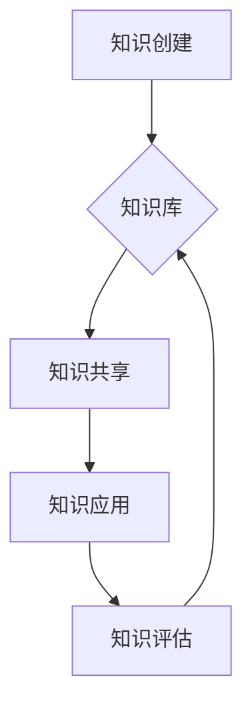

                 

## 知识管理策略：让知识发挥最大效益

> 关键词：知识管理、知识图谱、知识提取、知识共享、人工智能、数据分析、知识库

### 1. 背景介绍

在当今信息爆炸的时代，知识已成为企业和个人竞争的核心驱动力。海量数据和信息涌现，如何有效地获取、存储、组织、共享和利用知识，成为摆在各行各业面前的重大挑战。知识管理 (KM) 应运而生，旨在通过系统化的方法和工具，帮助组织和个人更好地管理知识资产，从而提升效率、创新能力和竞争力。

传统的知识管理方法往往依赖于人工整理和文档管理，效率低下，难以应对海量数据的挑战。随着人工智能 (AI) 技术的快速发展，特别是深度学习和自然语言处理 (NLP) 的突破，知识管理迎来了新的机遇。AI 赋能的知识管理系统能够自动提取、分类、关联和分析知识，实现知识的智能化管理和利用。

### 2. 核心概念与联系

知识管理的核心概念包括知识创建、知识共享、知识应用和知识评估。

* **知识创建:** 指的是将经验、见解、技能等转化为可共享的知识形式的过程。
* **知识共享:** 指的是将知识传播和交流给其他人，以便他们能够学习和利用。
* **知识应用:** 指的是将知识应用于实际问题解决，创造新的价值。
* **知识评估:** 指的是对知识的质量、有效性和时效性进行评估，确保知识的可靠性和价值。

**知识管理架构**



### 3. 核心算法原理 & 具体操作步骤

**3.1 算法原理概述**

AI 赋能的知识管理系统通常采用以下核心算法：

* **自然语言处理 (NLP):** 用于理解和处理自然语言文本，例如文本分类、实体识别、关系抽取等。
* **知识图谱 (KG):** 用于构建知识的结构化表示，例如实体、关系和属性，以便于知识的检索、推理和分析。
* **机器学习 (ML):** 用于从数据中学习知识模式，例如知识推荐、知识发现等。

**3.2 算法步骤详解**

1. **数据采集:** 收集各种形式的知识数据，例如文档、网站、数据库等。
2. **数据预处理:** 对数据进行清洗、格式化和转换，以便于后续算法处理。
3. **知识提取:** 使用 NLP 算法从数据中提取知识实体、关系和属性。
4. **知识表示:** 将提取的知识表示为知识图谱的形式。
5. **知识推理:** 使用规则引擎或机器学习模型进行知识推理，发现新的知识或关系。
6. **知识共享:** 将知识以多种形式共享给用户，例如搜索引擎、知识库、推荐系统等。
7. **知识评估:** 对知识的质量、有效性和时效性进行评估，并反馈到知识创建和知识提取环节，不断优化知识管理系统。

**3.3 算法优缺点**

**优点:**

* 自动化知识管理，提高效率。
* 挖掘隐藏的知识，发现新的价值。
* 个性化知识推荐，提升用户体验。

**缺点:**

* 需要大量高质量的数据进行训练。
* 算法的准确性和可靠性需要不断提升。
* 知识的解释性和可信度需要进一步研究。

**3.4 算法应用领域**

AI 赋能的知识管理算法广泛应用于各个领域，例如：

* **企业内部知识管理:** 帮助企业构建知识库，提高员工协作效率。
* **教育领域:** 提供个性化学习推荐，辅助教学和科研。
* **医疗领域:** 辅助医生诊断疾病，提高医疗效率。
* **金融领域:** 辅助风险管理和投资决策。

### 4. 数学模型和公式 & 详细讲解 & 举例说明

**4.1 数学模型构建**

知识图谱可以表示为一个三元组 (实体, 关系, 实体)，其中实体代表知识中的对象，关系代表实体之间的联系，例如“出生于”，“工作于”等。

**4.2 公式推导过程**

知识推理可以使用规则引擎或机器学习模型进行。规则引擎基于事先定义的规则进行推理，而机器学习模型则通过学习数据中的知识模式进行推理。

**举例说明:**

假设知识图谱中包含以下三元组:

* (张三, 出生于, 北京)
* (李四, 工作于, 北京)

如果规则是“出生于北京的人可能在北京工作”，则可以使用规则引擎推导出 (张三, 工作于, 北京) 的可能性。

**4.3 案例分析与讲解**

在医疗领域，知识图谱可以用于辅助医生诊断疾病。例如，如果患者的症状包括“头痛”、“发烧”和“咳嗽”，知识图谱可以根据这些症状与疾病之间的关系，推荐可能的疾病，并提供相应的治疗方案。

### 5. 项目实践：代码实例和详细解释说明

**5.1 开发环境搭建**

可以使用 Python 语言和相关的库进行知识管理系统的开发，例如：

* **SpaCy:** 用于自然语言处理任务，例如实体识别和关系抽取。
* **NetworkX:** 用于构建和分析知识图谱。
* **TensorFlow/PyTorch:** 用于训练机器学习模型。

**5.2 源代码详细实现**

以下是一个简单的知识图谱构建代码示例:

```python
import spacy

nlp = spacy.load("en_core_web_sm")

text = "张三出生于北京，工作于谷歌。"

doc = nlp(text)

entities = [(ent.text, ent.label_) for ent in doc.ents]

print(entities)

# 输出结果:
# [('张三', 'PERSON'), ('北京', 'GPE'), ('谷歌', 'ORG')]
```

**5.3 代码解读与分析**

该代码使用 SpaCy 库对文本进行分析，提取出实体和实体类型。

**5.4 运行结果展示**

运行结果显示了文本中的实体和实体类型，例如“张三”为 PERSON 类型， “北京”为 GPE 类型， “谷歌”为 ORG 类型。

### 6. 实际应用场景

**6.1 企业知识管理**

知识管理系统可以帮助企业构建知识库，记录和共享员工的经验和知识，提高员工协作效率和知识传承。

**6.2 教育领域**

知识图谱可以用于构建个性化学习推荐系统，根据学生的学习兴趣和知识水平，推荐合适的学习资源。

**6.3 医疗领域**

知识图谱可以辅助医生诊断疾病，提供患者的病史、症状和治疗方案等信息，帮助医生做出更准确的诊断。

**6.4 未来应用展望**

随着人工智能技术的不断发展，知识管理系统将更加智能化和个性化。未来，知识管理系统将能够：

* 自动生成知识文档和报告。
* 提供更精准的知识推荐和个性化学习体验。
* 辅助决策和解决复杂问题。

### 7. 工具和资源推荐

**7.1 学习资源推荐**

* **书籍:**

    * 《知识管理：理论与实践》
    * 《人工智能：改变世界的算法》

* **在线课程:**

    * Coursera: 知识管理
    * edX: 人工智能

**7.2 开发工具推荐**

* **知识图谱构建工具:**

    * Neo4j
    * RDF4J

* **自然语言处理工具:**

    * SpaCy
    * NLTK

**7.3 相关论文推荐**

* **知识图谱构建:**

    * “A Survey on Knowledge Graph Construction”

* **知识推理:**

    * “Knowledge Graph Reasoning: A Survey”

### 8. 总结：未来发展趋势与挑战

**8.1 研究成果总结**

AI 赋能的知识管理系统取得了显著的成果，能够有效地处理海量数据，挖掘隐藏的知识，并提供个性化的知识服务。

**8.2 未来发展趋势**

未来，知识管理系统将更加智能化、个性化和融合化。

* **智能化:** 利用更先进的 AI 算法，例如深度学习和强化学习，提高知识提取、推理和推荐的准确性和效率。
* **个性化:** 根据用户的需求和偏好，提供个性化的知识服务，例如个性化学习推荐、个性化知识发现等。
* **融合化:** 将知识管理与其他技术融合，例如大数据分析、云计算和物联网，构建更加智能和全面的知识管理系统。

**8.3 面临的挑战**

* **数据质量:** 知识管理系统依赖于高质量的数据，而现实世界的数据往往存在噪声、不完整和矛盾等问题。
* **知识表示:** 如何更好地表示复杂和多层次的知识，仍然是一个挑战。
* **知识可解释性:** AI 算法的决策过程往往难以解释，这使得知识管理系统的可信度和透明度受到质疑。

**8.4 研究展望**

未来研究将重点关注以下几个方面:

* 开发更 robust 和高效的知识提取和推理算法。
* 建立更加灵活和可扩展的知识表示模型。
* 提高知识管理系统的可解释性和透明度。


### 9. 附录：常见问题与解答

**9.1 如何构建知识图谱？**

构建知识图谱需要以下步骤:

1. 确定知识领域和知识类型。
2. 收集相关数据，例如文本、数据库等。
3. 使用 NLP 算法提取知识实体和关系。
4. 将提取的知识表示为知识图谱的形式。
5. 使用工具进行知识图谱的管理和维护。

**9.2 如何评估知识管理系统的效果？**

知识管理系统的效果可以从以下几个方面进行评估:

* 知识的准确性和完整性。
* 知识的发现和利用效率。
* 知识共享和协作效果。
* 知识管理系统的用户满意度。


作者：禅与计算机程序设计艺术 / Zen and the Art of Computer Programming 
<end_of_turn>

