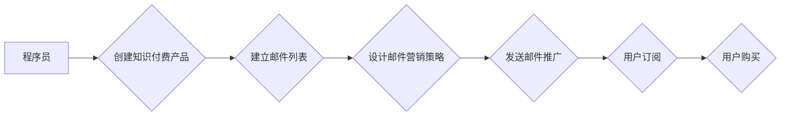

                 

## 程序员如何利用邮件营销推广知识付费

> 关键词：程序员、邮件营销、知识付费、推广策略、自动化、数据分析、转化率

## 1. 背景介绍

在当今数字时代，知识付费已成为一种蓬勃发展的商业模式。程序员作为技术领域的重要力量，拥有丰富的专业知识和经验，也具备成为知识付费创作者的潜力。然而，如何有效推广知识付费产品，吸引目标用户，并最终实现商业化目标，是许多程序员面临的挑战。邮件营销作为一种精准、高效的营销手段，为程序员提供了独特的推广优势。

## 2. 核心概念与联系

### 2.1 邮件营销

邮件营销是指通过电子邮件向目标受众发送营销信息，以推广产品、服务或品牌。它是一种直接、个性化的沟通方式，能够与受众建立更紧密的联系。

### 2.2 知识付费

知识付费是指通过付费的方式获取知识、技能或经验。它涵盖了各种形式的知识产品，例如在线课程、电子书、付费博客、咨询服务等。

### 2.3 核心概念联系

程序员可以通过邮件营销精准地触达目标用户，并有效推广其知识付费产品。邮件营销可以帮助程序员建立用户数据库，收集用户数据，并根据用户兴趣和需求进行个性化推送，提高用户转化率。

**Mermaid 流程图**



## 3. 核心算法原理 & 具体操作步骤

### 3.1 算法原理概述

邮件营销的核心算法原理在于数据分析和自动化。通过收集用户数据，分析用户行为，并根据分析结果进行个性化推送，可以提高邮件营销的效率和转化率。

### 3.2 算法步骤详解

1. **数据收集:** 收集用户邮箱地址、兴趣爱好、购买行为等数据。
2. **数据分析:** 分析用户数据，识别用户群体特征、兴趣偏好和购买习惯。
3. **邮件内容设计:** 根据用户数据，设计个性化、有吸引力的邮件内容。
4. **邮件发送:** 利用邮件营销平台，定时发送邮件到目标用户邮箱。
5. **数据跟踪:** 跟踪邮件打开率、点击率、转化率等数据，并根据数据进行调整和优化。

### 3.3 算法优缺点

**优点:**

* 精准触达目标用户
* 个性化内容推送
* 数据分析驱动优化
* 成本相对较低

**缺点:**

* 需要投入时间和精力进行数据收集和分析
* 邮件营销效果受用户邮箱过滤等因素影响
* 需要不断优化邮件内容和发送策略

### 3.4 算法应用领域

邮件营销广泛应用于各个领域，例如电商、教育、科技、金融等。对于程序员来说，可以利用邮件营销推广其知识付费产品，例如在线课程、电子书、付费博客等。

## 4. 数学模型和公式 & 详细讲解 & 举例说明

### 4.1 数学模型构建

邮件营销效果可以采用以下数学模型进行评估：

**转化率 = (购买用户数 / 邮件打开用户数) * 100%**

其中：

* 购买用户数：点击邮件链接并完成购买的用户数量
* 邮件打开用户数：打开邮件的用户数量

### 4.2 公式推导过程

该公式的推导过程基于以下假设：

* 邮件打开用户数代表了邮件营销的曝光度
* 购买用户数代表了邮件营销的转化效果

通过将购买用户数与邮件打开用户数进行比对，可以得到邮件营销的转化率，即邮件营销的有效性。

### 4.3 案例分析与讲解

假设程序员A发送了一封邮件推广其在线课程，邮件打开率为20%，点击率为5%，最终有100人购买了课程。

根据公式计算，转化率为：

转化率 = (100 / (20% * 1000)) * 100% = 50%

这意味着，程序员A的邮件营销效果良好，每100人打开邮件，就有50人购买了课程。

## 5. 项目实践：代码实例和详细解释说明

### 5.1 开发环境搭建

* 操作系统：Windows/macOS/Linux
* 编程语言：Python
* 邮件营销平台：Mailchimp/Sendinblue/GetResponse

### 5.2 源代码详细实现

```python
import smtplib
from email.mime.text import MIMEText
from email.mime.multipart import MIMEMultipart

def send_email(sender_email, sender_password, recipient_email, subject, body):
    msg = MIMEMultipart()
    msg['From'] = sender_email
    msg['To'] = recipient_email
    msg['Subject'] = subject
    msg.attach(MIMEText(body, 'plain'))

    with smtplib.SMTP_SSL('smtp.gmail.com', 465) as server:
        server.login(sender_email, sender_password)
        server.sendmail(sender_email, recipient_email, msg.as_string())

# 邮件发送示例
sender_email = 'your_email@gmail.com'
sender_password = 'your_password'
recipient_email = 'recipient_email@example.com'
subject = '知识付费产品推广'
body = '您好，\n\n欢迎关注我的知识付费产品，了解更多信息请访问：https://www.example.com'

send_email(sender_email, sender_password, recipient_email, subject, body)
```

### 5.3 代码解读与分析

该代码示例演示了如何使用Python发送邮件。

* 首先，导入必要的库，例如smtplib用于发送邮件，MIMEText用于创建邮件正文，MIMEMultipart用于创建邮件主体。
* 然后，定义一个函数`send_email`，该函数接受发送者邮箱、密码、接收者邮箱、主题和正文作为参数，并发送邮件。
* 最后，使用示例数据调用`send_email`函数发送邮件。

### 5.4 运行结果展示

成功发送邮件后，接收者会收到一封包含主题和正文的邮件。

## 6. 实际应用场景

程序员可以将邮件营销应用于以下场景：

* **推广在线课程:** 向目标用户发送课程介绍邮件，突出课程优势和价值，并提供优惠折扣。
* **发布电子书:** 向用户发送电子书预告邮件，分享电子书内容和写作理念，并引导用户购买。
* **建立付费博客:** 向用户发送博客文章更新邮件，分享技术 insights 和经验，并引导用户订阅付费博客。
* **提供咨询服务:** 向用户发送咨询服务介绍邮件，介绍服务内容和收费标准，并引导用户预约咨询。

### 6.4 未来应用展望

随着人工智能和自动化技术的不断发展，邮件营销将更加智能化和个性化。程序员可以利用这些技术，例如机器学习和自然语言处理，进一步优化邮件内容和发送策略，提高邮件营销效果。

## 7. 工具和资源推荐

### 7.1 学习资源推荐

* **邮件营销书籍:** 《邮件营销实战》、《邮件营销 bible》
* **在线课程:** Udemy、Coursera、Skillshare

### 7.2 开发工具推荐

* **邮件营销平台:** Mailchimp、Sendinblue、GetResponse
* **Python库:** smtplib、email

### 7.3 相关论文推荐

* **邮件营销效果评估:** 《邮件营销效果评估方法研究》
* **邮件营销个性化推送:** 《基于用户行为分析的邮件营销个性化推送方法》

## 8. 总结：未来发展趋势与挑战

### 8.1 研究成果总结

邮件营销作为一种高效的营销手段，为程序员推广知识付费产品提供了独特的优势。通过数据分析、自动化和个性化推送，程序员可以提高邮件营销效果，实现商业化目标。

### 8.2 未来发展趋势

未来，邮件营销将更加智能化和个性化。人工智能和自动化技术将进一步优化邮件内容和发送策略，提高邮件营销效率。

### 8.3 面临的挑战

* **用户邮箱过滤:** 邮件营销效果受用户邮箱过滤等因素影响。
* **数据隐私保护:** 程序员需要遵守数据隐私保护法规，确保用户数据安全。
* **邮件营销内容创作:** 需要不断创作高质量、有吸引力的邮件内容。

### 8.4 研究展望

未来研究方向包括：

* **更精准的用户画像构建:** 利用更先进的机器学习算法，构建更精准的用户画像，实现更个性化的邮件推送。
* **邮件营销自动化程度提升:** 利用人工智能技术，实现邮件营销的自动化，例如自动生成邮件内容、自动发送邮件等。
* **邮件营销效果评估指标优化:** 开发更科学、更全面的邮件营销效果评估指标，更好地衡量邮件营销效果。

## 9. 附录：常见问题与解答

**Q1: 如何建立邮件列表？**

A1: 可以通过网站注册表单、线下活动报名、社交媒体推广等方式收集用户邮箱地址。

**Q2: 如何设计吸引人的邮件内容？**

A2: 邮件内容应简洁明了、有吸引力，并突出知识付费产品的价值和优势。可以使用图片、视频等多媒体元素，增强邮件的可读性。

**Q3: 如何提高邮件打开率和点击率？**

A3: 可以使用个性化邮件主题、发送时间优化、A/B测试等方法提高邮件打开率和点击率。

**Q4: 如何避免邮件被标记为垃圾邮件？**

A4: 遵守邮件营销规范，避免使用过度营销的语言，并提供清晰的退订链接。

**Q5: 如何评估邮件营销效果？**

A5: 可以通过邮件打开率、点击率、转化率等指标评估邮件营销效果。

作者：禅与计算机程序设计艺术 / Zen and the Art of Computer Programming


<end_of_turn>

