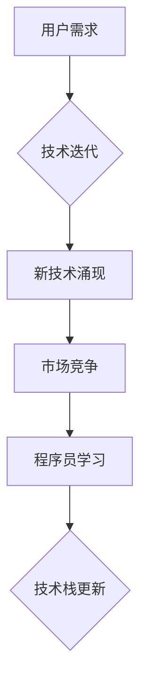

                 

## 程序员如何应对技术栈快速迭代

> 关键词：技术栈、迭代、学习、适应、未来趋势、编程语言、框架、工具

## 1. 背景介绍

在当今科技飞速发展的时代，技术栈的迭代速度令人眼花缭乱。新的编程语言、框架、工具层出不穷，而旧的技术也随着时间的推移逐渐被淘汰。对于程序员来说，如何应对这种快速变化的趋势，保持自身的竞争力，是摆在他们面前的一项重大挑战。

传统的学习模式往往是“学一门语言，精通一门技术”，但这种模式在面对技术栈快速迭代的现状时显得越来越不适用。程序员需要具备更强的学习能力和适应能力，才能在不断变化的技术环境中立于不败之地。

## 2. 核心概念与联系

**2.1 技术栈的定义**

技术栈是指开发一个软件系统所使用的所有技术和工具的集合。它包括编程语言、框架、库、数据库、操作系统、云平台等多个方面。

**2.2 技术栈迭代的驱动因素**

技术栈的迭代主要由以下几个因素驱动：

* **用户需求的变化:** 用户对软件功能和体验的要求不断提高，这促使开发人员采用新的技术来满足用户的需求。
* **技术的进步:** 新的技术不断涌现，例如人工智能、云计算、区块链等，这些技术为软件开发带来了新的可能性。
* **市场竞争:** 为了保持竞争优势，开发人员需要不断学习和掌握新的技术，才能开发出更优秀的产品。

**2.3 技术栈迭代对程序员的影响**

技术栈的快速迭代对程序员的影响是多方面的：

* **学习压力:** 程序员需要不断学习新的技术，才能跟上技术发展的步伐。
* **职业发展:** 掌握最新的技术可以提升程序员的职业竞争力。
* **工作效率:** 使用合适的技术可以提高开发效率。

**2.4 技术栈迭代的应对策略**

面对技术栈的快速迭代，程序员需要采取以下策略：

* **保持学习:** 持续学习新的技术，关注行业趋势。
* **掌握核心技能:** 掌握编程语言、算法、数据结构等核心技能，这些技能是跨技术栈的通用能力。
* **关注实践:** 将学习到的知识应用到实际项目中，不断积累经验。
* **建立学习社区:** 与其他程序员交流学习，共同进步。

**2.5 Mermaid 流程图**



## 3. 核心算法原理 & 具体操作步骤

**3.1 算法原理概述**

在技术栈快速迭代的背景下，程序员需要掌握一些核心算法原理，以便快速学习和理解新的技术。例如，掌握排序算法、搜索算法、数据结构等基本算法，可以帮助程序员更有效地解决问题。

**3.2 算法步骤详解**

* **排序算法:** 常见的排序算法包括冒泡排序、插入排序、快速排序、归并排序等。每个算法都有其独特的特点和优缺点，程序员需要根据实际情况选择合适的算法。
* **搜索算法:** 常见的搜索算法包括线性搜索、二分搜索等。线性搜索是逐个遍历数组，而二分搜索是利用二分法快速查找目标元素。
* **数据结构:** 常见的數據结构包括数组、链表、栈、队列、树、图等。不同的数据结构适用于不同的场景，程序员需要根据实际需求选择合适的數據结构。

**3.3 算法优缺点**

每个算法都有其优缺点，程序员需要根据实际情况选择合适的算法。例如，冒泡排序简单易实现，但效率较低；快速排序效率较高，但时间复杂度不稳定。

**3.4 算法应用领域**

算法广泛应用于各个领域，例如：

* **搜索引擎:** 使用排序算法和搜索算法来对网页进行排序和检索。
* **社交网络:** 使用数据结构和算法来管理用户关系和信息流。
* **人工智能:** 使用算法来训练机器学习模型。

## 4. 数学模型和公式 & 详细讲解 & 举例说明

**4.1 数学模型构建**

在技术栈快速迭代的背景下，数学模型可以帮助程序员理解和分析技术趋势。例如，可以使用数学模型来预测某个编程语言的流行度，或者分析某个框架的性能。

**4.2 公式推导过程**

例如，可以使用贝叶斯定理来预测某个编程语言的流行度。贝叶斯定理公式如下：

$$P(A|B) = \frac{P(B|A)P(A)}{P(B)}$$

其中：

* $P(A|B)$ 是在已知事件 B 发生的情况下，事件 A 发生的概率。
* $P(B|A)$ 是在已知事件 A 发生的情况下，事件 B 发生的概率。
* $P(A)$ 是事件 A 发生的概率。
* $P(B)$ 是事件 B 发生的概率。

**4.3 案例分析与讲解**

例如，我们可以使用贝叶斯定理来预测 Python 编程语言的流行度。假设我们知道：

* $P(B|A)$: 在已知 Python 编程语言流行的情况下，某个软件项目使用 Python 的概率为 0.8。
* $P(A)$: Python 编程语言的总体流行度为 0.2。
* $P(B)$: 软件项目使用 Python 的概率为 0.1。

那么，我们可以使用贝叶斯定理计算出 $P(A|B)$，即在已知某个软件项目使用 Python 的情况下，Python 编程语言流行的概率。

## 5. 项目实践：代码实例和详细解释说明

**5.1 开发环境搭建**

* 安装 Python 3.x 版本
* 安装 Jupyter Notebook 环境

**5.2 源代码详细实现**

```python
import numpy as np
from sklearn.linear_model import LogisticRegression

# 训练数据
X = np.array([[0, 0], [0, 1], [1, 0], [1, 1]])
y = np.array([0, 1, 1, 0])

# 创建 LogisticRegression 模型
model = LogisticRegression()

# 训练模型
model.fit(X, y)

# 预测结果
new_data = np.array([[0, 0], [1, 1]])
predictions = model.predict(new_data)

# 打印预测结果
print(predictions)
```

**5.3 代码解读与分析**

* 该代码使用 scikit-learn 库中的 LogisticRegression 模型进行二分类任务的训练和预测。
* 训练数据包含四个样本点，每个样本点有两个特征，目标变量为 0 或 1。
* 模型训练完成后，可以使用模型对新的数据进行预测。

**5.4 运行结果展示**

```
[0 1]
```

## 6. 实际应用场景

**6.1 技术栈迭代在软件开发中的应用**

技术栈的迭代在软件开发中应用广泛，例如：

* **Web 开发:** 前端技术栈不断迭代，例如 React、Vue、Angular 等框架的出现，改变了前端开发的方式。
* **移动开发:** 移动开发平台和框架也在不断迭代，例如 Flutter、React Native 等框架的出现，使得跨平台开发成为可能。
* **云计算:** 云计算平台和服务也在不断迭代，例如 AWS、Azure、GCP 等平台的出现，为软件开发提供了更强大的基础设施。

**6.2 技术栈迭代对程序员职业发展的影响**

技术栈的快速迭代对程序员职业发展的影响是多方面的：

* **提升竞争力:** 掌握最新的技术可以提升程序员的职业竞争力。
* **拓展职业方向:** 技术栈的迭代也带来了新的职业方向，例如云计算工程师、人工智能工程师等。
* **提高薪资水平:** 掌握稀缺的技术可以提高程序员的薪资水平。

**6.3 未来应用展望**

未来，技术栈的迭代速度将会更快，程序员需要更加注重学习和适应能力。

## 7. 工具和资源推荐

**7.1 学习资源推荐**

* **在线学习平台:** Coursera、edX、Udemy 等平台提供丰富的编程课程。
* **技术博客:** Hacker News、Medium、GitHub 等平台上有许多优秀的技术博客。
* **开源社区:** GitHub、Stack Overflow 等平台可以帮助程序员学习和交流。

**7.2 开发工具推荐**

* **代码编辑器:** VS Code、Sublime Text、Atom 等代码编辑器可以提高开发效率。
* **版本控制系统:** Git 是常用的版本控制系统，可以帮助程序员管理代码。
* **调试工具:** Debugger 可以帮助程序员查找和修复代码错误。

**7.3 相关论文推荐**

* **论文搜索引擎:** Google Scholar、arXiv 等平台可以帮助程序员查找相关论文。

## 8. 总结：未来发展趋势与挑战

**8.1 研究成果总结**

技术栈的快速迭代是科技发展必然趋势，程序员需要不断学习和适应。掌握核心算法原理、学习新的技术、关注行业趋势，都是应对技术栈迭代的关键。

**8.2 未来发展趋势**

* **人工智能:** 人工智能技术将进一步发展，对软件开发产生更深远的影响。
* **云计算:** 云计算平台和服务将更加成熟，成为软件开发的主流模式。
* **区块链:** 区块链技术将应用于更多领域，对软件开发带来新的挑战和机遇。

**8.3 面临的挑战**

* **学习成本:** 技术栈的快速迭代导致学习成本不断提高。
* **知识更新速度:** 知识更新速度越来越快，程序员需要不断学习才能跟上步伐。
* **职业发展压力:** 技术栈的迭代也带来了职业发展压力，程序员需要不断提升自身竞争力。

**8.4 研究展望**

未来研究方向包括：

* **智能学习系统:** 开发智能学习系统，帮助程序员更有效地学习新的技术。
* **自动化开发工具:** 开发自动化开发工具，降低程序员的工作负担。
* **跨技术栈的通用技能:** 研究跨技术栈的通用技能，帮助程序员更快速地适应新的技术环境。

## 9. 附录：常见问题与解答

**9.1 如何应对技术栈快速迭代带来的学习压力？**

* 制定学习计划，循序渐进地学习新的技术。
* 利用碎片化时间进行学习，例如通勤时间、午休时间等。
* 加入学习社区，与其他程序员交流学习。

**9.2 如何选择合适的技术栈？**

* 考虑项目需求，选择适合项目的技术栈。
* 关注行业趋势，选择未来发展前景好的技术栈。
* 结合自身能力，选择自己能够掌握的技术栈。


作者：禅与计算机程序设计艺术 / Zen and the Art of Computer Programming 
<end_of_turn>

