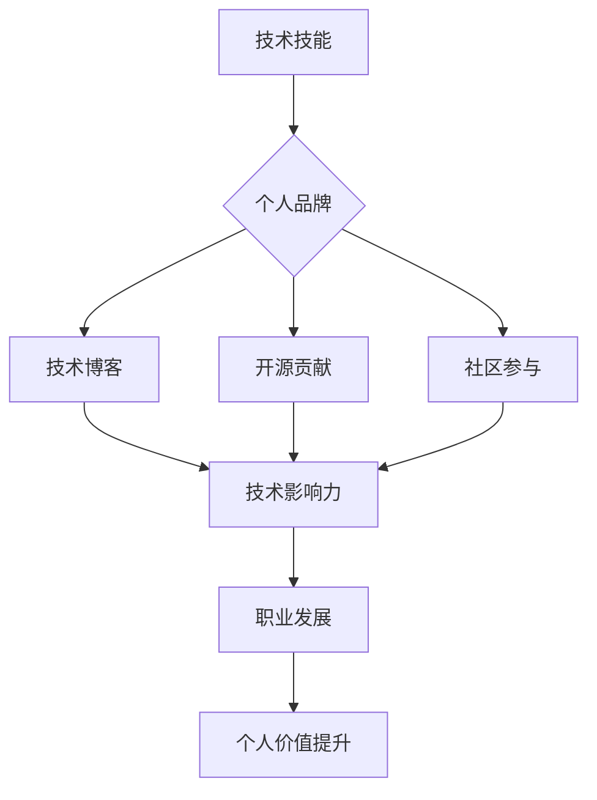

                 

## 程序员如何打造个人影响力

> 关键词：个人品牌、技术博客、开源贡献、社区参与、演讲分享、网络平台、学习成长、持续输出、专业技能、软技能

## 1. 背景介绍

在当今科技日新月异的时代，程序员作为数字世界的核心力量，拥有着前所未有的机遇和挑战。技术技能的快速迭代和市场需求的不断变化，要求程序员不断学习和提升，并积极拓展自己的影响力。打造个人影响力不仅可以提升个人价值，还能为职业发展打开更多可能性。

然而，许多程序员在技术领域取得了成功，却在个人影响力方面却显得力不从心。他们可能缺乏有效的个人品牌建设策略，或者不知道如何将自己的技术经验和见解分享给更广泛的群体。

## 2. 核心概念与联系

个人影响力是个人在特定领域或群体中所拥有的声誉、认可度和影响力。对于程序员而言，个人影响力可以体现在以下几个方面：

* **技术领域的影响力:** 通过撰写技术博客、开源贡献、参与技术社区等方式，分享自己的技术经验和见解，成为技术领域的专家和引领者。
* **个人品牌的影响力:** 建立独特的个人品牌，展现自己的专业技能、价值观和个人特质，吸引关注和认可。
* **职业发展的影响力:** 通过个人影响力，拓展人脉关系，获得更多职业机会，提升职业竞争力。

**核心概念与联系流程图:**



## 3. 核心算法原理 & 具体操作步骤

打造个人影响力并非一蹴而就，需要程序员们运用一定的策略和方法，循序渐进地提升自己的影响力。

### 3.1  算法原理概述

打造个人影响力的核心算法可以概括为以下几个步骤：

1. **明确目标:** 确定想要在哪个领域或群体中建立影响力，并设定具体的目标。
2. **打造个人品牌:** 构建独特的个人品牌，展现自己的专业技能、价值观和个人特质。
3. **持续输出:** 定期发布高质量的技术内容，例如博客文章、开源项目、演讲分享等。
4. **积极参与社区:** 加入技术社区，与其他程序员交流学习，分享经验，建立人脉关系。
5. **拓展平台:** 利用网络平台，例如社交媒体、个人网站等，扩大自己的影响力。

### 3.2  算法步骤详解

**步骤一：明确目标**

* 确定目标领域：例如，人工智能、云计算、移动开发等。
* 设定目标群体：例如，初学者、企业开发者、技术领导者等。
* 制定目标指标：例如，博客文章阅读量、开源项目贡献度、社区活跃度等。

**步骤二：打造个人品牌**

* 确定个人定位：例如，技术专家、经验分享者、创新者等。
* 设计个人形象：例如，头像、个人网站、社交媒体简介等。
* 撰写个人故事：分享自己的技术经历、学习历程和个人价值观。

**步骤三：持续输出**

* 定期发布高质量内容：例如，技术博客文章、开源项目代码、演讲稿等。
* 关注内容质量：内容要原创、有价值、易于理解。
* 选择合适的平台：例如，技术博客平台、开源代码托管平台、演讲分享平台等。

**步骤四：积极参与社区**

* 加入技术社区：例如，Stack Overflow、GitHub、微信群等。
* 积极参与讨论：解答问题、分享经验、提出建议等。
* 建立人脉关系：与其他程序员交流学习，互相帮助。

**步骤五：拓展平台**

* 利用社交媒体：例如，Twitter、LinkedIn、微信公众号等，分享自己的技术内容和观点。
* 建立个人网站：展示自己的个人品牌、技术作品和联系方式。
* 参加技术活动：例如，技术会议、开源项目集会等，扩大自己的影响力。

### 3.3  算法优缺点

**优点:**

* 提升个人价值：打造个人影响力可以提升个人技术水平、专业技能和个人品牌价值。
* 拓展职业机会：个人影响力可以帮助程序员获得更多职业机会，例如技术咨询、演讲邀请、开源项目合作等。
* 促进学习成长：持续输出和社区参与可以促进程序员的学习成长，不断提升自己的技术水平和专业能力。

**缺点:**

* 需要投入时间和精力：打造个人影响力需要程序员们持续投入时间和精力，例如撰写博客文章、参与社区讨论等。
* 需要一定的技巧和策略：程序员需要掌握一定的写作技巧、沟通技巧和网络营销技巧，才能有效地打造个人影响力。
* 竞争激烈：技术领域是一个竞争激烈的领域，程序员需要不断努力才能脱颖而出。

### 3.4  算法应用领域

打造个人影响力的算法可以应用于以下领域：

* **技术领域:** 程序员可以利用这个算法提升自己的技术影响力，成为技术领域的专家和引领者。
* **创业领域:** 创业者可以利用这个算法打造个人品牌，吸引投资人和用户。
* **教育领域:** 教师可以利用这个算法提升自己的教学影响力，分享自己的教学经验和理念。

## 4. 数学模型和公式 & 详细讲解 & 举例说明

打造个人影响力的过程可以抽象为一个数学模型，其中影响力可以看作是一个函数，取决于多个因素，例如技术技能、个人品牌、内容输出、社区参与等。

**4.1  数学模型构建**

```
影响力 = f(技术技能, 个人品牌, 内容输出, 社区参与)
```

其中：

* **技术技能:** 指程序员的专业技术水平，例如编程语言、框架、算法等。
* **个人品牌:** 指程序员的个人形象、价值观和专业定位。
* **内容输出:** 指程序员发布的技术内容的质量和数量，例如博客文章、开源项目、演讲分享等。
* **社区参与:** 指程序员参与技术社区的活跃度和贡献度，例如解答问题、分享经验、提出建议等。

**4.2  公式推导过程**

每个因素对影响力的贡献度可以根据其重要性和权重进行量化，例如：

* 技术技能的权重为 0.4
* 个人品牌的权重为 0.3
* 内容输出的权重为 0.2
* 社区参与的权重为 0.1

则影响力公式可以推导为：

```
影响力 = 0.4 * 技术技能 + 0.3 * 个人品牌 + 0.2 * 内容输出 + 0.1 * 社区参与
```

**4.3  案例分析与讲解**

假设有两个程序员，A 和 B，他们的技术技能、个人品牌、内容输出和社区参与情况如下：

* A: 技术技能: 高级，个人品牌: 良好，内容输出: 频繁，社区参与: 积极
* B: 技术技能: 中级，个人品牌: 一般，内容输出: 偶尔，社区参与: 很少

根据公式推导，A 的影响力得分将高于 B，因为 A 在所有方面都表现出色。

## 5. 项目实践：代码实例和详细解释说明

### 5.1  开发环境搭建

打造个人影响力需要搭建一个合适的开发环境，例如：

* **博客平台:** 选择一个适合的技术博客平台，例如 WordPress、Medium、GitHub Pages 等。
* **代码托管平台:** 选择一个代码托管平台，例如 GitHub、GitLab、Bitbucket 等，用于托管开源项目代码。
* **社交媒体平台:** 选择合适的社交媒体平台，例如 Twitter、LinkedIn、微信公众号等，用于分享技术内容和观点。

### 5.2  源代码详细实现

以下是一个简单的技术博客网站的源代码示例，使用 HTML、CSS 和 JavaScript 实现：

```html
<!DOCTYPE html>
<html>
<head>
  <title>我的技术博客</title>
  <link rel="stylesheet" href="style.css">
</head>
<body>
  <h1>我的技术博客</h1>
  <div class="post">
    <h2>我的第一篇文章</h2>
    <p>这是我的第一篇文章，内容主要介绍了...</p>
  </div>
  <script src="script.js"></script>
</body>
</html>
```

```css
body {
  font-family: sans-serif;
}

h1 {
  text-align: center;
}

.post {
  margin: 20px;
  padding: 10px;
  border: 1px solid #ccc;
}
```

### 5.3  代码解读与分析

* HTML 代码定义了博客网站的基本结构，包括标题、文章内容等。
* CSS 代码定义了博客网站的样式，例如字体、颜色、布局等。
* JavaScript 代码可以用于实现博客网站的交互功能，例如评论、点赞等。

### 5.4  运行结果展示

运行上述代码，可以生成一个简单的技术博客网站，展示文章标题和内容。

## 6. 实际应用场景

打造个人影响力的实践案例遍布各个技术领域，以下是一些例子：

* **开源贡献者:** 通过开源项目贡献代码、文档和测试，积累技术经验，提升个人影响力。例如，Linux内核开发者 Linus Torvalds，通过开源 Linux 操作系统，成为了全球知名的技术领袖。
* **技术博主:** 通过撰写技术博客文章，分享自己的技术经验和见解，吸引读者关注，建立个人品牌。例如，程序员社区 Stack Overflow 的创始人 Joel Spolsky，通过技术博客文章，成为了软件开发领域的知名专家。
* **演讲分享者:** 通过参加技术会议和举办个人演讲，分享自己的技术成果和经验，扩大个人影响力。例如，程序员社区 GitHub 的创始人 Tom Preston-Werner，通过技术演讲，成为了开源软件领域的知名人物。

### 6.4  未来应用展望

随着科技发展和互联网的普及，打造个人影响力的重要性将更加凸显。未来，程序员可以通过以下方式进一步拓展个人影响力：

* **利用人工智能技术:** 利用人工智能技术，例如机器学习、自然语言处理等，提升内容创作效率和质量，更好地与读者互动。
* **打造虚拟形象:** 利用虚拟现实和增强现实技术，打造虚拟形象，进行线上互动和演讲分享，拓展影响力范围。
* **参与元宇宙建设:** 参与元宇宙的建设，在虚拟世界中建立自己的社区和品牌，拓展新的影响力领域。

## 7. 工具和资源推荐

### 7.1  学习资源推荐

* **在线学习平台:** Coursera、edX、Udemy 等平台提供丰富的技术课程和学习资源。
* **技术博客:** Hacker News、Medium、Dev.to 等平台汇聚了众多技术博主的优质文章。
* **开源社区:** GitHub、GitLab、Bitbucket 等平台提供了大量的开源项目和技术文档。

### 7.2  开发工具推荐

* **代码编辑器:** VS Code、Sublime Text、Atom 等代码编辑器提供了丰富的功能和插件，提高代码编写效率。
* **版本控制系统:** Git 是常用的版本控制系统，用于管理代码版本和协同开发。
* **部署工具:** Docker、Kubernetes 等工具可以帮助程序员快速部署和管理应用程序。

### 7.3  相关论文推荐

* **"The Impact of Social Media on Personal Branding"**
* **"The Role of Content Marketing in Building Personal Brand"**
* **"The Future of Personal Branding in the Digital Age"**

## 8. 总结：未来发展趋势与挑战

### 8.1  研究成果总结

打造个人影响力是一个持续发展的过程，需要程序员们不断学习和提升。通过分析上述算法原理、实践案例和工具资源，我们可以总结出以下几点：

* 技术技能是打造个人影响力的基础，需要不断学习和提升。
* 个人品牌是程序员的独特标识，需要精心打造和维护。
* 内容输出是提升个人影响力的关键，需要持续发布高质量的内容。
* 社区参与是拓展个人影响力的有效途径，需要积极参与技术社区。

### 8.2  未来发展趋势

未来，打造个人影响力将更加注重以下几个方面：

* **个性化定制:** 利用人工智能技术，为每个程序员提供个性化的影响力提升方案。
* **跨平台整合:** 将个人影响力拓展到多个平台，例如社交媒体、博客平台、视频平台等。
* **虚拟化体验:** 利用虚拟现实和增强现实技术，打造沉浸式的个人品牌体验。

### 8.3  面临的挑战

打造个人影响力也面临着一些挑战：

* **信息爆炸:** 互联网信息量巨大，如何脱颖而出，吸引读者关注是一个挑战。
* **竞争激烈:** 技术领域竞争激烈，需要程序员们不断努力才能保持竞争力。
* **时间成本:** 打造个人影响力需要投入大量时间和精力，需要程序员们合理规划时间。

### 8.4  研究展望

未来，研究人员可以继续探索以下方向：

* **开发更有效的个人影响力提升算法:** 基于人工智能技术，开发更精准、更有效的个人影响力提升算法。
* **研究不同领域程序员的影响力差异:** 研究不同技术领域、不同经验水平的程序员，其影响力形成机制和特点。
* **探讨个人影响力与职业成功的关联:** 研究个人影响力与程序员职业发展、薪资水平等因素之间的关联。

## 9. 附录：常见问题与解答

**问题一：如何打造个人品牌？**

**解答：**

* 确定个人定位：例如，技术专家、经验分享者、创新者等。
* 设计个人形象：例如，头像、个人网站、社交媒体简介等。
* 撰写个人故事：分享自己的技术经历、学习历程和个人价值观。

**问题二：如何持续输出高质量内容？**

**解答：**

* 选择合适的平台：例如，技术博客平台、开源代码托管平台、演讲分享平台等。
* 定期发布内容：例如，每周发布一篇博客文章、每月贡献一个开源项目等。
* 关注内容质量：内容要原创、有价值、易于理解。

**问题三：如何参与技术社区？**

**解答：**

* 加入技术社区：例如，Stack Overflow、GitHub、微信群等。
* 积极参与讨论：解答问题、分享经验、提出建议等。
* 建立人脉关系：与其他程序员交流学习，互相帮助。


作者：禅与计算机程序设计艺术 / Zen and the Art of Computer Programming<end_of_turn>

