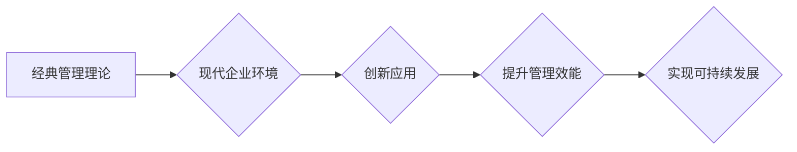

                 

## 经典管理理论在现代企业中的创新应用

> 关键词：管理理论、现代企业、创新应用、流程优化、数据驱动、人工智能、敏捷开发、团队协作

## 1. 背景介绍

在瞬息万变的现代社会，企业面临着前所未有的挑战和机遇。激烈的市场竞争、快速变化的技术环境、不断演变的客户需求，都迫使企业不断寻求创新和变革，以保持竞争力。经典管理理论，作为管理学发展的重要里程碑，为企业提供了宝贵的管理经验和方法论。然而，传统的管理理论在面对现代企业的复杂性和动态性时，往往显得不够灵活和有效。因此，将经典管理理论与现代技术和理念相结合，进行创新应用，成为企业提升管理效能、实现可持续发展的关键。

## 2. 核心概念与联系

### 2.1  经典管理理论概述

经典管理理论主要指20世纪初兴起的管理学理论体系，代表人物包括泰勒、韦伯、吉布斯等。这些理论强调科学管理、制度化管理、分工合作等原则，为企业管理提供了结构化和标准化的框架。

* **科学管理 (Scientific Management):** 泰勒提出的科学管理强调通过科学的方法和工具提高工作效率，包括工作标准化、时间与动作研究、激励机制等。
* **官僚制 (Bureaucracy):** 韦伯提出的官僚制强调建立完善的组织结构、明确的职责分工、规范的程序和规则，以实现管理的效率和公平性。
* **行政管理 (Administrative Management):** Fayol提出的行政管理强调管理者的职责和技能，包括计划、组织、指挥、协调和控制等五大管理职能。

### 2.2  现代企业环境

现代企业面临着以下特点：

* **快速变化:** 科技发展日新月异，市场需求不断变化，企业需要快速适应环境变化，才能保持竞争力。
* **复杂性:** 企业规模不断扩大，业务范围不断拓展，内部流程和外部环境都变得更加复杂。
* **全球化:** 企业经营范围跨越国界，需要应对不同文化和制度环境的挑战。
* **数据化:** 企业积累了大量的数据，需要利用数据分析和挖掘，为决策提供支持。

### 2.3  经典管理理论与现代企业环境的联系

经典管理理论虽然诞生于工业革命时期，但其核心价值观和管理原则仍然具有指导意义。例如，科学管理的精益化理念、官僚制的制度化管理、行政管理的五大职能，都可以在现代企业中得到应用和创新。

**Mermaid 流程图**



## 3. 核心算法原理 & 具体操作步骤

### 3.1  算法原理概述

在现代企业中，经典管理理论的创新应用需要借助现代算法和技术手段。例如，数据分析算法可以帮助企业挖掘数据中的价值，优化决策；人工智能算法可以帮助企业自动化流程，提高效率；敏捷开发方法可以帮助企业快速响应市场变化，迭代产品。

### 3.2  算法步骤详解

以下是一些经典管理理论与现代算法结合的具体应用案例：

* **科学管理与数据分析:** 通过数据分析，可以识别出生产流程中的瓶颈和浪费，并制定相应的改进措施。例如，利用机器学习算法分析生产数据，预测设备故障，提前进行维护，提高生产效率。
* **官僚制与流程自动化:** 通过流程自动化，可以提高管理效率，减少人为错误。例如，利用 RPA（机器人流程自动化）技术，自动完成重复性任务，例如审批流程、数据录入等。
* **行政管理与人工智能:** 通过人工智能，可以辅助管理者进行决策，提高决策效率。例如，利用自然语言处理技术，分析员工反馈，识别潜在的问题，并提供解决方案。

### 3.3  算法优缺点

* **数据分析算法:** 优点：能够挖掘数据中的价值，提供数据驱动的决策支持。缺点：需要大量的数据支持，算法模型的构建和维护需要专业技术。
* **人工智能算法:** 优点：能够自动完成复杂的任务，提高效率。缺点：算法模型的训练需要大量的数据和计算资源，存在黑盒效应，难以解释算法的决策过程。
* **敏捷开发方法:** 优点：能够快速响应市场变化，迭代产品。缺点：需要团队成员具备高水平的协作能力和沟通能力。

### 3.4  算法应用领域

* **生产管理:** 优化生产流程，提高生产效率。
* **人力资源管理:** 人才招聘、培训、绩效评估等。
* **财务管理:** 财务分析、风险管理等。
* **市场营销:** 市场调研、客户关系管理等。

## 4. 数学模型和公式 & 详细讲解 & 举例说明

### 4.1  数学模型构建

经典管理理论中的许多概念可以用数学模型来表示，例如，韦伯提出的官僚制模型可以描述组织结构和权力分配的关系。

### 4.2  公式推导过程

例如，泰勒提出的时间与动作研究可以利用数学公式来计算工作效率。

### 4.3  案例分析与讲解

例如，可以使用数学模型分析生产线上的瓶颈，并通过公式计算优化后的生产效率。

## 5. 项目实践：代码实例和详细解释说明

### 5.1  开发环境搭建

使用Python语言和相关库，例如pandas、scikit-learn等，搭建数据分析和机器学习的开发环境。

### 5.2  源代码详细实现

```python
import pandas as pd
from sklearn.model_selection import train_test_split
from sklearn.linear_model import LinearRegression

# 加载数据
data = pd.read_csv('production_data.csv')

# 划分训练集和测试集
X = data[['machine_hours', 'labor_hours']]
y = data['output']
X_train, X_test, y_train, y_test = train_test_split(X, y, test_size=0.2)

# 训练线性回归模型
model = LinearRegression()
model.fit(X_train, y_train)

# 预测测试集的输出
y_pred = model.predict(X_test)

# 评估模型性能
print('模型性能:', model.score(X_test, y_test))
```

### 5.3  代码解读与分析

这段代码实现了对生产数据进行分析，并利用线性回归模型预测生产输出。

### 5.4  运行结果展示

运行结果显示模型的性能指标，例如R-squared值，可以评估模型的拟合程度。

## 6. 实际应用场景

### 6.1  案例分析

* **生产线优化:** 利用数据分析和机器学习算法，分析生产线上的瓶颈，优化生产流程，提高生产效率。
* **人力资源管理:** 利用人工智能技术，辅助招聘、培训、绩效评估等工作，提高人力资源管理效率。
* **财务管理:** 利用数据分析和机器学习算法，进行财务分析、风险管理等工作，提高财务管理的准确性和效率。

### 6.2  未来应用展望

随着人工智能、大数据等技术的不断发展，经典管理理论的创新应用将更加广泛和深入。例如，利用虚拟现实技术，模拟企业运营场景，进行管理决策的训练和演练；利用区块链技术，构建透明、可信的管理体系。

## 7. 工具和资源推荐

### 7.1  学习资源推荐

* **书籍:** 《管理学原理》、《组织行为学》、《数据驱动决策》等。
* **在线课程:** Coursera、edX等平台提供管理学和数据科学相关的在线课程。

### 7.2  开发工具推荐

* **数据分析工具:** Python、R、Tableau等。
* **机器学习库:** scikit-learn、TensorFlow、PyTorch等。
* **流程自动化工具:** UiPath、Automation Anywhere等。

### 7.3  相关论文推荐

* **经典管理理论:** 韦伯的官僚制理论、泰勒的科学管理理论等。
* **数据驱动管理:** 数据分析在管理决策中的应用、人工智能在管理中的应用等。

## 8. 总结：未来发展趋势与挑战

### 8.1  研究成果总结

经典管理理论的创新应用，为企业管理提供了新的思路和方法，提高了管理效率和决策准确性。

### 8.2  未来发展趋势

未来，经典管理理论的创新应用将更加注重数据驱动、人工智能、敏捷开发等技术的融合，实现更智能、更灵活、更有效的管理模式。

### 8.3  面临的挑战

* **技术壁垒:** 需要具备一定的技术能力，才能有效地应用现代技术手段。
* **数据安全:** 数据安全和隐私保护是需要高度重视的问题。
* **人才培养:** 需要培养具备数据分析、人工智能、敏捷开发等技能的人才。

### 8.4  研究展望

未来，需要进一步研究经典管理理论与现代技术的融合，探索更有效的管理模式，帮助企业应对复杂的环境变化，实现可持续发展。

## 9. 附录：常见问题与解答

* **Q1: 如何将经典管理理论与现代技术相结合？**

* **A1:** 可以通过以下方式将经典管理理论与现代技术相结合：
    * 利用数据分析技术，挖掘数据中的价值，为决策提供支持。
    * 利用人工智能技术，自动化流程，提高效率。
    * 利用敏捷开发方法，快速响应市场变化，迭代产品。

* **Q2: 经典管理理论是否适用于所有类型的企业？**

* **A2:** 经典管理理论的适用性取决于企业的具体情况。对于规模较小、业务范围较窄的企业，经典管理理论的原则仍然具有指导意义。对于规模较大、业务范围较广的企业，需要根据实际情况进行调整和创新。


作者：禅与计算机程序设计艺术 / Zen and the Art of Computer Programming 
<end_of_turn>

