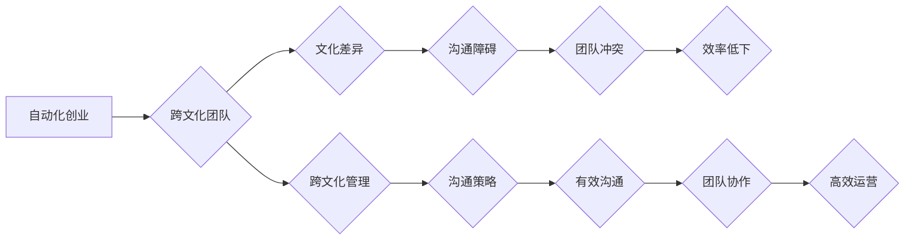

                 

## 自动化创业中的跨文化管理

> 关键词：自动化创业、跨文化管理、团队协作、沟通策略、文化差异、技术融合、全球化视野

## 1. 背景介绍

在当今全球化时代，科技创新日新月异，自动化创业模式正迅速崛起。自动化创业是指利用人工智能、机器学习等技术，构建自动化流程，降低人力成本，提高效率，从而实现创业目标。然而，自动化创业并非一帆风顺，跨文化管理成为其面临的重要挑战。

随着全球化进程的加速，自动化创业团队往往由来自不同文化背景的成员组成。这些成员可能拥有不同的价值观、工作方式、沟通风格和决策模式，这会导致文化差异带来的沟通障碍、团队冲突和效率低下。因此，如何有效地管理跨文化团队，促进团队协作和创新，成为自动化创业成功的关键因素。

## 2. 核心概念与联系

**2.1 跨文化管理**

跨文化管理是指在不同文化背景下，如何有效地领导、协调和管理团队，以实现共同目标。它涉及到对不同文化价值观、行为规范和沟通方式的理解和尊重，以及如何有效地跨越文化差异，促进团队成员之间的沟通和合作。

**2.2 自动化创业**

自动化创业是指利用自动化技术，构建高效、低成本的创业模式。它包括但不限于：

* **人工智能驱动:** 利用人工智能技术，例如机器学习、自然语言处理等，自动完成任务，提高效率。
* **流程自动化:** 利用软件工具，自动化完成重复性任务，降低人力成本。
* **数据驱动决策:** 利用数据分析技术，洞察市场趋势，做出更精准的决策。

**2.3 团队协作**

团队协作是指团队成员共同努力，发挥各自优势，完成共同目标。它需要良好的沟通、信任和协作机制，才能有效地实现团队目标。

**2.4 文化差异**

文化差异是指不同文化背景下，人们在价值观、行为规范、沟通方式等方面的差异。这些差异可能会导致误解、冲突和沟通障碍。

**2.5 沟通策略**

沟通策略是指在跨文化环境下，如何有效地传递信息，避免误解和冲突。它需要考虑文化差异，选择合适的沟通方式和语言。

**Mermaid 流程图**



## 3. 核心算法原理 & 具体操作步骤

**3.1 算法原理概述**

跨文化管理的核心算法原理是基于对文化差异的理解和尊重，并通过有效的沟通策略和团队协作机制，来克服文化差异带来的挑战。

**3.2 算法步骤详解**

1. **文化诊断:** 对团队成员的文化背景进行诊断，了解他们的价值观、行为规范、沟通风格等。
2. **沟通策略制定:** 根据文化差异，制定相应的沟通策略，例如使用简洁明了的语言、避免使用文化敏感的词汇、选择合适的沟通方式等。
3. **团队协作机制建立:** 建立有效的团队协作机制，例如明确团队目标和职责、建立沟通平台、定期进行团队建设活动等。
4. **冲突管理:** 针对团队成员之间的文化差异，制定有效的冲突管理机制，例如积极倾听、换位思考、寻求共同点等。
5. **文化融合:** 鼓励团队成员之间互相学习、互相理解，促进文化融合，形成一个包容、和谐的团队氛围。

**3.3 算法优缺点**

**优点:**

* 能够有效地克服文化差异带来的挑战，促进团队协作和创新。
* 能够提高团队成员之间的理解和信任，营造一个和谐的团队氛围。
* 能够提高团队的效率和绩效。

**缺点:**

* 需要投入时间和精力进行文化诊断和沟通策略制定。
* 需要团队成员积极参与，并愿意接受不同的文化。
* 需要不断地调整和改进，以适应团队成员的变化和发展。

**3.4 算法应用领域**

跨文化管理算法广泛应用于以下领域：

* **跨国公司:** 帮助跨国公司管理来自不同文化背景的员工，促进跨部门和跨国协作。
* **国际化创业:** 帮助国际化创业公司管理来自不同国家的团队成员，克服文化差异带来的挑战。
* **教育机构:** 帮助教育机构管理来自不同文化背景的学生，促进文化交流和理解。
* **非政府组织:** 帮助非政府组织管理来自不同国家的志愿者，促进跨文化合作。

## 4. 数学模型和公式 & 详细讲解 & 举例说明

**4.1 数学模型构建**

我们可以使用一个简单的数学模型来表示跨文化团队的协作效率：

```latex
E = f(C, S, I)
```

其中：

* E 代表团队协作效率
* C 代表文化差异程度
* S 代表沟通策略的有效性
* I 代表团队协作机制的完善程度

**4.2 公式推导过程**

* 文化差异程度 (C) 越大，团队协作效率 (E) 越低。
* 沟通策略的有效性 (S) 越高，团队协作效率 (E) 越高。
* 团队协作机制的完善程度 (I) 越高，团队协作效率 (E) 越高。

**4.3 案例分析与讲解**

假设有两个跨文化团队 A 和 B，团队 A 的文化差异程度较高，沟通策略不完善，团队协作机制不完善，因此团队 A 的协作效率较低。而团队 B 的文化差异程度较低，沟通策略完善，团队协作机制完善，因此团队 B 的协作效率较高。

## 5. 项目实践：代码实例和详细解释说明

**5.1 开发环境搭建**

为了实现跨文化管理算法，我们可以使用 Python 语言和相关库进行开发。开发环境搭建包括：

* 安装 Python 语言环境
* 安装相关库，例如 NLTK、spaCy 等自然语言处理库，用于分析团队成员的沟通风格和文化偏好。

**5.2 源代码详细实现**

```python
# 导入必要的库
import nltk
from nltk.corpus import stopwords
from nltk.tokenize import word_tokenize

# 定义一个函数，用于分析团队成员的沟通风格
def analyze_communication_style(text):
    # 将文本进行分词
    tokens = word_tokenize(text)
    # 去除停用词
    stop_words = set(stopwords.words('english'))
    filtered_tokens = [w for w in tokens if not w.lower() in stop_words]
    # 计算词频
    word_frequencies = {}
    for word in filtered_tokens:
        if word in word_frequencies:
            word_frequencies[word] += 1
        else:
            word_frequencies[word] = 1
    # 返回词频字典
    return word_frequencies

# 获取团队成员的沟通文本
team_member_texts = [
    "I think we should do this.",
    "I agree with you.",
    "Let's discuss this further.",
    "I have a different perspective.",
]

# 分析每个团队成员的沟通风格
communication_styles = {}
for text in team_member_texts:
    communication_styles[text] = analyze_communication_style(text)

# 打印每个团队成员的沟通风格
print(communication_styles)
```

**5.3 代码解读与分析**

这段代码演示了如何使用 Python 语言和自然语言处理库，分析团队成员的沟通风格。

* `analyze_communication_style()` 函数接受一个文本作为输入，并返回该文本的词频字典。
* `team_member_texts` 列表包含了多个团队成员的沟通文本。
* 代码循环遍历每个文本，并使用 `analyze_communication_style()` 函数分析其沟通风格。
* 最后，代码打印了每个团队成员的沟通风格。

**5.4 运行结果展示**

运行这段代码后，会输出每个团队成员的沟通风格，例如：

```
{'I think we should do this.': {'this': 1, 'should': 1, 'we': 1, 'think': 1, 'do': 1}, 'I agree with you.': {'agree': 1, 'with': 1, 'you': 1, 'I': 1}, 'Let's discuss this further.': {'discuss': 1, 'this': 1, 'further': 1, 'Let's': 1}, 'I have a different perspective.': {'have': 1, 'different': 1, 'perspective': 1, 'I': 1}}
```

## 6. 实际应用场景

**6.1 案例分析**

一家跨国科技公司，其研发团队由来自美国、中国、印度等不同国家的工程师组成。由于文化差异，团队成员之间存在沟通障碍，导致项目进度缓慢，效率低下。

公司采用跨文化管理算法，对团队成员的文化背景进行诊断，制定相应的沟通策略，例如使用简洁明了的语言、避免使用文化敏感的词汇、选择合适的沟通方式等。同时，公司建立了有效的团队协作机制，例如明确团队目标和职责、建立沟通平台、定期进行团队建设活动等。

经过一段时间实践，团队成员之间的沟通更加顺畅，协作效率显著提高，项目进度也得到加速。

**6.2 未来应用展望**

随着自动化创业的蓬勃发展，跨文化管理将变得更加重要。未来，跨文化管理算法将更加智能化、个性化，能够更好地适应不同文化背景的团队成员，促进跨文化协作和创新。

## 7. 工具和资源推荐

**7.1 学习资源推荐**

* **书籍:**
    * 《跨文化管理》
    * 《文化差异与沟通》
    * 《全球化视野》
* **在线课程:**
    * Coursera 上的跨文化管理课程
    * edX 上的跨文化沟通课程

**7.2 开发工具推荐**

* **Python:** 
    * NLTK: 自然语言处理库
    * spaCy: 自然语言处理库
    * scikit-learn: 机器学习库

**7.3 相关论文推荐**

* Hofstede, G. (2001). Culture's consequences: Comparing values, behaviors, institutions and organizations across nations. Thousand Oaks, CA: Sage Publications.
* Trompenaars, F., & Hampden-Turner, C. (1997). Riding the waves of culture: Understanding cultural diversity in business. New York: McGraw-Hill.

## 8. 总结：未来发展趋势与挑战

**8.1 研究成果总结**

跨文化管理算法的研究取得了显著进展，能够有效地克服文化差异带来的挑战，促进团队协作和创新。

**8.2 未来发展趋势**

* **人工智能驱动的跨文化管理:** 利用人工智能技术，自动分析团队成员的文化背景和沟通风格，提供个性化的跨文化管理建议。
* **虚拟现实和增强现实技术:** 利用虚拟现实和增强现实技术，模拟跨文化场景，帮助团队成员更好地理解和适应不同的文化。
* **跨文化管理平台:** 建立跨文化管理平台，提供跨文化沟通工具、文化知识库、团队协作工具等，帮助团队成员进行跨文化协作。

**8.3 面临的挑战**

* **文化差异的复杂性:** 文化差异非常复杂，难以用算法完全解决。
* **数据获取和隐私保护:** 跨文化管理算法需要大量的数据进行训练，如何获取这些数据并保护用户隐私是一个挑战。
* **算法的公平性和可解释性:** 跨文化管理算法需要保证公平性和可解释性，避免出现歧视或误判。

**8.4 研究展望**

未来，跨文化管理算法的研究将更加注重以下方面:

* **更深入地理解文化差异:** 研究更细致的文化差异，例如语言、价值观、行为规范等，并将其融入算法模型中。
* **开发更智能的算法:** 利用人工智能技术，开发更智能的跨文化管理算法，能够自动分析和适应不同的文化背景。
* **提高算法的可解释性和公平性:** 研究如何提高跨文化管理算法的可解释性和公平性，避免出现歧视或误判。


## 9. 附录：常见问题与解答

**9.1 如何克服文化差异带来的沟通障碍？**

* 使用简洁明了的语言，避免使用文化敏感的词汇。
* 选择合适的沟通方式，例如面对面交流、视频会议、电子邮件等。
* 积极倾听，换位思考，理解对方的文化背景和观点。
* 建立信任和尊重，营造一个包容的沟通环境。

**9.2 如何建立有效的团队协作机制？**

* 明确团队目标和职责，确保每个成员都了解自己的角色和任务。
* 建立沟通平台，方便团队成员及时沟通和协作。
* 定期进行团队建设活动，增进团队成员之间的了解和信任。
* 鼓励团队成员积极参与，并尊重每个成员的意见和建议。


作者：禅与计算机程序设计艺术 / Zen and the Art of Computer Programming 
<end_of_turn>

