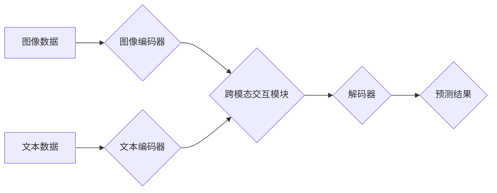

                 

## 跨模态AI：打通图像、文本与音频的壁垒

> 关键词：跨模态学习、图像理解、自然语言处理、音频分析、多模态融合、深度学习、Transformer、BERT、CLIP

### 1. 背景介绍

人工智能（AI）的蓬勃发展，使得机器能够模拟人类的认知能力，并在各个领域取得了突破性的进展。然而，传统的AI模型通常专注于单一模态数据，例如文本、图像或音频，难以处理多模态数据带来的复杂挑战。跨模态AI应运而生，旨在突破单一模态的局限，实现不同模态数据之间的理解和交互。

跨模态AI的出现，源于人类认知的多模态特性。我们通过视觉、听觉、触觉等多种感官信息来感知世界，并将其整合在一起形成完整的理解。而传统的AI模型缺乏这种多模态感知能力，导致其在理解复杂场景、处理真实世界数据方面存在局限性。

跨模态AI的应用前景广阔，涵盖了图像识别、语音识别、机器翻译、视频理解、情感分析等多个领域。例如，在医疗领域，跨模态AI可以将患者的影像数据、病历信息和语音记录进行融合分析，辅助医生进行诊断和治疗；在教育领域，跨模态AI可以根据学生的学习风格和需求，提供个性化的学习内容和互动体验。

### 2. 核心概念与联系

跨模态AI的核心概念是将不同模态数据进行融合，学习它们的相互关系和内在联系。

**2.1 跨模态学习**

跨模态学习是指训练模型能够从多个模态数据中学习，并利用这些知识进行预测或生成。

**2.2 多模态融合**

多模态融合是指将不同模态数据进行有效地组合，提取其共同特征和语义信息。

**2.3 跨模态表示学习**

跨模态表示学习是指学习不同模态数据的统一表示，使得不同模态的数据能够在同一个语义空间中进行比较和交互。

**2.4 跨模态模型架构**

跨模态模型架构通常包括以下几个部分：

* **模态编码器:** 将每个模态数据编码成相应的特征向量。
* **跨模态交互模块:** 将不同模态的特征向量进行融合，学习它们的相互关系。
* **解码器:** 根据融合后的特征向量进行预测或生成。

**2.5 Mermaid 流程图**

### 3. 核心算法原理 & 具体操作步骤

**3.1 算法原理概述**

跨模态AI的核心算法原理是利用深度学习技术，训练模型能够学习不同模态数据的特征表示和相互关系。常用的算法包括：

* **多任务学习:** 将多个模态任务联合训练，共享模型参数，提高模型的泛化能力。
* **对抗性训练:** 使用生成对抗网络（GAN）等技术，训练模型生成逼真的多模态数据，增强模型的鲁棒性。
* **自监督学习:** 利用无标签数据进行预训练，学习数据的潜在结构和语义信息，提高模型的性能。

**3.2 算法步骤详解**

1. **数据预处理:** 将不同模态数据进行清洗、格式化和转换，使其能够被模型输入。
2. **特征提取:** 使用预训练模型或自定义模型，提取每个模态数据的特征向量。
3. **跨模态融合:** 将不同模态的特征向量进行融合，可以使用注意力机制、拼接操作或其他融合方法。
4. **模型训练:** 使用交叉熵损失函数等损失函数，训练模型进行预测或生成。
5. **模型评估:** 使用准确率、召回率、F1-score等指标，评估模型的性能。

**3.3 算法优缺点**

* **优点:** 能够处理多模态数据，提高模型的理解能力和泛化能力。
* **缺点:** 需要大量的多模态数据进行训练，模型训练复杂度高。

**3.4 算法应用领域**

* **图像识别:** 将图像和文本信息结合，提高图像识别的准确率。
* **语音识别:** 将语音信号和文本信息结合，提高语音识别的准确率和鲁棒性。
* **机器翻译:** 将文本和图像信息结合，提高机器翻译的质量和准确性。
* **视频理解:** 将视频、音频和文本信息结合，理解视频内容和场景。

### 4. 数学模型和公式 & 详细讲解 & 举例说明

**4.1 数学模型构建**

跨模态AI模型通常使用神经网络进行构建，其中包括多个层级的神经元，每个神经元接收来自前一层神经元的输入，并进行计算，输出到下一层神经元。

**4.2 公式推导过程**

跨模态AI模型的训练过程通常使用反向传播算法，通过调整模型参数，最小化模型预测结果与真实结果之间的误差。

**4.3 案例分析与讲解**

例如，在图像字幕生成任务中，跨模态AI模型需要将图像信息和文本信息进行融合，生成准确的字幕。

**4.3.1 图像编码器**

图像编码器使用卷积神经网络（CNN）提取图像特征，将图像转换为特征向量。

**4.3.2 文本编码器**

文本编码器使用循环神经网络（RNN）或Transformer模型提取文本特征，将文本转换为特征向量。

**4.3.3 跨模态交互模块**

跨模态交互模块使用注意力机制将图像特征向量和文本特征向量进行融合，学习它们的相互关系。

**4.3.4 解码器**

解码器使用RNN或Transformer模型生成字幕文本。

**4.3.5 损失函数**

损失函数使用交叉熵损失函数，计算模型预测结果与真实字幕之间的误差。

### 5. 项目实践：代码实例和详细解释说明

**5.1 开发环境搭建**

使用Python语言和深度学习框架TensorFlow或PyTorch搭建开发环境。

**5.2 源代码详细实现**

使用预训练模型或自定义模型，实现图像编码器、文本编码器、跨模态交互模块和解码器。

**5.3 代码解读与分析**

解释代码的逻辑结构和功能，包括数据预处理、特征提取、跨模态融合、模型训练和评估等步骤。

**5.4 运行结果展示**

展示模型训练过程中的损失曲线和最终模型的性能指标，例如准确率、召回率和F1-score。

### 6. 实际应用场景

**6.1 图像字幕生成**

将图像转换为文本描述，用于辅助视障人士理解图像内容。

**6.2 视频理解**

理解视频内容和场景，用于视频搜索、视频摘要和视频监控等应用。

**6.3 情感分析**

分析文本和图像中的情感信息，用于市场调研、用户体验分析和情感识别等应用。

**6.4 未来应用展望**

跨模态AI将在未来发挥越来越重要的作用，例如：

* **虚拟现实和增强现实:** 创建更加沉浸式和交互式的虚拟体验。
* **机器人技术:** 帮助机器人更好地理解和交互于人类世界。
* **医疗诊断:** 辅助医生进行更准确的诊断和治疗。

### 7. 工具和资源推荐

**7.1 学习资源推荐**

* **书籍:** 《深度学习》
* **课程:** Coursera上的“深度学习”课程
* **博客:** OpenAI Blog、Google AI Blog

**7.2 开发工具推荐**

* **TensorFlow:** 开源深度学习框架
* **PyTorch:** 开源深度学习框架
* **HuggingFace:** 提供预训练模型和工具

**7.3 相关论文推荐**

* **BERT:** Devlin et al. (2018)
* **CLIP:** Radford et al. (2021)
* **DALL-E:** Ramesh et al. (2021)

### 8. 总结：未来发展趋势与挑战

**8.1 研究成果总结**

跨模态AI取得了显著的进展，在图像识别、语音识别、机器翻译等领域取得了突破性的成果。

**8.2 未来发展趋势**

* **模型规模和能力的提升:** 训练更大规模、更强大的跨模态AI模型。
* **跨模态知识的共享和迁移:** 学习不同模态之间的知识关系，实现跨模态知识的共享和迁移。
* **解释性和可解释性:** 提高跨模态AI模型的解释性和可解释性，使其能够更好地被人类理解和信任。

**8.3 面临的挑战**

* **数据获取和标注:** 跨模态数据获取和标注成本高昂。
* **模型训练复杂度:** 跨模态AI模型训练复杂度高，需要大量的计算资源。
* **伦理和安全问题:** 跨模态AI模型可能存在伦理和安全问题，需要进行充分的评估和监管。

**8.4 研究展望**

未来，跨模态AI将继续朝着更智能、更通用、更安全的方向发展，为人类社会带来更多福祉。

### 9. 附录：常见问题与解答

**9.1 如何选择合适的跨模态AI模型？**

选择合适的跨模态AI模型需要根据具体的应用场景和数据特点进行选择。

**9.2 如何处理跨模态数据的不平衡问题？**

可以使用数据增强、权重调整等方法处理跨模态数据的不平衡问题。

**9.3 如何评估跨模态AI模型的性能？**

可以使用准确率、召回率、F1-score等指标评估跨模态AI模型的性能。

作者：禅与计算机程序设计艺术 / Zen and the Art of Computer Programming 
<end_of_turn>

