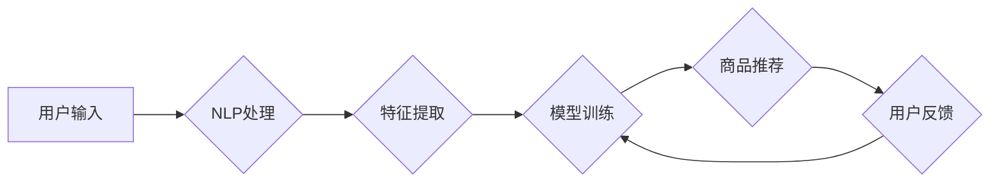

                 

## AI电商搜索：提升电子商务转化率和收入的实践

> 关键词：电商搜索、AI推荐、自然语言处理、机器学习、深度学习、转化率优化、收入增长

## 1. 背景介绍

电子商务的蓬勃发展为消费者提供了便捷的购物体验，但也给商家带来了新的挑战。如何精准匹配用户需求，提高商品推荐的准确性和效率，成为了电商平台提升用户体验和商业效益的关键问题。传统基于关键词匹配的搜索算法难以满足用户日益复杂的搜索需求，而人工智能技术，特别是深度学习算法，为电商搜索带来了新的机遇。

AI电商搜索通过对用户行为、商品信息、市场趋势等多方面数据的分析，能够实现更精准的商品推荐，提升用户搜索体验，最终促进电商平台的转化率和收入增长。

## 2. 核心概念与联系

### 2.1  电商搜索的本质

电商搜索的核心是将用户搜索的意图与平台上的商品进行匹配，并根据用户的历史行为、偏好等信息，推荐最相关的商品。

### 2.2  AI技术在电商搜索中的应用

AI技术在电商搜索中主要应用于以下几个方面：

* **自然语言处理 (NLP):**  理解用户搜索的自然语言，提取关键词、语义信息，并进行意图识别。
* **机器学习 (ML):**  基于用户行为数据，训练模型，预测用户对商品的兴趣，并进行商品推荐。
* **深度学习 (DL):**  利用深度神经网络，学习更复杂的特征，提升推荐的准确性和个性化程度。

### 2.3  AI电商搜索架构



## 3. 核心算法原理 & 具体操作步骤

### 3.1  算法原理概述

常用的AI电商搜索算法包括：

* **基于关键词匹配的搜索算法:**  根据用户输入的关键词，在商品数据库中进行精确匹配，返回相关商品。
* **基于语义理解的搜索算法:**  利用NLP技术，理解用户搜索的语义信息，并根据语义相似度进行商品推荐。
* **基于协同过滤的推荐算法:**  根据用户的历史购买行为和其他用户的相似行为，推荐用户可能感兴趣的商品。
* **基于内容过滤的推荐算法:**  根据商品的属性信息和用户偏好，推荐用户可能感兴趣的商品。
* **深度学习推荐算法:**  利用深度神经网络，学习用户和商品之间的复杂关系，进行更精准的推荐。

### 3.2  算法步骤详解

以基于深度学习的推荐算法为例，其具体步骤如下：

1. **数据收集和预处理:**  收集用户行为数据、商品信息数据、市场趋势数据等，并进行清洗、转换、特征提取等预处理工作。
2. **模型构建:**  选择合适的深度学习模型，例如多层感知机 (MLP)、卷积神经网络 (CNN)、循环神经网络 (RNN) 等，并根据数据特点进行模型设计和参数设置。
3. **模型训练:**  利用训练数据，训练深度学习模型，并通过评估指标，例如准确率、召回率、F1值等，评估模型的性能。
4. **模型部署:**  将训练好的模型部署到线上环境，并进行实时商品推荐。
5. **模型监控和优化:**  持续监控模型的性能，并根据用户反馈和数据变化，对模型进行优化和更新。

### 3.3  算法优缺点

**优点:**

* **精准度高:**  深度学习算法能够学习用户和商品之间的复杂关系，进行更精准的推荐。
* **个性化强:**  根据用户的历史行为和偏好，提供个性化的商品推荐。
* **可扩展性强:**  深度学习模型能够处理海量数据，并随着数据量的增加，性能不断提升。

**缺点:**

* **数据依赖性强:**  深度学习算法需要大量的训练数据，否则模型性能难以保证。
* **训练成本高:**  训练深度学习模型需要大量的计算资源和时间。
* **解释性差:**  深度学习模型的决策过程较为复杂，难以解释模型的推荐结果。

### 3.4  算法应用领域

深度学习推荐算法广泛应用于电商平台、社交媒体、音乐平台、视频平台等领域，例如：

* **商品推荐:**  根据用户的历史购买行为、浏览记录、收藏列表等信息，推荐用户可能感兴趣的商品。
* **内容推荐:**  根据用户的阅读习惯、观看历史、点赞记录等信息，推荐用户可能感兴趣的文章、视频、音乐等内容。
* **广告推荐:**  根据用户的兴趣爱好、行为特征等信息，推荐用户可能感兴趣的广告。

## 4. 数学模型和公式 & 详细讲解 & 举例说明

### 4.1  数学模型构建

深度学习推荐算法通常采用协同过滤模型，其核心思想是基于用户的相似度和商品的相似度进行推荐。

**用户-商品交互矩阵:**  用一个矩阵来表示用户和商品之间的交互关系，其中每个元素表示用户对商品的评分或购买行为。

**用户相似度矩阵:**  根据用户的交互行为，计算用户之间的相似度，并构建一个用户相似度矩阵。

**商品相似度矩阵:**  根据商品的特征信息和用户交互行为，计算商品之间的相似度，并构建一个商品相似度矩阵。

### 4.2  公式推导过程

**用户相似度计算:**  可以使用余弦相似度、皮尔逊相关系数等方法计算用户之间的相似度。

**商品相似度计算:**  可以使用余弦相似度、Jaccard系数等方法计算商品之间的相似度。

**推荐算法:**  根据用户的历史行为和商品的相似度，预测用户对商品的兴趣，并进行推荐。

### 4.3  案例分析与讲解

假设有一个电商平台，用户和商品的交互关系如下：

```
用户 | 商品A | 商品B | 商品C
------- | -------- | -------- | --------
用户1 | 5 | 3 | 2
用户2 | 4 | 5 | 4
用户3 | 2 | 4 | 5
```

我们可以计算用户之间的相似度和商品之间的相似度，并根据这些相似度，推荐用户可能感兴趣的商品。

## 5. 项目实践：代码实例和详细解释说明

### 5.1  开发环境搭建

* **操作系统:**  Linux/macOS/Windows
* **编程语言:**  Python
* **深度学习框架:**  TensorFlow/PyTorch
* **数据处理库:**  Pandas/NumPy
* **机器学习库:**  Scikit-learn

### 5.2  源代码详细实现

```python
# 导入必要的库
import pandas as pd
from sklearn.metrics.pairwise import cosine_similarity

# 加载用户-商品交互数据
data = pd.read_csv('user_item_interactions.csv')

# 计算用户相似度矩阵
user_similarity = cosine_similarity(data.T)

# 计算商品相似度矩阵
item_similarity = cosine_similarity(data)

# 根据用户历史行为推荐商品
def recommend_items(user_id, top_n=5):
    # 获取用户历史交互数据
    user_interactions = data.loc[user_id]

    # 计算用户与其他用户的相似度
    user_similarity_scores = user_similarity[user_id]

    # 获取相似用户的商品交互数据
    similar_user_interactions = data.loc[user_similarity_scores.argsort()[:-top_n-1:-1]]

    # 计算用户可能感兴趣的商品
    recommended_items = similar_user_interactions.mean().sort_values(ascending=False).index

    return recommended_items

# 示例：推荐用户1可能感兴趣的商品
recommended_items = recommend_items(user_id=0, top_n=3)
print(f'推荐给用户1的商品：{recommended_items}')
```

### 5.3  代码解读与分析

* **数据加载:**  首先加载用户-商品交互数据，并将其转换为Pandas DataFrame格式。
* **相似度计算:**  使用cosine_similarity函数计算用户之间的相似度和商品之间的相似度。
* **推荐算法:**  `recommend_items`函数根据用户的历史交互数据，计算用户与其他用户的相似度，并根据相似用户的商品交互数据，预测用户可能感兴趣的商品。
* **结果展示:**  打印出推荐给用户1的商品。

### 5.4  运行结果展示

运行代码后，会输出推荐给用户1的商品列表。

## 6. 实际应用场景

### 6.1  电商平台商品推荐

AI电商搜索可以帮助电商平台实现精准的商品推荐，提升用户购物体验，并促进销售额增长。例如，淘宝、京东等电商平台都已将AI技术应用于商品推荐系统中。

### 6.2  搜索引擎结果排序

AI技术可以帮助搜索引擎更好地理解用户搜索意图，并根据用户历史行为、偏好等信息，对搜索结果进行排序，提升搜索结果的准确性和相关性。例如，Google、百度等搜索引擎都已将AI技术应用于搜索结果排序中。

### 6.3  个性化内容推荐

AI技术可以帮助社交媒体、音乐平台、视频平台等平台，根据用户的兴趣爱好、行为特征等信息，推荐个性化的内容，提升用户粘性和活跃度。例如，Netflix、Spotify等平台都已将AI技术应用于内容推荐系统中。

### 6.4  未来应用展望

随着人工智能技术的不断发展，AI电商搜索将在以下方面得到更广泛的应用：

* **更精准的商品推荐:**  利用更先进的深度学习算法，学习用户和商品之间的更复杂的关系，进行更精准的推荐。
* **更个性化的购物体验:**  根据用户的个性化需求，提供定制化的商品推荐和购物体验。
* **更智能的搜索引擎:**  利用自然语言理解和知识图谱技术，实现更智能的搜索引擎，能够理解用户的复杂搜索意图，并提供更准确、更全面的搜索结果。

## 7. 工具和资源推荐

### 7.1  学习资源推荐

* **书籍:**
    * 《深度学习》 - Ian Goodfellow, Yoshua Bengio, Aaron Courville
    * 《机器学习》 - Tom Mitchell
* **在线课程:**
    * Coursera: 深度学习 Specialization
    * Udacity: 机器学习 Engineer Nanodegree
* **博客和网站:**
    * Towards Data Science
    * Machine Learning Mastery

### 7.2  开发工具推荐

* **深度学习框架:**
    * TensorFlow
    * PyTorch
* **数据处理库:**
    * Pandas
    * NumPy
* **机器学习库:**
    * Scikit-learn

### 7.3  相关论文推荐

* **深度学习推荐系统:**
    * "Collaborative Filtering for Implicit Feedback Datasets"
    * "Neural Collaborative Filtering"
* **自然语言处理在电商搜索中的应用:**
    * "BERT for Search"
    * "XLNet: Generalized Autoregressive Pretraining for Language Understanding"

## 8. 总结：未来发展趋势与挑战

### 8.1  研究成果总结

AI电商搜索技术取得了显著的进展，能够实现更精准的商品推荐，提升用户购物体验，并促进电商平台的商业效益。

### 8.2  未来发展趋势

* **更精准的推荐:**  利用更先进的深度学习算法，学习用户和商品之间的更复杂的关系，进行更精准的推荐。
* **更个性化的体验:**  根据用户的个性化需求，提供定制化的商品推荐和购物体验。
* **更智能的搜索:**  利用自然语言理解和知识图谱技术，实现更智能的搜索引擎，能够理解用户的复杂搜索意图，并提供更准确、更全面的搜索结果。

### 8.3  面临的挑战

* **数据质量:**  深度学习算法依赖于高质量的数据，而电商平台的数据往往存在噪声、缺失等问题，需要进行有效的清洗和预处理。
* **模型解释性:**  深度学习模型的决策过程较为复杂，难以解释模型的推荐结果，这可能会导致用户对推荐结果的信任度降低。
* **公平性与偏见:**  深度学习模型可能会学习到用户的偏见，导致推荐结果存在公平性问题。

### 8.4  研究展望

未来，AI电商搜索技术将继续朝着更精准、更个性化、更智能的方向发展。研究者们将继续探索新的算法和技术，以解决数据质量、模型解释性和公平性等挑战，并为用户提供更优质的购物体验。

## 9. 附录：常见问题与解答

**Q1:  AI电商搜索与传统搜索算法相比，有哪些优势？**

**A1:**  AI电商搜索能够理解用户的语义信息，并根据用户的历史行为和偏好，进行更精准的商品推荐，而传统搜索算法只能根据关键词进行匹配，推荐结果往往不够精准。

**Q2:  如何评估AI电商搜索的性能？**

**A2:**  常用的评估指标包括准确率、召回率、F1值、点击率、转化率等。

**Q3:  如何解决AI电商搜索中的数据质量问题？**

**A3:**  可以通过数据清洗、数据预处理、数据增强等方法来解决数据质量问题。

**Q4:  如何提高AI电商搜索的模型解释性？**

**A4:**  可以通过使用可解释性模型、进行特征重要性分析、生成模型解释报告等方法来提高模型解释性。


作者：禅与计算机程序设计艺术 / Zen and the Art of Computer Programming 
<end_of_turn>

