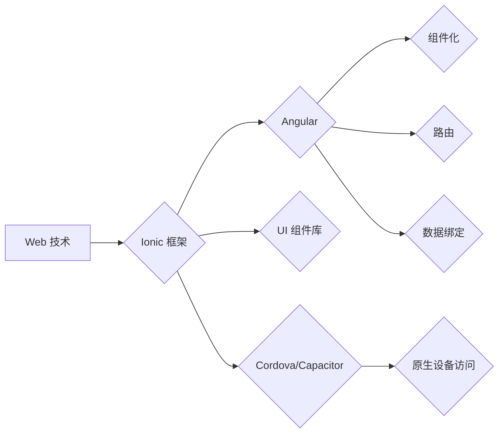

                 

## Ionic 框架优势：基于 Angular 的移动应用开发

> 关键词：Ionic, Angular, 移动应用开发, 跨平台, 性能, UI, 开发效率, 

## 1. 背景介绍

移动应用市场蓬勃发展，用户对高质量、功能丰富的移动应用需求日益增长。开发人员需要快速、高效地构建跨平台的移动应用，以满足市场需求。Ionic 框架应运而生，它基于 Angular 的强大功能，提供了一种基于 Web 技术的跨平台移动应用开发解决方案。

Ionic 框架的出现，为移动应用开发带来了诸多优势：

* **跨平台开发:** Ionic 框架使用 Web 技术（HTML, CSS, JavaScript）开发应用，可以一次性构建适用于 iOS、Android 和 Web 平台的应用，大大降低了开发成本和时间。
* **Angular 生态系统:** Ionic 框架紧密集成 Angular，可以利用 Angular 的强大功能，如组件化、路由、数据绑定等，提高开发效率和代码可维护性。
* **丰富的 UI 组件库:** Ionic 提供了丰富的 UI 组件库，可以快速构建美观、易用的用户界面，节省了大量 UI 设计和开发时间。
* **活跃的社区支持:** Ionic 拥有庞大的社区支持，开发者可以轻松找到解决方案和帮助。

## 2. 核心概念与联系

Ionic 框架的核心概念是将 Web 技术应用于移动应用开发。它利用了 Web 标准和工具，例如 HTML, CSS 和 JavaScript，构建跨平台的移动应用。

Ionic 框架的架构可以概括为以下几个层级：

* **底层:** Ionic 基于 Cordova 或 Capacitor 等插件框架，提供原生设备访问能力，例如相机、定位、通知等。
* **中间层:** Ionic 提供了 Angular 的组件化、路由、数据绑定等功能，用于构建应用的逻辑和结构。
* **顶层:** Ionic 提供了丰富的 UI 组件库，用于构建应用的用户界面。

**Mermaid 流程图:**



## 3. 核心算法原理 & 具体操作步骤

Ionic 框架的核心算法原理是基于 Web 技术的跨平台应用开发。它利用了 HTML, CSS 和 JavaScript 的特性，将 Web 应用打包成移动应用。

### 3.1  算法原理概述

Ionic 框架的核心算法原理是将 Web 应用打包成移动应用。它利用了以下几个关键技术：

* **Web 技术:** Ionic 框架使用 HTML, CSS 和 JavaScript 开发应用，这些技术是 Web 开发的标准，可以跨平台运行。
* **Cordova/Capacitor:** Ionic 框架基于 Cordova 或 Capacitor 等插件框架，提供原生设备访问能力，例如相机、定位、通知等。
* **打包工具:** Ionic 框架使用打包工具将 Web 应用打包成移动应用，例如 APK 或 IPA 文件。

### 3.2  算法步骤详解

Ionic 框架的开发流程可以概括为以下几个步骤：

1. **项目初始化:** 使用 Ionic CLI 初始化一个新的 Ionic 项目。
2. **UI 设计:** 使用 Ionic 的 UI 组件库设计应用的用户界面。
3. **逻辑开发:** 使用 Angular 的组件化、路由、数据绑定等功能开发应用的逻辑。
4. **原生设备访问:** 使用 Cordova 或 Capacitor 插件访问原生设备功能。
5. **打包发布:** 使用 Ionic 的打包工具将应用打包成移动应用，并发布到应用商店。

### 3.3  算法优缺点

**优点:**

* **跨平台开发:** 可以一次性构建适用于 iOS、Android 和 Web 平台的应用。
* **开发效率高:** 使用 Web 技术和 Angular 的强大功能，可以提高开发效率。
* **成本低:** 减少了开发多个平台应用的成本。
* **活跃的社区支持:** 拥有庞大的社区支持，可以轻松找到解决方案和帮助。

**缺点:**

* **性能:** 相比原生应用，Ionic 应用的性能可能略逊一筹。
* **原生功能:** 某些原生功能可能需要使用插件实现，可能会存在兼容性问题。

### 3.4  算法应用领域

Ionic 框架适用于各种类型的移动应用开发，例如：

* **电商应用:** 构建跨平台的电商应用，方便用户随时随地购物。
* **社交应用:** 构建跨平台的社交应用，方便用户与朋友交流。
* **新闻资讯应用:** 构建跨平台的新闻资讯应用，方便用户获取最新信息。
* **教育应用:** 构建跨平台的教育应用，方便用户学习新知识。

## 4. 数学模型和公式 & 详细讲解 & 举例说明

Ionic 框架的开发与数学模型和公式的直接关系并不密切。它主要依赖于 Web 技术和 Angular 的框架结构，而非复杂的数学计算。

## 5. 项目实践：代码实例和详细解释说明

### 5.1  开发环境搭建

1. 安装 Node.js 和 npm: 下载并安装 Node.js，npm 将自动安装。
2. 安装 Ionic CLI: 使用 npm 安装 Ionic CLI: `npm install -g @ionic/cli`
3. 创建 Ionic 项目: 使用 Ionic CLI 创建一个新的 Ionic 项目: `ionic start my-app blank --type=angular`

### 5.2  源代码详细实现

以下是一个简单的 Ionic 应用代码示例，展示了如何使用 Ionic 的 UI 组件和 Angular 的数据绑定功能：

```html
<!-- app.component.html -->
<ion-header>
  <ion-toolbar>
    <ion-title>Ionic App</ion-title>
  </ion-toolbar>
</ion-header>

<ion-content>
  <h1>Hello, Ionic!</h1>
  <p>{{ message }}</p>
  <button ion-button (click)="changeMessage()">Change Message</button>
</ion-content>

```

```typescript
// app.component.ts
import { Component } from '@angular/core';

@Component({
  selector: 'app-root',
  templateUrl: 'app.component.html',
  styleUrls: ['app.component.scss'],
})
export class AppComponent {
  message = 'This is an Ionic app!';

  changeMessage() {
    this.message = 'Message changed!';
  }
}
```

### 5.3  代码解读与分析

* `ion-header` 和 `ion-content` 是 Ionic 提供的 UI 组件，用于定义应用的头部和内容区域。
* `ion-toolbar` 和 `ion-title` 是 Ionic 的头部组件，用于显示应用的标题。
* `<h1>` 和 `<p>` 是 HTML 标签，用于显示文本内容。
* `ion-button` 是 Ionic 的按钮组件，用于触发事件。
* `(click)="changeMessage()"` 是 Angular 的数据绑定语法，当按钮被点击时，会调用 `changeMessage()` 方法。
* `AppComponent` 是 Angular 的组件类，负责管理应用的状态和逻辑。
* `message` 是组件的属性，用于存储消息内容。
* `changeMessage()` 方法用于修改 `message` 属性的值。

### 5.4  运行结果展示

运行上述代码，可以创建一个简单的 Ionic 应用，显示“Hello, Ionic!” 和 “This is an Ionic app!” 的文本内容，并有一个按钮，点击按钮后，文本内容会变为“Message changed!”。

## 6. 实际应用场景

Ionic 框架在移动应用开发领域有着广泛的应用场景，例如：

* **电商应用:** 构建跨平台的电商应用，方便用户随时随地购物。
* **社交应用:** 构建跨平台的社交应用，方便用户与朋友交流。
* **新闻资讯应用:** 构建跨平台的新闻资讯应用，方便用户获取最新信息。
* **教育应用:** 构建跨平台的教育应用，方便用户学习新知识。
* **企业内部应用:** 构建跨平台的企业内部应用，方便员工进行协作和沟通。

## 7. 工具和资源推荐

### 7.1  学习资源推荐

* **Ionic 官方文档:** https://ionicframework.com/docs/
* **Ionic 官方教程:** https://ionicframework.com/docs/getting-started
* **Angular 官方文档:** https://angular.io/docs

### 7.2  开发工具推荐

* **Visual Studio Code:** https://code.visualstudio.com/
* **WebStorm:** https://www.jetbrains.com/webstorm/
* **Android Studio:** https://developer.android.com/studio

### 7.3  相关论文推荐

* **Ionic Framework: A Cross-Platform Mobile Development Framework Based on Web Technologies**
* **Angular: A Comprehensive Guide to Building Web Applications**

## 8. 总结：未来发展趋势与挑战

Ionic 框架作为一种基于 Web 技术的跨平台移动应用开发解决方案，在移动应用开发领域有着重要的地位。未来，Ionic 框架将继续发展，并面临以下挑战：

### 8.1  研究成果总结

Ionic 框架的优势在于其跨平台性、开发效率和成本效益。它为开发者提供了便捷的工具和资源，可以快速构建高质量的移动应用。

### 8.2  未来发展趋势

* **性能优化:** Ionic 框架将继续致力于提升应用性能，使其更接近原生应用的性能水平。
* **原生功能支持:** Ionic 框架将继续扩展原生功能支持，提供更丰富的功能和体验。
* **人工智能集成:** Ionic 框架将集成人工智能技术，为开发者提供更智能的应用开发体验。

### 8.3  面临的挑战

* **性能瓶颈:** 由于 Web 技术的特性，Ionic 应用的性能可能仍然不如原生应用。
* **原生功能兼容性:** 某些原生功能可能需要使用插件实现，可能会存在兼容性问题。
* **市场竞争:** 移动应用开发市场竞争激烈，Ionic 框架需要不断创新，才能保持竞争力。

### 8.4  研究展望

Ionic 框架的未来发展方向将是更加注重性能优化、原生功能支持和人工智能集成，以满足用户对移动应用越来越高的需求。


## 9. 附录：常见问题与解答

* **Ionic 和 Cordova/Capacitor 的区别是什么？**

Ionic 框架基于 Cordova 或 Capacitor 等插件框架，提供原生设备访问能力。Cordova 是 Ionic 框架早期使用的插件框架，而 Capacitor 是 Ionic 框架的最新插件框架，性能更优。

* **Ionic 应用的性能如何？**

Ionic 应用的性能相对于原生应用略逊一筹，但随着 Ionic 框架的不断优化，性能差距正在逐渐缩小。

* **Ionic 框架适合开发哪些类型的应用？**

Ionic 框架适用于各种类型的移动应用开发，例如电商应用、社交应用、新闻资讯应用、教育应用等。


作者：禅与计算机程序设计艺术 / Zen and the Art of Computer Programming 
<end_of_turn>

